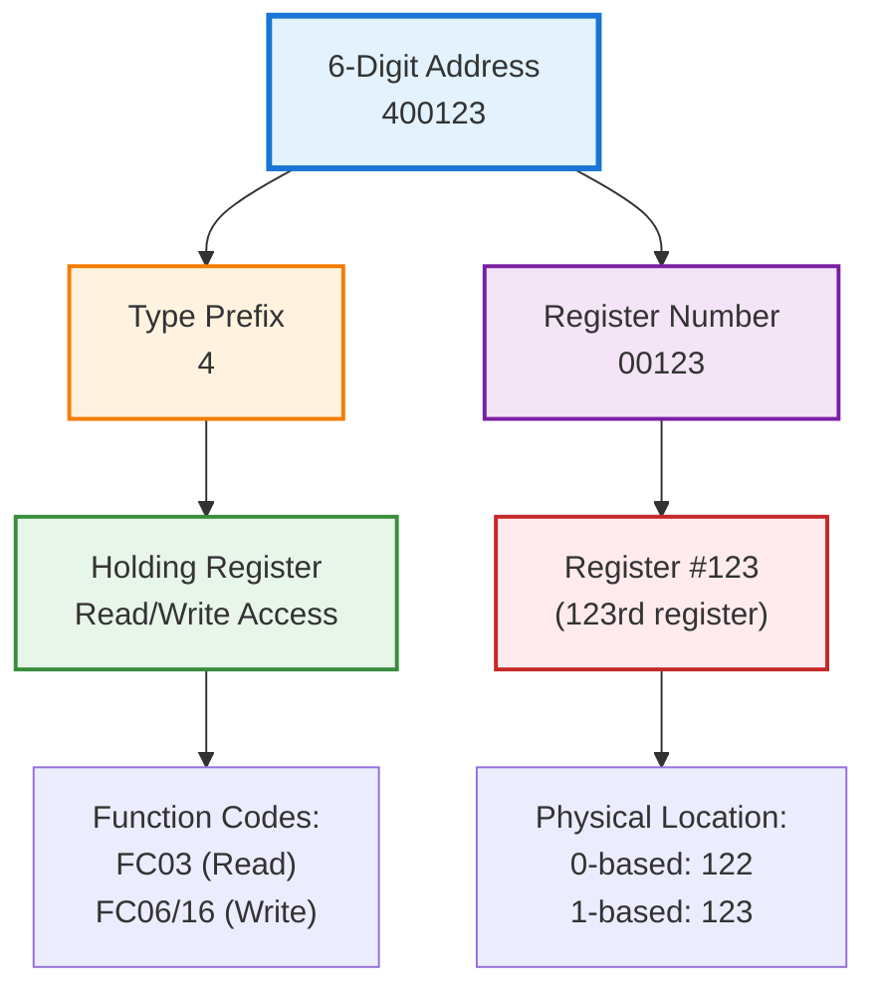
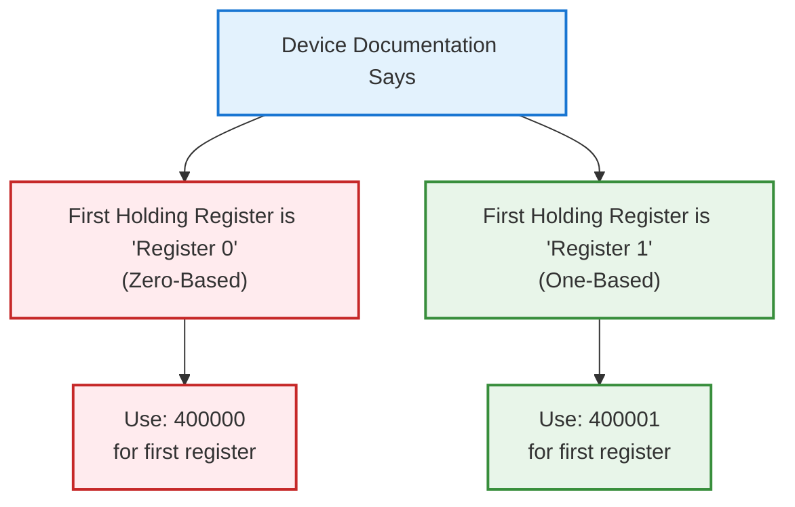

# Modbus 6-Digit Addressing Scheme Guide

!!! info "Quick Reference"
    **6-Digit Address Format:** `[Type][5-Digit Register Number]`
    
    Examples: `400001`, `300025`, `000013`, `165536`

## Overview

The **6-digit addressing scheme** is an industry-standard format used by Modbus Monitor tools to combine both the **register type** and **register address** into a single, easy-to-use number. This eliminates the confusion between function codes and addresses that often troubles users new to Modbus.

!!! warning "Common Confusion Alert"
    **The first digit is NOT the Modbus function code!** It's a **register type indicator**. Many users confuse this prefix with function codes, leading to addressing errors.

## Why Use 6-Digit Addressing?

### **Traditional Modbus Confusion:**
```
User thinks: "I need Function Code 3, Address 123"
Reality: FC03 with address 123 could mean:
- Register 123 (0-based) = Physical register 124
- Register 123 (1-based) = Physical register 123
- Different devices may interpret this differently!
```

### **6-Digit Clarity:**
```
User enters: "400123"
System knows: Holding register #123, automatically handles:
- Correct function code (FC03 for read, FC06/16 for write)
- Proper addressing mode (0-based vs 1-based)
- Register type validation
```

## Format Structure



## Register Type Prefixes

| Prefix | Register Type | Access | Function Codes | Address Range | Physical Memory |
|--------|---------------|--------|----------------|---------------|-----------------|
| **0** | **Coils** | Read/Write | FC01 (Read)<br/>FC05 (Write Single)<br/>FC15 (Write Multiple) | `000001` - `065536` | Digital outputs, Boolean values |
| **1** | **Discrete Inputs** | Read Only | FC02 (Read) | `100001` - `165536` | Digital inputs, Boolean status |
| **3** | **Input Registers** | Read Only | FC04 (Read) | `300001` - `365536` | Analog inputs, sensor data |
| **4** | **Holding Registers** | Read/Write | FC03 (Read)<br/>FC06 (Write Single)<br/>FC16 (Write Multiple) | `400001` - `465536` | Analog outputs, setpoints, configuration |

!!! example "Memory Layout Analogy"
    Think of Modbus memory like a filing cabinet:
    
    - **Coils (0xxxxx):** Light switches - ON/OFF states you can control
    - **Discrete Inputs (1xxxxx):** Sensors - ON/OFF states you can only read  
    - **Input Registers (3xxxxx):** Gauges - Analog values you can only read
    - **Holding Registers (4xxxxx):** Control knobs - Analog values you can read and adjust

## Complete Address Examples

### **Holding Registers (4xxxxx) - Most Common**

| 6-Digit Address | Meaning | Function Code | Use Case |
|-----------------|---------|---------------|----------|
| `400001` | 1st holding register | FC03 (Read) / FC06 (Write) | First setpoint or control value |
| `400025` | 25th holding register | FC03 (Read) / FC06 (Write) | Temperature setpoint |
| `400100` | 100th holding register | FC03 (Read) / FC06 (Write) | Configuration parameter |
| `465536` | Last possible holding register | FC03 (Read) / FC06 (Write) | Maximum address |

### **Input Registers (3xxxxx) - Sensor Data**

| 6-Digit Address | Meaning | Function Code | Use Case |
|-----------------|---------|---------------|----------|
| `300001` | 1st input register | FC04 (Read) | Temperature sensor |
| `300010` | 10th input register | FC04 (Read) | Pressure reading |
| `300050` | 50th input register | FC04 (Read) | Flow rate measurement |

### **Coils (0xxxxx) - Digital Outputs**

| 6-Digit Address | Meaning | Function Code | Use Case |
|-----------------|---------|---------------|----------|
| `000001` | 1st coil | FC01 (Read) / FC05 (Write) | Motor start/stop |
| `000008` | 8th coil | FC01 (Read) / FC05 (Write) | Alarm acknowledgment |
| `000016` | 16th coil | FC01 (Read) / FC05 (Write) | Valve control |

### **Discrete Inputs (1xxxxx) - Digital Inputs**

| 6-Digit Address | Meaning | Function Code | Use Case |
|-----------------|---------|---------------|----------|
| `100001` | 1st discrete input | FC02 (Read) | Emergency stop button |
| `100005` | 5th discrete input | FC02 (Read) | Door open sensor |
| `100012` | 12th discrete input | FC02 (Read) | Motor running status |

## Converting from Other Tools

### **From Modbus Poll/Similar Tools:**

| Your Tool Setup | 6-Digit Equivalent | Explanation |
|------------------|-------------------|-------------|
| FC03, Address 1 | `400001` | Holding register 1 |
| FC03, Address 123 | `400123` | Holding register 123 |
| FC04, Address 5 | `300005` | Input register 5 |
| FC01, Address 13 | `000013` | Coil 13 |
| FC02, Address 8 | `100008` | Discrete input 8 |

### **Quick Conversion Formula:**

```
Function Code → Prefix Mapping:
- FC01/05/15 (Coils) → Add "0" prefix
- FC02 (Discrete Inputs) → Add "1" prefix  
- FC03/06/16 (Holding Registers) → Add "4" prefix
- FC04 (Input Registers) → Add "3" prefix

Example: FC03, Address 567 → "4" + "00567" = 400567
```

## Zero-Based vs One-Based Addressing

!!! important "Critical Concept for Proper Communication"
    The **same 6-digit address** may point to different physical registers depending on the device's addressing mode.

### **Understanding the Difference:**

| Address Mode | `400001` Points To | `400000` Points To |
|--------------|-------------------|-------------------|
| **One-Based** | 1st physical register | *Invalid address* |
| **Zero-Based** | 2nd physical register | 1st physical register |

### **Device Examples:**



### **How to Determine Your Device's Mode:**

1. **Check device documentation** - Look for "Register 0" (zero-based) or "Register 1" (one-based)
2. **Test with known values** - Read a register with a known value
3. **Look for address examples** - Manufacturer examples often show the convention
4. **Contact manufacturer** - When in doubt, ask technical support

### **Common Device Patterns:**

| Device Type | Typical Mode | Example |
|-------------|--------------|---------|
| **PLCs (Allen-Bradley, Siemens)** | One-based | First register = 400001 |
| **Meters/Instruments** | One-based | First register = 400001 |
| **Embedded devices** | Zero-based | First register = 400000 |
| **Custom hardware** | Varies | Check documentation |

## Common Mistakes and Solutions

### **❌ Mistake 1: Using Function Code as Prefix**

```
Wrong: "I need FC03, so I'll use 300001"
Right: "I need holding registers, so I'll use 400001"
```

**Solution:** Remember prefix indicates **register type**, not function code.

### **❌ Mistake 2: Mixing Addressing Modes**

```
Wrong: Device uses 0-based, but you enter 400001 for first register
Result: You're actually reading the second register!
```

**Solution:** Test with one register first, verify you get expected data.

### **❌ Mistake 3: Invalid Prefix Combinations**

```
Wrong: Using 200001 (prefix "2" doesn't exist)
Wrong: Using 500001 (prefix "5" doesn't exist)
```

**Solution:** Only use prefixes 0, 1, 3, or 4.

### **❌ Mistake 4: Address Range Errors**

```
Wrong: 400066000 (exceeds 5-digit limit)
Wrong: 4000000 (too many digits)
```

**Solution:** Maximum register number is 65536 (e.g., 465536).

## Advanced Topics

### **Multiple Register Reads**

When reading consecutive registers, you can often specify:

```
Start Address: 400001
Count: 10

Result: Reads registers 400001 through 400010
```

### **Bit-Level Access**

Some tools allow bit access within registers:

```
Address: 400001.5
Meaning: Bit 5 of holding register 1
```

### **Block Optimization**

For efficiency, group related addresses:

```
Good: 400001-400010 (consecutive block)
Inefficient: 400001, 400005, 400009 (scattered reads)
```

## Troubleshooting Guide

### **No Response from Device**

1. **Verify addressing mode** - Try both 400000 and 400001 for first register
2. **Check register type** - Ensure you're using correct prefix (0,1,3,4)
3. **Confirm device support** - Not all devices implement all register types
4. **Test with minimal address** - Start with 400001 or 400000

### **Wrong Data Returned**

1. **Address offset issue** - Wrong addressing mode (0-based vs 1-based)
2. **Register type mismatch** - Using 3xxxxx when device expects 4xxxxx
3. **Endian/byte order** - Data format issue (separate from addressing)

### **Address Rejected by Device**

1. **Exceeds device range** - Device may only support 1-1000, not full 65536
2. **Invalid register type** - Device doesn't implement that register type
3. **Reserved addresses** - Some addresses may be reserved/protected

## Best Practices

### **✅ Do:**
- **Start simple** - Test with 400001 first
- **Document working addresses** - Keep a list of validated addresses  
- **Use consecutive blocks** - More efficient than scattered reads
- **Verify addressing mode** - Test first register to confirm 0-based vs 1-based
- **Check device limits** - Not all devices support the full 65536 range

### **❌ Don't:**
- **Assume function codes** - Let the tool handle function code selection
- **Mix addressing modes** - Stick to one mode throughout your project
- **Skip documentation** - Always check device manuals for addressing conventions
- **Use invalid prefixes** - Only 0, 1, 3, 4 are valid
- **Exceed register limits** - Respect device-specific address ranges

## Reference Links

- **Video Tutorial:** [Modbus Monitor YouTube Channel](https://www.youtube.com/watch?v=eesPvKslLV8)
- **Modbus Specification:** [Wikipedia Modbus Article](https://en.wikipedia.org/wiki/Modbus)
- **Interactive Tools:** Use address conversion utilities in Modbus Monitor XPF
- **Additional Help:** See product-specific guides for detailed examples

---

*This guide applies to both Modbus Monitor XPF and Modbus Monitor Android applications. The 6-digit addressing scheme ensures consistent, clear communication with Modbus devices while eliminating common addressing confusion.*