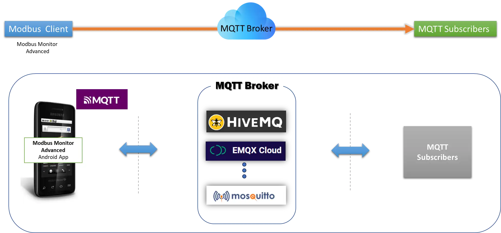
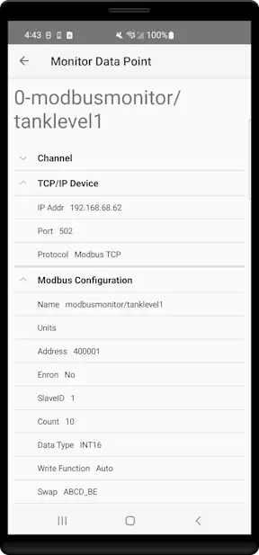
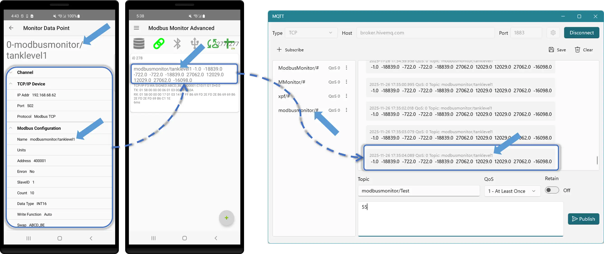
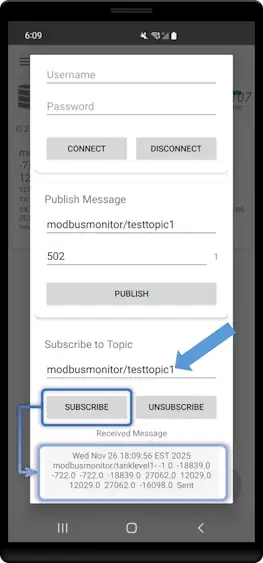

# MQTT Add-on for Modbus Monitor Advanced

**Real-time IoT data publishing from Android to any MQTT broker**

{ .screenshot-center loading="lazy" }


## Overview

The MQTT Add-on extends Modbus Monitor Advanced with professional IoT capabilities, enabling real-time data publishing to cloud platforms, enterprise message brokers, and custom dashboards.

**How It Works:**

Modbus Monitor Advanced can read data from **any local source** (Modbus TCP servers, serial devices, Bluetooth adapters, sensors, or simulated data) through **three communication channels**—and automatically publish everything to your cloud MQTT broker. No databases, servers, or coding required. Perfect for remote monitoring, edge computing, and IoT dashboards.

**Data Flow Example:**
```
Local Modbus Server (TCP/IP, USB Serial, or Bluetooth)
        ↓
Modbus Monitor Advanced (reads data every polling cycle)
        ↓
MQTT Add-on (transforms data to JSON)
        ↓
Cloud MQTT Broker (HiveMQ, AWS IoT, Azure, Mosquitto, etc.)
        ↓
Dashboards, Analytics, Mobile Apps, Alerts
```

!!! success "Quick Links"
    [:material-rocket-launch-outline: **Get Started (5 min)**](#quick-start-setup) | [:material-play-circle: **Step-by-Step Guide**](#mqtt-in-action-step-by-step-workflow) | [:material-table: **Expert Reference**](#detailed-configuration)

!!! tip "YouTube Walkthrough"
    Watch the complete MQTT setup and live publishing demo: [:material-youtube: MQTT Publisher Video](https://youtu.be/vhivTbEz7hY?si=9dGFPTGUoaKHLWSc){:target="_blank"}

---

## Quick Start Setup (5 Minutes)

**Perfect for first-time users—get your data publishing to the cloud in 5 minutes using HiveMQ free broker.**

### What You Need

- ✅ Android device with Modbus Monitor Advanced + MQTT add-on **purchased**
- ✅ A Modbus server to read from (TCP/IP, USB Serial, or Bluetooth—see examples below)
- ✅ Free HiveMQ broker account (or any MQTT broker: local Mosquitto, AWS IoT, Azure, etc.)

### The Simplest Setup (TCP/IP Example)

**Step 1: Create a Monitor Point (30 seconds)**

1. Open Modbus Monitor Advanced → Tap **+** (add button)
2. Tap **Change** and configure:
   - **Channel**: `TCP/IP`
   - **IP Address**: `192.168.68.62` (your Modbus server)
   - **Port**: `502`
   - **Address**: `400001`
   - **Data Type**: `INT16`
3. Tap **OK**

{ .screenshot-center loading="lazy" }

💡 **Need help?** See [:octicons-book-24: Advanced Guide → Creating Monitor Points](../products/android/advanced-guide.md#monitor-points) for detailed explanations of each field.

**Step 2: Enable MQTT (60 seconds)**

1. Tap **Hamburger Menu** → **Settings** → **MQTT**
2. Toggle **Enable MQTT** ON
3. Fill in:
   - **Broker Host**: `broker.hivemq.com`
   - **Port**: `1883`
   - **Client ID**: `myandroid01` (any unique name)
   - **Topic**: `modbusmonitor/tanklevel1` (any path you like)
4. Tap **Save**


**Step 3: Start Publishing (10 seconds)**

1. Return to main screen
2. Tap the **Link icon** to start polling
3. **Done!** Data is now publishing to HiveMQ

**Verify It Works:**

1. Go to [HiveMQ Web Client](https://www.hivemq.com/demos/websocket-client/){:target="_blank"}
2. Click **Connect**
3. Subscribe to `modbusmonitor/#`
4. Watch your data appear in real-time! 🎉

**Diagram reference:**

- (Left) Monitoring point polls the local Modbus server (configuration).
- (Middle) App reads data from the TCP device.
- (Right) MQTT tool subscribes to the topic and receives values broadcast by the remote broker.
- The arrow shows topics published by the Modbus Monitor Android configuration (name: modbusmonitor/tanklevel1). The value is published after polling (modbusmonitor/tanklevel1) and is subscribed to by the remote monitoring tool (modbusmonitor/#).

<figure markdown="span">
  { loading="lazy" }
  <figcaption>
    MQTT Publishing Flow: Modbus → Android app → MQTT broker → Remote subscribers
  </figcaption>
</figure>
---

## MQTT in Action: Step-by-Step Workflow

**Detailed walkthrough with all settings explained—follow this if Quick Start feels too fast.**

### Setup Your Test Environment

**What You'll Need:**

1. **Android device** running Modbus Monitor Advanced with MQTT add-on purchased
2. **Remote Modbus Server** (can be Modbus Monitor XPF on Windows, or any Modbus TCP server)
3. **MQTT Broker** (we'll use public HiveMQ: `broker.hivemq.com`)
4. **MQTT Client** (MQTT Explorer to subscribe and verify publishing)

**System Overview:**
```
Modbus Server (Windows XPF)
        ↓ {TCP/IP}
Android Device (Modbus Monitor Advanced)
        ↓ {WiFi/Ethernet → Internet}
HiveMQ Public Broker
        ↓ {MQTT}
MQTT Explorer (or other subscribers)
```

### Step 1: Connect to Modbus Server

1. Open Modbus Monitor Advanced → **Hamburger Menu** → **+** to create a Monitor Point
2. Tap **Change** to configure:   
      - **Channel**: `TCP/IP` (WiFi)
      - **Protocol**: `Modbus TCP`
      - **Device IP**: Enter your Windows/Modbus server IP (e.g., `192.168.1.100`)
      - **Port**: Default Modbus TCP port (e.g., `502` or `8888` if custom)
      - **Slave ID**: `1` (or appropriate value for your server)
      - **Address**: `400001` (Holding Register example)
      - **Count**: `2` (read 2 registers)
      - **Data Type**: `FLOAT32`
      - **Name**: `temperature` (use naming similar to MQTT topics)
3. Tap **OK** to save the monitor point

📖 **For detailed field explanations**, see [:octicons-book-24: Advanced Guide → Monitor Point Configuration](../products/android/advanced-guide.md#monitor-point-configuration)

### Step 2: Open MQTT Console

1. Tap **Hamburger Menu** → **Cloud** → **MQTT** (or look for MQTT button in menu)
2. MQTT Console opens showing connection status

### Step 3: Connect to HiveMQ Broker (Manual Test)

1. In MQTT Console, fill in broker details:
   - **Broker Host**: `broker.hivemq.com`
   - **Port**: `1883` (or `8883` for TLS/SSL secure connection)
   - **Client ID**: `android-modbus-monitor` (or any unique ID)
   - **Username**: Leave blank (HiveMQ public broker requires no auth)
   - **Password**: Leave blank
   - **Use TLS/SSL**: Toggle OFF for port `1883`, toggle ON for port `8883`

2. Tap **Connect** button
3. **Header lights up GREEN** → Connection successful!
4. Any connection messages display at bottom of console

**Secure Port Options:**

| Protocol | Port | Use Case | TLS Toggle |
|----------|------|----------|-----------|
| **TCP (Unencrypted)** | `1883` | Testing, local networks | OFF |
| **TLS/SSL (Encrypted)** | `8883` | Production, cloud brokers | ON |
| **WebSocket** | `8000` | Browser/web apps | OFF |
| **WebSocket Secure** | `8001` | Secure web apps | ON |

**Example Brokers with Secure Ports:**

- HiveMQ: `tcp://broker.hivemq.com:1883` or `ssl://broker.hivemq.com:8883`
- AWS IoT: `ssl://<endpoint>.iot.region.amazonaws.com:8883`
- Azure IoT: `ssl://your-hub.azure-devices.net:8883`
- Mosquitto: `tcp://test.mosquitto.org:1883` or `ssl://test.mosquitto.org:8883`

### Step 4: Manually Publish Test Data

1. In MQTT Console, tap **Publish** button
2. Configure publish settings:
      - **Topic**: `modbusmonitor/temperature`
      - **Payload**: `75.3` (sample temperature value)
3. Tap **Send**
4. Data is now published to the broker for remote subscribers

=== "Verify in Modbus Monitor Advanced"

    **Verify directly inside the app—no external tools required:**

    1. In the same MQTT Console where you published
    2. Find the **Subscribe** section (or **Subscriptions** tab)
    3. Enter the topic: `modbusmonitor/temperature`
    4. Tap **Subscribe**
    5. Watch the console—you'll see incoming messages in real-time:
       ```
       Subscribed to: modbusmonitor/temperature
       Message: 75.3
       ```
    6. When finished, tap **Unsubscribe** to stop listening
    {.screenshot-center loading="lazy"}

=== "Verify using MQTT Explorer (or similar)"

    **Verify using an external MQTT tool on your computer:**

    - Open MQTT Explorer or similar tool on your computer
    - Connect to `broker.hivemq.com`
    - Subscribe to `modbusmonitor/#` (wildcard to see all topics)
    - You should see: `modbusmonitor/temperature` = `75.3`

### Step 5: Configure Automatic Publishing

**Now let's automate this so data publishes continuously:**

1. Go back to Monitor Points list
2. Tap your monitor point (e.g., `temperature`) → **Change**
3. Confirm TCP/IP, Modbus TCP, and data type settings are correct
4. Tap **OK** to return to list

💡 **Tip**: If your values aren't updating correctly, review [:octicons-book-24: Advanced Guide → Troubleshooting Monitor Points](../products/android/advanced-guide.md#troubleshooting-monitor-points)

5. Open **Hamburger Menu** → **Settings** → **MQTT**
6. Configure MQTT settings:
   - **Enable MQTT**: Toggle ON
   - **Broker Host**: `broker.hivemq.com`
   - **Port**: `1883`
   - **Client ID**: `android-modbus-monitor`
   - **Base Topic**: `modbus/monitor` (auto-appends point name or `/batch`)
   - **Publish Mode**: Choose:
     - **Individual Topics**: Each point publishes separately (e.g., `.../temperature`, `.../pressure`)
     - **Batch JSON**: All points in one message (e.g., `.../batch`)
   - **QoS**: `0` (for testing) or `1` (for reliability)

7. Tap **Save** to apply settings

### Step 6: Start Real-Time Publishing

1. Return to main screen with your Monitor Point
2. Tap the **Link icon** to start Client Mode
   - App begins polling the Modbus server every cycle
   - Data updates are displayed in real-time
   - MQTT automatically publishes after each complete polling cycle

3. **Watch in MQTT Explorer:**
   - You'll see `modbusmonitor/tank1/temperature` update in real-time
   - Each time the polling cycle completes, a new value publishes
   - Example sequence: `75.3` → `75.5` → `76.1` → (repeating)

### Step 7: Stop Communication

1. Tap the **Link icon** again to halt Client Mode
2. Polling stops and MQTT publishing stops
3. Last published values remain in broker (subscribers see last-known values)

### Step 8: View Published Data Flow

**What's Happening Behind the Scenes:**

```
[Polling Cycle]
1. App connects to Modbus server
2. Requests holding register 400001 (2 registers)
3. Server responds with raw data
4. App converts to FLOAT32 → "75.3"
5. [MQTT Automatically Publishes]
6. Data sent to HiveMQ broker
7. Remote subscribers (MQTT Explorer) receive: "modbus/monitor/temperature = 75.3"
8. Repeat cycle every ~1000ms (configurable)
```

---

## Data Sources: Three Communication Channels

Modbus Monitor Advanced can read data from **any of three communication channels**, and MQTT will seamlessly publish all data to your cloud broker without any additional configuration.

📖 **For complete channel documentation**, see [:octicons-book-24: Advanced Guide → Communication Channels](../products/android/advanced-guide.md#communication-channels)

### Channel 1: TCP/IP (WiFi/Ethernet)

**Best For**: Remote Modbus servers, industrial equipment on network, desktop applications

**Setup:**

- Server IP: `192.168.1.100` (or public IP if remote)
- Port: `502` (Modbus TCP standard) or custom port like `8888`
- Protocol: `Modbus TCP`, `Modbus UDP`
- Perfect for: Factory equipment, SCADA systems, remote gateways

**MQTT Publishing:**

```
Data Flow: Remote Server (TCP/IP) → Android App → MQTT Broker → Dashboard
Example: Industrial PLC reading temperature → Android polling → HiveMQ cloud
```

### Channel 2: USB-OTG Serial (Hardwired)

**Best For**: Direct serial connections, legacy equipment, RS232/RS485 devices

**Setup:**

- USB adapter: FTDI, Prolific, or SiLab chipset
- Protocol: `Modbus RTU`, `Modbus ASCII`
- Physical cable from Android to device (5m max)
- Perfect for: Field service, equipment commissioning, portable diagnostics

**MQTT Publishing:**
```
Data Flow: Serial Device (RS232/485) → USB Adapter → Android → MQTT Broker
Example: Energy meter on RS485 → USB converter → Android → Cloud MQTT → Analytics
```

### Channel 3: Bluetooth (Wireless)

**Best For**: Wireless connections, portable devices, flexible range monitoring

**Setup:**

- Bluetooth serial adapter (tested: SIIG, Broadcom)
- Protocol: `Modbus RTU`, `Modbus ASCII` (wireless)
- Range: 10–30 meters (line of sight)
- Perfect for: Warehouse scanning, mobile equipment monitoring, IoT sensors

**MQTT Publishing:**
```
Data Flow: Bluetooth Device → Android (wireless) → MQTT Broker → Mobile App
Example: Bluetooth sensor in storage → Android warehouse device → AWS IoT → Alerts
```

### Multi-Channel Configuration Example

**Scenario: Monitor everything simultaneously**

You can create multiple monitor points, each using a different channel:

| Monitor Point | Channel | Source | MQTT Topic |
|---------------|---------|--------|-----------|
| Tank Level | **TCP/IP** | Factory PLC (192.168.1.100:502) | `factory/tank_level` |
| Motor Speed | **Serial (USB)** | VFD via RS485 converter | `factory/motor_speed` |
| Ambient Temp | **Bluetooth** | Wireless sensor in room | `warehouse/temp_ambient` |

**Automatic Publishing:**
All three data sources are polled every cycle and published to the MQTT broker in a single batch message:

```json
{
  "timestamp": "2025-11-26T14:30:22Z",
  "device_id": "android-factory-01",
  "points": [
    {"name": "Tank Level", "value": 75.3, "channel": "TCP/IP"},
    {"name": "Motor Speed", "value": 1450, "channel": "Serial"},
    {"name": "Ambient Temp", "value": 22.5, "channel": "Bluetooth"}
  ]
}
```

---

## Expert Reference: Detailed Configuration

**For advanced users and customization. Bookmark this section for quick reference.**

**Broker Configuration:**

| Setting | Description | Example | Required |
|---------|-------------|---------|----------|
| **Broker Host** | MQTT broker hostname or IP | `mqtt.example.com` | Yes |
| **Port** | MQTT port (1883 standard, 8883 TLS) | `1883` | Yes |
| **Client ID** | Unique device identifier | `android-sensor-42` | Yes |
| **Username** | Authentication username | `field_device_01` | If broker requires |
| **Password** | Authentication password | `●●●●●●●●` | If broker requires |

---

## Use Cases & Examples

### AWS IoT Core Integration

**Configuration:**

```yaml
Broker: xxxxx.iot.us-east-1.amazonaws.com
Port: 8883
TLS: Enabled
Client Cert: device-cert.pem
Topic: devices/android/modbus/data
```

**[See full AWS IoT setup guide →](https://docs.aws.amazon.com/iot/)**

### Azure IoT Hub Integration

**Configuration:**
```yaml
Broker: your-hub.azure-devices.net
Port: 8883
Username: your-hub.azure-devices.net/device-id/?api-version=2021-04-12
Password: SAS Token
Topic: devices/device-id/messages/events/
```

**[See full Azure IoT setup guide →](https://learn.microsoft.com/azure/iot/)**

### Local Mosquitto Broker

**Configuration:**
```yaml
Broker: 192.168.1.100
Port: 1883
TLS: Disabled
Username: local_user
Password: local_pass
Topic: factory/line1/modbus
```

### Node-RED Dashboard Integration

**Configuration:**
```yaml
Broker: localhost (if Node-RED on device) or LAN IP
Port: 1883
Topic: nodered/modbus/input
```

**Node-RED Flow:** Subscribe to topic → Parse JSON → Dashboard gauges

---

## Troubleshooting

### Common Issues

| Problem | Cause | Solution |
|---------|-------|----------|
| **Connection Failed** | Wrong host/port | Verify broker details; check firewall |
| **Authentication Error** | Invalid credentials | Confirm username/password; check broker logs |
| **No Data Published** | MQTT disabled or Client Mode stopped | Enable MQTT toggle; start polling |
| **Messages Not Received** | Wrong topic subscription | Check topic structure; verify wildcards (`#`, `+`) |

### Testing MQTT Connection

**Using Mosquitto CLI:**
```bash
# Subscribe to all topics
mosquitto_sub -h broker.example.com -p 1883 -t "modbus/#" -u username -P password

# Test publish
mosquitto_pub -h broker.example.com -p 1883 -t "modbus/test" -m "hello" -u username -P password
```

**Using MQTT Explorer (GUI):**
1. Download MQTT Explorer
2. Add connection with your broker details
3. Subscribe to `#` (all topics)
4. Start app polling and watch for published messages

---

## Frequently Asked Questions

??? question "What's the difference between point topics and batch JSON?"
    **Point Topics**: Each monitor point publishes to its own topic (e.g., `modbus/device01/tank_level`). Good for subscribing to specific values.
    
    **Batch JSON**: All monitor points in a single JSON message to one topic (e.g., `modbus/device01/batch`). Efficient for dashboards displaying multiple values.
    
    You can enable both modes simultaneously.

??? question "How often does MQTT publish?"
    MQTT publishes automatically after each complete polling cycle through all monitor points. Polling interval is controlled by Settings → Timing → Poll Interval (default 1000ms).

??? question "Does MQTT work with Sensor Server mode?"
    Yes! Sensor values (accelerometer, gyro, etc.) are published just like Modbus monitor points. Topic names use the sensor name.

??? question "Can I use MQTT without internet?"
    Yes, if you have a local MQTT broker (Mosquitto, HiveMQ) on your LAN. The app only needs network access to the broker, not internet.

??? question "What happens if the broker goes offline?"
    Messages are not queued or cached. When the broker reconnects, publishing resumes from the current cycle. For critical data retention, use the Google Sheets Add-on for logging.

??? question "How do I secure my MQTT connection?"
    1. Use TLS/SSL (port 8883)
    2. Enable client certificate authentication (mutual TLS)
    3. Use strong passwords
    4. Restrict broker access by IP/firewall
    5. Set appropriate QoS levels

??? question "Can multiple Android devices publish to the same broker?"
    Yes. Use unique Client IDs and topic prefixes for each device to avoid collisions. Example: `modbus/device01/`, `modbus/device02/`, etc.

---

## Best Practices

**Topic Design:**

- Use hierarchical structure: `company/site/area/device/point`
- Include device ID for multi-device deployments
- Keep topic names short and descriptive
- Use lowercase with underscores: `tank_level` not `Tank Level`

**Performance:**

- Poll interval ≥ 1000ms for stable networks
- Use batch JSON for >10 monitor points
- QoS 0 for high-frequency non-critical data
- QoS 1 for important values

**Security:**

- Always use TLS/SSL for cloud brokers
- Rotate credentials periodically
- Use read-only credentials where possible
- Monitor broker logs for unauthorized access

**Reliability:**

- Test connection before deployment
- Set up broker monitoring/alerts
- Document topic structure for team
- Keep backup of configuration

---

## Additional Resources

- **MQTT Protocol**: [mqtt.org](https://mqtt.org/)
- **HiveMQ Tutorials**: [hivemq.com/mqtt-essentials](https://www.hivemq.com/mqtt-essentials/)
- **AWS IoT Docs**: [docs.aws.amazon.com/iot](https://docs.aws.amazon.com/iot/)
- **Azure IoT Docs**: [learn.microsoft.com/azure/iot](https://learn.microsoft.com/azure/iot/)

**Need Help?** Contact [support@quantumbitsolutions.com](mailto:support@quantumbitsolutions.com)

---

[:octicons-arrow-left-24: Back to Advanced Guide](../products/android/advanced-guide.md#add-ons-integration)
