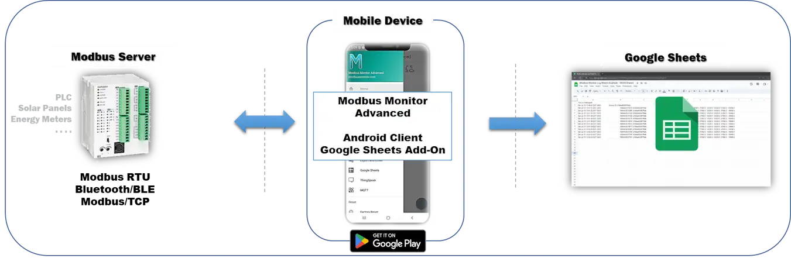
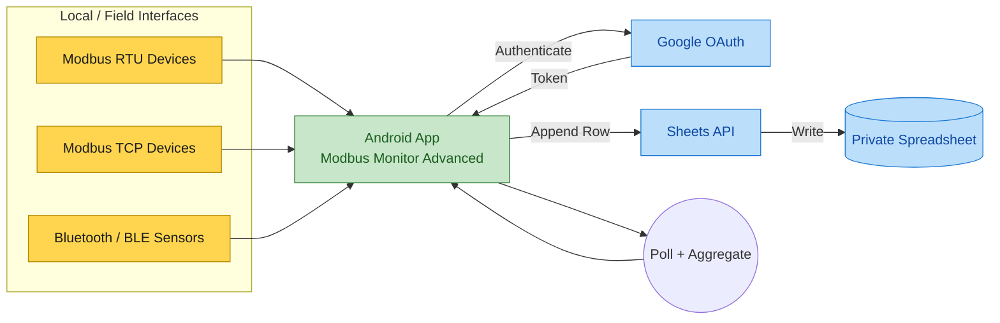
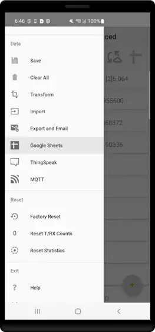
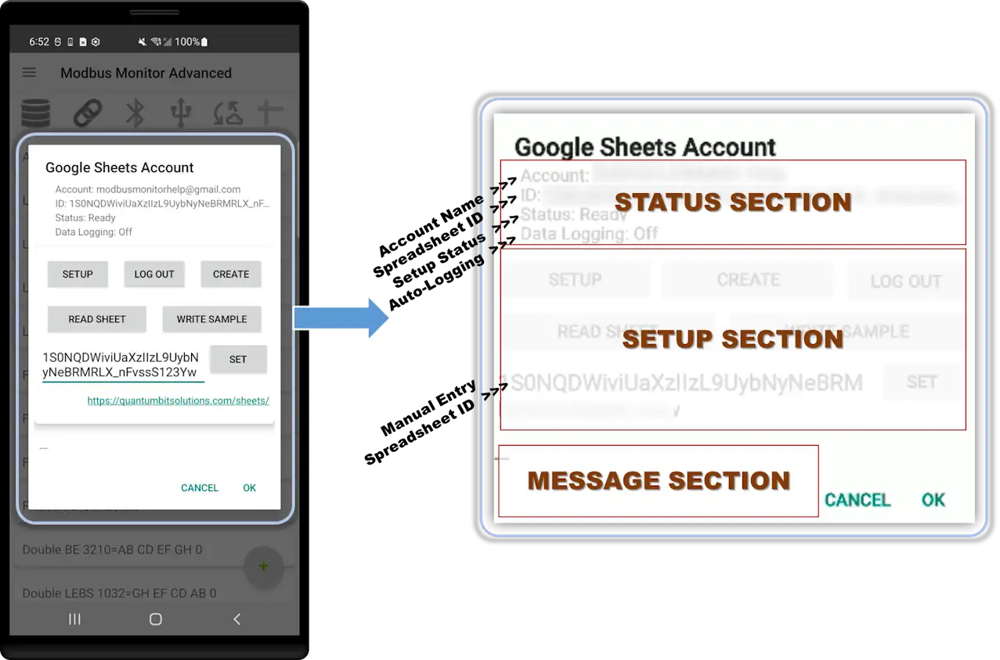
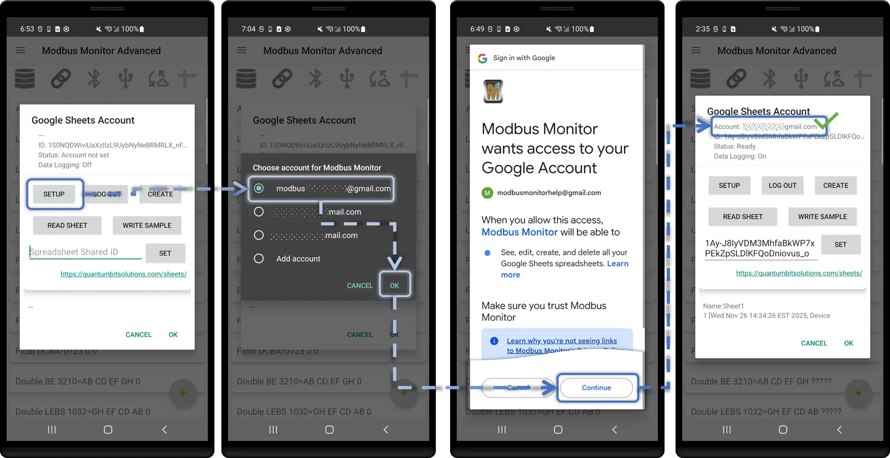
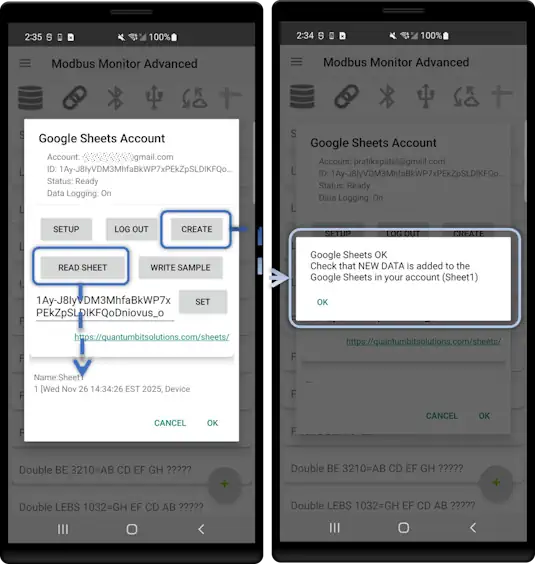
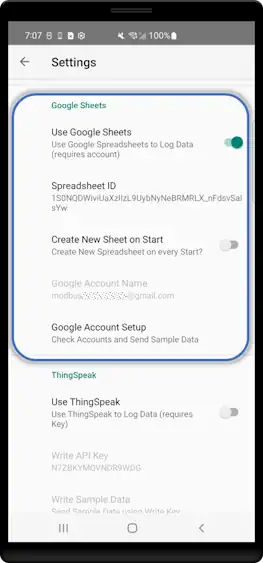
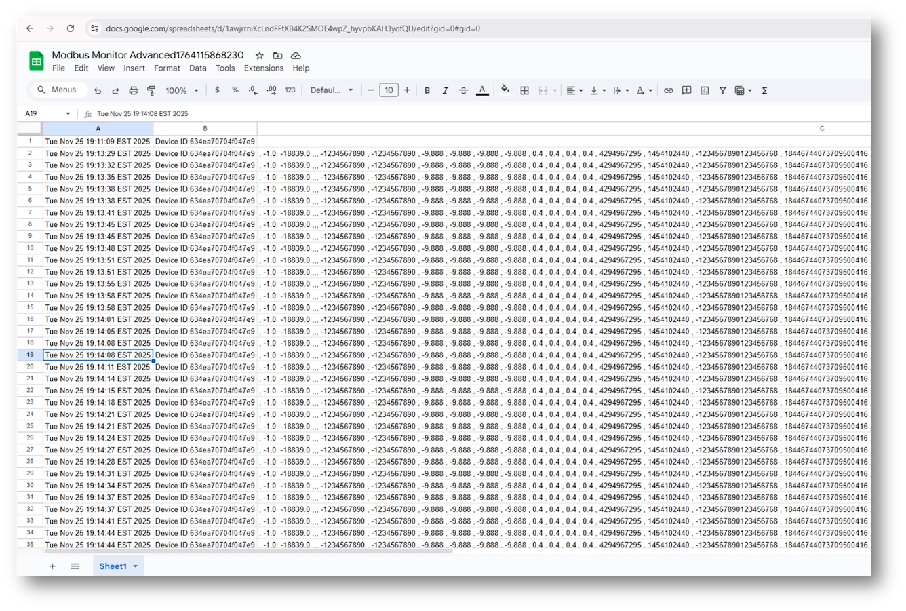

# Google Sheets Add-on for Modbus Monitor Advanced

**Unified real-time cloud spreadsheet logging for Android field data**

{ .screenshot-center loading="lazy" }

## Overview

The Google Sheets Add‑on logs your Modbus data directly to a Google spreadsheet—no server or coding needed. Just connect your Android device to a Modbus source, sign in with Google, and start collecting data in the cloud.

**What it does:**
- Automatically saves one row per reading (timestamp, device name, and your sensor values)
- Works with any Modbus source: serial cables (RTU), network devices (TCP), or Bluetooth sensors
- All data appears instantly in Google Sheets where you can view charts, share with your team, and export to Excel

**Why use it:**
- Fast setup—create a spreadsheet with one button
- No server to maintain
- Access your data from any device with a web browser
- Built-in backup and version history from Google Drive

<div class="video-wrapper" style="text-align: center; margin: 1.5em 0;">
  <iframe width="560" height="315" src="https://www.youtube.com/embed/GAkMOEzmZ-k" title="Google Sheets Add-on Tutorial" frameborder="0" allow="accelerometer; autoplay; clipboard-write; encrypted-media; gyroscope; picture-in-picture" allowfullscreen></iframe>
  <p style="margin-top: 0.5em;"><strong>📺 Watch:</strong> Complete setup and configuration walkthrough</p>
</div>

**Key Features:**

- **Real-time Logging** - Automatic row append after each polling cycle
- **Cloud Storage** - Google Drive integration with unlimited retention
- **Device Merging** - Log data from multiple devices with unique IDs to build a centralized database
- **Team Collaboration** - Share spreadsheets with view/edit permissions
- **Excel Compatible** - Download as XLSX, CSV, PDF
- **Custom Formulas** - Use Google Sheets functions on live data
- **Charts & Pivot Tables** - Use Google Sheets built-in visualization tools to view trend data
- **Version History** - Track all changes with timestamps
- **Mobile & Desktop** - Access from any device

!!! success "Quick Links"
    [:material-rocket-launch-outline: **Quick Start**](#quick-start-setup) | [:material-table: **Data Format**](#data-format) | [:material-frequently-asked-questions: **FAQ**](#frequently-asked-questions)

---

## Architecture (Easy Concept View)



Notes:

- Polling collects live Modbus register/coil values at your configured interval.
- App formats a row (timestamp + selected points), then appends via Google Sheets API.
- Optional local CSV logging can run in parallel for on-device backups.

---

## Log Data in Google Sheets

Logging data in Google Sheets using the Modbus Monitor Advanced Android app now exclusively uses a private Google Sheet linked to your authenticated Google account. This ensures strict privacy, audit history, and controlled access. Public "anyone can edit" shared sheets are no longer supported.

### Private Google Sheet (Authenticated)

Requires a Google Account. Data is kept private. You can create a new sheet automatically or reuse an existing one.

1. Go to Settings and select “Use Google Sheets”.
2. Enable “Create New Sheet on Start” if you want a new spreadsheet created each time the app starts; otherwise it reuses the same spreadsheet.
3. If needed, enter minutes in “CSV Log Timer” to also create a local CSV file (set 0 to disable; large values can fill storage—move files regularly).
4. Press “Back”.
5. Choose a Google account to log in.

!!! info "Before You Begin"
    **Required:**
    
    - Modbus Monitor Advanced app installed on Android device
    - **Google Sheets Add-on purchased and activated** (separate in-app purchase)
    - Google account (free Gmail account works)
    - At least one Modbus data source: TCP server, RTU device, or BLE gateway
    
    **What You'll Do:**
    
    1. Connect your Google account to the app
    2. Create or select a spreadsheet
    3. Test the connection with sample data
    4. Configure monitoring points (TCP/RTU/BLE)
    5. Enable auto-logging and start polling
    6. Verify data appears in Google Sheets

### Step 1: Access Google Sheets Menu

1. Open **Modbus Monitor Advanced** on your Android device
2. Tap **Main Menu** (hamburger icon ☰)
3. Select **Google Sheets**

{ .screenshot-center loading="lazy" }

### Step 2: Understanding the Google Sheets Control Panel

The control panel is your central hub for configuring Google account login, creating spreadsheets, and verifying connections. You can access it three ways:

1. **Main Menu → Google Sheets** (full control panel)
2. **Tap the spreadsheet icon** on the main screen (quick access)
3. **Main Menu → Settings → Google Sheets section** (configuration view)

<figure markdown="span">
  { .screenshot-center loading="lazy" }
  <figcaption><strong>Control Panel Layout:</strong> Three sections—<strong>STATUS</strong> (top: account, spreadsheet ID, permissions, logging state), <strong>SETUP</strong> (middle: all control buttons), and <strong>MESSAGE</strong> (bottom: operation results and feedback)</figcaption>
</figure>

The control panel has three main sections:

1. **STATUS** (top) - Shows current account, spreadsheet ID, connection status, and logging state
2. **SETUP** (middle) - Contains all control buttons for configuration and testing
3. **MESSAGE** (bottom) - Displays responses from Google, error messages, and data from Read operations

**Status Section:**

| Field | What It Shows | Example |
|-------|---------------|---------|
| **Account** | Currently signed-in Google email | `user@gmail.com` or `---` when not logged in |
| **Spreadsheet ID** | Active sheet identifier used for logging | `1Abc2Def3Ghi4Jkl5Mno6Pqr` |
| **Status** | Setup progress indicator | `Ready` or steps needed to complete setup |
| **Data Logging** | Auto-logging state | `ON` or `OFF` |

**Control Buttons:**

| Button | Function | When to Use |
|--------|----------|-------------|
| **Setup** | Choose or switch Google account | First-time setup or changing accounts to use to create, read, or update the online spreadsheet |
| **Create** | Create new spreadsheet, write initial header row, and auto-save ID | Quick start without manual spreadsheet creation |
| **Log Out** | Sign out of current account | Switch accounts or revoke access |
| **Read Sheet** | Fetch and display a few rows from current spreadsheet | Verify connection and existing data |
| **Write Sample** | Append test row to spreadsheet | Validate write permissions before real logging |
| **Set** | Save the Spreadsheet ID from the text field | Manually enter or paste a spreadsheet ID into the text box, then click Set to save |


### Step 3: Connect Your Google Account

1. Click **Setup** button
2. Device opens with Google account sign-in screen
3. Select your Google account and click OK
4. **Click "Continue"** to grant permissions:
   - ✓ View and manage your spreadsheets (Create, Read, and Write)
5. Device redirects back to app to cntrol panel
6. **Confirmation**: Account email appears in header

{ .screenshot-center loading="lazy" }

### Step 4: Create Spreadsheet and Test Connection

1. Click **Create** button
   
      - App automatically creates new spreadsheet in your Google Drive
      - Writes an initial header row with timestamp and device ID columns
      - Spreadsheet ID saved to app settings
      - Confirmation message appears in the MESSAGE section
  
2. Click **Read Sheet** button   
      - Fetches a few rows from spreadsheet (empty initially)
      - Confirms connection is working
  
3. Click **Write Sample** button
   
      - Writes test data row to spreadsheet
      - Verifies write permissions
  
4. **(Optional)** Open [sheets.google.com](https://sheets.google.com) in browser
   
      - Find newly created spreadsheet
      - Verify sample row appeared

{ .screenshot-center loading="lazy" }

!!! tip "Alternative: Use Existing Spreadsheet"
    Instead of clicking **Create**, you can manually enter a **Spreadsheet ID** if you want to log to an existing sheet.
    
    **How to Extract the Spreadsheet ID:**
    
    1. Open your spreadsheet in a browser
    2. Look at the URL in the address bar:
       ```
       https://docs.google.com/spreadsheets/d/1Abc2Def3Ghi4Jkl5Mno6Pqr/edit
                                           ^^^^^^^^^^^^^^^^^^^^^^^
                                           This is the Spreadsheet ID
       ```
    3. **Copy only the ID portion** (between `/d/` and `/edit`): `1Abc2Def3Ghi4Jkl5Mno6Pqr`
    4. Paste it into the **Spreadsheet ID text field** in the control panel
    5. Click the **Set** button to save it to global settings
    
    ⚠️ **Important:** Do NOT paste the full URL—only the ID string.

### Step 5: Configure Monitoring Points for Your Data Source

Before enabling auto-logging, ensure your monitoring points are properly configured for the channel you're using.

!!! example "Example Setup from Video"
    **Scenario:** Android device polling a Modbus TCP server running on a Windows workstation (using Modbus Monitor XPF to simulate a Modbus device).

**For TCP/IP Channel (Most Common):**

1. **Main Menu → Monitoring Points**
2. **Select TCP Channel** (if using RTU or BLE, select accordingly)
3. **Configure Connection:**
   
      - **IP Address/Hostname**: Remote server address (e.g., `192.168.1.100` or `modbus.example.com`)
      - **Port Number**: Modbus TCP port (default: `502`)
      - **Station ID (Slave ID)**: Device unit identifier (typically `1`)
  
4. **Data Configuration:**
      - **Register Address**: Starting register (e.g., `400001` for holding registers)
      - **Number of Registers**: How many registers to poll (e.g., `10`)
      - **Data Type**: INT16, FLOAT32, etc. (match your device)
  
5. **OK** and repeat for additional points.

For a deeper walkthrough of monitoring point setup (including addressing formats, data types, and common pitfalls), see the Advanced Guide:

- [:octicons-arrow-right-24: Advanced Guide — Monitoring Points](../products/android/advanced-guide.md#monitoring-points)
- [:octicons-arrow-right-24: Advanced Guide — Client Mode Setup](../products/android/advanced-guide.md#client-mode-setup)

You can also reuse the monitoring point screenshots from the Advanced Guide in this section, or click through for step-by-step visuals.

**For RTU Serial Channel:**

- Use USB-to-RS485 adapter
- Configure baud rate (9600, 19200, etc.)
- Set parity, stop bits, data bits

**For Bluetooth/BLE:**

- Pair device first
- Select from available BLE sensors
- Configure sensor-specific parameters

!!! example "Quick Multi-Point Setup (Advanced)"
    **Import from Desktop:** If you've configured monitoring points on Modbus Monitor XPF (Windows), export the configuration file and import it into the Android app. 
    
    **Example:** Import a configuration file with 47 pre-configured monitoring points. When auto-logging is enabled:
    
    - **One row per polling cycle**
    - **47 columns** (one per monitoring point)
    - **Each value in its own column** in the spreadsheet
    - All data collected simultaneously and logged together
    
    This is ideal for complex setups with many registers spread across multiple devices or address ranges.

### Step 6: Enable Auto-Logging

1. **Main Menu → Settings**
2. **Locate "Use Google Sheets" toggle**
3. **Toggle ON** (switches to green/enabled state)
4. *(Optional)* Set **CSV Log Timer** for local backup (0 = disabled)
5. **Press Back** to return to main screen

{ .screenshot-center loading="lazy" }
*Settings screen with "Use Google Sheets" toggle highlighted in ON position*

### Step 7: Start Polling and Data Collection

1. On the **Main Screen**, locate the **Link Icon** (🔗)
2. **Tap the Link Icon** to start communication
3. Status changes to **"Connected"** with green indicator
4. Watch the poll counter increment
5. Data automatically logs to Google Sheets after each polling cycle

### Step 8: Verify Data Logging

**Option A: Verify from the App**

1. Return to **Main Menu → Google Sheets**
2. Check **header status bar**:
   - Last upload timestamp
   - Rows written counter
3. Click **Read Sheet** button to fetch latest rows

**Option B: Verify from Google Sheets (Recommended)**

1. Open your spreadsheet at [sheets.google.com](https://sheets.google.com) in a browser
2. **Refresh the page** (or open the sheet for the first time)
3. **First row (Row 1)** = Auto-generated headers:
   - Timestamp
   - Device ID (unique mobile device identifier)
   - Monitoring point names (one column per point)
4. **Subsequent rows (Row 2, 3, 4...)** = Data from each polling cycle
5. **Each column** = Value for one monitoring point at that timestamp

{ .screenshot-center loading="lazy" }
Google Sheets browser view showing header row (Timestamp, Device ID, Point1, Point2, Point3...) and multiple data rows with timestamped values

**To Stop Logging:**

1. Return to **Main Screen** in app
2. **Tap the Link Icon** again to disconnect
3. Status changes to "Disconnected"
4. Data logging stops; all existing data remains safely in the spreadsheet

!!! success "Multi-Device Logging Benefit"
    **Fleet & Team Use:** The same spreadsheet can receive data from **multiple Android devices simultaneously**. Each row includes:
    
    - **Timestamp**: When data was logged
    - **Device ID**: Unique identifier per mobile device (auto-generated)
    - **Values**: Monitoring point data
    
    This enables centralized logging from field technicians, remote sites, or distributed sensors—all merging into one searchable database for analysis and trending.
---

---

## Detailed Configuration

### App Settings

{ .screenshot-center loading="lazy" }

**Required Settings:**

| Setting | Description | Example | Notes |
|---------|-------------|---------|-------|
| **Spreadsheet ID** | Unique ID from Sheets URL | `1Abc2Def3Ghi4Jkl5Mno6Pqr` | Copy from browser address bar |
| **Sheet Name** | Tab name in spreadsheet | `Sensor Data` | Must match exactly (case-sensitive) |
| **Google Account** | Authenticated account email | `user@gmail.com` | Shown after sign-in |

**Optional Settings:**

| Setting | Description | Default | When to Use |
|---------|-------------|---------|-------------|
| **Include Timestamp** | Add date/time column | Enabled | For time-series logging |
| **Timestamp Format** | ISO 8601 or custom | `YYYY-MM-DD HH:MM:SS` | Adjust for locale |
| **Include Device ID** | Add device identifier column | Disabled | Multi-device logging |
| **Append Mode** | Insert new row each cycle | Enabled | Most common use case |
| **Update Mode** | Overwrite last row | Disabled | For live dashboards |

---
 

## Data Format

### Automatic Headers

**First Cycle Creates Headers:**

On the first data upload, the app automatically creates a header row:

| Timestamp | Device ID | Tank Level | Motor Speed | Temperature | Pressure |
|-----------|-----------|------------|-------------|-------------|----------|
| 2025-11-25 14:30:00 | android01 | 75.3 | 1450 | 68.2 | 101.3 |
| 2025-11-25 14:30:05 | android01 | 74.8 | 1448 | 68.4 | 101.2 |

**Header Format:**

- **Timestamp**: If enabled, first column
- **Device ID**: If enabled, second column
- **Monitor Point Names**: Remaining columns in order

### Data Types

For detailed information about Modbus data types (INT16, FLOAT32, etc.) and how to configure them, see the [:octicons-arrow-right-24: Advanced Guide — Data Types](../products/android/advanced-guide.md#data-types).

**In Google Sheets:**
- Numbers appear as regular cells (e.g., `1450`, `75.30`)
- Timestamps are auto-detected as date/time format
- Boolean values display as `TRUE` or `FALSE`

### Row Append Behavior

**Append Mode (Default):**
```
Cycle 1 → Row 2 (after header)
Cycle 2 → Row 3
Cycle 3 → Row 4
...
```

**Update Mode:**
```
Cycle 1 → Row 2
Cycle 2 → Row 2 (overwrite)
Cycle 3 → Row 2 (overwrite)
```

!!! tip "When to Use Update Mode"
    Update mode is ideal for live dashboards where you only need the latest value. For historical logging and analysis, use append mode (default).

---

## Spreadsheet Organization

### Single Sheet Layout

**Simple Time-Series Log:**

```
Sheet: Sensor Data
- Column A: Timestamp
- Column B-Z: Monitor point values
- New row every polling cycle
```

### Dashboard Sheet

**Live Status Board:**

```
Sheet: Dashboard (Update Mode)
- Column A: Parameter Name (static)
- Column B: Current Value (updated)
- Column C: Units (static)
- Column D: Status (formula: =IF(B2>100,"High","Normal"))
```

**Charts:**

- Insert → Chart
- Data range: `Sensor Data!A:Z`
- Chart type: Line, Column, Gauge
- Auto-updates as data appends

---

## Use Cases & Examples

### Industrial Data Logging

**Monitor Points:**

- Timestamp, Tank Level, Pressure, Flow Rate, Temperature

**Logging:**

- Append mode with 30-second intervals
- Long-term archival for compliance
- Weekly export to CSV for analysis

**Formulas:**

```
=AVERAGE(B2:B1000)  // Average tank level
=MAX(D:D)           // Peak flow rate
=COUNTIF(E:E,">80") // Temperature over 80°C
```

### Multi-Device Fleet

**Setup:**

- Each Android device logs to separate sheet
- Include Device ID column
- Master sheet with IMPORTRANGE

**Master Sheet Formula:**

```
=QUERY({
  IMPORTRANGE("ID1","Sheet1!A:F");
  IMPORTRANGE("ID2","Sheet1!A:F");
  IMPORTRANGE("ID3","Sheet1!A:F")
}, "SELECT * ORDER BY Col1 DESC")
```

### Shift Reports

**Configuration:**

- Append mode with 5-minute intervals
- Timestamp column enabled
- Units in monitor point names

**Daily Summary:**

```
=QUERY(A:F, "SELECT A, AVG(B), MAX(C), MIN(D) 
WHERE A >= date '"&TEXT(TODAY(),"yyyy-mm-dd")&"' 
GROUP BY A")
```

### Quality Control

**Monitor Points:**

- Production count, Defect count, Cycle time

**Calculated Columns:**

```
Column F: =IF(D2>0, B2/D2, 0)  // Defect rate
Column G: =IF(C2<60, "Pass", "Fail")  // Cycle time check
```

**Conditional Formatting:**

- Red if defect rate > 5%
- Green if cycle time < 50s

---

## Advanced Features

### Google Sheets Formulas

**Real-time Calculations:**

```
// Running average of last 100 rows
=AVERAGE(INDIRECT("B"&MAX(2,ROW()-100)&":B"&ROW()))

// Count values above threshold today
=COUNTIFS(A:A,">="&TODAY(), C:C,">100")

// Conditional sum by device
=SUMIF(B:B,"android01",D:D)
```

### Pivot Tables

**Summarize Data:**

1. Data → Pivot table
2. Rows: Date (group by day)
3. Values: Average(Tank Level), Max(Pressure)
4. Filters: Device ID

### Charts & Graphs

**Time Series Chart:**

1. Select data range: `A1:F1000`
2. Insert → Chart → Line chart
3. X-axis: Timestamp
4. Y-axis: Multiple monitor points
5. Enable "Aggregate" for smooth lines

**Gauge Dashboard:**

1. Insert → Chart → Gauge chart
2. Data range: Last row only
3. Set min/max/threshold colors
4. Update mode keeps gauge live

### Sharing & Permissions

**Collaboration:**

- Share → Add email addresses
- **Viewer**: Read-only access
- **Commenter**: Can add comments
- **Editor**: Can modify data

**Public Link:**

- Share → Get link → Anyone with link
- Useful for public dashboards
- Viewers can't see authentication

### Apps Script Automation

**Auto-Export to PDF:**
```javascript
function dailyExport() {
  var ss = SpreadsheetApp.getActiveSpreadsheet();
  var sheet = ss.getSheetByName("Sensor Data");
  var pdf = sheet.getAs('application/pdf');
  
  GmailApp.sendEmail(
    "report@example.com",
    "Daily Sensor Report",
    "Attached is today's data",
    {attachments: [pdf]}
  );
}
```

**Trigger:** Daily at 11pm

---

## Troubleshooting

### Common Issues

| Problem | Cause | Solution |
|---------|-------|----------|
| **Authentication Failed** | Expired token | Re-authenticate via Settings → Google Sheets |
| **Spreadsheet Not Found** | Wrong ID or no access | Verify ID; check sharing permissions |
| **Sheet Not Found** | Typo in sheet name | Ensure exact match (case-sensitive) |
| **No Rows Appended** | Google Sheets disabled | Enable toggle in Settings |
| **Duplicate Headers** | Re-starting without clearing | Manually delete duplicate header rows |
| **Rate Limit Error** | Too many rapid writes | Increase polling interval to ≥5s |

### Testing Upload

**Manual Test:**

1. Configure spreadsheet with valid ID
2. Start Client Mode with 1-2 monitor points
3. Wait for one polling cycle
4. Refresh Google Sheets in browser
5. Verify new row with timestamp

**Check Upload Status:**

- Settings → Google Sheets → Last Upload Status
- Shows success/failure and timestamp
- Error messages if upload fails

### Quota Limits

**Google Sheets API Limits:**

- **Free tier**: 300 write requests per minute per project
- **Typical impact**: ~5s minimum between updates safe
- **Exceeding**: Temporary throttle, resume after cooldown

**Mitigation:**

- Increase polling interval (30-60s recommended)
- Use batch mode if available
- Avoid multiple devices writing to same sheet rapidly

---

## Frequently Asked Questions

??? question "Why are only private Google Sheets supported?"
    Public "anyone with the link can edit" sheets were deprecated for several reasons:
    - Data integrity risks (unauthorized edits or deletions)
    - Privacy and compliance requirements in industrial environments
    - No reliable per-user audit trail on public edit links
    - Stronger security via token-based authenticated access and revocation

    Each write uses your authenticated Google account token. Share the sheet explicitly with Viewer or Editor roles for controlled collaboration. For dashboards, keep edit access limited and grant View-only to broader audiences.

??? question "How many monitor points can I log?"
    Google Sheets supports up to **18,278 columns** per sheet. Practically, keep under 50 monitor points per sheet for performance. For more data, use multiple sheets or consider MQTT add-on.

??? question "How often can I update the spreadsheet?"
    **Recommended minimum: 5 seconds** between updates to respect API rate limits. For industrial logging, 30-60 second intervals are typical and efficient.

??? question "Can I log to multiple spreadsheets?"
    No, each Android device logs to one spreadsheet. To aggregate multiple devices, use separate sheets in one spreadsheet or use IMPORTRANGE formulas to combine data.

??? question "Does Google Sheets work offline?"
    No, internet connection required to upload data. For offline logging, use local CSV export, then manually import to Sheets later.

??? question "Can I use Google Sheets with Sensor Server mode?"
    Yes! Android sensor values (accelerometer, gyro, etc.) are logged just like Modbus monitor points, with sensor names as column headers.

??? question "How do I export historical data?"
    File → Download → Microsoft Excel (.xlsx) or CSV. Alternatively, use QUERY or FILTER functions to export specific date ranges.

??? question "What happens if the spreadsheet is deleted?"
    Logging fails and errors appear in Settings. Create a new spreadsheet and update the Spreadsheet ID in app settings.

??? question "Can I share the spreadsheet without giving app access?"
    Yes. Share the spreadsheet normally via Google Sheets sharing. The app uses your authentication, not per-viewer permissions.

---

## Best Practices

**Spreadsheet Organization:**

- One sheet per device or location
- Descriptive sheet names (avoid generic "Sheet1")
- Include timestamp and device ID columns
- Archive old data periodically to new sheets

**Performance:**

- Keep active sheets under 100,000 rows
- Use separate sheets for historical data
- Avoid complex formulas in large datasets
- Consider monthly or yearly sheet rotation

**Data Management:**

- Export and archive data quarterly
- Use freeze rows/columns for headers
- Apply conditional formatting for alerts
- Document formulas and data sources

**Security:**

- Share with specific emails, not "anyone with link"
- Use Viewer permissions for non-editors
- Revoke app access if device is lost
- Regularly review Google Account permissions

---

## Additional Resources

- **Google Sheets Help**: [support.google.com/docs/topic/9054603](https://support.google.com/docs/topic/9054603)
- **Apps Script Docs**: [developers.google.com/apps-script](https://developers.google.com/apps-script)
- **API Reference**: [developers.google.com/sheets/api](https://developers.google.com/sheets/api)

**Need Help?** Contact [support@quantumbitsolutions.com](mailto:support@quantumbitsolutions.com)

[:octicons-issue-opened-24: Suggest an improvement](https://docs.quantumbitsolutions.com/support/)  
[:octicons-history-24: Legacy page](https://quantumbitsolutions.com/sheets)

---

[:octicons-arrow-left-24: Back to Advanced Guide](../products/android/advanced-guide.md#add-ons-integration)
