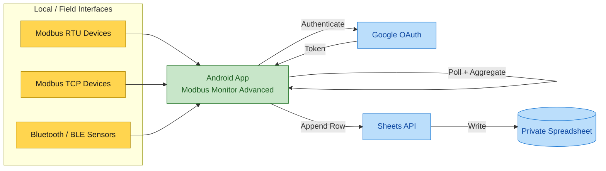

# Google Sheets Add-on for Modbus Monitor Advanced

**Unified real-time cloud spreadsheet logging for Android field data**

{ .screenshot-center loading="lazy" }

## Overview

The Google Sheets Add‑on makes real‑time Modbus data logging simple. With the Modbus Monitor Advanced Android app you can send live values straight to a private Google Sheet (no server, database, or coding required). Each polling cycle becomes one clean row: timestamp, device ID, and one column per point. This gives you searchable, shareable, exportable industrial data in seconds.

You can collect data from multiple field interfaces and send them all to the same spreadsheet:

- Modbus RTU (serial) devices via USB/RS-485 adapters
- Modbus TCP endpoints over WiFi or Ethernet
- Bluetooth / BLE sensor gateways (wrapped into Modbus-style polling internally)
- Mixed hybrid networks where RTU sources are bridged to TCP

Regardless of source (RTU serial line, TCP network, or BLE gateway), everything is converted into the same simple row format and appended for historical trends. Benefits:

- Rapid cloud visibility without deploying a server stack
- Seamless multi-device fleet aggregation (optional device ID column)
- Secure audit history, revision tracking, and export (XLSX / CSV / PDF)
- Immediate use of Google Sheets formulas, charts, pivot tables, and Apps Script automation

### FAQ: Why Only Private Authenticated Sheets?

??? question "Why are only private Google Sheets supported?"
    Public "anyone with the link can edit" sheets were deprecated for several reasons:
    - Data integrity risks (unauthorized edits or deletions)
    - Privacy and compliance requirements in industrial environments
    - No reliable per-user audit trail on public edit links
    - Stronger security via token-based authenticated access and revocation

    Each write uses your authenticated Google account token. Share the sheet explicitly with Viewer or Editor roles for controlled collaboration. For dashboards, keep edit access limited and grant View-only to broader audiences.

Typical architecture: multiple local Modbus RTU or TCP nodes + BLE peripherals → Android app polling & row assembly → OAuth token exchange → append via Sheets API → cloud spreadsheet for analysis and collaboration.

**Key Features:**

- **Real-time Logging** - Automatic row append after each polling cycle
- **Cloud Storage** - Google Drive integration with unlimited retention
- **Device Merging** - Log data from multiple devices with unique IDs to build a centralized database
- **Team Collaboration** - Share spreadsheets with view/edit permissions
- **Excel Compatible** - Download as XLSX, CSV, PDF
- **Custom Formulas** - Use Google Sheets functions on live data
- **Charts & Pivot Tables** - Use Google Sheets built-in visualization tools to view trend data
- **Version History** - Track all changes with timestamps
- **Mobile & Desktop** - Access from any device


!!! success "Quick Links"
    [:material-rocket-launch-outline: **Quick Start**](#quick-start-setup) | [:material-table: **Data Format**](#data-format) | [:material-frequently-asked-questions: **FAQ**](#frequently-asked-questions)

---

## Architecture (Easy Concept View)



Notes:
- Polling collects live Modbus register/coil values at your configured interval.
- App formats a row (timestamp + selected points), then appends via Google Sheets API.
- Optional local CSV logging can run in parallel for on-device backups.

---

## Log Data in Google Sheets

Logging data in Google Sheets using the Modbus Monitor Advanced Android app now exclusively uses a private Google Sheet linked to your authenticated Google account. This ensures strict privacy, audit history, and controlled access. Public "anyone can edit" shared sheets are no longer supported.

### Private Google Sheet (Authenticated)

Requires a Google Account. Data is kept private. You can create a new sheet automatically or reuse an existing one.

1. Go to Settings and select “Use Google Sheets”.
2. Enable “Create New Sheet on Start” if you want a new spreadsheet created each time the app starts; otherwise it reuses the same spreadsheet.
3. If needed, enter minutes in “CSV Log Timer” to also create a local CSV file (set 0 to disable; large values can fill storage—move files regularly).
4. Press “Back”.
5. Choose a Google account to log in.

### Sample Send (Account Setup Panel)

Use the Account Setup control panel to test and validate your configuration:

- **Log Out**: Log out of the current account.
- **Log In**: Log in to your Google account; “Login OK” confirms success.
- **Change Account**: Log out and log in to a different account.
- **Write Sample Data**: Writes sample data to the spreadsheet to test settings.
- **Create New Sheet**: Creates a new spreadsheet and remembers the Sheet ID.

### Start Sending Data Periodically

1. Adjust the logging interval to balance battery life and data usage (Settings → Log screen).
2. Click “Connect” or tap the Link to begin communication; confirm that data appears in the selected Google Spreadsheet.

---

## Migration Note

Content in this guide consolidates and updates material from the legacy page at https://quantumbitsolutions.com/sheets. The latest, canonical documentation lives here. If you find mismatches, use the feedback link at the end of this page.

---

## Quick Start Setup

### Prerequisites

- Modbus Monitor Advanced installed
- Google Sheets Add-on purchased and activated
- Google account (free Gmail account works)
- Monitor points configured and polling

### Create Spreadsheet (3 Minutes)

1. **Open Google Sheets**
   - Visit [sheets.google.com](https://sheets.google.com)
   - Sign in with Google account

2. **Create New Spreadsheet**
   - Click "Blank" to create new sheet
   - **Name**: e.g., "Modbus Data Log - Factory Line 1"
   - Note the **Spreadsheet ID** from URL:
     ```
     https://docs.google.com/spreadsheets/d/SPREADSHEET_ID_HERE/edit
     ```

3. **Prepare First Sheet**
   - Rename "Sheet1" to a descriptive name (e.g., "Sensor Data")
   - Leave cells empty - app will auto-create headers

4. **Get Sharing Link**
   - Click "Share" button
   - Get shareable link (for reference only)

### App Configuration (5 Minutes)

1. **Enable Google Sheets in App**
   - Hamburger Menu → Settings → Google Sheets
   - Toggle "Enable Google Sheets" ON

2. **Authenticate Google Account**
   - Tap "Sign in with Google"
   - Select your Google account
   - Grant permissions:
     - ✓ View and manage spreadsheets
     - ✓ See your email address
   - App stores authentication token securely

3. **Enter Spreadsheet Details**
   - **Spreadsheet ID**: Paste from URL (just the ID part)
   - **Sheet Name**: Tab name (e.g., "Sensor Data", "Sheet1")

4. **Configure Logging Options**
   - **Append Mode**: New row for each cycle (recommended)
   - **Update Mode**: Overwrite last row (for dashboards)
   - **Include Timestamp**: Auto-add date/time column (recommended)

5. **Start Logging**
   - Start Client Mode polling
   - First cycle creates headers automatically
   - Subsequent cycles append data rows

**Verify Logging:**
- Open your Google Sheets spreadsheet
- Refresh page
- New rows should appear after each polling cycle

---

## Detailed Configuration

### App Settings

{ .screenshot-center loading="lazy" }

**Required Settings:**

| Setting | Description | Example | Notes |
|---------|-------------|---------|-------|
| **Spreadsheet ID** | Unique ID from Sheets URL | `1Abc2Def3Ghi4Jkl5Mno6Pqr` | Copy from browser address bar |
| **Sheet Name** | Tab name in spreadsheet | `Sensor Data` | Must match exactly (case-sensitive) |
| **Google Account** | Authenticated account email | `user@gmail.com` | Shown after sign-in |

**Optional Settings:**

| Setting | Description | Default | When to Use |
|---------|-------------|---------|-------------|
| **Include Timestamp** | Add date/time column | Enabled | For time-series logging |
| **Timestamp Format** | ISO 8601 or custom | `YYYY-MM-DD HH:MM:SS` | Adjust for locale |
| **Include Device ID** | Add device identifier column | Disabled | Multi-device logging |
| **Append Mode** | Insert new row each cycle | Enabled | Most common use case |
| **Update Mode** | Overwrite last row | Disabled | For live dashboards |

### Authentication

**First-Time Setup:**
1. Tap "Sign in with Google"
2. Browser opens with Google consent screen
3. Select account and grant permissions
4. Browser redirects back to app
5. "Authenticated as [email]" confirmation

**Token Management:**
- Token stored securely on device
- Auto-refreshes when expired
- Revoke via Google Account settings
- Re-authenticate if issues occur

**Permissions Required:**
- `spreadsheets`: Read and write to spreadsheets
- `drive.file`: Access spreadsheets created/opened by app
- `userinfo.email`: Display signed-in account

---

## Legacy Shared Sheet Workflow (Deprecated)

The former "public shared sheet (anyone with the link can edit)" workflow has been deprecated and removed. All logging now requires an authenticated Google account and writes only to spreadsheets owned by or explicitly shared with that account.

Reasons for deprecation:
- Data integrity risks (unauthorized edits, accidental deletions)
- Lack of per-user audit trail and reliable version history
- Privacy requirements for industrial and regulated environments
- Improved token-based access control and revocation capability

If you previously used a public shared sheet:
- Create (or reuse) a private sheet under your account
- Share with specific emails using Viewer/Editor roles as needed
- Update the Spreadsheet ID in the app settings

All subsequent references in this guide assume the authenticated private sheet workflow.

---

## Account Setup Panel (Testing Controls)

Use the Account Setup panel to validate connectivity and permissions:

- **Log In / Log Out**: Authenticate or clear the session
- **Change Account**: Switch to a different Google account
- **Write Sample Data**: Append test values to confirm permissions and sheet configuration
- **Create New Sheet**: Programmatically create a spreadsheet and store its Sheet ID

---

## Start Sending Data Periodically

- Choose a sensible interval to reduce battery and data usage (5–60 seconds typical)
- Press **Link/Connect** in the main UI to start client polling
- Confirm rows appear in your spreadsheet with timestamps and values

---
 

## Data Format

### Automatic Headers

**First Cycle Creates Headers:**

On the first data upload, the app automatically creates a header row:

| Timestamp | Device ID | Tank Level | Motor Speed | Temperature | Pressure |
|-----------|-----------|------------|-------------|-------------|----------|
| 2025-11-25 14:30:00 | android01 | 75.3 | 1450 | 68.2 | 101.3 |
| 2025-11-25 14:30:05 | android01 | 74.8 | 1448 | 68.4 | 101.2 |

**Header Format:**
- **Timestamp**: If enabled, first column
- **Device ID**: If enabled, second column
- **Monitor Point Names**: Remaining columns in order

### Data Types

**Column Data Types:**

| Monitor Point Data Type | Sheets Cell Format | Example |
|------------------------|-------------------|---------|
| **Integer (16-bit, 32-bit)** | Number | `1450` |
| **Float (32-bit, 64-bit)** | Number (2 decimals) | `75.30` |
| **Boolean** | TRUE/FALSE | `TRUE` |
| **String** | Text | `Running` |

**Timestamp Format:**
- **ISO 8601**: `2025-11-25T14:30:00Z` (UTC)
- **Local Time**: `2025-11-25 14:30:00` (device timezone)
- Google Sheets auto-detects as date/time

### Row Append Behavior

**Append Mode (Default):**
```
Cycle 1 → Row 2 (after header)
Cycle 2 → Row 3
Cycle 3 → Row 4
...
```

**Update Mode:**
```
Cycle 1 → Row 2
Cycle 2 → Row 2 (overwrite)
Cycle 3 → Row 2 (overwrite)
```

!!! tip "When to Use Update Mode"
    Update mode is ideal for live dashboards where you only need the latest value. For historical logging and analysis, use append mode (default).

---

## Spreadsheet Organization

### Single Sheet Layout

**Simple Time-Series Log:**
```
Sheet: Sensor Data
- Column A: Timestamp
- Column B-Z: Monitor point values
- New row every polling cycle
```

### Multi-Sheet Structure

**Organized by Category:**
```
Spreadsheet: Factory Monitoring
├─ Sheet: Line 1 Sensors
├─ Sheet: Line 2 Sensors
├─ Sheet: Power Meters
└─ Sheet: Summary Dashboard
```

**Configuration:**
- Use different sheet names for each Android device/location
- Point each app instance to its own sheet
- Create summary sheet with references

### Dashboard Sheet

**Live Status Board:**
```
Sheet: Dashboard (Update Mode)
- Column A: Parameter Name (static)
- Column B: Current Value (updated)
- Column C: Units (static)
- Column D: Status (formula: =IF(B2>100,"High","Normal"))
```

**Charts:**
- Insert → Chart
- Data range: `Sensor Data!A:Z`
- Chart type: Line, Column, Gauge
- Auto-updates as data appends

---

## Use Cases & Examples

### Industrial Data Logging

**Monitor Points:**
- Timestamp, Tank Level, Pressure, Flow Rate, Temperature

**Logging:**
- Append mode with 30-second intervals
- Long-term archival for compliance
- Weekly export to CSV for analysis

**Formulas:**
```
=AVERAGE(B2:B1000)  // Average tank level
=MAX(D:D)           // Peak flow rate
=COUNTIF(E:E,">80") // Temperature over 80°C
```

### Multi-Device Fleet

**Setup:**
- Each Android device logs to separate sheet
- Include Device ID column
- Master sheet with IMPORTRANGE

**Master Sheet Formula:**
```
=QUERY({
  IMPORTRANGE("ID1","Sheet1!A:F");
  IMPORTRANGE("ID2","Sheet1!A:F");
  IMPORTRANGE("ID3","Sheet1!A:F")
}, "SELECT * ORDER BY Col1 DESC")
```

### Shift Reports

**Configuration:**
- Append mode with 5-minute intervals
- Timestamp column enabled
- Units in monitor point names

**Daily Summary:**
```
=QUERY(A:F, "SELECT A, AVG(B), MAX(C), MIN(D) 
WHERE A >= date '"&TEXT(TODAY(),"yyyy-mm-dd")&"' 
GROUP BY A")
```

### Quality Control

**Monitor Points:**
- Production count, Defect count, Cycle time

**Calculated Columns:**
```
Column F: =IF(D2>0, B2/D2, 0)  // Defect rate
Column G: =IF(C2<60, "Pass", "Fail")  // Cycle time check
```

**Conditional Formatting:**
- Red if defect rate > 5%
- Green if cycle time < 50s

---

## Advanced Features

### Google Sheets Formulas

**Real-time Calculations:**
```
// Running average of last 100 rows
=AVERAGE(INDIRECT("B"&MAX(2,ROW()-100)&":B"&ROW()))

// Count values above threshold today
=COUNTIFS(A:A,">="&TODAY(), C:C,">100")

// Conditional sum by device
=SUMIF(B:B,"android01",D:D)
```

### Pivot Tables

**Summarize Data:**
1. Data → Pivot table
2. Rows: Date (group by day)
3. Values: Average(Tank Level), Max(Pressure)
4. Filters: Device ID

### Charts & Graphs

**Time Series Chart:**
1. Select data range: `A1:F1000`
2. Insert → Chart → Line chart
3. X-axis: Timestamp
4. Y-axis: Multiple monitor points
5. Enable "Aggregate" for smooth lines

**Gauge Dashboard:**
1. Insert → Chart → Gauge chart
2. Data range: Last row only
3. Set min/max/threshold colors
4. Update mode keeps gauge live

### Sharing & Permissions

**Collaboration:**
- Share → Add email addresses
- **Viewer**: Read-only access
- **Commenter**: Can add comments
- **Editor**: Can modify data

**Public Link:**
- Share → Get link → Anyone with link
- Useful for public dashboards
- Viewers can't see authentication

### Apps Script Automation

**Auto-Export to PDF:**
```javascript
function dailyExport() {
  var ss = SpreadsheetApp.getActiveSpreadsheet();
  var sheet = ss.getSheetByName("Sensor Data");
  var pdf = sheet.getAs('application/pdf');
  
  GmailApp.sendEmail(
    "report@example.com",
    "Daily Sensor Report",
    "Attached is today's data",
    {attachments: [pdf]}
  );
}
```

**Trigger:** Daily at 11pm

---

## Troubleshooting

### Common Issues

| Problem | Cause | Solution |
|---------|-------|----------|
| **Authentication Failed** | Expired token | Re-authenticate via Settings → Google Sheets |
| **Spreadsheet Not Found** | Wrong ID or no access | Verify ID; check sharing permissions |
| **Sheet Not Found** | Typo in sheet name | Ensure exact match (case-sensitive) |
| **No Rows Appended** | Google Sheets disabled | Enable toggle in Settings |
| **Duplicate Headers** | Re-starting without clearing | Manually delete duplicate header rows |
| **Rate Limit Error** | Too many rapid writes | Increase polling interval to ≥5s |

### Testing Upload

**Manual Test:**
1. Configure spreadsheet with valid ID
2. Start Client Mode with 1-2 monitor points
3. Wait for one polling cycle
4. Refresh Google Sheets in browser
5. Verify new row with timestamp

**Check Upload Status:**
- Settings → Google Sheets → Last Upload Status
- Shows success/failure and timestamp
- Error messages if upload fails

### Quota Limits

**Google Sheets API Limits:**
- **Free tier**: 300 write requests per minute per project
- **Typical impact**: ~5s minimum between updates safe
- **Exceeding**: Temporary throttle, resume after cooldown

**Mitigation:**
- Increase polling interval (30-60s recommended)
- Use batch mode if available
- Avoid multiple devices writing to same sheet rapidly

---

## Frequently Asked Questions

??? question "How many monitor points can I log?"
    Google Sheets supports up to **18,278 columns** per sheet. Practically, keep under 50 monitor points per sheet for performance. For more data, use multiple sheets or consider MQTT add-on.

??? question "How often can I update the spreadsheet?"
    **Recommended minimum: 5 seconds** between updates to respect API rate limits. For industrial logging, 30-60 second intervals are typical and efficient.

??? question "Can I log to multiple spreadsheets?"
    No, each Android device logs to one spreadsheet. To aggregate multiple devices, use separate sheets in one spreadsheet or use IMPORTRANGE formulas to combine data.

??? question "Does Google Sheets work offline?"
    No, internet connection required to upload data. For offline logging, use local CSV export, then manually import to Sheets later.

??? question "Can I use Google Sheets with Sensor Server mode?"
    Yes! Android sensor values (accelerometer, gyro, etc.) are logged just like Modbus monitor points, with sensor names as column headers.

??? question "How do I export historical data?"
    File → Download → Microsoft Excel (.xlsx) or CSV. Alternatively, use QUERY or FILTER functions to export specific date ranges.

??? question "What happens if the spreadsheet is deleted?"
    Logging fails and errors appear in Settings. Create a new spreadsheet and update the Spreadsheet ID in app settings.

??? question "Can I share the spreadsheet without giving app access?"
    Yes. Share the spreadsheet normally via Google Sheets sharing. The app uses your authentication, not per-viewer permissions.

---

## Best Practices

**Spreadsheet Organization:**
- One sheet per device or location
- Descriptive sheet names (avoid generic "Sheet1")
- Include timestamp and device ID columns
- Archive old data periodically to new sheets

**Performance:**
- Keep active sheets under 100,000 rows
- Use separate sheets for historical data
- Avoid complex formulas in large datasets
- Consider monthly or yearly sheet rotation

**Data Management:**
- Export and archive data quarterly
- Use freeze rows/columns for headers
- Apply conditional formatting for alerts
- Document formulas and data sources

**Security:**
- Share with specific emails, not "anyone with link"
- Use Viewer permissions for non-editors
- Revoke app access if device is lost
- Regularly review Google Account permissions

---

## Additional Resources

- **Google Sheets Help**: [support.google.com/docs/topic/9054603](https://support.google.com/docs/topic/9054603)
- **Apps Script Docs**: [developers.google.com/apps-script](https://developers.google.com/apps-script)
- **API Reference**: [developers.google.com/sheets/api](https://developers.google.com/sheets/api)

**Need Help?** Contact [support@quantumbitsolutions.com](mailto:support@quantumbitsolutions.com)

[:octicons-issue-opened-24: Suggest an improvement](https://docs.quantumbitsolutions.com/support/)  
[:octicons-history-24: Legacy page](https://quantumbitsolutions.com/sheets)

---

[:octicons-arrow-left-24: Back to Advanced Guide](../products/android/advanced-guide.md#add-ons-integration)
