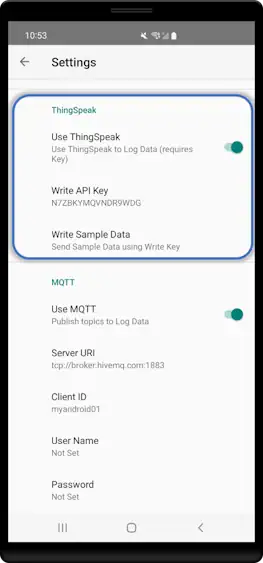

!!! note "Navigation"
    **📚 [Documentation Home](../index.md) → [Guides](index.md) → ThingSpeak for Android**

# ThingSpeak Add-on for Android

**Mobile IoT data logging to ThingSpeak. Cloud charts, MATLAB analytics, real-time alerts.**

{ .screenshot-center loading="lazy" }

⬆️ **New to ThingSpeak?** [See Overview Guide](thingspeak-overview.md) for platform-agnostic concepts, use cases, initial setup, and FAQ.

---

## Quick Start (3 Steps)

### Prerequisites

- ✅ Modbus Monitor Advanced installed  
- ✅ ThingSpeak Add-on purchased  
- ✅ ThingSpeak channel created with Write API Key ([see Overview Guide](thingspeak-overview.md#getting-started-all-platforms))

### Step 1: Enter Your API Key

1. Open **Hamburger Menu** → **Settings** → **ThingSpeak**
2. Toggle **Enable ThingSpeak** ON
3. Paste your **Write API Key** (from ThingSpeak)
4. Tap **OK**

{ .screenshot-center loading="lazy" }

### Step 2: Start Logging

1. Return to main screen
2. Tap **Link icon** to start Client Mode
3. Your monitor points automatically upload to ThingSpeak

### Step 3: View Your Data

1. Open [ThingSpeak](https://thingspeak.com)
2. Go to your channel → **Private View**
3. See live charts updating with your Modbus data

**Done!** Your data is now logging to the cloud.

---

## How It Works

### Automatic Field Mapping

Monitor points from your Modbus configuration automatically map to ThingSpeak Fields 1–8 **in the order they appear**:

```
Your Monitor Points:    ThingSpeak Channel:
1. Tank Level      →    Field 1
2. Motor Speed     →    Field 2
3. Temperature     →    Field 3
4. Pressure        →    Field 4
5. Flow Rate       →    Field 5
6. Humidity        →    Field 6
7. Voltage         →    Field 7
8. Current         →    Field 8
```

**⚠️ Limit:** ThingSpeak supports 8 fields maximum. Only your first 8 monitor points upload.

**To change what uploads:** Reorder your monitor points in the app. Changes take effect on the next upload cycle.

### Upload Interval

Data uploads to ThingSpeak based on your polling interval. Configure timing in **Settings** → **Timing** tab.

**Key Settings:**
- **Inter-Packet Time (ms)**: Delay between Modbus requests (lower = faster polling)
- **Interval (ms)**: Time between complete polling cycles (this determines ThingSpeak upload frequency)

For detailed configuration help, see [Advanced Guide → Timing Settings](../products/android/advanced-guide.md#timing-settings).

**ThingSpeak Requirements:**

- **Minimum:** 15 seconds (15,000 ms) for free tier
- **Recommended:** 30–60 seconds for balanced performance

---

## Android-Specific Features

### Mobile Features

**Start/Stop Logging:**
- Tap **Link icon** to start or Stop
- Data uploads automatically after each poll cycle

**Battery Savings:**
- Frequent polling drains battery
- Recommended: 30–60 second intervals on battery
- Use USB power for continuous monitoring

**Background Monitoring:**
- App continues uploading while in background
- Requires internet connection (WiFi or mobile data)
- Pauses uploads when offline, resumes when connected

---

## Verification & Testing

### Check if it's working

1. **Enable ThingSpeak** in app settings
2. **Start Client Mode** on main screen
3. **Open ThingSpeak** → Your Channel → **Private View**
4. **Look for new data points** with recent timestamps

### Troubleshooting

| Issue | Solution |
|-------|----------|
| **No data uploaded** | Check Write API Key is correct and copied exactly |
| **Internet required** | Verify WiFi or mobile data connection |
| **Rate limit error** | Increase interval to at least 15 seconds |
| **Only seeing some fields** | Only first 8 monitor points upload |
| **Wrong values uploading** | Verify monitor points are reading correct Modbus addresses |

---

## Common Tasks

**How do I view my data?**  
Open ThingSpeak → Your Channel → Private View (or Public View if shared)

**Can I make my data public?**  
Yes: Channel Settings → Sharing → "Share channel view with everyone"

**How do I export data?**  
ThingSpeak → Data Import/Export → Choose format (CSV, JSON, XML) → Download

**How many days of data does ThingSpeak keep?**  
Free tier: 3 months of history (rollover after 3 months)

**Can I see alerts?**  
Yes: Set up React Apps in ThingSpeak for email/SMS on threshold breach

---

## Cross-Platform Reference
Feature comparison between Android and Windows versions of the ThingSpeak Add-on.

| Feature | Android | Windows |
|---------|---------|---------|
| **Basic Setup** | [← You are here] | [Windows Setup](thingspeak-addon.md) |
| **ThingSpeak Concepts** | [Overview Guide](thingspeak-overview.md) | [Overview Guide](thingspeak-overview.md) |
| **MATLAB Integration** | Supported | Supported |
| **Max Fields** | 8 | 8 |
| **Min Update Interval** | 15s (free) | 15s (free) |

---

## FAQ
Short answers to practical, real-world questions—rate limits, mapping, offline use, sensors, and alerts.

??? question "What if I have more than 8 monitor points?"
    ThingSpeak supports 8 fields max. Only the first 8 points upload. For more data:
    - Create multiple channels
    - Use MQTT or Google Sheets add-ons
    - Upgrade ThingSpeak plan

??? question "Does it work offline?"
    No—ThingSpeak requires internet. The app stores data locally, but you must upload later.

??? question "What's the battery impact?"
    Frequent uploads consume power. For battery devices, use 30-60 second intervals or connect USB power.

??? question "Can I change field mapping?"
    No automatic mapping. Fields are assigned by monitor point order. Reorder points to change mapping.

??? question "Does Android Sensor Server work?"
    Yes! Sensor values upload alongside Modbus data as long as you have free ThingSpeak fields.

??? question "Can I see real-time notifications?"
    Yes. Set up React Apps in ThingSpeak for email/SMS alerts when data exceeds thresholds.

---

## Resources
Official links for further reading, MATLAB integration, community help, and support.

- **ThingSpeak Docs**: [thingspeak.com/docs](https://thingspeak.com/docs)
- **MATLAB Integration**: [mathworks.com/thingspeak](https://www.mathworks.com/help/thingspeak/)
- **Community**: [community.thingspeak.com](https://community.thingspeak.com/)
- **Support**: [support@quantumbitsolutions.com](mailto:support@quantumbitsolutions.com)

---

[:octicons-arrow-left-24: Back to Advanced Guide](../products/android/advanced-guide.md#add-ons-integration)
