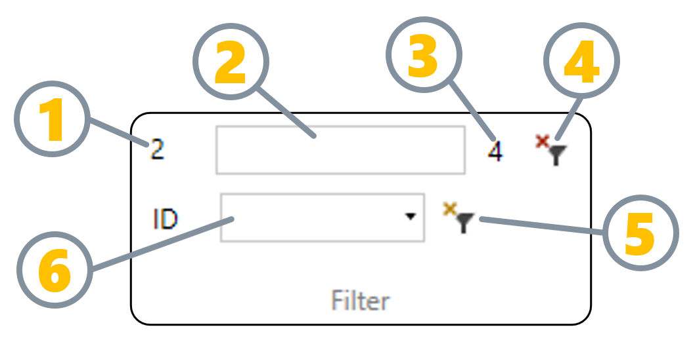
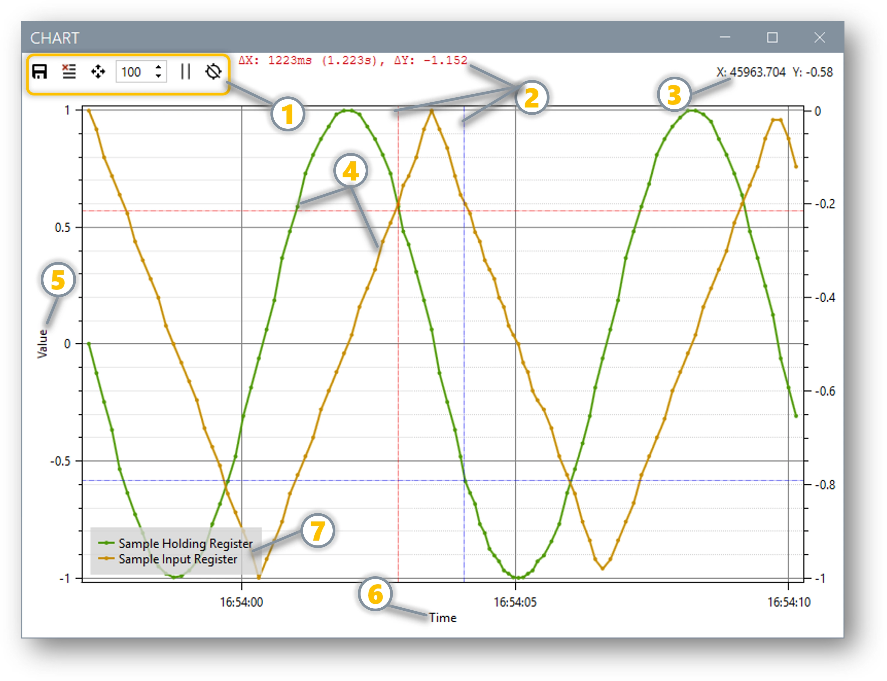

# 🖼️ Images & Assets Management Guide

!!! tip "Quick Reference"
    **Best Practice**: Store images in `docs/assets/` with organized subfolders.  
    **VS Code**: Paste images directly and they'll be auto-saved to your chosen folder!

[TOC]

## 📁 Recommended Folder Structure

```
docs/
├── assets/
│   ├── images/           # General images, logos, icons
│   ├── screenshots/      # Application screenshots  
│   ├── diagrams/        # Hand-drawn or external diagrams
│   ├── icons/           # Small UI icons and favicons
│   └── downloads/       # PDF files, templates, etc.
├── index.md
└── other-pages.md
```

## 🚀 VS Code Image Workflow (Recommended)

### Method 1: Paste & Auto-Save (Easiest!)

1. **Copy** an image (screenshot, from web, etc.)
2. **Paste** in your markdown file with `Ctrl+V`
3. **VS Code will prompt**: "Save image to..."
4. **Choose folder**: Navigate to `docs/assets/screenshots/` 
5. **Name the file**: Use descriptive names like `modbus-connection-settings.png`

**Result**: VS Code automatically creates the correct markdown syntax:
```markdown

```

### Method 2: Drag & Drop

1. **Drag** image files from Explorer into VS Code editor
2. **VS Code asks**: Where to save the image
3. **Choose**: `docs/assets/images/` or appropriate subfolder
4. **Auto-generated** markdown link appears

## 📝 Markdown Image Syntax

### Basic Image
```markdown

```

### Image with Title Tooltip
```markdown

```

### Clickable Image (Opens full size)
```markdown
[](assets/screenshots/full-dashboard.png)
```

### Image with Caption
```markdown
<figure markdown>
  
  <figcaption>Complete network topology showing all Modbus devices</figcaption>
</figure>
```

### Responsive Images with Sizing
```markdown
{ width="300" }
```

## 🎯 Image Naming Conventions

### Screenshots
- `dashboard-main-view.png` - Main application views
- `dialog-connection-settings.png` - Dialog boxes and modals  
- `menu-file-operations.png` - Menu screenshots
- `error-connection-timeout.png` - Error states

### Diagrams  
- `architecture-system-overview.png` - System architecture
- `workflow-data-processing.png` - Process workflows
- `network-topology-plant-a.png` - Network diagrams

### Icons
- `icon-modbus-tcp.svg` - Protocol icons
- `status-connected.png` - Status indicators
- `button-export-data.png` - UI elements

## 📐 Image Size Guidelines

### Screenshots
- **Full application**: 1920x1080 or 1440x900
- **Dialog boxes**: Actual size (don't resize)
- **Mobile views**: 375x812 (iPhone) or 360x800 (Android)

### Performance Tips
- **Compress**: Use tools like TinyPNG for smaller file sizes
- **Format**: PNG for screenshots, JPG for photos, SVG for icons
- **Max width**: Keep under 2000px for web display

## 🔧 Advanced Features

### Image Galleries with Tabs

=== "Connection Setup"
    
    
    Configure the IP address and port for your Modbus device.

=== "Register Mapping" 
    
    
    Map the registers you want to monitor.

=== "Live Data"
    
    
    View real-time data from your device.

### Image with Annotations

```markdown


1. **Connection Status** - Shows current device state
2. **Live Data Panel** - Real-time register values  
3. **Historical Charts** - Trending data visualization
4. **Alert Panel** - Active alarms and notifications
```

### Comparison Images Side by Side

<div class="grid cards" markdown>

-   **Before Optimization**

    
    
    Response time: 2.5 seconds

-   **After Optimization**  

    
    
    Response time: 0.3 seconds

</div>

## 📋 Asset Management Checklist

### Before Adding Images
- [ ] Is the image necessary for understanding?
- [ ] Is it the right format (PNG/JPG/SVG)?
- [ ] Is the file size reasonable (< 1MB)?
- [ ] Does the filename follow naming conventions?

### When Adding Images  
- [ ] Use descriptive alt text for accessibility
- [ ] Place in appropriate subfolder
- [ ] Add caption if context is needed
- [ ] Test image displays correctly in preview

### After Adding Images
- [ ] Verify image loads in `mkdocs serve` preview
- [ ] Check mobile responsiveness
- [ ] Ensure images are committed to Git
- [ ] Update any image references in other files

## 🎨 Pro Tips

!!! success "VS Code Extensions for Images"
    - **Paste Image**: Auto-saves pasted images
    - **Image Preview**: Hover to preview images
    - **SVG**: Syntax highlighting for SVG files

!!! info "Git & Large Files"
    - **Commit images**: They're part of your documentation
    - **File size**: Keep under 10MB per image (GitHub limit)
    - **Git LFS**: Consider for very large image collections

!!! warning "Broken Links"
    Use relative paths from the markdown file location:
    ```markdown
    ✅ 
    ❌   
    ❌ 
    ```

## 🔄 Moving Existing Images

Let me help you organize your current images:

```bash
# Move existing images to proper location
mv docs/image.png docs/assets/images/
mv docs/image-1.png docs/assets/screenshots/

# Update markdown references
# From:  
# To:   
```

Your image workflow is now optimized! 📸✨