# 📊 Mermaid Diagrams Showcase

!!! info "Complete Mermaid Reference"
    This page showcases all types of Mermaid diagrams you can use in your documentation.  
    Copy any example and customize for your needs!

[TOC]

## 🔄 Flowcharts & Process Diagrams

### Basic Flowchart

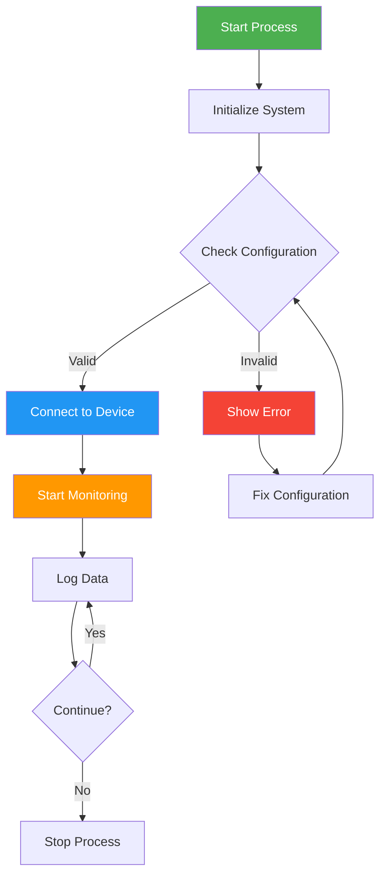

### Complex System Architecture

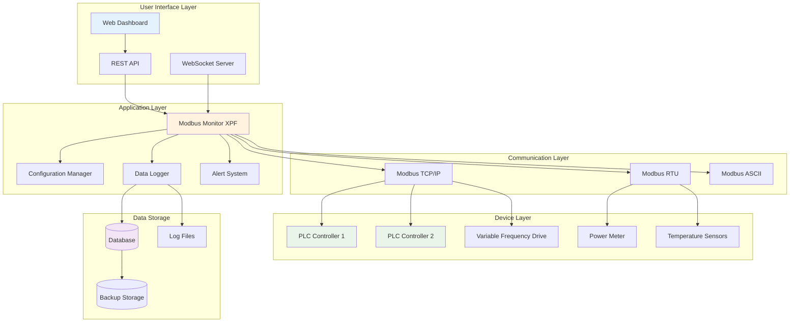

### Network Topology Diagram

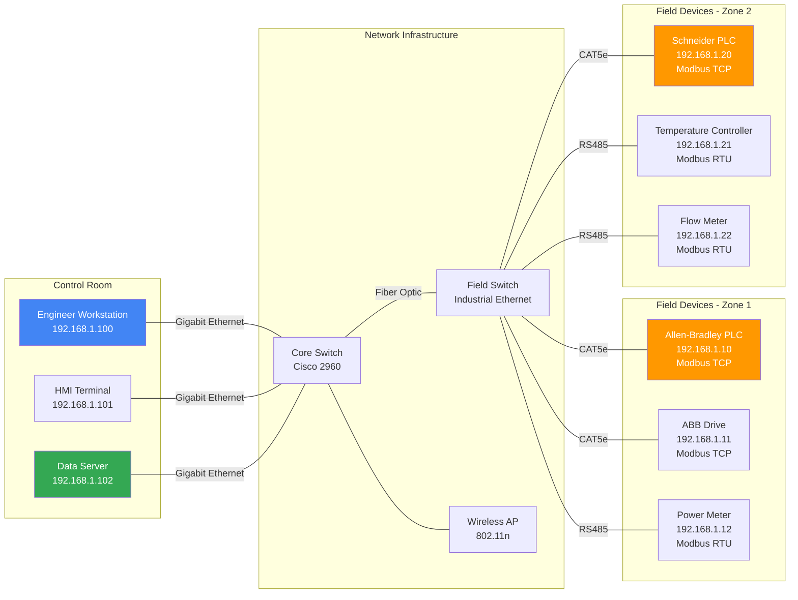

## 📋 Sequence Diagrams

### Modbus Communication Flow

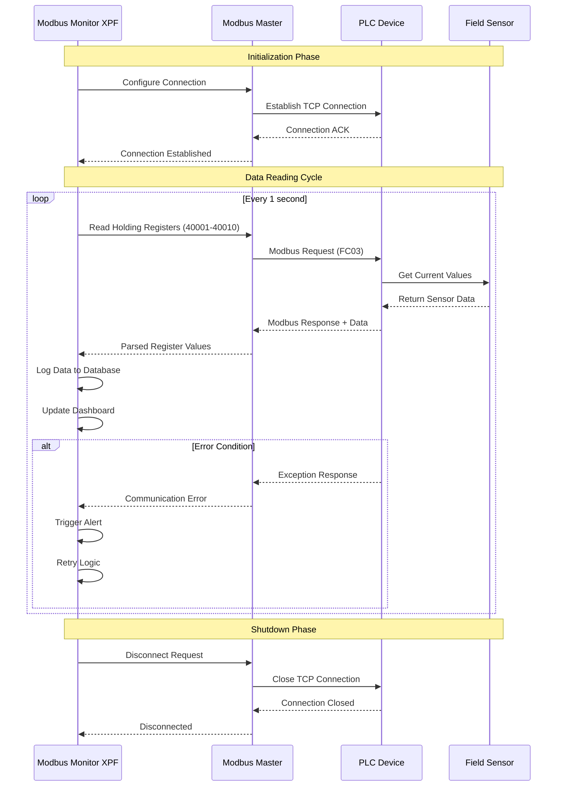

### User Workflow Process

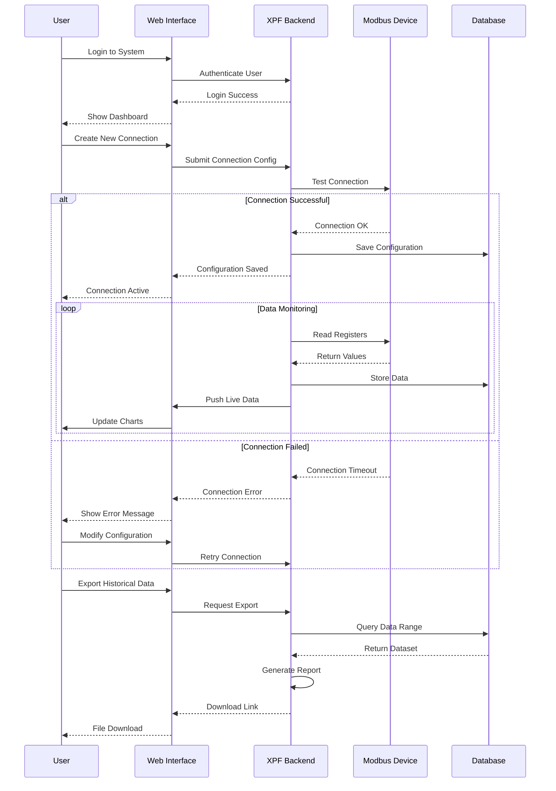

## 📊 Charts & Graphs

### State Diagram

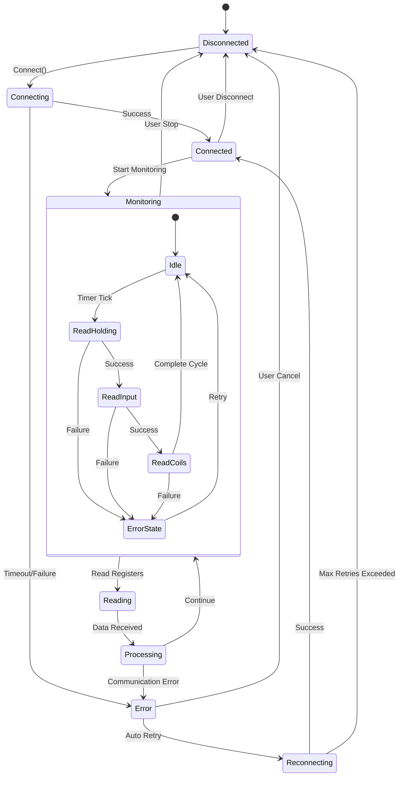

### Class Diagram (System Architecture)

```mermaid
classDiagram
    class ModbusMonitor {
        +String deviceIP
        +int port
        +int timeout
        +ConnectionStatus status
        +connect()
        +disconnect()
        +readRegisters()
        +writeRegisters()
    }
    
    class ConnectionManager {
        +List~Connection~ connections
        +addConnection()
        +removeConnection()
        +getActiveConnections()
    }
    
    class DataLogger {
        +String logPath
        +LogFormat format
        +bool enabled
        +logData()
        +exportData()
        +clearLogs()
    }
    
    class RegisterMap {
        +int address
        +DataType type
        +String name
        +float scaleFactor
        +String unit
        +validate()
        +convert()
    }
    
    class AlertSystem {
        +List~AlertRule~ rules
        +addRule()
        +removeRule()
        +checkAlerts()
        +sendNotification()
    }
    
    class WebInterface {
        +startServer()
        +handleRequest()
        +pushUpdate()
    }
    
    ModbusMonitor "1" --> "1..*" RegisterMap
    ConnectionManager "1" --> "0..*" ModbusMonitor
    ModbusMonitor "1" --> "1" DataLogger
    ModbusMonitor "1" --> "1" AlertSystem
    WebInterface "1" --> "1" ConnectionManager
    
    <<interface>> IModbusClient
    ModbusMonitor ..|> IModbusClient
    
    <<enumeration>> ConnectionStatus
    ConnectionStatus : DISCONNECTED
    ConnectionStatus : CONNECTING
    ConnectionStatus : CONNECTED
    ConnectionStatus : ERROR
    
    <<enumeration>> DataType
    DataType : INT16
    DataType : INT32
    DataType : FLOAT32
    DataType : BOOL
```

### Entity Relationship Diagram

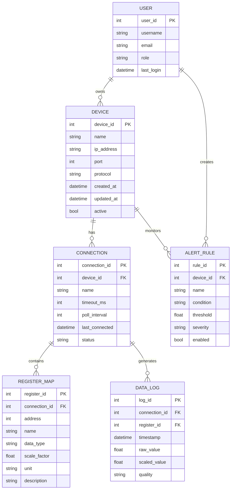

## 📈 Timeline & Gantt Charts

### Project Timeline

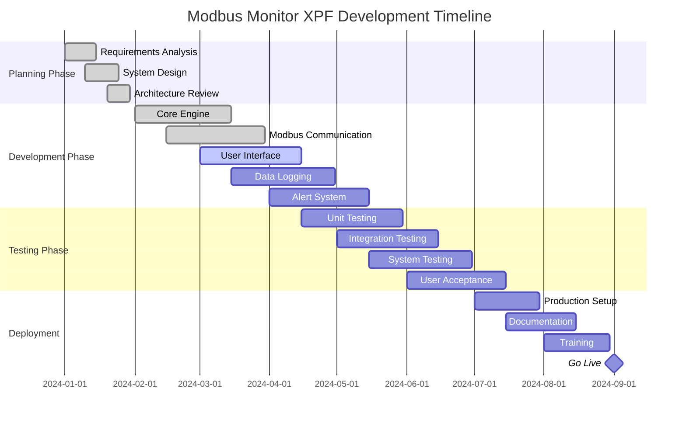

### Feature Implementation Roadmap

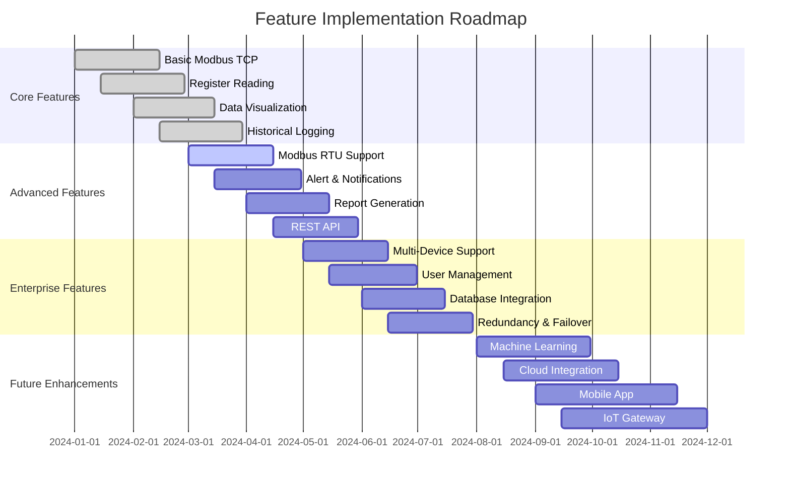

## 🔀 Git Flow & Workflow

### Development Workflow

```mermaid
gitgraph
    commit id: "Initial Setup"
    branch develop
    checkout develop
    commit id: "Core Framework"
    
    branch feature/modbus-tcp
    checkout feature/modbus-tcp
    commit id: "TCP Implementation"
    commit id: "Connection Pool"
    commit id: "Error Handling"
    
    checkout develop
    merge feature/modbus-tcp
    commit id: "Integrate TCP Support"
    
    branch feature/ui-dashboard
    checkout feature/ui-dashboard
    commit id: "Dashboard Layout"
    commit id: "Real-time Charts"
    
    branch feature/data-logging
    checkout feature/data-logging
    commit id: "Logger Framework"
    commit id: "Database Schema"
    
    checkout develop
    merge feature/ui-dashboard
    merge feature/data-logging
    commit id: "Feature Integration"
    
    checkout main
    merge develop
    commit id: "v1.0 Release" tag: "v1.0.0"
    
    checkout develop
    branch feature/alerts
    checkout feature/alerts
    commit id: "Alert Rules Engine"
    commit id: "Notification System"
    
    checkout develop
    merge feature/alerts
    
    checkout main
    merge develop
    commit id: "v1.1 Release" tag: "v1.1.0"
```

## 🗺️ Mind Maps & Hierarchies

### System Components Mind Map

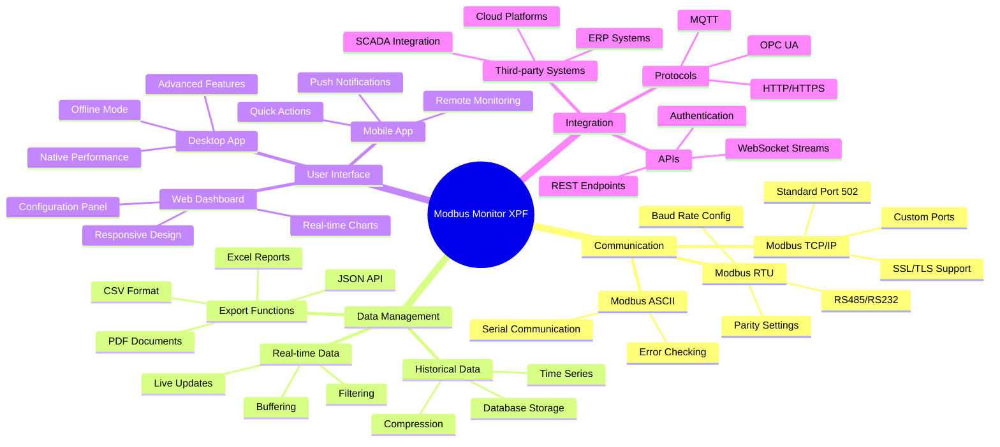

## 🔄 Pie Charts & Quadrant Charts

### System Resource Usage

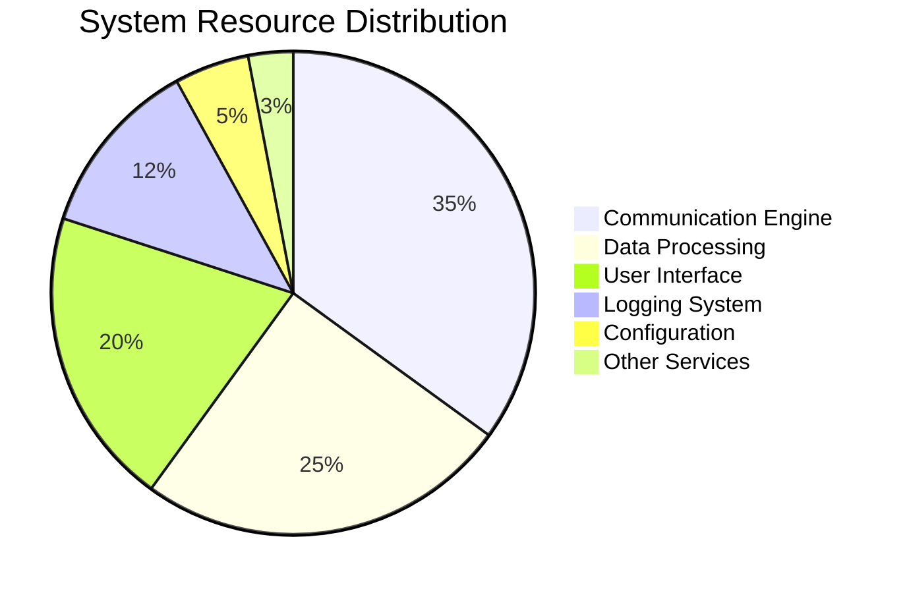

### Feature Priority Matrix

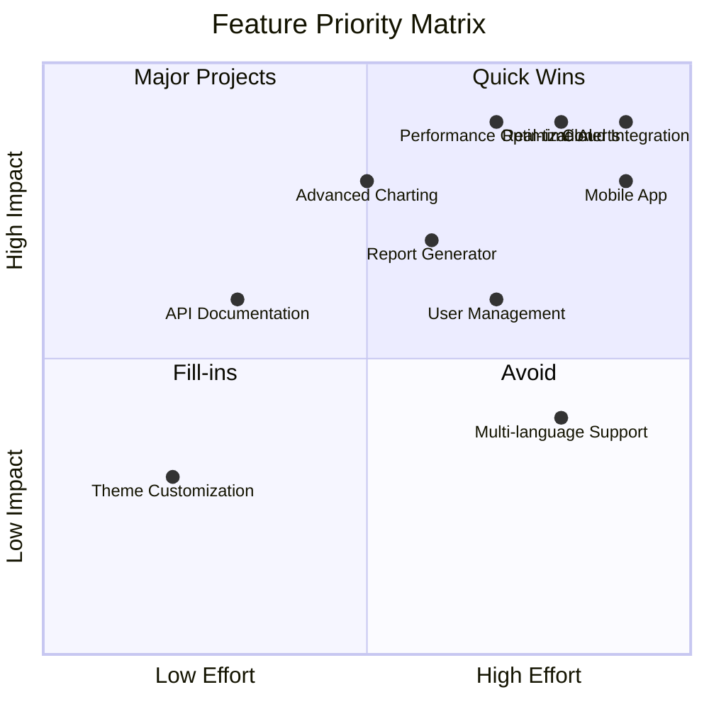

## 📋 Use These Templates!

### Quick Copy Templates

**Basic Flowchart Template:**
```markdown
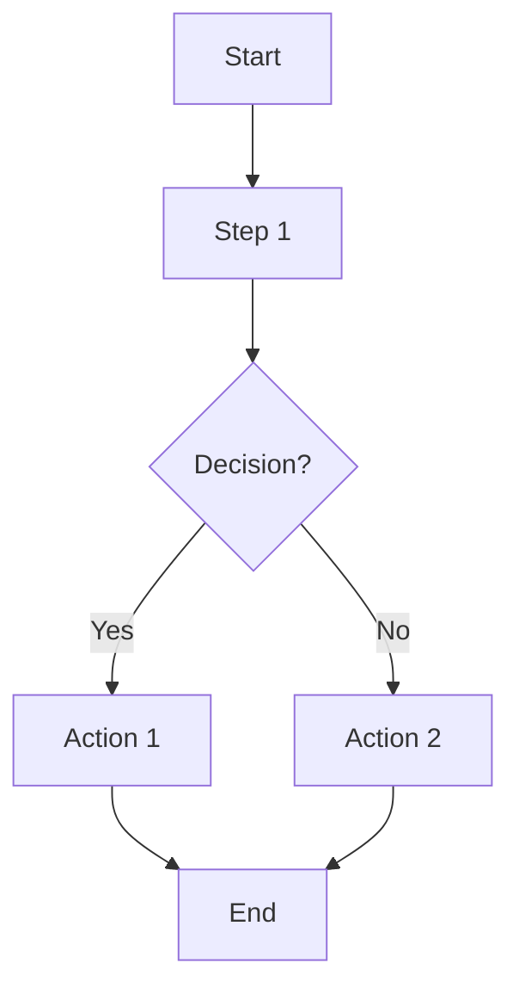
```

**Sequence Diagram Template:**
```markdown
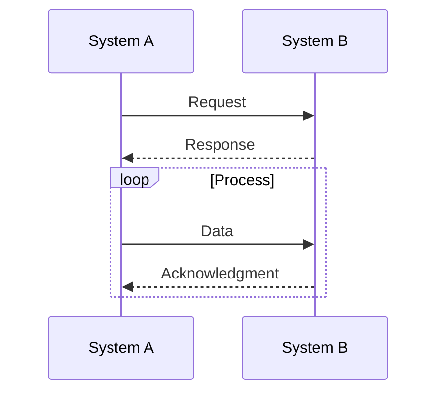
```

**Network Diagram Template:**
```markdown
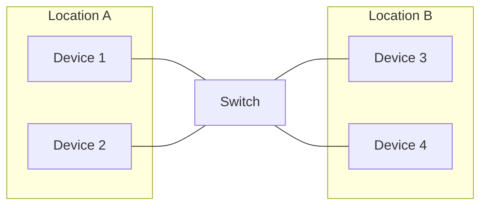
```

!!! tip "Mermaid Tips"
    - **Styling**: Add `style NodeID fill:#color` for custom colors
    - **Subgraphs**: Group related components together
    - **Links**: Use `-->`, `---`, `-.-`, `==>` for different arrow types
    - **Classes**: Define reusable styles with `classDef className fill:#color`
    - **Themes**: Available themes: default, dark, forest, neutral

Your Mermaid showcase is now complete with all major diagram types! 🎉