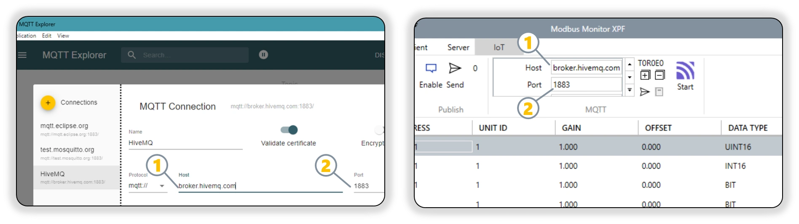

!!! note "Navigation"
    **[Documentation Home](../../) > [XPF User Guide](../products/xpf/user-guide.md) > MQTT Add-on**

# MQTT Add-on

**General-purpose messaging and IoT connectivity add-on for Modbus Monitor XPF**

<figure markdown>
  
  <figcaption>XPF MQTT Configuration showing connection to public broker </figcaption>
</figure>

## Quick Start: Connect to Public MQTT Brokers

The fastest way to get started with MQTT is to connect to free public test brokers. This section shows how to configure XPF to connect to popular public MQTT brokers for testing and development.

### Supported Public Brokers

=== "HiveMQ Public (Recommended)"

    **Recommended for beginners - reliable and well-maintained**
    
    | Connection Type | Host | Port | Security | Notes |
    |----------------|------|------|----------|-------|
    | **TCP** | `broker.hivemq.com` | `1883` | Unencrypted | Basic testing |
    | **TCP + TLS** | `broker.hivemq.com` | `8883` | Encrypted | Recommended for production testing |
    | **WebSocket** | `broker.hivemq.com` | `8000` | Unencrypted | Web browser compatible |
    | **WebSocket + TLS** | `broker.hivemq.com` | `8884` | Encrypted | Secure web browser compatible |
    
    **Authentication:** None required (anonymous access)  
    **Reliability:** High uptime, actively maintained by HiveMQ  
    **Best For:** Learning MQTT, initial testing, proof of concepts

=== "Eclipse Mosquitto"

    **Alternative option for testing**
    
    | Connection Type | Host | Port | Security | Notes |
    |----------------|------|------|----------|-------|
    | **TCP** | `test.mosquitto.org` | `1883` | Unencrypted | Basic testing |
    | **TCP + TLS** | `test.mosquitto.org` | `8883` | Encrypted | Secure testing |
    
    **Authentication:** None required (anonymous access)  
    **Reliability:** Good uptime, community maintained  
    **Best For:** Alternative testing option, Mosquitto-specific features

=== "EMQX Public"

    **Additional testing option**
    
    | Connection Type | Host | Port | Security | Notes |
    |----------------|------|------|----------|-------|
    | **TCP** | `broker.emqx.io` | `1883` | Unencrypted | Basic testing |
    | **TCP + TLS** | `broker.emqx.io` | `8883` | Encrypted | Secure testing |
    | **WebSocket** | `broker.emqx.io` | `8083` | Unencrypted | Web browser compatible |
    | **WebSocket + TLS** | `broker.emqx.io` | `8084` | Encrypted | Secure web browser compatible |
    
    **Authentication:** None required (anonymous access)  
    **Reliability:** Good uptime, EMQX maintained  
    **Best For:** Testing EMQX-specific features, alternative broker option

=== "Local Mosquitto"

    **Run your own broker locally**
    
    | Connection Type | Host | Port | Security | Setup Required |
    |----------------|------|------|----------|----------------|
    | **TCP** | `localhost` | `1883` | Unencrypted | Install Mosquitto locally |
    | **TCP + TLS** | `localhost` | `8883` | Encrypted | Configure TLS certificates |
    
    **Authentication:** Configurable (can require username/password)  
    **Reliability:** Depends on your setup  
    **Best For:** Development, learning broker administration, offline testing
    
    **Quick Setup:**
    ```bash
    # Windows (using Chocolatey)
    choco install mosquitto
    
    # Start broker
    mosquitto -v
    ```

!!! warning "Public Broker Security"
    Public brokers are intended for **testing only**. Never send sensitive data or use them for production applications. Anyone can subscribe to your topics and see your messages.

### Step-by-Step Connection Guide

This section provides a complete walkthrough for connecting XPF to an MQTT broker. **We'll use HiveMQ's public broker (`broker.hivemq.com`) as our example** since it requires no registration and is perfect for learning and initial testing.

!!! example "Example Configuration Notice"
    **The following steps demonstrate connecting to `broker.hivemq.com` as an example.** You can substitute any broker from the [Supported Public Brokers](#supported-public-brokers) tabs above, or use your own private broker by replacing the host, port, and authentication details as needed.

#### Prerequisites
- Modbus Monitor XPF with MQTT Add-on installed and licensed
- Internet connection for accessing public brokers
- Basic understanding of MQTT topics and messages

#### Configuration Steps      

1. **Open MQTT Configuration**
   - Launch Modbus Monitor XPF
   - Navigate to the MQTT Add-on settings
   - **Example**: We'll connect to `broker.hivemq.com` on port `1883` 


2. **Enter Broker Details**
      - **Broker Address**: Enter `broker.hivemq.com`
      - **Port**: Use `1883` for unencrypted or `8883` for TLS
      - **Protocol**: Select `TCP` or `TLS TCP` based on your port choice
      - **Client ID**: Enter a unique identifier (e.g., `XPF-Test-001`)

3. **Authentication Settings**
      - **Username**: Leave blank (public broker requires no authentication)
      - **Password**: Leave blank
      - **Certificate**: Not required for basic connection

4. **Test Connection**
      - Click "Test Connection" to verify connectivity
      - Should show "Connected" status if successful

5. **Configure Topics**
      - **Publish Topic**: `xpf/test/data` (example)
      - **Subscribe Topic**: `xpf/test/commands` (example)

!!! tip "Topic Best Practices"
    Use unique topic prefixes to avoid conflicts with other users:
    - Good: `yourname/xpf/device1/data`
    - Avoid: `data` or `test` (too generic)

#### Validating Your Connection with MQTT Explorer

To verify that your XPF MQTT connection is working correctly, use **MQTT Explorer** - a free desktop application that provides a visual interface for monitoring MQTT traffic.

<figure markdown>
  
  <figcaption>Connection setup showing XPF MQTT configuration (left) and MQTT Explorer (right). Both must use the same: (1) Host/Broker address and (2) Port number for successful communication</figcaption>
</figure>

**MQTT Explorer Setup:**

1. **Download and Install MQTT Explorer**
      - Visit: [MQTT Explorer Official Site](http://mqtt-explorer.com/)
      - Download the installer for Windows
      - Install and launch the application

2. **Connect MQTT Explorer to the Same Broker**
      - **Name**: `HiveMQ Public Test` (or any descriptive name)
      - **Host**: `broker.hivemq.com`
      - **Port**: `1883`
      - **Protocol**: `mqtt://`
      - Click "Connect"

3. **Monitor XPF Message Publishing**
      - In MQTT Explorer, navigate to your topic tree (e.g., `xpf/test/data`)
      - Start publishing from XPF
      - Verify messages appear in MQTT Explorer in real-time
      - Check message content and timestamps

4. **Test Bidirectional Communication**
      - Use MQTT Explorer to publish a test message to your subscribe topic
      - Verify XPF receives the message
      - Confirm message format and content in XPF

!!! success "Validation Checklist"
    **Your MQTT connection is working correctly when:**
    
    - MQTT Explorer shows "Connected" status
    - Messages from XPF appear in MQTT Explorer
    - Messages published from MQTT Explorer reach XPF
    - Message timestamps are current
    - JSON formatting is correct (if using structured data)

*[Detailed configuration steps with screenshots will be added here]*

*[MQTT Explorer validation screenshots will be added here]*

---

## Overview

The MQTT Add-on enables Modbus Monitor XPF to publish and subscribe to MQTT brokers for general IoT messaging, cloud integration, and distributed system communication. This add-on provides:

- **Universal MQTT Connectivity**: Connect to any MQTT broker (AWS IoT, Azure IoT, HiveMQ, Mosquitto, etc.)
- **Bi-directional Communication**: Both publish monitor point data and subscribe to control commands
- **Advanced Security**: TLS/SSL encryption, client certificates, and authentication support
- **Flexible Topic Management**: Custom topic structures with dynamic variable substitution
- **JSON Message Support**: Structured data publishing with configurable JSON formatting
- **Quality of Service**: QoS 0, 1, and 2 support for reliable message delivery
- **Retained Messages**: Store last known values for new subscribers

!!! info "Add-on vs Core Features"
    **MQTT Add-on** provides general MQTT messaging capabilities for any broker, while **ThingSpeak Add-on** is specifically designed for ThingSpeak cloud platform integration with dedicated features for channel management.

## XPF's Revolutionary MQTT Capabilities

**Modbus Monitor XPF is the only tool that provides complete bidirectional MQTT integration in both Client and Server modes** - eliminating the need for multiple software tools and dramatically simplifying MQTT development and deployment.

### Unique Bidirectional Architecture

!!! success "Industry-First Capabilities"
    **XPF combines Publisher + Subscriber + MQTT Test Tools in one application:**
    
    **Publisher Mode (Client Mode Active)**
    - XPF polls Modbus devices and publishes data to MQTT broker
    - Perfect for: Sending sensor data, status updates, alarms to cloud
    
    **Subscriber Mode (Server Mode Active)**  
    - XPF receives MQTT messages and writes values to Modbus devices
    - Perfect for: Remote setpoint changes, control commands, configuration updates
    
    **Built-in MQTT Test Tools**
    - Integrated MQTT client for testing and debugging
    - No need for separate test applications
    - Save hours of setup time and eliminate tool confusion

### Why This is Revolutionary

| Traditional Approach | XPF Integrated Approach | Time Savings |
|---------------------|-------------------------|--------------|
| **Modbus Client Software** | **XPF Client Mode** | |
| + **Separate MQTT Publisher** | (Built into XPF) | **60-80% faster** |
| + **Separate MQTT Subscriber** | **XPF Server Mode** | |
| + **MQTT Test Client** | **Built-in Test Tools** | |
| + **Integration Coding** | (No coding needed) | |
| = 4+ separate tools | = **One XPF License** | **75% cost reduction** |

### Bidirectional Use Cases

**Industrial Automation (Both Directions)**
```yaml
Uplink (XPF Client to MQTT):
  - Temperature sensors to Cloud dashboard
  - Production counts to Analytics platform  
  - Alarm states to Notification system

Downlink (MQTT to XPF Server):
  - Setpoint changes to PLC registers
  - Recipe updates to Process controllers
  - Emergency stops to Safety systems
```

**IoT Edge Gateway (Complete Solution)**
```yaml
Edge Processing:
  - Collect from multiple Modbus devices (Client mode)
  - Aggregate and process data locally  
  - Publish summaries to cloud (Publisher)
  - Receive cloud commands (Subscriber)
  - Distribute commands to devices (Server mode)
```

**Development & Testing (Integrated Tools)**
```yaml
Development Workflow:
  1. Use XPF Server mode to simulate devices
  2. Test MQTT publishing with built-in tools
  3. Verify cloud connectivity with integrated client
  4. Deploy same XPF configuration to production
```

!!! tip "No Other Tool Does This"
    **XPF eliminates the complexity of:**
    - Learning multiple MQTT client applications
    - Integrating separate publisher/subscriber tools  
    - Writing custom code to bridge Modbus and MQTT
    - Managing multiple software licenses and configurations
    - Debugging communication between separate tools

This guide will show you how to leverage both directions plus the integrated test tools for complete MQTT solutions.

## Quick Start

### 1. Purchase Add-on

You need both an MQTT broker (cloud or local) and the XPF MQTT Add-on:

#### A. MQTT Broker Service
- **Free Options**: 
  - Local: [Eclipse Mosquitto](https://mosquitto.org/) (free local broker)
  - Cloud: [HiveMQ Cloud](https://www.hivemq.com/cloud/) (free tier available)
  - AWS IoT Core (pay-as-you-go)
- **Commercial Brokers**: AWS IoT, Azure IoT Hub, Google Cloud IoT Core
- **Enterprise**: Private MQTT broker installations

#### B. Modbus Monitor XPF MQTT Add-on (Integration Software)
- **Purchase Required**: Buy MQTT Add-on from [Quantum Bit Solutions Shop](https://quantumbitsolutions.com/shop/)
  - Search for "MQTT Add-on" or "XPF MQTT Integration"
  - Enables XPF to connect to any MQTT broker
  - Includes advanced security and topic management features
- **Installation**: Activate the Add-on and restart the App to enable the feature.
  - **See**: [License Activation](../products/xpf/user-guide.md#license-activation) in the main user guide for step-by-step activation instructions

### 2. Configure Add-on
- [Configure MQTT broker connection](#step-1-configure-mqtt-broker-connection)
- [Set up topics for publishing and subscribing](#step-2-configure-topics)
- [Map monitor points to MQTT messages](#step-3-message-mapping)

### 3. Configure Monitor Points
- **See**: [Monitor Points Configuration](../products/xpf/user-guide.md#7-monitor-points-configuration) in main user guide
- **Focus**: Ensure monitor points are collecting the data you want to publish via MQTT

### 4. Start Messaging & Verify
- [Enable MQTT communication](#step-4-enable-mqtt-communication)
- [Verify message flow](#verification-checklist) to/from broker
- [Monitor connection status](#monitoring-and-maintenance) and troubleshoot if needed

## Prerequisites

Before starting, ensure you have:

- [ ] **Modbus Monitor XPF** installed with MQTT Add-on enabled
- [ ] **MQTT broker access** (cloud service or local installation)
- [ ] **Broker credentials** (username, password, certificates if required)
- [ ] **Monitor points configured** for the data you want to publish
- [ ] **Network connectivity** to MQTT broker
- [ ] **Valid licensing** for commercial use (if applicable)

## Step 1: Configure MQTT Broker Connection

### MQTT Broker Configuration

Configure the MQTT Add-on to connect to your chosen MQTT broker:

!!! note "MQTT vs ThingSpeak"
    The MQTT Add-on provides general MQTT protocol connectivity to any broker, while ThingSpeak Add-on is specifically designed for ThingSpeak platform integration.

### XPF MQTT Setup

1. **Open MQTT Add-on Settings**
   - Navigate to **Add-ons** > **MQTT** in XPF
   - Or go to **Client** tab > **MQTT** group

2. **Enter Broker Connection Details**
   - **Broker Host**: Your MQTT broker hostname or IP address
   - **Port**: MQTT port (1883 for non-secure, 8883 for TLS)
   - **Client ID**: Unique identifier for this XPF instance
   - **Username**: MQTT broker username (if required)
   - **Password**: MQTT broker password (if required)

3. **Configure Security Settings**
   - **TLS/SSL**: Enable for encrypted connections
   - **Client Certificates**: Upload certificates for mutual authentication
   - **CA Certificate**: Upload broker's certificate authority
   - **Ignore Certificate Errors**: For testing only (not recommended for production)

### Connection Parameters

| Setting | Example Value | Description |
|---------|---------------|-------------|
| **Broker Host** | `mqtt.hivemq.com` | MQTT broker hostname or IP address |
| **Port** | `8883` | 1883 (non-TLS) or 8883 (TLS) |
| **Client ID** | `XPF-Plant1-001` | Unique identifier for this connection |
| **Username** | `your-username` | Broker authentication username |
| **Password** | `your-password` | Broker authentication password |
| **TLS/SSL** | `Enabled` | Secure encrypted connection |

## Step 2: Configure Topics

### MQTT Topic Structure

Configure topic patterns for publishing and subscribing:

**Publishing Topics (XPF to Broker):**

| Topic Pattern | Example | Data Source | Description |
|---------------|---------|-------------|-------------|
| **Static Topics** | `plant/reactor1/temperature` | Monitor Point 1 | Fixed topic path |
| **Dynamic Topics** | `{UnitID}/holding/{Address}` | Any Monitor Point | Variable substitution |
| **JSON Topics** | `data/json` | Multiple Points | Structured JSON payload |

**Subscription Topics (Broker to XPF):**

| Topic Pattern | Example | Target | Description |
|---------------|---------|--------|-------------|
| **Control Commands** | `plant/reactor1/setpoint` | Monitor Point Write | Receive control values |
| **Configuration Updates** | `config/+/update` | System Settings | Dynamic configuration |
| **Broadcast Messages** | `alerts/#` | Event Logging | System-wide notifications |

### Configure Topic Mappings

1. **Set Up Publishing**
   - **Topic Template**: Define topic structure with variables
   - **Message Format**: Choose JSON or raw value format
   - **QoS Level**: Select Quality of Service (0, 1, or 2)
   - **Retain Messages**: Enable to store last value for new subscribers

2. **Set Up Subscriptions**
   - **Subscribe Topics**: Define topics to listen for incoming messages
   - **Wildcard Support**: Use `+` (single level) and `#` (multi-level) wildcards
   - **Message Handling**: Configure how received messages update monitor points

3. **Variable Substitution**
   - **{UnitID}**: Replaced with monitor point Unit ID
   - **{Address}**: Replaced with monitor point address
   - **{Name}**: Replaced with monitor point name
   - **{Value}**: Replaced with current monitor point value

!!! tip "Monitor Points Configuration"
    **Need to configure monitor points first?** See the comprehensive [Monitor Points Configuration](../products/xpf/user-guide.md#7-monitor-points-configuration) section in the main user guide.

### Example Topic Configurations

**Industrial Process Monitoring:**
```yaml
Publishing Topics:
  - "plant/line1/temperature" - Temperature sensor data
  - "plant/line1/pressure" - Pressure measurement
  - "plant/line1/flow" - Flow rate data

Subscription Topics:
  - "plant/line1/setpoints/+" - Receive setpoint changes
  - "commands/emergency/#" - Emergency stop commands
```

**Multi-Device Installation:**
```yaml
Publishing Topics:
  - "devices/{UnitID}/data/{Address}" - Dynamic device data
  - "status/devices" - JSON status summary

Subscription Topics:
  - "config/devices/{UnitID}/+" - Device-specific configuration
  - "commands/broadcast" - System-wide commands
```

## Step 3: Message Mapping

### Monitor Point to MQTT Message Mapping

**XPF automatically maps monitor points to MQTT messages based on your topic configuration:**

| Message Format | Content Example | Use Case |
|----------------|-----------------|----------|
| **Raw Value** | `25.4` | Simple numeric publishing |
| **JSON Object** | `{"value": 25.4, "timestamp": "2025-11-05T14:30:15Z", "unit": "C"}` | Structured data with metadata |
| **Custom JSON** | `{"temperature": 25.4, "status": "normal"}` | Application-specific format |

### Configure Message Mappings

1. **Select Message Format**
   - **Raw Value**: Publishes monitor point value directly
   - **JSON Standard**: Includes value, timestamp, and metadata
   - **JSON Custom**: User-defined JSON structure

2. **Map Publishing Data**
   - **Individual Topics**: Each monitor point gets its own topic
   - **Batched Topics**: Multiple points in single JSON message
   - **Filtered Publishing**: Only publish when values change

3. **Configure Subscription Handling**
   - **Direct Value Mapping**: Incoming messages directly update monitor point values
   - **JSON Parsing**: Extract values from JSON message structures
   - **Command Processing**: Handle structured command messages

### Verify Message Mapping

1. **Use MQTT Test Tools**
   - **MQTT Explorer**: Connect to broker and monitor message flow
   - **Mosquitto Client**: Command-line tools for testing
   - **Online MQTT Clients**: Web-based testing tools

2. **Monitor XPF Communication Log**
   - View outgoing publish messages
   - See incoming subscription messages
   - Track connection status and errors

## Step 4: Enable MQTT Communication

### Start MQTT Communication

1. **Enable the Add-on**
   - In MQTT Add-on settings, check **Enable MQTT**
   - Click **Connect** to establish broker connection

2. **Monitor Connection Status**
   - Verify **Connected** status indicator is green
   - Check that **Messages Published** counter is incrementing
   - Monitor **Messages Received** for subscriptions

3. **Verify Message Flow**
   - Use MQTT testing tools to confirm published messages
   - Send test messages to subscription topics
   - Verify monitor point values update from received messages

### Verification Checklist

- [ ] **MQTT broker connection** shows as connected
- [ ] **Published messages** appear on configured topics
- [ ] **Subscribed topics** update monitor point values
- [ ] **Message timing** matches configured intervals
- [ ] **No error messages** in XPF communication log

## Testing and Verification Tools

!!! info "Documentation Approach"
    **This guide uses external tools (MQTT Explorer) for verification screenshots to provide clear visual separation between:**
    - **XPF** = Publisher/Subscriber (the main application)  
    - **MQTT Explorer** = External verification tool (for documentation clarity)
    
    **In real-world usage, you can use XPF's built-in test tools exclusively** - no external applications needed!

### XPF's Built-in MQTT Test Tools

**XPF includes integrated MQTT testing capabilities** that save hours of setup time and eliminate the need for separate test applications:

!!! success "Built-in Test Features"
    **Integrated MQTT Client**
    - Test broker connectivity without external tools
    - Send test messages to verify subscription handling  
    - Monitor message flow directly in XPF console
    - Debug topic mapping and message formatting issues
    
    **Real-time Message Monitoring**
    - View live MQTT traffic (TX/RX counters)
    - Console logging with timestamped message details
    - Connection status indicators and error reporting
    - Quality of Service (QoS) confirmation tracking
    
    **Rapid Development Workflow**
    - Configure > Test > Debug > Deploy in single application
    - No context switching between multiple tools
    - Immediate feedback on configuration changes
    - Built-in message validation and formatting checks

### External Verification Tools (For Documentation Clarity)

**In this guide, we use MQTT Explorer as external verification** to clearly show the separation between XPF (publisher/subscriber) and verification tool:

| Tool Role | Application | Purpose in Guide |
|-----------|-------------|------------------|
| **MQTT Publisher** | **XPF (Client Mode)** | Sending Modbus data to broker |
| **MQTT Subscriber** | **XPF (Server Mode)** | Receiving commands from broker |
| **Verification Tool** | **MQTT Explorer** | Visual confirmation of message flow |

**Why MQTT Explorer for Documentation:**
- **Visual Clarity**: Tree view shows topic structure clearly
- **Popular & Free**: Most widely used MQTT test client  
- **Clean Interface**: Perfect for screenshots and tutorials
- **Cross-Platform**: Windows/Mac/Linux compatibility
- **No Registration**: Immediate download and use

**MQTT Explorer TLS Support:**
- **Basic TLS/SSL**: Supports standard TLS connections (port 8883)
- **CA Certificates**: Can validate broker certificates
- **Username/Password over TLS**: Works with HiveMQ Cloud
- **Client Certificates**: No mutual TLS support
- **Advanced PKI**: Limited certificate management

!!! note "For Advanced TLS"
    For client certificate examples, we'll use **HiveMQ WebSocket Client** (built into broker dashboard) or **XPF's built-in tools**, as MQTT Explorer doesn't support mutual TLS authentication.

!!! tip "Real-World Usage"
    **In production, you can use XPF's built-in test tools exclusively** - no external applications needed! We use MQTT Explorer in this guide only to provide clear visual separation for learning purposes.

## Complete Setup Examples

### Example 1: HiveMQ Public Broker (Basic Setup)

**Perfect for testing and learning** - No registration required, completely free.


#### Step 1: Configure Basic Connection

1. **Open XPF MQTT Add-on Settings**
   - Navigate to **Add-ons** > **MQTT Configuration**
   - Or use **Client Tab** > **MQTT Group** > **Settings**

2. **Enter HiveMQ Public Broker Details**
   ```yaml
   Broker Host: broker.hivemq.com
   Port: 1883
   Client ID: XPF-YourName-001    # Make this unique!
   Username: (leave empty)
   Password: (leave empty)
   TLS/SSL: Unchecked
   Keep Alive: 60
   ```

3. **Configure Basic Topics**
   ```yaml
   Publishing Topic: test/xpf/yourname/data
   Subscription Topic: test/xpf/yourname/commands
   Message Format: JSON Standard
   QoS Level: 1
   ```

#### Step 2: Test the Connection

1. **In XPF**: Click **Connect** - Status should show "Connected"

2. **Set up MQTT Explorer** (external verification tool):
   - Download [MQTT Explorer](https://mqtt-explorer.com/) (free)
   - In MQTT Explorer: Connect to `broker.hivemq.com:1883`
   - Subscribe to your topic: `test/xpf/yourname/data`


#### Step 3: Verify Message Flow

1. **In XPF**: Start Modbus polling - XPF publishes data to broker

2. **In MQTT Explorer**: You should see incoming messages like:
   ```json
   {
     "value": 25.4,
     "timestamp": "2025-11-05T14:30:15Z",
     "address": "40001",
     "unit": "°C"
   }
   ```

!!! success "Basic Setup Complete!"
    You now have XPF publishing to MQTT! This setup is perfect for testing but **not secure for production**.

#### Alternative: Using XPF's Built-in Test Tools

**Instead of MQTT Explorer, you can verify everything using XPF's integrated tools:**

!!! tip "XPF-Only Verification (No External Tools Needed)"
    **1. Check Connection Status**
    - XPF Status: Look for "Connected" indicator
    - TX Counter: Should increment as data is published
    
    **2. Use XPF's Built-in MQTT Console**
    - Open **MQTT Console** in XPF
    - Enable **Debug Logging** 
    - Watch real-time TX/RX message flow
    
    **3. Test Bidirectional Communication**
    - **Publisher Test**: XPF Client mode publishes to broker
    - **Subscriber Test**: Switch to XPF Server mode receives from broker
    - **Built-in Test Messages**: Use XPF's test message sender
    
    This eliminates the need for any external MQTT tools!

### Example 2: HiveMQ Cloud with TLS (Production Setup)

**Recommended for production** - Secure, reliable, free tier available.


#### Step 1: Set Up HiveMQ Cloud Account

1. **Create Free Account**
   - Go to [HiveMQ Cloud](https://www.hivemq.com/cloud/)
   - Click **"Get Started Free"**
   - Create account (no credit card required)

2. **Create Cluster**
   - Click **"Create Cluster"**
   - Select **"Free"** plan (100 connections)
   - Choose region closest to your location
   - Wait 2-3 minutes for cluster creation

3. **Get Connection Details**
   - Click your cluster name
   - Note the **Cluster URL** (e.g., `abc123def.s2.eu.hivemq.cloud`)
   - Click **"Access Management"** > **"Add Credentials"**
   - Create username/password (save these!)


#### Step 2: Configure TLS Connection in XPF

1. **Open XPF MQTT Settings**
   - **Broker Host**: `your-cluster.s2.eu.hivemq.cloud` (from Step 1)
   - **Port**: `8883` (TLS port)
   - **Client ID**: `XPF-Plant1-Device001` (unique identifier)
   - **Username**: (from HiveMQ credentials)
   - **Password**: (from HiveMQ credentials)

2. **Enable TLS Security**
   - **Check** **TLS/SSL** checkbox
   - **CA Certificate**: **Auto-detect** (HiveMQ uses standard certificates)
   - **Client Certificate**: Leave empty (username/password auth)
   - **Verify Hostname**: Checked


#### Step 3: Configure Production Topics

```yaml
Publishing Topics:
  - "factory/line1/plc/{Address}" - Individual register data
  - "factory/line1/status" - JSON summary every 30 seconds
  - "factory/line1/alarms" - Alert messages only

Subscription Topics:
  - "factory/line1/setpoints/+" - Receive setpoint changes
  - "factory/line1/commands/emergency" - Emergency stop commands
```

#### Step 4: Test Secure Connection

1. **Click Connect** - Should show **"Connected (TLS)"**
2. **Verify in HiveMQ Cloud Console**:
   - Go to your cluster dashboard
   - Click **"Client Details"**
   - Should see your Client ID connected


#### Step 5: Verify Encrypted Communication

**Option A: MQTT Explorer (Basic TLS)**
1. **Configure MQTT Explorer for TLS**:
   - Host: `your-cluster.s2.eu.hivemq.cloud`
   - Port: `8883`
   - Protocol: `mqtts://` (TLS)
   - Username/Password: (your HiveMQ credentials)
   - Subscribe to: `factory/line1/plc/+`

**Option B: HiveMQ WebSocket Client (Recommended for TLS)**
1. **Use Built-in WebSocket Client**:
   - In HiveMQ cluster dashboard, click **"Try out Websocket Client"**
   - Automatically uses secure connection (WSS)
   - Subscribe to your topics: `factory/line1/plc/+`
   - You should see encrypted data flowing


2. **Monitor XPF Communication Log**:
   - Messages show **"Published (TLS)"**
   - No certificate errors
   - Connection remains stable

!!! success "Production Setup Complete!"
    You now have **secure, encrypted MQTT** communication suitable for production environments!

### Example 3: Advanced TLS with Client Certificates

**For high-security environments** requiring mutual TLS authentication.

#### When to Use Client Certificates

- **Industrial environments** with strict security policies
- **Multi-tenant brokers** requiring device authentication
- **Compliance requirements** (ISO 27001, IEC 62443)
- **Zero-trust networks** where identity verification is mandatory

#### Step 1: Generate Client Certificates

**Option A: Use OpenSSL (Self-Signed)**
```bash
# Generate private key
openssl genpkey -algorithm RSA -out client-key.pem -pkcs8

# Generate certificate signing request
openssl req -new -key client-key.pem -out client.csr \
  -subj "/CN=XPF-Plant1-Device001/O=YourCompany/C=US"

# Generate self-signed certificate
openssl x509 -req -in client.csr -signkey client-key.pem \
  -out client-cert.pem -days 365
```

**Option B: Use Your PKI/CA System**
- Generate certificate through your organization's PKI
- Ensure certificate includes **Client Authentication** key usage
- Common Name should match your device identifier

#### Step 2: Convert to PFX Format (Windows)

XPF requires PFX format for client certificates:

```bash
# Combine certificate and private key into PFX
openssl pkcs12 -export -out client.pfx \
  -inkey client-key.pem -in client-cert.pem \
  -name "XPF-Plant1-Device001"
# Enter export password when prompted
```

#### Step 3: Configure XPF with Client Certificate


1. **TLS Configuration**:
   - **TLS/SSL**: Checked
   - **CA Certificate**: `ca.crt` (broker's CA certificate)
   - **Client Certificate**: `client.pfx` (your device certificate)
   - **Certificate Password**: (PFX password from Step 2)

2. **Broker Configuration**:
   ```yaml
   Broker Host: secure-broker.yourcompany.com
   Port: 8883
   Client ID: XPF-Plant1-Device001  # Must match certificate CN
   Username: (may be required depending on broker)
   Password: (may be required depending on broker)
   ```

#### Step 4: Verify Mutual TLS

1. **Connection Log Should Show**:
   ```
   [INFO] TLS Handshake successful
   [INFO] Client certificate presented
   [INFO] Mutual authentication completed
   [INFO] Connected to secure-broker.yourcompany.com:8883
   ```

2. **Broker Logs Should Confirm**:
   - Client certificate validation successful
   - Device authenticated via certificate
   - Connection authorized for configured topics

!!! warning "Certificate Management"
    - **Monitor expiration dates** - Set calendar reminders
    - **Secure private keys** - Store PFX files securely
    - **Test certificate renewal** before expiration
    - **Backup certificates** in secure location

## Advanced Configuration

### Security and Authentication

**TLS/SSL Configuration:**

| Security Level | Configuration | Use Case |
|----------------|---------------|----------|
| **No Encryption** | Port 1883, no certificates | Local testing only |
| **TLS Encryption** | Port 8883, CA certificate | Standard cloud brokers |
| **Mutual TLS** | Client certificates required | High-security environments |
| **Custom CA** | Private certificate authority | Enterprise deployments |

**Authentication Methods:**

- **Username/Password**: Basic authentication for most brokers
- **Client Certificates**: X.509 certificates for device authentication
- **API Keys**: Token-based authentication (AWS IoT, Azure IoT)
- **OAuth 2.0**: Modern authentication for cloud services

### Message Formatting and QoS

**Quality of Service Levels:**

| QoS | Delivery Guarantee | Use Case | Overhead |
|-----|-------------------|----------|----------|
| **QoS 0** | At most once | Non-critical data | Minimal |
| **QoS 1** | At least once | Important data | Low |
| **QoS 2** | Exactly once | Critical commands | High |

**Message Retention:**

- **Retained Messages**: Last value stored by broker for new subscribers
- **Session Persistence**: Maintain subscriptions across disconnections
- **Last Will and Testament**: Automatic status messages on unexpected disconnection

### Broker-Specific Configurations

#### AWS IoT Core
```yaml
Host: your-endpoint.iot.us-east-1.amazonaws.com
Port: 8883
TLS: Required
Authentication: X.509 Client Certificate
Topics: Must follow AWS IoT policies
```

#### Azure IoT Hub
```yaml
Host: your-hub.azure-devices.net
Port: 8883
TLS: Required
Authentication: Device Connection String or Certificate
Topics: devices/{deviceId}/messages/events/
```

#### HiveMQ Cloud
```yaml
Host: your-cluster.hivemq.cloud
Port: 8883
TLS: Required
Authentication: Username/Password
Topics: User-defined structure
```

## Troubleshooting

### Common Issues and Solutions

**Connection Problems:**

| Issue | Cause | Solution |
|-------|-------|----------|
| Connection refused | Wrong host/port | Verify broker hostname and port number |
| Authentication failed | Wrong credentials | Check username/password or certificate |
| TLS handshake failed | Certificate issues | Verify CA certificate and hostname matching |
| Connection timeout | Network/firewall | Check network connectivity and firewall rules |

**Message Flow Issues:**

| Issue | Cause | Solution |
|-------|-------|----------|
| Messages not published | Topic permissions | Check broker ACL and topic permissions |
| Subscription not working | Wildcard errors | Verify topic patterns and wildcard usage |
| JSON parsing errors | Format mismatches | Validate JSON structure against schema |
| QoS delivery issues | Broker configuration | Check broker QoS support and client settings |

### Diagnostic Tools

**XPF MQTT Add-on Diagnostics:**
- MQTT connection status indicator
- Message publish/subscribe counters
- Topic subscription management
- Communication error logging

**External MQTT Tools:**
- **MQTT Explorer**: Visual broker exploration and testing
- **Mosquitto Client**: Command-line publish/subscribe tools
- **MQTT.fx**: Desktop MQTT client for testing
- **Online MQTT Clients**: Web-based testing interfaces

## Best Practices

### Security Recommendations

1. **Use TLS Encryption**: Always enable TLS for production deployments
2. **Certificate Management**: Regularly rotate client certificates
3. **Topic Security**: Implement proper ACL policies on broker
4. **Network Segmentation**: Isolate MQTT traffic on dedicated networks

### Performance Optimization

1. **Topic Design**: Use hierarchical topic structures for efficient routing
2. **Message Size**: Keep messages small for better performance
3. **QoS Selection**: Use appropriate QoS for each use case
4. **Connection Pooling**: Reuse connections for multiple operations

### Monitoring and Maintenance

1. **Connection Health**: Monitor connection status and automatic reconnection
2. **Message Throughput**: Track publish/subscribe rates and errors
3. **Broker Performance**: Monitor broker metrics and resource usage
4. **Security Auditing**: Regular review of certificates and access logs

## Use Cases and Examples

### Industrial IoT Data Collection

**Scenario**: Collect data from multiple Modbus devices and publish to cloud MQTT broker

**Configuration**:
```yaml
Publishing Topics:
  - "factory/line-{UnitID}/temperature" - Temperature sensors
  - "factory/line-{UnitID}/pressure" - Pressure transmitters  
  - "factory/summary/json" - Combined status JSON

Message Format: JSON with timestamp and metadata
QoS: 1 (at least once delivery)
Retain: Enabled for status messages
```

### Remote Control and Monitoring

**Scenario**: Receive setpoint changes from cloud dashboard

**Configuration**:
```yaml
Subscription Topics:
  - "control/setpoints/+" - Individual setpoint changes
  - "commands/emergency" - Emergency shutdown commands

Publishing Topics:
  - "status/ack" - Command acknowledgments
  - "alarms/critical" - Critical alarm notifications
```

### Edge-to-Cloud Integration

**Scenario**: Bridge local Modbus networks to cloud analytics platform

**Configuration**:
```yaml
Local Collection:
  - Poll Modbus devices every 5 seconds
  - Aggregate data locally

Cloud Publishing:  
  - Publish summarized data every 60 seconds
  - Use QoS 1 for reliable delivery
  - Include metadata for cloud processing
```

## Support and Resources

### Official Documentation

- **MQTT Protocol**: [MQTT.org Official Specification](https://mqtt.org/)
- **Broker Documentation**: Refer to your specific broker documentation
- **XPF User Guide**: [Main user guide](../products/xpf/user-guide.md) for core XPF functionality
- **Monitor Points**: [Configuration guide](../products/xpf/user-guide.md#7-monitor-points-configuration) for data source setup

### Community Resources

- **MQTT Community**: Official MQTT forums and discussions
- **Modbus Monitor Community**: User discussions and examples
- **Broker Communities**: AWS IoT, Azure IoT, HiveMQ user groups

---

## Additional Add-ons

This MQTT Add-on is part of a growing ecosystem of XPF add-ons:

- **[ThingSpeak Add-on](thingspeak-addon.md)**: Dedicated ThingSpeak cloud integration
- **SQL Add-on**: Direct database logging and integration *(coming soon)*
- **Email Add-on**: Automated email reporting and alerts *(coming soon)*
- **Custom Add-ons**: Contact us for specialized integration requirements

---

## Navigation

!!! tip "Return to Main Guide"
    **[Back to XPF User Guide](../products/xpf/user-guide.md)**
    
    **Related Sections:**
    - [Monitor Points Configuration](../products/xpf/user-guide.md#7-monitor-points-configuration) - Configure data sources
    - [ThingSpeak Add-on](thingspeak-addon.md) - Dedicated cloud platform integration
    - [Client Operations](../products/xpf/user-guide.md#4-modbus-client-operations) - Core client functionality

**Next Steps:**
- Return to [main user guide](../products/xpf/user-guide.md) for core XPF features
- Explore [Monitor Points configuration](../products/xpf/user-guide.md#7-monitor-points-configuration)
- Check out [ThingSpeak Add-on](thingspeak-addon.md) for cloud-specific features