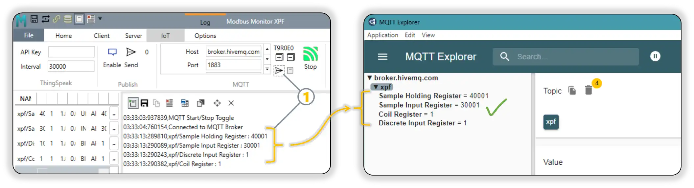
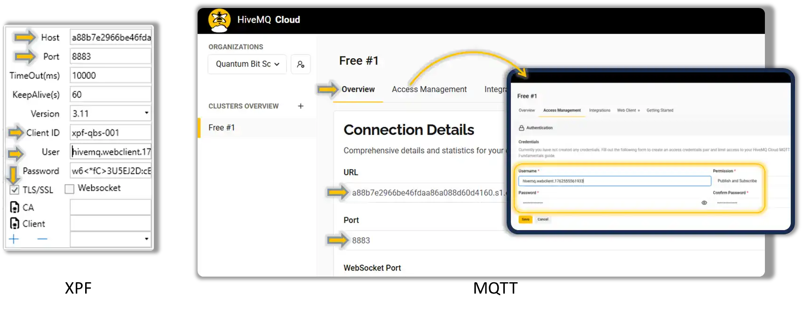

!!! note "Navigation"
    **[Documentation Home](../../) > [XPF User Guide](../products/xpf/user-guide.md) > MQTT Add-on**

# MQTT Add-on

**General-purpose messaging and IoT connectivity add-on for Modbus Monitor XPF**

<figure markdown>
  { loading="lazy" }
  <figcaption style="font-size: 0.9em; color: #666;">XPF MQTT Configuration showing connection to public broker</figcaption>
</figure>

!!! tip "📋 Table of Contents - Quick Navigation"
    **🚀 Getting Started (Recommended Path)**
    
    - **[📚 Broker Options](#supported-public-brokers)** → Choose your MQTT broker
    - **[🎯 Quick Tutorial](#quick-setup-tutorial)** → Complete setup walkthrough
        - **[🔧 Part A: Configure XPF](#part-a-configure-xpf-mqtt-connection)** → Set up XPF connection
        - **[🔍 Part B: Verification Tool](#part-b-set-up-mqtt-explorer-for-verification)** → Install MQTT Explorer  
        - **[✅ Part C: Test & Verify](#part-c-test-and-verify-connection)** → Test your setup
    - **[🔐 Secure Setup](#secure-setup-guide)** → TLS/SSL, WebSocket, and certificate authentication
    - **[📡 Server Mode](#server-mode-guide-mqtt-command-reception)** → Receive MQTT commands and write to Modbus
    
    **📖 Complete Documentation**
    
    - **[🌟 XPF Features](#xpfs-revolutionary-mqtt-capabilities)** → Unique bidirectional capabilities
    - **[� Advanced Configuration](#advanced-configuration-reference)** → Topic and message configuration reference
    - **[🛠️ Production Examples](#complete-setup-examples)** → Real-world setups (HiveMQ Cloud, EMQX, certificates)
    - **[❓ Troubleshooting](#troubleshooting)** → Common issues and solutions
    - **[📚 Resources](#support-and-resources)** → Documentation and community

## Overview

The MQTT Add-on enables Modbus Monitor XPF to publish and subscribe to MQTT brokers for general IoT messaging, cloud integration, and distributed system communication. This add-on provides:

- **Universal MQTT Connectivity**: Connect to any MQTT broker (AWS IoT, Azure IoT, HiveMQ, Mosquitto, etc.)
- **Bi-directional Communication**: Both publish monitor point data and subscribe to control commands
- **Advanced Security**: TLS/SSL encryption, client certificates, and authentication support
- **Flexible Topic Management**: Custom topic structures with dynamic variable substitution
- **JSON Message Support**: Structured data publishing with configurable JSON formatting
- **Quality of Service**: QoS 0, 1, and 2 support for reliable message delivery
- **Retained Messages**: Store last known values for new subscribers

!!! info "Add-on vs Core Features"
    **MQTT Add-on** provides general MQTT messaging capabilities for any broker, while **ThingSpeak Add-on** is specifically designed for ThingSpeak cloud platform integration with dedicated features for channel management.

## XPF's Revolutionary MQTT Capabilities

**Modbus Monitor XPF is the only tool that provides complete bidirectional MQTT integration in both Client and Server modes** - eliminating the need for multiple software tools and dramatically simplifying MQTT development and deployment.

### Unique Bidirectional Architecture

!!! success "Industry-First Capabilities"
    **XPF combines Publisher + Subscriber + MQTT Test Tools in one application:**
    
    **Publisher Mode (Client Mode Active)**
    - XPF polls Modbus devices and publishes data to MQTT broker
    - Perfect for: Sending sensor data, status updates, alarms to cloud
    
    **Subscriber Mode (Server Mode Active)**  
    - XPF receives MQTT messages and writes values to Modbus devices
    - Perfect for: Remote setpoint changes, control commands, configuration updates
    
    **Built-in MQTT Test Tools**
    - Integrated MQTT client for testing and debugging
    - No need for separate test applications
    - Save hours of setup time and eliminate tool confusion

### Why This is Revolutionary

| Traditional Approach | XPF Integrated Approach | Time Savings |
|---------------------|-------------------------|--------------|
| **Modbus Client Software** | **XPF Client Mode** | |
| + **Separate MQTT Publisher** | (Built into XPF) | **60-80% faster** |
| + **Separate MQTT Subscriber** | **XPF Server Mode** | |
| + **MQTT Test Client** | **Built-in Test Tools** | |
| + **Integration Coding** | (No coding needed) | |
| = 4+ separate tools | = **One XPF License** | **75% cost reduction** |

### Bidirectional Use Cases

**Industrial Automation (Both Directions)**
```yaml
Uplink (XPF Client to MQTT):
  - Temperature sensors to Cloud dashboard
  - Production counts to Analytics platform  
  - Alarm states to Notification system

Downlink (MQTT to XPF Server):
  - Setpoint changes to PLC registers
  - Recipe updates to Process controllers
  - Emergency stops to Safety systems
```

**IoT Edge Gateway (Complete Solution)**
```yaml
Edge Processing:
  - Collect from multiple Modbus devices (Client mode)
  - Aggregate and process data locally  
  - Publish summaries to cloud (Publisher)
  - Receive cloud commands (Subscriber)
  - Distribute commands to devices (Server mode)
```

**Development & Testing (Integrated Tools)**
```yaml
Development Workflow:
  1. Use XPF Server mode to simulate devices
  2. Test MQTT publishing with built-in tools
  3. Verify cloud connectivity with integrated client
  4. Deploy same XPF configuration to production
```

!!! tip "No Other Tool Does This"
    **XPF eliminates the complexity of:**
    - Learning multiple MQTT client applications
    - Integrating separate publisher/subscriber tools  
    - Writing custom code to bridge Modbus and MQTT
    - Managing multiple software licenses and configurations
    - Debugging communication between separate tools

This guide will show you how to leverage both directions plus the integrated test tools for complete MQTT solutions.

## Quick Start: Connect to Public MQTT Brokers

The fastest way to get started with MQTT is to connect to free public test brokers. This section shows how to configure XPF to connect to popular public MQTT brokers for testing and development.

### Supported Public Brokers

=== "HiveMQ Public (Recommended)"

    **Recommended for beginners - reliable and well-maintained**
    
    | Connection Type | Host | Port | Security | Notes |
    |----------------|------|------|----------|-------|
    | **TCP** | `broker.hivemq.com` | `1883` | Unencrypted | Basic testing |
    | **TCP + TLS** | `broker.hivemq.com` | `8883` | Encrypted | Recommended for production testing |
    | **WebSocket** | `broker.hivemq.com` | `8000` | Unencrypted | Web browser compatible |
    | **WebSocket + TLS** | `broker.hivemq.com` | `8884` | Encrypted | Secure web browser compatible |
    
    **Authentication:** None required (anonymous access)  
    **Reliability:** High uptime, actively maintained by HiveMQ  
    **Best For:** Learning MQTT, initial testing, proof of concepts

=== "Eclipse Mosquitto"

    **Alternative option for testing**
    
    | Connection Type | Host | Port | Security | Notes |
    |----------------|------|------|----------|-------|
    | **TCP** | `test.mosquitto.org` | `1883` | Unencrypted | Basic testing |
    | **TCP + TLS** | `test.mosquitto.org` | `8883` | Encrypted | Secure testing |
    
    **Authentication:** None required (anonymous access)  
    **Reliability:** Good uptime, community maintained  
    **Best For:** Alternative testing option, Mosquitto-specific features

=== "EMQX Public"

    **Additional testing option**
    
    | Connection Type | Host | Port | Security | Notes |
    |----------------|------|------|----------|-------|
    | **TCP** | `broker.emqx.io` | `1883` | Unencrypted | Basic testing |
    | **TCP + TLS** | `broker.emqx.io` | `8883` | Encrypted | Secure testing |
    | **WebSocket** | `broker.emqx.io` | `8083` | Unencrypted | Web browser compatible |
    | **WebSocket + TLS** | `broker.emqx.io` | `8084` | Encrypted | Secure web browser compatible |
    
    **Authentication:** None required (anonymous access)  
    **Reliability:** Good uptime, EMQX maintained  
    **Best For:** Testing EMQX-specific features, alternative broker option

=== "Local Mosquitto"

    **Run your own broker locally**
    
    | Connection Type | Host | Port | Security | Setup Required |
    |----------------|------|------|----------|----------------|
    | **TCP** | `localhost` | `1883` | Unencrypted | Install Mosquitto locally |
    | **TCP + TLS** | `localhost` | `8883` | Encrypted | Configure TLS certificates |
    
    **Authentication:** Configurable (can require username/password)  
    **Reliability:** Depends on your setup  
    **Best For:** Development, learning broker administration, offline testing
    
    **Quick Setup:**
    ```bash
    # Windows (using Chocolatey)
    choco install mosquitto
    
    # Start broker
    mosquitto -v
    ```

!!! warning "Public Broker Security"
    Public brokers are intended for **testing only**. Never send sensitive data or use them for production applications. Anyone can subscribe to your topics and see your messages.

### 🚀 Quick Setup Tutorial

This complete tutorial walks you through connecting XPF to an MQTT broker and verifying the connection. **We'll use HiveMQ's public broker (`broker.hivemq.com`)** since it requires no registration and is perfect for learning.

!!! example "Example Configuration Notice"
    **The following steps demonstrate connecting to `broker.hivemq.com` as an example.** You can substitute any broker from the [Supported Public Brokers](#supported-public-brokers) tabs above, or use your own private broker by replacing the host, port, and authentication details as needed.

!!! tip "Quick Navigation"
    **Choose your path:**
    
    - **🔧 [Part A: Configure XPF](#part-a-configure-xpf-mqtt-connection)** - Set up XPF MQTT connection
    - **🔍 [Part B: Set up Verification Tool](#part-b-set-up-mqtt-explorer-for-verification)** - Configure MQTT Explorer for testing  
    - **✅ [Part C: Test & Verify](#part-c-test-and-verify-connection)** - Publish test data and verify

#### Prerequisites
- Modbus Monitor XPF with MQTT Add-on installed and licensed
- Internet connection for accessing public brokers
- Basic understanding of MQTT topics and messages

---

## Part A: Configure XPF MQTT Connection

**Configure XPF to connect to the MQTT broker:**

1. **Open MQTT Configuration**
   - Launch Modbus Monitor XPF
   - Navigate to the MQTT Add-on settings
   - **Example**: We'll connect to `broker.hivemq.com` on port `1883` 

2. **Enter Broker Details**
      - **Broker Address**: Enter `broker.hivemq.com`
      - **Port**: Use `1883` for unencrypted or `8883` for TLS
      - **Protocol**: Select `TCP` or `TLS TCP` based on your port choice
      - **Client ID**: Enter a unique identifier (e.g., `XPF-Test-001`)

3. **Authentication Settings**
      - **Username**: Leave blank (public broker requires no authentication)
      - **Password**: Leave blank
      - **Certificate**: Not required for basic connection

4. **Test Connection**
      - Click "Test Connection" to verify connectivity
      - Should show "Connected" status if successful

5. **Configure Topics**
      - **Publish Topic**: `xpf/test/data` (example)
      - **Publish Topic**: `xpf/` (used in Example below)
      - **Subscribe Topic**: `xpf/test/commands` (example)

!!! tip "Topic Best Practices"
    Use unique topic prefixes to avoid conflicts with other users:
    - Good: `yourname/xpf/device1/data`
    - Avoid: `data` or `test` (too generic)

---

## Part B: Set up MQTT Explorer for Verification

**Set up MQTT Explorer to monitor and verify your MQTT messages:**

To verify that your XPF MQTT connection is working correctly, use **MQTT Explorer** - a free desktop application that provides a visual interface for monitoring MQTT traffic.

<figure markdown>
  { loading="lazy" }
  <figcaption style="font-size: 0.9em; color: #666;">Connection setup showing XPF MQTT configuration (left) and MQTT Explorer (right). Both must use the same: (1) Host/Broker address and (2) Port number for successful communication</figcaption>
</figure>

### Step 1: Download and Install MQTT Explorer

1. **Download and Install MQTT Explorer**
      - Visit: [MQTT Explorer Official Site](http://mqtt-explorer.com/)
      - Download the installer for Windows
      - Install and launch the application

### Step 2: Configure MQTT Explorer Connection

2. **Configure MQTT Explorer Connection and Subscriptions**
      - **Name**: `HiveMQ Public Test` (or any descriptive name)
      - **Host**: `broker.hivemq.com`
      - **Port**: `1883`
      - **Protocol**: `mqtt://`      
      - **Important: Set up subscriptions BEFORE connecting (MQTT Explorer requirement):**
        { width="800" loading="lazy" }
        - Expand the **Advanced** section in the connection dialog, `1`
        - In the **Topic** field, enter: `xpf/#`
        - Click the **+ ADD** button to add the subscription `2`
        - The `#` wildcard will capture all messages starting with `xpf/`
        - Click Back button, `3`
      - Click "Connect", `4`
      - MQTT Explorer shows **Connected** status

### Step 3: Verify MQTT Explorer Setup

3. **Verify Subscription Setup**
      - MQTT Explorer should show the `xpf/#` topic in the subscription list
      - This will monitor all messages from your XPF configuration
      - Leave MQTT Explorer running to capture incoming messages
      - Position windows so you can see both XPF and MQTT Explorer

!!! tip "MQTT Client Subscription Behavior"
    **Different MQTT client applications handle subscriptions differently:**
    
    - **MQTT Explorer**: Requires topic subscriptions in the Advanced section BEFORE connecting
    - **Other MQTT clients**: May allow subscriptions after connecting (varies by software)
    
    **Always check your specific MQTT client's requirements.** Our examples use MQTT Explorer, which needs pre-connection setup. See [Step 2: Configure Topics](#step-2-configure-topics) for detailed XPF topic configuration.

---

## Part C: Test and Verify Connection

**Configure XPF monitor points and test the complete MQTT flow:**

### Step 1: Configure XPF Monitor Points for MQTT

1. **Configure Monitor Points for MQTT Publishing**
   - In XPF, locate the monitor points you want to publish to MQTT
   - In the **Name** field for each monitor point, enter the MQTT topic name that matches what you configured in MQTT Explorer
   - **Example**: If you subscribed to `xpf/#` in MQTT Explorer, name your monitor points like:
     - `xpf/Sample Holding Register` 
     - `xpf/Sample Input Register`
     - `xpf/Discrete Input Register`
     - `xpf/Coil Register`
     - This ensures the published MQTT messages appear under the correct topic tree in MQTT Explorer      
      { width="600" loading="lazy" }

### Step 2: Enable Communication Logging

2. **Enable Communication Logging** to see detailed MQTT activity
      - **General Communication Log**: In XPF, go to **Home Tab** > **Log** > **Show** and click **Start**
      - **MQTT-Specific Debug Log**: Go to **IoT Tab** > **MQTT Group** > **Debug Log Button** and click **Start**
      - The MQTT Debug Log provides detailed connection, authentication, and message flow information specifically for MQTT operations
      - **For detailed logging setup**: See [Communication Logging](../products/xpf/user-guide.md#log-group) in the XPF User Guide

### Step 3: Start MQTT Communication

3. **Start MQTT Communication**
      - Click the **Start** button in IoT Tab > MQTT Group > Start
      - Verify connection success by checking:
        - XPF displays "Connected" status 
        - MQTT icon changes to green (connected state)
        - Watch the Communication Log for MQTT connection messages:
          ```          
            03:33:03:937839,MQTT Start/Stop Toggle
            03:33:04:760154,Connected to MQTT Broker
            03:33:13:289810,xpf/Sample Holding Register : 40001
            03:33:13:290089,xpf/Sample Input Register : 30001
            03:33:13:290243,xpf/Discrete Input Register : 1
            03:33:13:290382,xpf/Coil Register : 1
          ```

### Step 4: Publish Sample Data to MQTT Broker
1. **Use XPF's Test/Sample Publishing Feature**
      - In XPF MQTT interface, locate the **Send Sample** or **Test Publish** button
      - Click the button to publish all configured monitor points as sample data
      - This sends a one-time test message for each monitor point to verify connectivity
      - Watch MQTT Explorer to confirm messages are received in real-time

2. **Verify Test Message Flow**
      - Check that MQTT Explorer receives the test messages immediately
      - Confirm message format, content, and values match your monitor points
      - Communication Log should show published test messages with timestamps:
         ```          
            03:33:13:289810,xpf/Sample Holding Register : 40001
            03:33:13:290089,xpf/Sample Input Register : 30001
            03:33:13:290243,xpf/Discrete Input Register : 1
            03:33:13:290382,xpf/Coil Register : 1
         ```
      - Stop the Communication Logging and close the Log window after successful test verification

<figure markdown>
{ width="800" loading="lazy" title="Click to enlarge - MQTT publishing verification" }
<figcaption style="font-size: 0.9em; color: #666;">Successful MQTT publishing test demonstrating the complete flow: XPF publishes monitor point data using the test/sample button, which sends all monitoring points to the MQTT broker, and MQTT Explorer receives and displays these messages in its topic tree view for verification.</figcaption>
</figure>

### Step 5: Enable Continuous Publishing (Client Mode)

1. **Enable Automatic Message Publishing**
      - Click **Start** from the **Client Tab** to automatically publish these topics on every iteration when the full monitor point list is polled
      - XPF begins continuous publishing of monitor point data to MQTT topics
      - In MQTT Explorer, verify messages appear consistently in real-time under your topic tree
      - Monitor message content, timestamps, and publishing frequency to ensure proper operation
      - Communication Log shows detailed publish confirmation for ongoing operations

!!! success "🎉 Tutorial Complete! Validation Checklist"
    **Your MQTT connection is working correctly when:**
    
    - ✅ MQTT Explorer shows "Connected" status
    - ✅ Test messages from XPF appear in MQTT Explorer immediately  
    - ✅ Message content matches your monitor point values
    - ✅ Message timestamps are current
    - ✅ Communication Log shows successful publish confirmations

---

## Next Steps: Advanced Configuration

Now that you have basic MQTT communication working, you can explore advanced features:

- **🔐 [Secure Setup Guide](#secure-setup-guide)** - TLS/SSL encryption, WebSocket, and certificate authentication
- **📡 [Server Mode Guide](#server-mode-guide-mqtt-command-reception)** - Receive MQTT commands and write to Modbus devices
- **🏭 [Advanced Configuration](#step-2-configure-topics)** - Custom topic structures and message formatting  
- **🛠️ [Production Examples](#complete-setup-examples)** - Real-world configuration examples with detailed steps

---

## Secure Setup Guide

Once you've completed the [Quick Setup Tutorial](#quick-setup-tutorial), you can implement secure connections for production environments.

### TLS/SSL Encrypted Connections

For production systems, always use encrypted MQTT connections to protect your data.

#### Option 1: HiveMQ Cloud (Recommended for Beginners)

**Quick secure setup with managed cloud broker:**

1. **Create Free HiveMQ Cloud Account**
   - Visit [HiveMQ Cloud](https://www.hivemq.com/cloud/)
   - Create cluster (2-3 minutes)
   - Note cluster URL: `your-cluster.s2.eu.hivemq.cloud`

2. **Configure XPF for TLS**
   ```yaml
   Broker Host: your-cluster.s2.eu.hivemq.cloud
   Port: 8883 (TLS port)
   Client ID: XPF-YourCompany-001
   Username: (from HiveMQ credentials)
   Password: (from HiveMQ credentials)
   TLS/SSL: ✓ Enabled
   CA Certificate: Auto-detect
   ```

3. **Test Secure Connection**
   - XPF shows "Connected (TLS)" status
   - Use HiveMQ WebSocket client in dashboard for verification
   - **Enable MQTT Debug Log** (IoT Tab > MQTT Group > Debug Log) to see detailed connection status:

      ```
         11/8/2025 3:34:33 PM,MQTT Start/Stop Toggle
         11/8/2025 3:34:33 PM,Port 8883 on a88b7e2966be46fdaa86a088d60d4160.s1.eu.hivemq.cloud is open.
         11/8/2025 3:34:33 PM,Connecting...
         11/8/2025 3:34:33 PM,TCP Server: a88b7e2966be46fdaa86a088d60d4160.s1.eu.hivemq.cloud:8883
         11/8/2025 3:34:33 PM,Using credentials. Username: hivemq.webclient.1762555561933 Password:***
         11/8/2025 3:34:33 PM,TLS encryption enabled. Using protocol: Tls12
         11/8/2025 3:34:33 PM,No CA certificate provided.
         11/8/2025 3:34:33 PM,No client certificate provided.
         11/8/2025 3:34:33 PM,Using credentials. Username: hivemq.webclient.1762555561933 Password:***
         11/8/2025 3:34:33 PM,MQTT Client Configuration>> Host:a88b7e2966be46fdaa86a088d60d4160.s1.eu.hivemq.cloud, Port:8883, Protocol:3.11, Timeout:10000, KeepAlive:60s WebSocket:False, TLS:True, CA Cert Path:, Client Cert Path:, Username:hivemq.webclient.1762555561933, Password:*** 
         11/8/2025 3:34:33 PM,Connecting...
         11/8/2025 3:34:34 PM,Certificate validation approved. Errors: None. Subject: CN=*.s1.eu.hivemq.cloud. Thumbprint: A5ACACC3389D15FFAE7E2004F166320558B381CF. Chain elements: 3
         11/8/2025 3:34:34 PM,Connected.
         11/8/2025 3:34:34 PM,Connected to MQTT Broker
         11/8/2025 3:34:44 PM,Published: xpf/Sample Holding Register 40001
         11/8/2025 3:34:44 PM,xpf/Sample Holding Register : 40001
         11/8/2025 3:34:44 PM,Published: xpf/Sample Input Register 30001
         11/8/2025 3:34:44 PM,xpf/Sample Input Register : 30001
         11/8/2025 3:34:44 PM,Published: xpf/Discrete Input Register 1
         11/8/2025 3:34:44 PM,xpf/Discrete Input Register : 1
         11/8/2025 3:34:44 PM,Published: xpf/Coil Register 1
         11/8/2025 3:34:44 PM,xpf/Coil Register : 1
      ```

#### Option 2: Public Broker with TLS

**Use public brokers with encryption:**

1. **Configure TLS Connection**
   ```yaml
   Broker Host: broker.hivemq.com
   Port: 8883 (TLS port)
   Client ID: XPF-Secure-001
   Username: (leave blank)
   Password: (leave blank)
   TLS/SSL: ✓ Enabled
   Websocket: ✗ Disabled
   CA Certificate: Auto-detect
   ```

### WebSocket Connections

For firewall-friendly connections or web-based integration:

#### Standard WebSocket (Testing Only)
```yaml
Broker Host: broker.hivemq.com
Port: 8000 (WebSocket)
Protocol: ws://
TLS/SSL: ✗ Disabled
Websocket: ✓ Enabled
```

#### Secure WebSocket (Production)
```yaml
Broker Host: broker.hivemq.com  
Port: 8884 (WebSocket + TLS)
Protocol: wss://
TLS/SSL: ✓ Enabled
Websocket: ✓ Enabled
```

### Certificate-Based Authentication

#### Understanding Certificate Authentication

Certificate authentication provides enhanced security for MQTT connections through cryptographic validation. There are two types of certificates used in MQTT security:

**1. CA (Certificate Authority) Certificate**

   - **Purpose**: Validates the broker's identity (server authentication)      
   - **When to use**: When connecting to brokers with custom/private certificates
   - **Security benefit**: Prevents man-in-the-middle attacks by verifying broker authenticity

**2. Client Certificate**

   - **Purpose**: Authenticates your device to the broker (client authentication)
   - **When to use**: When broker requires mutual TLS (mTLS) authentication
   - **Security benefit**: Ensures only authorized devices can connect

#### When to Use Certificates

| Scenario | CA Certificate | Client Certificate | Use Case |
|----------|----------------|-------------------|----------|
| **Public brokers** (HiveMQ, EMQX public) | Optional (auto-detect) | Not supported | Basic testing, learning |
| **Private cloud brokers** (EMQX Cloud, HiveMQ Cloud) | Required (download from provider) | Optional | Secure production deployment |
| **Enterprise environments** | Required (from IT department) | Required | High-security, compliance requirements |
| **Self-hosted brokers** | Required (your own CA) | Required | Complete control and security |

#### EMQX Cloud Certificate Configuration

**EMQX provides downloadable CA certificates for secure connections** - making it an excellent example for demonstrating explicit certificate configuration:

!!! info "Why EMQX for CA Certificate Example"
    **EMQX Cloud offers free CA certificate downloads** with clear visibility of expiration dates, making it perfect for learning certificate management:
    
    - **HiveMQ Cloud**: Uses auto-detect certificates (easier but less transparent)
    - **EMQX Cloud**: Provides downloadable CA certificates (explicit trust chain)
    - **Learning benefit**: Shows proper certificate management workflow
    - **Production ready**: Same approach used in enterprise environments

**EMQX provides downloadable CA certificates for secure connections:**

{ loading="lazy"}

1. **Download CA Certificate from EMQX Console**
      - Log into your EMQX deployment console (as shown in screenshot)
      - Navigate to **Deployment Overview** → **MQTT Connection Information**
      - Click **CA Certificate** download link (shows "CA Certificate Expiration: 2031.11.09")
      - Save the certificate file (usually named `ca.crt` or similar)
      
2. **Configure XPF with EMQX CA Certificate**
   ```yaml
   XPF Configuration:
     Broker Host: caxxxx4e.ala.us-east-1.emqxsl.com (your EMQX endpoint)
     Port: 8883 (TLS port)
     TLS/SSL: ✓ Enabled
     CA Certificate: [Browse] → Select downloaded ca.crt file
     Client Certificate: Leave empty (for username/password auth)
   ```

3. **Set CA Certificate Path in XPF**
   - In XPF MQTT settings, locate the **CA Certificate** button (file icon)
   - Click the **CA Certificate** button to open file browser
   - Navigate to your downloaded CA certificate file
   - Select the certificate file (e.g., `ca.crt`, `emqx-ca.pem`)
   - XPF will display the certificate path in the field

### Client Certificate Authentication

For high-security environments requiring mutual authentication:

!!! warning "Advanced Setup"
    Client certificates require PKI knowledge and certificate management. Only recommended for enterprise environments with proper certificate infrastructure.

#### When Client Certificates Are Required

**Industrial & Enterprise Scenarios:**
- **Manufacturing Plants**: PLCs and SCADA systems requiring device authentication
- **Critical Infrastructure**: Power plants, water treatment, transportation systems
- **Compliance Environments**: ISO 27001, IEC 62443, SOX, HIPAA requirements
- **Zero-Trust Networks**: All devices must be cryptographically authenticated
- **Multi-Tenant Brokers**: Shared MQTT infrastructure requiring device isolation

**Security Benefits:**
- **Device Identity Verification**: Each device has unique cryptographic identity
- **Non-Repudiation**: Cryptographic proof of device actions and commands
- **Access Control**: Fine-grained permissions based on certificate attributes
- **Audit Trails**: Complete logging of authenticated device communications

**Typical Implementation:**
```yaml
Enterprise Setup:
  CA Certificate: Company's root certificate authority
  Client Certificate: Device-specific certificate signed by company CA
  Broker Configuration: Requires both server and client authentication
  Access Control: MQTT topics mapped to certificate attributes
```

#### Generate Client Certificate (optional)
```bash
# Create private key and certificate
openssl genpkey -algorithm RSA -out client-key.pem
openssl req -new -key client-key.pem -out client.csr
openssl x509 -req -in client.csr -signkey client-key.pem -out client-cert.pem

# Convert to PFX for XPF
openssl pkcs12 -export -out client.pfx -inkey client-key.pem -in client-cert.pem
```

#### Configure XPF with Certificates

**XPF Certificate Configuration Steps:**

1. **Open XPF MQTT Settings**   
      - Navigate to **IoT Tab** > **MQTT Group** > **Settings**
      - Enable **TLS/SSL** checkbox first

2. **Set CA Certificate Path**
      - Click the **CA Certificate** button (file certificate icon)
      - Browse to your downloaded CA certificate file
      - Select the certificate file (e.g., `ca.crt`, `emqx-ca.pem`, `your-company-ca.crt`)
      - XPF displays the full path in the field

3. **Set Client Certificate Path** (if required)
      - Click the **Client Certificate** button (file certificate icon)  
      - Browse to your client certificate file (must be in PFX format)
      - Select the certificate file (e.g., `client.pfx`, `device-cert.pfx`)
      - Enter the certificate password when prompted

4. **Complete Configuration**
   ```yaml
   Broker Configuration:
     Broker Host: secure-broker.yourcompany.com (or EMQX endpoint)
     Port: 8883 (TLS port)
     Client ID: XPF-Device-001 (must match certificate CN if using client certs)
     TLS/SSL: ✓ Enabled
     
   Certificate Configuration:
     CA Certificate: [Full path displayed after browsing]
     Client Certificate: [Full path displayed after browsing, PFX format]
     Certificate Password: [Entered during PFX selection]
   ```

**Certificate File Format Requirements:**
- **CA Certificate**: `.crt`, `.pem`, `.cer` formats supported
- **Client Certificate**: Must be `.pfx` (PKCS#12) format containing both certificate and private key
- **Certificate Path**: XPF stores and displays the full file path after selection

!!! tip "Certificate Management in XPF"
    **XPF Certificate UI Features:**
    
    - **File Browser Integration**: Certificate buttons open standard file dialogs
    - **Path Validation**: XPF validates certificate file format and accessibility  
    - **Secure Storage**: Certificate paths stored in XPF configuration (passwords not stored)
    - **Certificate Icons**: File certificate icons clearly identify certificate configuration buttons

### Authentication vs Authorization

Understanding the difference between authentication (who you are) and authorization (what you can do) is crucial for proper MQTT security implementation.

#### Authentication: "Who Are You?"

**Authentication Methods by Complexity:**

| Method | Security Level | Use Case | Username Required | Notes |
|--------|----------------|----------|-------------------|-------|
| **Anonymous** | None | Public testing only | No | Anyone can connect |
| **Username/Password** | Basic | Development, cloud services | Yes | Simple credential-based auth |
| **CA Certificate Only** | Medium | Verified server identity | Yes (usually) | Validates broker, not client |
| **Client Certificate** | High | Enterprise environments | No* | Cryptographic device identity |
| **Client Cert + Username** | Highest | Maximum security | Yes | Both crypto and credential auth |

*Client certificates can replace username/password but may be used together for defense in depth.

#### Authorization: "What Can You Do?"

**After authentication, authorization controls access to topics and operations:**

**HiveMQ Cloud Authorization Example:**
```yaml
Topic Permissions (configured in broker):
  User "sensor-device":
    - CAN publish to: "sensors/+/data"
    - CANNOT publish to: "commands/#"
    - CAN subscribe to: "sensors/sensor-001/config"
    
  User "control-dashboard":
    - CAN publish to: "commands/#"
    - CAN subscribe to: "sensors/+/data"
    - CAN subscribe to: "alarms/#"
```

#### Recommended Configurations by Use Case

=== "Beginner (Learning & Testing)"

    **Goal**: Get started quickly with minimal complexity
    
    **Authentication**: Username/Password
    ```yaml
    XPF Configuration:
      TLS/SSL: ✓ Enabled (use 8883)
      CA Certificate: Auto-detect
      Username: your-hivemq-username
      Password: your-hivemq-password
      Client Certificate: (leave empty)
    ```
    
    **Authorization**: Default permissions (can publish/subscribe to all topics)
    
    **Benefits:**
    - Quick setup, no certificate management
    - Encrypted connection protects data in transit
    - Good for learning and development
    
    **Limitations:**
    - Relies on shared credentials
    - Less secure than certificate-based auth

=== "Secure (Production Development)"

    **Goal**: Production-ready security with manageable complexity
    
    **Authentication**: Username/Password + Downloaded CA Certificate
    ```yaml
    XPF Configuration:
      TLS/SSL: ✓ Enabled
      CA Certificate: [Downloaded from EMQX/HiveMQ console]
      Username: production-device-001
      Password: strong-unique-password
      Client Certificate: (leave empty)
    ```
    
    **Authorization**: Topic-based permissions
    ```yaml
    Broker Configuration:
      Device Permissions:
        - PUBLISH: "factory/line1/data/#"
        - SUBSCRIBE: "factory/line1/commands/+"
        - DENY: "admin/#", "system/#"
    ```
    
    **Benefits:**
    - Explicit trust chain (no auto-detect)
    - Topic-level access control
    - Credential rotation capabilities
    
    **When to use:**
    - Production deployments
    - Multi-device installations
    - Customer-facing systems

=== "Enterprise (Maximum Security)"

    **Goal**: Highest security for critical infrastructure
    
    **Authentication**: Client Certificate + CA Certificate (mutual TLS)
    ```yaml
    XPF Configuration:
      TLS/SSL: ✓ Enabled
      CA Certificate: company-root-ca.crt
      Client Certificate: device-001.pfx
      Certificate Password: strong-pfx-password
      Username: (optional - can be derived from certificate)
    ```
    
    **Authorization**: Certificate-based permissions + topic ACLs
    ```yaml
    Broker Configuration:
      Certificate Subject: CN=XPF-Plant1-Device001
      Permitted Actions:
        - PUBLISH: "plant1/devices/001/#"
        - SUBSCRIBE: "plant1/commands/001/+"
        - DENY ALL other topics
    ```
    
    **Benefits:**
    - Cryptographic device identity
    - No shared credentials
    - Granular certificate-based permissions
    - Audit trails for all device actions
    
    **When to use:**
    - Critical infrastructure
    - Compliance environments (IEC 62443, ISO 27001)
    - Zero-trust networks
    - High-value industrial systems

#### Implementation Recommendations

**Start Simple, Scale Security:**

1. **Development Phase**: Begin with username/password + TLS
2. **Testing Phase**: Add downloaded CA certificates  
3. **Production Phase**: Implement topic-based authorization
4. **Enterprise Phase**: Add client certificates for device authentication

**Common Security Progression:**
```yaml
Phase 1: Anonymous → Username/Password + TLS
Phase 2: Add CA Certificate (explicit trust)
Phase 3: Configure topic permissions (authorization)
Phase 4: Client certificates (device identity)
```

!!! warning "Authentication vs Authorization Gotcha"
    **Client certificates replace username/password for authentication** but broker authorization policies still determine topic access. A device with a valid certificate can still be denied access to specific topics by authorization rules.

!!! tip "HiveMQ vs EMQX Authorization"
    - **HiveMQ Cloud**: Authorization configured in web console under "Access Management"
    - **EMQX Cloud**: Authorization rules configured in "Authentication & Authorization" section
    - **Both support**: Topic-based ACLs, username-based rules, certificate-based policies

### Verification

**Secure connection indicators:**

- XPF status shows "Connected (TLS)" or "Connected (WSS)"
- Communication log shows no certificate errors
- Message traffic encrypted (use Wireshark to verify)

!!! success "Production Ready"
    **Your MQTT connection is now production-ready with:**

    - ✅ Encrypted data transmission
    - ✅ Server authentication  
    - ✅ Optional client authentication
    - ✅ Firewall-friendly options

**For detailed configuration steps, see**: [Complete Setup Examples](#complete-setup-examples) section.

---

## Server Mode Guide: MQTT Command Reception

XPF's Server Mode allows receiving commands from MQTT brokers and writing them to Modbus devices - enabling remote control capabilities. This powerful feature transforms XPF into a **Modbus server** that can receive control commands via MQTT and write values directly to its internal Modbus registers, which can then be read by other Modbus clients.

**How MQTT Server Mode Works:**
- XPF creates virtual Modbus registers (holding registers, input registers, coils, discrete inputs)
- MQTT messages received from the broker are processed and written to these virtual registers
- Other Modbus clients (PLCs, HMIs, SCADA systems) can connect to XPF via TCP/RTU and read the updated values
- This creates a **bridge between MQTT and Modbus networks**, enabling cloud-to-device control

**Practical Applications:**
- **Cloud Control**: Receive setpoint changes from cloud dashboards and make them available to local PLCs
- **Remote Configuration**: Update device parameters via MQTT that are then read by Modbus devices
- **Inter-System Communication**: Bridge different protocols by receiving MQTT data and serving it via Modbus
- **Testing & Simulation**: Use another XPF instance in Client mode to send MQTT messages, then read the values from the Server mode instance

!!! tip "Bidirectional Testing Setup"
    **Perfect for testing:** Use two XPF instances - one in Client mode publishing MQTT data, and another in Server mode receiving the data and serving it via Modbus. This creates a complete local test environment without needing external hardware.

!!! info "Bidirectional MQTT"
    **Client Mode**: XPF polls Modbus → publishes to MQTT as discuseed in the previous sections. (data collection)  
    **Server Mode**: XPF receives MQTT → writes to Modbus registers → serves data via Modbus (remote control)

### Server Mode Setup

#### Step 1: Basic Server Configuration

1. **Switch to Server Mode**
   - Open XPF **Server** tab
   - Configure Modbus server settings (Unit ID, register ranges)
   - **See**: [Server Mode Configuration](../products/xpf/user-guide.md#5-modbus-server-operations) in main user guide

2. **Configure MQTT Subscriptions**
   ```yaml
   Subscription Topics:
     - "commands/plant1/setpoint" - Temperature setpoint changes
     - "control/emergency/stop" - Emergency commands  
     - "config/device/{UnitID}/+" - Device configuration updates
   
   Message Handling:
     - JSON parsing for structured commands
     - Direct value mapping for simple setpoints
     - Validation and acknowledgment publishing
   ```

#### Step 2: Command Message Format

**Simple Value Commands:**
```json
Topic: "commands/plant1/setpoint"
Message: "75.5"
Result: Writes 75.5 to configured Modbus register
```

**Structured JSON Commands:**
```json
Topic: "commands/plant1/config"
Message: {
  "register": "40001",
  "value": 1250,
  "unit": "°F",
  "timestamp": "2025-11-07T14:30:00Z"
}
```

#### Step 3: Test Server Mode

1. **Start XPF Server Mode**
   - Click **Start** in Server tab
   - Verify Modbus server listening on configured port

2. **Send Test Commands**
   - Use MQTT client to publish to subscription topics
   - Monitor XPF Communication Log for received messages
   - Verify register values change in XPF Server view

3. **Bidirectional Testing**
   - **Client Mode**: Read current values → Publish to MQTT
   - **Server Mode**: Receive MQTT commands → Update values  
   - **Client Mode**: Read updated values → Confirm changes

### Server Mode Use Cases

**Remote Setpoint Control:**
```yaml
Scenario: Cloud dashboard adjusts PLC setpoints
MQTT Topic: "control/plant1/temperature/setpoint"
Message: "68.5"
XPF Action: Write 68.5 to holding register 40001
Confirmation: Publish acknowledgment to "status/plant1/setpoint/ack"
```

**Emergency Stop Systems:**
```yaml
Scenario: Cloud monitoring detects problem
MQTT Topic: "emergency/plant1/stop" 
Message: "EMERGENCY_STOP"
XPF Action: Write 1 to emergency stop coil 00001
Confirmation: Publish "STOPPED" to "status/plant1/emergency"
```

**Recipe/Configuration Updates:**
```yaml
Scenario: Push new process parameters
MQTT Topic: "config/devices/001/recipe"
Message: {"temp": 150, "time": 3600, "pressure": 25}
XPF Action: Write multiple registers with recipe values
Confirmation: Publish success status
```

### Security Considerations for Server Mode

!!! warning "Server Mode Security"
    **Server Mode receives write commands - implement proper security:**
    
    - ✅ **Use TLS/SSL** for all MQTT connections
    - ✅ **Implement authentication** (usernames, certificates)
    - ✅ **Validate command sources** and message formats
    - ✅ **Log all command executions** for audit trails
    - ✅ **Set register write permissions** carefully
    - ✅ **Test emergency stop procedures** thoroughly

### Bidirectional Integration Example

**Complete IoT control system:**

```yaml
Data Collection (Client Mode):
  - XPF polls temperature sensor (register 30001)
  - Publishes to "sensors/plant1/temperature"
  - Cloud receives and displays current temperature

Remote Control (Server Mode):  
  - Cloud operator adjusts setpoint in dashboard
  - Dashboard publishes to "commands/plant1/setpoint"
  - XPF receives command and writes to setpoint register (40001)
  - Process controller uses new setpoint

Verification Loop:
  - XPF continues polling actual temperature
  - Publishes updated readings showing setpoint change effect
  - Cloud dashboard shows real-time response to control action
```

**For comprehensive Server Mode configuration, see**: [Server Operations](../products/xpf/user-guide.md#5-modbus-server-operations) in the main user guide.

## Advanced Configuration Reference

For comprehensive configuration beyond the tutorials, see the detailed sections below:

!!! tip "Start with Tutorials First"
    **New users should complete the [Quick Setup Tutorial](#quick-setup-tutorial) or [Secure Setup Guide](#secure-setup-guide) before using these advanced references.**

### Advanced Topic Configuration

### MQTT Topic Structure

Configure topic patterns for publishing and subscribing:

**Publishing Topics (XPF to Broker):**

| Topic Pattern | Example | Data Source | Description |
|---------------|---------|-------------|-------------|
| **Static Topics** | `plant/reactor1/temperature` | Monitor Point 1 | Fixed topic path |
| **Dynamic Topics** | `{UnitID}/holding/{Address}` | Any Monitor Point | Variable substitution |
| **JSON Topics** | `data/json` | Multiple Points | Structured JSON payload |

**Subscription Topics (Broker to XPF):**

| Topic Pattern | Example | Target | Description |
|---------------|---------|--------|-------------|
| **Control Commands** | `plant/reactor1/setpoint` | Monitor Point Write | Receive control values |
| **Configuration Updates** | `config/+/update` | System Settings | Dynamic configuration |
| **Broadcast Messages** | `alerts/#` | Event Logging | System-wide notifications |

### Configure Topic Mappings

1. **Set Up Publishing**
   - **Topic Template**: Define topic structure with variables
   - **Message Format**: Choose JSON or raw value format
   - **QoS Level**: Select Quality of Service (0, 1, or 2)
   - **Retain Messages**: Enable to store last value for new subscribers

2. **Set Up Subscriptions**
   - **Subscribe Topics**: Define topics to listen for incoming messages
   - **Wildcard Support**: Use `+` (single level) and `#` (multi-level) wildcards
   - **Message Handling**: Configure how received messages update monitor points

3. **Variable Substitution**
   - **{UnitID}**: Replaced with monitor point Unit ID
   - **{Address}**: Replaced with monitor point address
   - **{Name}**: Replaced with monitor point name
   - **{Value}**: Replaced with current monitor point value

!!! tip "Monitor Points Configuration"
    **Need to configure monitor points first?** See the comprehensive [Monitor Points Configuration](../products/xpf/user-guide.md#7-monitor-points-configuration) section in the main user guide.

### Example Topic Configurations

**Industrial Process Monitoring:**
```yaml
Publishing Topics:
  - "plant/line1/temperature" - Temperature sensor data
  - "plant/line1/pressure" - Pressure measurement
  - "plant/line1/flow" - Flow rate data

Subscription Topics:
  - "plant/line1/setpoints/+" - Receive setpoint changes
  - "commands/emergency/#" - Emergency stop commands
```

**Multi-Device Installation:**
```yaml
Publishing Topics:
  - "devices/{UnitID}/data/{Address}" - Dynamic device data
  - "status/devices" - JSON status summary

Subscription Topics:
  - "config/devices/{UnitID}/+" - Device-specific configuration
  - "commands/broadcast" - System-wide commands
```

### Advanced Message Format Configuration

**For detailed message mapping and publishing options beyond the basic tutorials:**

| Message Format | Content Example | Use Case |
|----------------|-----------------|----------|
| **Raw Value** | `25.4` | Simple numeric publishing |
| **JSON Object** | `{"value": 25.4, "timestamp": "2025-11-05T14:30:15Z", "unit": "C"}` | Structured data with metadata |
| **Custom JSON** | `{"temperature": 25.4, "status": "normal"}` | Application-specific format |

**Advanced Configuration Options:**
- **Individual Topics**: Each monitor point gets its own topic
- **Batched Topics**: Multiple points in single JSON message
- **Filtered Publishing**: Only publish when values change
- **QoS Settings**: Configure Quality of Service (0, 1, or 2)
- **Retained Messages**: Store last value for new subscribers

!!! tip "Complete Configuration Guide"
    **For step-by-step configuration instructions, see:**
    - **[Quick Setup Tutorial](#quick-setup-tutorial)** - Basic setup walkthrough
    - **[Secure Setup Guide](#secure-setup-guide)** - Production security configuration
    - **[Complete Setup Examples](#complete-setup-examples)** - Real-world implementation examples

## Testing and Verification Tools

!!! info "Documentation Approach"
    **This guide uses external tools (MQTT Explorer) for verification screenshots to provide clear visual separation between:**
    - **XPF** = Publisher/Subscriber (the main application)  
    - **MQTT Explorer** = External verification tool (for documentation clarity)
    
    **In real-world usage, you can use XPF's built-in test tools exclusively** - no external applications needed!

### XPF's Built-in MQTT Test Tools

**XPF includes integrated MQTT testing capabilities** that save hours of setup time and eliminate the need for separate test applications:

!!! success "Built-in Test Features"
    **Integrated MQTT Client**
    - Test broker connectivity without external tools
    - Send test messages to verify subscription handling  
    - Monitor message flow directly in XPF console
    - Debug topic mapping and message formatting issues
    
    **Real-time Message Monitoring**
    - View live MQTT traffic (TX/RX counters)
    - Console logging with timestamped message details
    - Connection status indicators and error reporting
    - Quality of Service (QoS) confirmation tracking
    
    **Rapid Development Workflow**
    - Configure > Test > Debug > Deploy in single application
    - No context switching between multiple tools
    - Immediate feedback on configuration changes
    - Built-in message validation and formatting checks

### External Verification Tools (For Documentation Clarity)

**In this guide, we use MQTT Explorer as external verification** to clearly show the separation between XPF (publisher/subscriber) and verification tool:

| Tool Role | Application | Purpose in Guide |
|-----------|-------------|------------------|
| **MQTT Publisher** | **XPF (Client Mode)** | Sending Modbus data to broker |
| **MQTT Subscriber** | **XPF (Server Mode)** | Receiving commands from broker |
| **Verification Tool** | **MQTT Explorer** | Visual confirmation of message flow |

**Why MQTT Explorer for Documentation:**
- **Visual Clarity**: Tree view shows topic structure clearly
- **Popular & Free**: Most widely used MQTT test client  
- **Clean Interface**: Perfect for screenshots and tutorials
- **Cross-Platform**: Windows/Mac/Linux compatibility
- **No Registration**: Immediate download and use

**MQTT Explorer TLS Support:**
- **Basic TLS/SSL**: Supports standard TLS connections (port 8883)
- **CA Certificates**: Can validate broker certificates
- **Username/Password over TLS**: Works with HiveMQ Cloud
- **Client Certificates**: No mutual TLS support
- **Advanced PKI**: Limited certificate management

!!! note "For Advanced TLS"
    For client certificate examples, we'll use **HiveMQ WebSocket Client** (built into broker dashboard) or **XPF's built-in tools**, as MQTT Explorer doesn't support mutual TLS authentication.

!!! tip "Real-World Usage"
    **In production, you can use XPF's built-in test tools exclusively** - no external applications needed! We use MQTT Explorer in this guide only to provide clear visual separation for learning purposes.

## Complete Setup Examples

!!! tip "Tutorial Prerequisites"
    **These examples assume you've completed the [Quick Setup Tutorial](#quick-setup-tutorial) for basic MQTT concepts.** If you're new to MQTT, start with the tutorial first.

### Example 1: HiveMQ Cloud with TLS (Production Setup)

**Recommended for production** - Secure, reliable, free tier available.

{ loading="lazy" }

#### Step 1: Set Up HiveMQ Cloud Account

1. **Create Free Account**
   - Go to [HiveMQ Cloud](https://www.hivemq.com/cloud/)
   - Click **"Get Started Free"**
   - Create account (no credit card required)

2. **Create Cluster**
   - Click **"Create Cluster"**
   - Select **"Free"** plan (100 connections)
   - Choose region closest to your location
   - Wait 2-3 minutes for cluster creation

3. **Get Connection Details**
   - Click your cluster name
   - Note the **Cluster URL** (e.g., `abc123def.s2.eu.hivemq.cloud`)
   - Click **"Access Management"** > **"Add Credentials"**
   - Create username/password (save these!)

{ loading="lazy" }

#### Step 2: Configure TLS Connection in XPF

1. **Open XPF MQTT Settings**
   - **Broker Host**: `your-cluster.s2.eu.hivemq.cloud` (from Step 1)
   - **Port**: `8883` (TLS port)
   - **Client ID**: `XPF-Plant1-Device001` (unique identifier)
   - **Username**: (from HiveMQ credentials)
   - **Password**: (from HiveMQ credentials)

2. **Enable TLS Security**
   - **Check** **TLS/SSL** checkbox
   - **CA Certificate**: **Auto-detect** (HiveMQ uses standard certificates)
   - **Client Certificate**: Leave empty (username/password auth)
   - **Verify Hostname**: Checked

{ loading="lazy" }

#### Step 3: Configure Production Topics

```yaml
Publishing Topics:
  - "factory/line1/plc/{Address}" - Individual register data
  - "factory/line1/status" - JSON summary every 30 seconds
  - "factory/line1/alarms" - Alert messages only

Subscription Topics:
  - "factory/line1/setpoints/+" - Receive setpoint changes
  - "factory/line1/commands/emergency" - Emergency stop commands
```

#### Step 4: Test Secure Connection

1. **Click Connect** - Should show **"Connected (TLS)"**
2. **Verify in HiveMQ Cloud Console**:
   - Go to your cluster dashboard
   - Click **"Client Details"**
   - Should see your Client ID connected

{ loading="lazy" }

#### Step 5: Verify Encrypted Communication

**Option A: MQTT Explorer (Basic TLS)**
1. **Configure MQTT Explorer for TLS**:
   - Host: `your-cluster.s2.eu.hivemq.cloud`
   - Port: `8883`
   - Protocol: `mqtts://` (TLS)
   - Username/Password: (your HiveMQ credentials)
   - Subscribe to: `factory/line1/plc/+`

**Option B: HiveMQ WebSocket Client (Recommended for TLS)**
1. **Use Built-in WebSocket Client**:
   - In HiveMQ cluster dashboard, click **"Try out Websocket Client"**
   - Automatically uses secure connection (WSS)
   - Subscribe to your topics: `factory/line1/plc/+`
   - You should see encrypted data flowing

{ loading="lazy" }

2. **Monitor XPF Communication Log**:
   - Messages show **"Published (TLS)"**
   - No certificate errors
   - Connection remains stable

!!! success "Production Setup Complete!"
    You now have **secure, encrypted MQTT** communication suitable for production environments!

### Example 3: EMQX Cloud with CA Certificate

**Production setup with EMQX Cloud using downloaded CA certificate** - More secure than auto-detect.

#### Step 1: Set Up EMQX Cloud Deployment

1. **Create EMQX Cloud Account**
   - Visit [EMQX Cloud](https://www.emqx.com/cloud) and create account
   - Create a new deployment (Serverless or Dedicated)
   - Note your deployment endpoint (e.g., `caxxxx4e.ala.us-east-1.emqxsl.com`)

2. **Download CA Certificate**
   - In EMQX console, go to **Deployment Overview**
   - Find **MQTT Connection Information** section
   - Click **CA Certificate** download link
   - Save the certificate file (e.g., `emqx-ca.crt`)

#### Step 2: Configure XPF with EMQX CA Certificate


1. **Open XPF MQTT Settings**
   ```yaml
   Basic Configuration:
     Broker Host: caxxxx4e.ala.us-east-1.emqxsl.com (your endpoint)
     Port: 8883 (TLS/SSL port)
     Client ID: XPF-EMQX-Device001
     Username: (EMQX username)
     Password: (EMQX password)
   ```

2. **Configure CA Certificate**
   - Enable **TLS/SSL** checkbox
   - Click **CA Certificate** button (file certificate icon)
   - Browse to downloaded `emqx-ca.crt` file
   - Select the certificate file
   - XPF displays certificate path

#### Step 3: Test EMQX Connection

1. **Verify Certificate Configuration**
   - CA Certificate path should be displayed in XPF
   - TLS/SSL should be enabled
   - All connection details should be entered

2. **Connect and Verify**
   - Click **Connect** - should show **"Connected (TLS)"**
   - Check MQTT Debug Log for certificate validation:
   ```
   Certificate validation approved. Errors: None.
   Subject: CN=*.ala.us-east-1.emqxsl.com
   TLS encryption enabled. Using protocol: Tls12
   Connected to MQTT Broker
   ```

3. **Verify in EMQX Console**
   - Go to EMQX deployment **Monitor** section
   - Check **Connections** - should see your Client ID connected
   - Verify connection shows as secure/encrypted

!!! success "EMQX CA Setup Complete!"
    **Benefits of using downloaded CA certificate:**
    - ✅ **Explicit trust chain** - You control which CA to trust
    - ✅ **No auto-detect vulnerabilities** - Prevents potential CA spoofing
    - ✅ **Certificate expiry tracking** - You know when CA cert expires (2031.11.09 in example)
    - ✅ **Compliance ready** - Explicit certificate management for auditing

### Example 4: Advanced TLS with Client Certificates

**For high-security environments** requiring mutual TLS authentication.

#### When to Use Client Certificates

- **Industrial environments** with strict security policies
- **Multi-tenant brokers** requiring device authentication
- **Compliance requirements** (ISO 27001, IEC 62443)
- **Zero-trust networks** where identity verification is mandatory

#### Step 1: Generate Client Certificates

**Option A: Use OpenSSL (Self-Signed)**
```bash
# Generate private key
openssl genpkey -algorithm RSA -out client-key.pem -pkcs8

# Generate certificate signing request
openssl req -new -key client-key.pem -out client.csr \
  -subj "/CN=XPF-Plant1-Device001/O=YourCompany/C=US"

# Generate self-signed certificate
openssl x509 -req -in client.csr -signkey client-key.pem \
  -out client-cert.pem -days 365
```

**Option B: Use Your PKI/CA System**
- Generate certificate through your organization's PKI
- Ensure certificate includes **Client Authentication** key usage
- Common Name should match your device identifier

#### Step 2: Convert to PFX Format (Windows)

XPF requires PFX format for client certificates:

```bash
# Combine certificate and private key into PFX
openssl pkcs12 -export -out client.pfx \
  -inkey client-key.pem -in client-cert.pem \
  -name "XPF-Plant1-Device001"
# Enter export password when prompted
```

#### Step 3: Configure XPF with Client Certificate

{ loading="lazy" }

1. **TLS Configuration**:
   - **TLS/SSL**: Checked
   - **CA Certificate**: `ca.crt` (broker's CA certificate)
   - **Client Certificate**: `client.pfx` (your device certificate)
   - **Certificate Password**: (PFX password from Step 2)

2. **Broker Configuration**:
   ```yaml
   Broker Host: secure-broker.yourcompany.com
   Port: 8883
   Client ID: XPF-Plant1-Device001  # Must match certificate CN
   Username: (may be required depending on broker)
   Password: (may be required depending on broker)
   ```

#### Step 4: Verify Mutual TLS

1. **Connection Log Should Show**:
   ```
   [INFO] TLS Handshake successful
   [INFO] Client certificate presented
   [INFO] Mutual authentication completed
   [INFO] Connected to secure-broker.yourcompany.com:8883
   ```

2. **Broker Logs Should Confirm**:
   - Client certificate validation successful
   - Device authenticated via certificate
   - Connection authorized for configured topics

!!! warning "Certificate Management"
    - **Monitor expiration dates** - Set calendar reminders
    - **Secure private keys** - Store PFX files securely
    - **Test certificate renewal** before expiration
    - **Backup certificates** in secure location

## Troubleshooting

### Common Issues and Solutions

**Connection Problems:**

| Issue | Cause | Solution |
|-------|-------|----------|
| Connection refused | Wrong host/port | Verify broker hostname and port number |
| Authentication failed | Wrong credentials | Check username/password or certificate |
| TLS handshake failed | Certificate issues | Verify CA certificate and hostname matching |
| Connection timeout | Network/firewall | Check network connectivity and firewall rules |

**Message Flow Issues:**

| Issue | Cause | Solution |
|-------|-------|----------|
| Messages not published | Topic permissions | Check broker ACL and topic permissions |
| Subscription not working | Wildcard errors | Verify topic patterns and wildcard usage |
| JSON parsing errors | Format mismatches | Validate JSON structure against schema |
| QoS delivery issues | Broker configuration | Check broker QoS support and client settings |

### Diagnostic Tools

**XPF MQTT Add-on Diagnostics:**
- MQTT connection status indicator
- Message publish/subscribe counters
- Topic subscription management
- Communication error logging

**External MQTT Tools:**
- **MQTT Explorer**: Visual broker exploration and testing
- **Mosquitto Client**: Command-line publish/subscribe tools
- **MQTT.fx**: Desktop MQTT client for testing
- **Online MQTT Clients**: Web-based testing interfaces

## Best Practices

### Security Recommendations

1. **Use TLS Encryption**: Always enable TLS for production deployments
2. **Certificate Management**: Regularly rotate client certificates
3. **Topic Security**: Implement proper ACL policies on broker
4. **Network Segmentation**: Isolate MQTT traffic on dedicated networks

### Performance Optimization

1. **Topic Design**: Use hierarchical topic structures for efficient routing
2. **Message Size**: Keep messages small for better performance
3. **QoS Selection**: Use appropriate QoS for each use case
4. **Connection Pooling**: Reuse connections for multiple operations

### Monitoring and Maintenance

1. **Connection Health**: Monitor connection status and automatic reconnection
2. **Message Throughput**: Track publish/subscribe rates and errors
3. **Broker Performance**: Monitor broker metrics and resource usage
4. **Security Auditing**: Regular review of certificates and access logs

## Use Cases and Examples

### Industrial IoT Data Collection

**Scenario**: Collect data from multiple Modbus devices and publish to cloud MQTT broker

**Configuration**:
```yaml
Publishing Topics:
  - "factory/line-{UnitID}/temperature" - Temperature sensors
  - "factory/line-{UnitID}/pressure" - Pressure transmitters  
  - "factory/summary/json" - Combined status JSON

Message Format: JSON with timestamp and metadata
QoS: 1 (at least once delivery)
Retain: Enabled for status messages
```

### Remote Control and Monitoring

**Scenario**: Receive setpoint changes from cloud dashboard

**Configuration**:
```yaml
Subscription Topics:
  - "control/setpoints/+" - Individual setpoint changes
  - "commands/emergency" - Emergency shutdown commands

Publishing Topics:
  - "status/ack" - Command acknowledgments
  - "alarms/critical" - Critical alarm notifications
```

### Edge-to-Cloud Integration

**Scenario**: Bridge local Modbus networks to cloud analytics platform

**Configuration**:
```yaml
Local Collection:
  - Poll Modbus devices every 5 seconds
  - Aggregate data locally

Cloud Publishing:  
  - Publish summarized data every 60 seconds
  - Use QoS 1 for reliable delivery
  - Include metadata for cloud processing
```

## Support and Resources

### Official Documentation

- **MQTT Protocol**: [MQTT.org Official Specification](https://mqtt.org/)
- **Broker Documentation**: Refer to your specific broker documentation
- **XPF User Guide**: [Main user guide](../products/xpf/user-guide.md) for core XPF functionality
- **Monitor Points**: [Configuration guide](../products/xpf/user-guide.md#7-monitor-points-configuration) for data source setup

### Community Resources

- **MQTT Community**: Official MQTT forums and discussions
- **Modbus Monitor Community**: User discussions and examples
- **Broker Communities**: AWS IoT, Azure IoT, HiveMQ user groups

---

## Additional Add-ons

This MQTT Add-on is part of a growing ecosystem of XPF add-ons:

- **[ThingSpeak Add-on](thingspeak-addon.md)**: Dedicated ThingSpeak cloud integration
- **SQL Add-on**: Direct database logging and integration *(coming soon)*
- **Email Add-on**: Automated email reporting and alerts *(coming soon)*
- **Custom Add-ons**: Contact us for specialized integration requirements

---

## Navigation

!!! tip "Return to Main Guide"
    **[Back to XPF User Guide](../products/xpf/user-guide.md)**
    
    **This Guide's Key Sections:**
    - [Quick Setup Tutorial](#quick-setup-tutorial) - Complete beginner walkthrough
    - [Secure Setup Guide](#secure-setup-guide) - TLS/SSL and production security
    - [Server Mode Guide](#server-mode-guide-mqtt-command-reception) - Bidirectional MQTT control
    
    **Related User Guide Sections:**
    - [Monitor Points Configuration](../products/xpf/user-guide.md#7-monitor-points-configuration) - Configure data sources
    - [Server Operations](../products/xpf/user-guide.md#5-modbus-server-operations) - Modbus server setup
    - [Client Operations](../products/xpf/user-guide.md#4-modbus-client-operations) - Core client functionality

**Next Steps:**
- Return to [main user guide](../products/xpf/user-guide.md) for core XPF features
- Explore [Monitor Points configuration](../products/xpf/user-guide.md#7-monitor-points-configuration)
- Check out [ThingSpeak Add-on](thingspeak-addon.md) for cloud-specific features