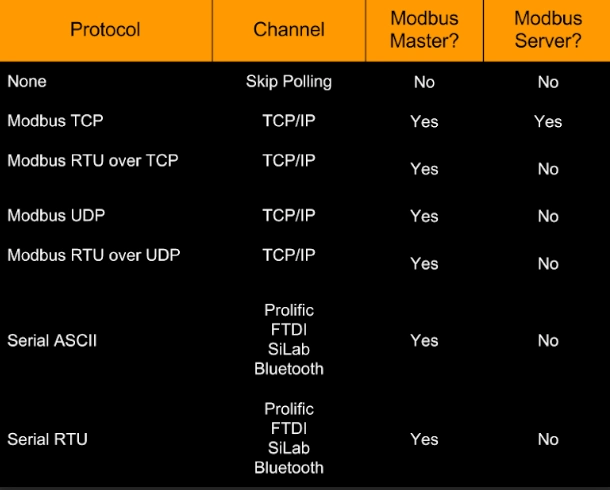
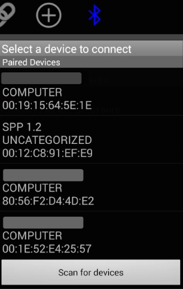
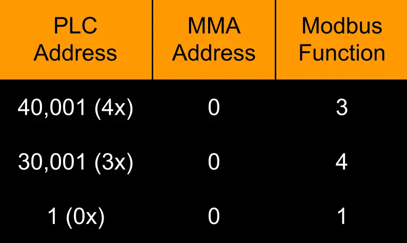

# Modbus Monitor Advanced - Complete User Manual

**Professional mobile Modbus monitoring for advanced users and field engineers**

{ .screenshot-center loading="lazy" }

## Introduction

The Modbus Monitor Advanced is a comprehensive **3-in-1 solution**: Modbus Client, Server, and Sensor Server in a single Android application. This professional app provides complete Modbus protocol implementation with extensive connectivity and data management capabilities.

### Core Capabilities

**Communication Channels (4)**:

- **TCP/IP** - Wi-Fi and Ethernet networks
- **USB-OTG** - Direct serial connections  
- **Bluetooth** - Wireless serial communication
- **Cloud/IoT** - MQTT and custom protocols

**Protocol Support (8)**:

Modbus TCP, UDP, RTU, ASCII, RTU over TCP, MQTT, and custom protocols

**Data Management**:

- CSV import/export with timed intervals (second/minute/hour)
- Email export and cloud integration (ThingSpeak, Google Sheets)
- Real-time logging and statistical analysis

### Operation Modes

- **Client Mode**: Poll remote devices with full protocol flexibility
- **Server Mode**: Turn Android into Modbus TCP slave device
- **Sensor Mode**: Expose phone sensors via Modbus TCP protocol

**Download**: [:material-google-play: Google Play Store](https://play.google.com/store/apps/details?id=com.Bhavan.Galex) | [:material-download: Official Site](https://quantumbitsolutions.com/purchase/)

**Requirements**: Android 8.0+ with network and USB permissions

## Getting Started

### Main Interface Overview

<figure markdown>
  { width="500" }
  <figcaption>Figure 1: Main interface with key controls and status indicators</figcaption>
</figure>

**Key Components**:
1. **Mode Controls** - Start/stop Client and Server operations
2. **Connection Status** - Bluetooth, USB, and IoT indicators  
3. **Statistics** - Good/bad packet counters
4. **Monitor Points** - Device data with real-time values
5. **Quick Add** - (+) button for new monitor points

### Quick Start (3 Steps)

!!! example "Get Connected in 3 Steps"
    1. **Add Monitor Point** - Press (+) button
    2. **Configure Connection** - Set channel (TCP/IP/USB/Bluetooth) and device details
    3. **Start Monitoring** - Press link icon to begin data collection

### Main Menu Features

<figure markdown>
  { width="350" }
  <figcaption>Figure 2: Complete menu showing all available features</figcaption>
</figure>

**Essential Features**:
- **⚙️ Settings** - Configure protocols, timing, and cloud integrations
- **�📤 Import/Export** - CSV data management and email sharing
- **☁️ Cloud Setup** - Google Sheets, ThingSpeak, MQTT configuration
- **🔧 System Tools** - Reset, statistics, and factory restore

## Monitor Points - Core Concept

<figure markdown>
  { width="450" }
  <figcaption>Figure 3: Monitor points showing live data from multiple devices</figcaption>
</figure>

**What are Monitor Points?**
Monitor Points are like PLC tags - each contains complete configuration for one data source:
- Communication settings (protocol, IP address, channel)
- Data formatting and display options
- Write values and mathematical transforms

**Key Advantage**: Each point can use different protocols and connections, enabling multi-device SCADA functionality.

### Monitor Point Management

<figure markdown>
  { width="400" }
  <figcaption>Figure 4: Management options (tap any monitor point to access)</figcaption>
</figure>

**Quick Actions**:
- **✏️ Change** - Configure point settings (primary option)
- **� Communications** - Start/stop polling
- **✍️ Write** - Send values to remote device
- **� Copy/📄 Paste** - Duplicate point configurations

### Configuration Dialog

<figure markdown>
  { width="500" }
  <figcaption>Figure 5: Detailed configuration with expandable sections</figcaption>
</figure>

**Configuration Sections**:
1. **📶 Channel** - Communication interface and protocol
2. **🔧 Modbus** - Address, function codes, display settings  
3. **🖥️ Sensor Server** - Android sensor integration
4. **🧮 Math** - Linear scaling and calculations
5. **💬 Coded Messages** - Text translation for numeric values

## Client Mode - Polling Remote Devices

<figure markdown>
  { width="500" }
  <figcaption>Figure 6: Client mode showing active data polling from multiple devices</figcaption>
</figure>

### Configuration Essentials

**Channel Selection**:
- **� TCP/IP** → Modbus TCP (Ethernet/Wi-Fi)
- **🔌 USB-OTG** → Modbus RTU/ASCII (Serial)  
- **📱 Bluetooth** → Modbus RTU/ASCII (Wireless)

**Addressing**: Uses 6-digit format supporting full 16-bit range (0-65535). See [6-Digit Addressing Guide](../../guides/6-digit-addressing.md) for details.

**Count Field**: Registers to read (1 for integers, 2 for floats, max 125)

!!! warning "Protocol Compatibility"
    Ensure correct Channel/Protocol combinations. Incorrect settings cause communication failures.

### Write Operations

<figure markdown>
  { width="400" }
  <figcaption>Figure 7: Write dialog for sending values to remote devices</figcaption>
</figure>

**Write Capabilities**: Send values to remote servers (disabled by default for safety)
**Multi-Device**: Each monitor point supports different protocols and connections

## Modbus Server Mode (Slave)

<figure markdown>
  { width="500" }
  <figcaption>Figure 9: Server mode active with IP address, port, and connected client count displayed</figcaption>
</figure>

The Modbus Monitor Advanced can operate as a **Modbus TCP Server**, turning your Android device into a Modbus slave that other devices can poll for data. This mode effectively converts your phone or tablet into an industrial data server.

!!! info "Server Mode Overview"
    Technically this functionality could be split into a separate "Modbus Server Android App", but it's included in the same app for convenience and ease of use.

### Server Mode Features

#### Core Functionality
- **Modbus TCP Protocol Only**: Server mode supports only Modbus TCP (other protocols ignored)
- **Shared Monitor Points**: Same monitor point list used for both Master and Slave operations
- **Multiple Client Support**: Handle multiple simultaneous client connections
- **Real-time Data Serving**: Serve live data to remote Modbus masters

#### Starting the Server
1. **Click Server Icon** on the main window to start/stop the Modbus TCP Server
2. **View Connection Info**: Server IP Address and Port displayed when started successfully  
3. **Monitor Clients**: Number in parentheses next to port shows connected client count

### Server Configuration

<figure markdown>
  { width="450" }
  <figcaption>Figure 10: Server configuration settings accessible through Main Menu → Settings → Server</figcaption>
</figure>

**Access**: Main Menu → Settings → Server

#### Configuration Options

| Setting | Description | Default |
|---------|-------------|---------|
| **Server/Listen Port** | Port number for server operation | 8888 |
| **Modbus Server** | Show/hide Server icon on main window | Enabled |
| **Auto Start** | Automatically start server when app launches | Disabled |

#### Port Configuration Guidelines

**Recommended Port: 8888**
- Port 502 (standard Modbus) requires rooted Android device
- Android blocks many ports below 1024 for security
- Use ports above 1024 that aren't occupied by other applications

**Special Port Setting: "0"**
- Setting port to "0" lets Android automatically find available port
- ⚠️ **Caution**: Can cause conflicts with other network devices
- Better to manually select a known-safe port number

**Port Selection Best Practices**:
- Research existing network devices and their port usage
- Avoid common service ports (e.g., 5060 for VoIP)
- Test selected port to ensure no conflicts
- Document chosen port for future reference

### Setting Up Monitor Points for Server Mode

<figure markdown>
  { width="500" }
  <figcaption>Figure 11: Monitor point configured for server mode with Modbus TCP protocol and proper addressing</figcaption>
</figure>

#### Basic Server Setup Steps

1. **Enable Server Feature**: Check "Modbus Server?" in Settings to show server icon
2. **Add Monitor Points**: Click (+) to add at least one monitoring point
3. **Configure Points**: Set up each point for server operation

#### Server Monitor Point Configuration

**Required Settings**:
- **Protocol**: Must be set to **Modbus TCP**
- **Channel**: TCP/IP (other channels ignored)  
- **Address**: Starting register address (e.g., 0 for 40001)
- **Count**: Number of registers to serve
- **Function Code**: 3 (Holding Registers) or 4 (Input Registers)

**Ignored Settings in Server Mode**:
- **IP Address**: Uses server settings instead
- **Port**: Uses server port configuration

#### Example Configuration
```yaml
Server Setup Example:
  Protocol: Modbus TCP
  Address: 0 (PLC Address 40001)
  Count: 10 (for 5 float values × 2 words/float)
  Function: 3 (Holding Registers)
  Data Type: Float
```

### How Server Mode Works

#### Data Flow Process
1. **Monitor Point Setup**: Configure registers with addresses and data types
2. **Memory Management**: Values stored in internal memory at specified addresses
3. **Client Polling**: Remote masters poll your device using standard Modbus TCP
4. **Data Response**: App responds with current values from internal registers

#### Write Operations in Server Mode
- **Write Support**: Clients can write values to your server registers
- **Internal Storage**: Written values stored in internal memory
- **Value Retrieval**: Stored values returned when registers are polled
- **Preset Values**: Use "Write Preset Value" to populate registers with default data

## Sensor Server Mode

<figure markdown>
  { width="500" }
  <figcaption>Figure 12: Sensor server setup showing Android sensor selection and automatic configuration</figcaption>
</figure>

**Sensor Server** is an innovative extension of the Modbus Server that exposes your Android device's built-in sensors through the Modbus TCP protocol.

### What is Sensor Server?

#### Core Concept
- **Hardware Integration**: Links Android sensors directly to Modbus registers  
- **No Programming Required**: Any Modbus TCP Master can access phone sensors
- **Automatic Configuration**: Sensor selection automatically configures register settings
- **Real-time Data**: Live sensor readings available via standard Modbus polling

#### Available Sensors
**Common Android Sensors**:
- **📱 Accelerometer**: Device motion and orientation
- **🧭 Gyroscope**: Angular velocity measurements  
- **🌟 Light Sensor**: Ambient light levels
- **🗓️ Orientation**: Device position in 3D space
- **🌡️ Temperature**: Ambient temperature (device-dependent)
- **📊 Barometer**: Atmospheric pressure
- **🧲 Magnetometer**: Magnetic field strength
- **📍 Proximity**: Object detection near device

### Configuring Sensor Server

<figure markdown>
  { width="600" }
  <figcaption>Figure 13: Automatic sensor information display showing specifications and real-time values</figcaption>
</figure>

#### Setup Process

1. **Enable Server Mode**: Turn on Modbus Server feature (required)
2. **Add Monitor Point**: Create new monitoring point
3. **Select Sensor**: Choose desired sensor from dropdown list
4. **Review Configuration**: Verify automatic settings
5. **Start Server**: Activate server to begin data collection

#### Automatic Configuration

**When you select a sensor, the app automatically**:
- **Updates Register Name**: Fills with comprehensive sensor specifications
- **Sets Count Field**: Configures to 6 words (3 floats × 2 words each)
- **Configures Protocol**: Sets to Modbus TCP
- **Sets Function Code**: Uses function 3 or 4
- **Sets Data Type**: Configures as Float

#### Sensor Information Display

**Register Name Format** (automatically generated):
```
Sensor #[number] [SensorName] 
Power:[value]mA Resolution:[value] 
Range:[value] Vendor:[name] Version:[number]
Raw Data: [0]xxx.xx [1]xxx.xx [2]xxx.xx
```

**Example Information**:
- **Sensor Number**: Internal Android sensor ID
- **Sensor Name**: Human-readable sensor type
- **Power Consumption**: Current draw in milliamps
- **Resolution**: Measurement precision
- **Maximum Range**: Sensor measurement limits
- **Vendor**: Sensor manufacturer
- **Version**: Hardware/driver version
- **Raw Data**: Live 3-axis readings in real-time

### Required Sensor Server Configuration

#### Mandatory Settings
```yaml
Sensor Server Requirements:
  Sensor Selection: [Choose from dropdown]
  Address: 0 (or any unused address)
  Count: 6 (minimum for 3 float values)
  Protocol: Modbus TCP
  Data Type: Float  
  Function: 3 or 4
```

!!! warning "Configuration Requirements"
    All fields above must be properly configured for Sensor Server to work correctly. The Count field must be minimum 6 words to accommodate the 3-axis float data.

### Understanding Sensor Data

#### Data Format
**3-Axis Readings**: Most sensors provide data in 3-dimensional arrays
- **[0] X-Axis**: First dimensional reading
- **[1] Y-Axis**: Second dimensional reading  
- **[2] Z-Axis**: Third dimensional reading

#### Data Interpretation
**Accelerometer Example**:
- **X-Axis**: Lateral acceleration (left/right)
- **Y-Axis**: Longitudinal acceleration (forward/back)
- **Z-Axis**: Vertical acceleration (up/down)
- **Units**: Typically m/s² (meters per second squared)

**Reference Documentation**: 
- 📖 [Android Sensor Developer Guide](https://developer.android.com/guide/topics/sensors/sensors_overview.html)
- 📋 Manufacturer sensor datasheets for specific interpretations

### Practical Applications

#### Industrial IoT Integration
- **Environmental Monitoring**: Use phone as environmental sensor station
- **Vibration Analysis**: Monitor equipment vibration via accelerometer
- **Light Control Systems**: Automatic lighting based on ambient conditions
- **Security Systems**: Motion detection and proximity alerts

#### Research and Development
- **Data Collection**: Gather sensor data for analysis projects  
- **Prototype Testing**: Quick sensor integration without custom programming
- **Educational Demonstrations**: Teach industrial protocols and sensor integration
- **Mobile Sensor Networks**: Deploy phones as distributed sensor nodes

## Professional Use Cases

### Field Service Applications
- **Equipment Diagnostics**: Quick troubleshooting of industrial devices
- **Configuration Backup**: Save and restore device settings
- **Performance Monitoring**: Track system performance over time
- **Communication Testing**: Verify network connectivity and protocols

### System Integration
- **Device Commissioning**: Validate new installations
- **Network Mapping**: Document system architectures
- **Protocol Verification**: Test custom implementations
- **Performance Optimization**: Identify communication bottlenecks

### Research & Development
- **Protocol Analysis**: Reverse engineer device communications
- **Custom Development**: Test new device implementations  
- **Educational Demos**: Teach Modbus fundamentals
- **Communication Studies**: Analyze traffic patterns

## Advanced Configuration Examples

### TCP/IP Network Setup
```yaml
Device Configuration:
  Channel: TCP/IP
  Protocol: Modbus TCP
  IP Address: 192.168.1.100
  Port: 502
  Slave ID: 1
  Address: 400001 (holding register 1)
  Count: 1
  Data Type: 16-bit Integer
```

### Serial/USB Configuration
```yaml
Serial Connection:
  Channel: Serial
  Protocol: Modbus RTU
  Baud Rate: 9600
  Data Bits: 8
  Parity: None
  Stop Bits: 1
  Slave ID: 1
  Address: 300001 (input register 1)
  Count: 2 (for 32-bit float)
```

### Multi-Device Monitoring
```yaml
Device 1 - PLC:
  TCP/IP → 192.168.1.10:502
Device 2 - HMI:  
  TCP/IP → 192.168.1.20:503
Device 3 - Sensor:
  Serial → USB-OTG @ 19200 baud
```

## Hardware Requirements

### Mobile Device Specifications
- **Android OS**: 8.0 (API 26) or higher
- **RAM**: 2GB minimum, 4GB recommended
- **Storage**: 100MB available space
- **Network**: Wi-Fi, 4G/5G for TCP/IP communication
- **USB**: OTG support for serial connections

### Serial Communication Hardware
- **USB-OTG Adapter**: For connecting serial devices
- **USB-to-RS485 Converter**: For industrial networks
- **Proper Grounding**: Essential for reliable communication
- **Quality Cables**: Use shielded cables in industrial environments

## Hardware & Cloud Integration

### USB Serial Requirements
**Recommended Chipsets**: FTDI FT232/FT4232, Prolific PL2303, Silicon Labs CP210x, CH340/CH341
**Hardware**: USB-OTG adapter, USB-to-RS485 converter for industrial networks

### Cloud Platform Add-ons
- **📊 Google Sheets** - Real-time data publishing and automated reports
- **☁️ ThingSpeak** - IoT dashboards, API access, alerts and triggers  
- **📡 MQTT** - Industrial IoT integration with AWS, Azure, Google Cloud

## Troubleshooting

### Common Issues
- **"?????" Values** - Check IP address, port, protocol settings
- **USB Issues** - Verify OTG adapter compatibility and permissions
- **Timeouts** - Increase timeout values in settings
- **Protocol Errors** - Ensure correct Channel/Protocol combinations

### Support Resources
- 📧 **Email**: support@quantumbitsolutions.com
- 📖 **Documentation**: [quantumbitsolutions.com/help](https://quantumbitsolutions.com/help/)
- � **Forum**: [Expert community](https://quantumbitsolutions.com/forums/)

## Get Started Today

[:material-google-play: Download from Google Play Store](https://play.google.com/store/apps/details?id=com.Bhavan.Galex){ .md-button .md-button--primary }

**Professional Modbus monitoring** with unlimited monitor points, cloud integration, and priority support.

---

**Ready for serious industrial communication work on Android devices.**
