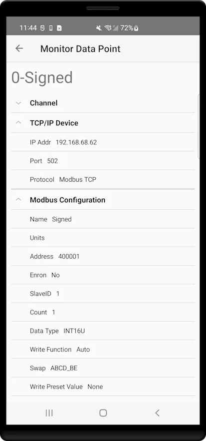
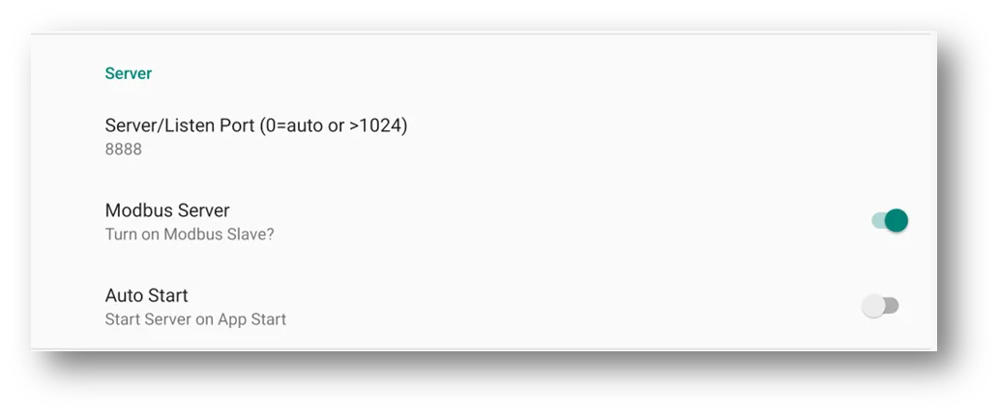
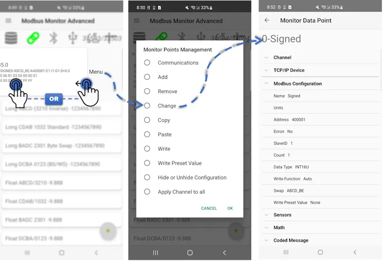

# Modbus Monitor Advanced - Complete User Manual

**Professional mobile Modbus monitoring for advanced users and field engineers**

{ .screenshot-center loading="lazy" }

## Introduction

The Modbus Monitor Advanced is a comprehensive **3-in-1 solution**: Modbus Client, Server, and Sensor Server in a single Android application. This professional app allows you to poll Modbus-speaking devices for data directly from your mobile device.

The Modbus Monitor Advanced operates in two primary modes: **Master (Client)** and **Slave (Server)**. The operation, configuration, and communication differ based on the selected mode. The paid version includes all features of the free app and excels in professional features, configuration options, and ease of data input.

**Master (Client) Mode**: The app polls remote devices to retrieve data, which is then displayed in your chosen data format, including raw data.

**Slave (Server) Mode**: Your phone or tablet acts as a Modbus TCP Slave Device, allowing other devices on the network to poll your device for data.

The advantage of the Modbus Monitor Advanced is that it combines both modes in one application, eliminating the need to purchase separate apps.

**Essential App Features**:

- **⚙️ Settings** - Configure protocols, timing, and cloud integrations  
- **📤 Export/Import** - CSV data management and email sharing
- **☁️ Cloud Integration** - Google Sheets, ThingSpeak, MQTT support
- **🔄 Data Management** - Real-time logging, statistics, and data transformations

### Core Capabilities

**Communication Channels (4)**:

- **TCP/IP** - Wi-Fi and Ethernet networks
- **USB-OTG** - Direct serial connections  
- **Bluetooth** - Wireless serial communication
- **Cloud/IoT** - MQTT and custom protocols

**Protocol Support (8)**:

Modbus TCP, UDP, Serial RTU, Serial ASCII, RTU over TCP, ASCII over TCP, ThingSpeak, Google Sheets, and MQTT

**Data Management**:

- CSV import/export with timed intervals (second/minute/hour)
- Email export and cloud integration (ThingSpeak, Google Sheets)
- Real-time logging and statistical analysis

### Operation Modes

- **Client Mode**: Poll remote devices with full protocol flexibility
- **Server Mode**: Turn Android into Modbus TCP slave device
- **Sensor Mode**: Expose phone sensors via Modbus TCP protocol and MOdbus/TCP server

**Download**: [:material-google-play: Google Play Store](https://play.google.com/store/apps/details?id=com.Bhavan.Galex) | [:material-download: Official Site](https://quantumbitsolutions.com/purchase/)

**Requirements**: Android 6.0+ (API23) with network and USB permissions; USB OTG support required for serial connections

## Getting Started

### Main Interface Overview

The Modbus Monitor Advanced features an intuitive main interface designed for both novice and expert users. Understanding this interface is crucial for effective operation, as it serves as your command center for all Modbus communication activities.

**Interface Design Philosophy**:
The main screen combines **status indicators** with **action buttons** for streamlined operation. Each visual element serves a specific purpose - status lights show what's happening, buttons control operations, and data displays provide real-time feedback. This unified design eliminates the need to navigate between multiple screens during normal operation.

**For New Users**: Don't be overwhelmed by the interface - you'll primarily use just a few key elements:

- The **+ button [10]** to add new connections
- **Monitor Points [9]** to view your data
- **Client Mode [3]** to start/stop data collection

**For Advanced Users**: The interface provides comprehensive control over multiple simultaneous connections, with detailed statistics, server capabilities, and extensive configuration options all accessible from this single screen.

The main interface combines status indicators with action buttons for easy operation. Each row displays monitor points showing Name, Configuration details, current Modbus values, send/receive frames, and packet response times.

<figure markdown id="figure-1">  
  
  <figcaption>Figure 1: Main interface with key controls and status indicators</figcaption>
</figure>

**Key Components**:

| Element | Reference | Description | Function |
|---------|-----------|-------------|----------|
| **[Hamburger Menu](#hamburger-menu)** | [1] | Main application menu | Access settings, import/export, cloud setup |
| **[Server Mode](#modbus-server-mode-slave)** | [2] | Server status/toggle | Start/stop Modbus TCP server functionality |
| **[Client Mode](#client-mode---polling-remote-devices)** | [3] | Client status/toggle | Start/stop Modbus client polling |
| **Bluetooth Status** | [4] | Communication indicators | Bluetooth control and status |
| **Serial Status** | [5] | USB Serial indicators | USB and USB-OTG connected device control panel and connection status. Shows status or click to see available USB devices that can be used |
| **IoT** | [6] | IoT status | IoT controls and status |
| **Google Sheets** | [7] | Statistics display | Controls for Google Sheets  |
| **Packet Counters** | [8] | Statistics display | Good/Bad packet counts and error tracking |
| **Monitor Points** | [9] | Data display area | Live values, config details, response times, click or swipe for edits |
| **Monitor Points - Index** | [9a] | Monitor point index and counter | Sequential monitor point number (i) and request attempt counter for tracking polling activity |
| **Monitor Points - Value** | [9b] | Primary data display line | Shows monitor point name, current live value, and optional engineering unit suffix for easy identification |
| **Monitor Points - Config** | [9c] | Configuration summary line | Displays key settings: communication channel, write function code, data type, byte swap, Modbus address, register count, slave ID, and scaling parameters |
| **Monitor Points - Packet** | [9d] | Communication packet display | Shows raw Modbus packet data for both transmitted requests and received responses for debugging and analysis |
| **Monitor Points - Delay** | [9e] | Communication timing metrics | Displays response time delay between packet transmission and reception, useful for network performance monitoring |
| **Monitor Points - Preset** | [9f] | Quick write button | Interactive button for instantly writing preset values to device when configured; requires proper write function code setup |
| **Server Info** | [10] | Network details | IP address and port when server is active |
| **Quick Add** | [11] | Add button | (+) button to create new monitor points |

!!! note "Monitor Point Configuration Display"
    Monitor Point configuration details (elements 9c to 9e) can be hidden or shown using the "Hide or Unhide Configuration" menu option in the Monitor Point Management dialog.

!!! info "Detailed Coverage Ahead"
    Each of these interface elements will be explained in comprehensive detail throughout this guide. The numbered references [1]-[10] correspond to the annotations in the screenshot above, making it easy to follow along. New users should focus on elements [3], [9], and [10] to get started, while advanced users can utilize all features for complex multi-device scenarios.


### Quick Start (3 Steps)

!!! example "Get Connected in 3 Steps"
    1. **Add Monitor Point** - Press the **+** button to add a new Monitor Point with default settings
    2. **Configure Connection** - Click the Monitor Point and select "Change" to set up the Monitor Point. Click TCP/IP (Channel), set the IP Address and Port from a remote server, specify the Number of Registers, and the Protocol (Modbus TCP is the default)
    3. **Start Monitoring** - Click the **Link** icon to start polling the remote server and view the value

### Navigation Guide

**Quick Access to Key Sections**:

| What You Want To Do | Go To Section | Key Features |
|---------------------|---------------|--------------|
| **Navigate the app interface** | [Hamburger Menu](#hamburger-menu) | Settings, import/export, cloud setup |
| **Configure app behavior** | [Settings](#settings) | Protocol settings, timing, cloud integration |
| **Read data from devices** | [Client Mode](#client-mode---polling-remote-devices) | Poll remote servers, multiple protocols |
| **Let others read your data** | [Server Mode](#modbus-server-mode-slave) | Turn phone into Modbus server |
| **Expose phone sensors** | [Sensor Server Mode](#sensor-server-mode) | Share accelerometer, gyro, etc. via Modbus |
| **Understand data organization** | [Monitor Points](#monitor-points---core-concept) | Core configuration concepts |
| **Troubleshoot issues** | [Troubleshooting](#troubleshooting) | Common problems and solutions |
| **Learn about hardware** | [Hardware Requirements](#hardware-requirements) | USB, Bluetooth, network setup |

## Hamburger Menu

<div class="grid cards" markdown>

-   { width="300" style="display: block; margin: 0 auto;" }

-   **Main Application Menu**

    ---
    
    Access advanced features through the hamburger menu:
    
    **Main**
    
    - **[Home](#main-interface-overview)** - Return to the main monitoring interface
    - **[Modbus Console](../free-guide.md)** - Simple console-style interface for basic Modbus communication (see [Free version guide](../free-guide.md))
    - **[Settings](#settings)** - Configure app behavior and protocols
    - **Purchases** - Verify license and purchase status
    
    **Data**

    - **Save** - Save current monitor point configuration
    - **Clear All** - Remove all monitor points and data
    - **Transform** - Legacy transformation utility to convert old monitor points to new types
    - **Import** - Load monitor points from CSV file in Downloads folder
    - **Export and Email** - Export all monitor points and configuration data to CSV in Downloads folder and send via email
    - **Google Sheets** - Real-time data publishing to spreadsheets (Add-on purchase required)
    - **ThingSpeak** - IoT dashboard and data visualization (Add-on purchase required)
    - **MQTT** - Industrial IoT messaging protocol (Add-on purchase required)
    
    **Reset & Maintenance**

    - **Factory Reset** - Restore app to default settings
    - **Reset Comm Counts** - Clear communication statistics
    - **Reset Statistics** - Reset performance counters
    
    **Exit**
    
    - **Help** - Access documentation links and application version information
    - **Exit** - Close application completely

</div>

## Settings

[:octicons-arrow-left-24: Back to Main Interface](#main-interface-overview)

Access comprehensive app configuration through **[Hamburger Menu [1]](#hamburger-menu) → Settings**. The Settings screen organizes all configuration options into logical categories for easy management of communication protocols, timing parameters, logging options, cloud integrations, and hardware-specific settings.

=== "Modbus Master"

    **Template settings for new monitor points in client mode operations.**
    
    | Setting | Type | Description | Default | Notes |
    |---------|------|-------------|---------|-------|
    | **IP Address** | Text | Default IP address for new monitor points | Device IP | Template for TCP/IP connections |
    | **Port** | Number | Default port for client connections | 502 | Standard Modbus TCP port |
    | **Slave ID** | Number | Default Modbus slave ID | 1 | Applied to new monitor points |
    | **Auto Start** | Switch | Start polling automatically when app launches | Disabled | Begins client mode on app start |
    
    !!! tip "Template Functionality"
        These settings serve as templates when creating new monitor points, saving you from entering the same information repeatedly for similar devices.

=== "Server"

    **Configuration options for [Modbus Server Mode](#modbus-server-mode-slave) operation.**
    
    | Setting | Type | Description | Default | Notes |
    |---------|------|-------------|---------|-------|
    | **Server Port** | Number | Port for Modbus TCP server | 8888 | See [Server Configuration](#server-configuration) |
    | **Modbus Server** | Switch | Show/hide server icon on main interface | Disabled | Enables [Server Mode [2]](#modbus-server-mode-slave) |
    | **Auto Start** | Switch | Automatically start server when app launches | Disabled | Useful for dedicated server deployments |
    
    !!! note "Server Configuration Cross-Reference"
        For detailed server setup including port guidelines and best practices, see the [Server Configuration](#server-configuration) section.

=== "Timing"

    **Fine-tune communication timing and performance parameters.**
    
    | Setting | Type | Description | Default | Range | Notes |
    |---------|------|-------------|---------|-------|-------|
    | **Timeout** | Number | Packet response timeout (milliseconds) | 1000 | 100-30000 | Increase for slow networks |
    | **Retries** | Number | Retry attempts for failed packets | 3 | 0-10 | 0 = no retries |
    | **Socket Timeout** | Number | TCP socket connection timeout | 30000 | 1000-60000 | Network connection limit |
    | **Inter-Message Wait** | Number | Delay between packets (milliseconds) | 20 | 0-5000 | Required for some devices |
    | **Interval** | Number | Polling interval for monitor points | 1000 | 100-3600000 | How often to poll each point |
    
    !!! warning "Performance Impact"
        Lower timeout values improve responsiveness but may cause failures on slow networks. Higher intervals reduce network traffic but delay data updates.

=== "Bluetooth"

    **Wireless communication security and connection options.**
    
    | Setting | Type | Description | Default | Security Impact |
    |---------|------|-------------|---------|------------------|
    | **Insecure Connections** | Switch | Allow insecure Bluetooth pairing | Disabled | Enables connections to older devices |
    
    !!! warning "Security Consideration"
        Insecure connections allow pairing with older Bluetooth devices that don't support modern security protocols. Enable only when necessary.

=== "Sleep"

    **Battery optimization and power management settings.**
    
    | Setting | Type | Description | Default | Impact |
    |---------|------|-------------|---------|--------|
    | **Battery Saver** | Switch | Stop communications during device sleep | Enabled | Improves battery life significantly |
    
    !!! tip "Power Management"
        Battery Saver automatically pauses all communication when your device sleeps, extending battery life for mobile use.

=== "Logs"

    **Control data logging, packet display, and debugging functionality.**
    
    | Setting | Type | Description | Default | Purpose |
    |---------|------|-------------|---------|----------|
    | **Show TX/RX** | Switch | Display packet data in interface | Disabled | Real-time packet debugging |
    | **Log Communications** | Switch | Log TX/RX frames and other info | Disabled | Detailed communication logging |
    | **CSV Log Period** | Number | CSV file logging interval (seconds) | 0 (disabled) | Automatic data export timing |
    
    !!! info "Debugging & Data Collection"
        Enable TX/RX display for real-time packet analysis. CSV logging saves data to Downloads folder for analysis.

=== "Google Sheets"

    **Real-time data publishing to Google Spreadsheets (Add-on required).**
    
    | Setting | Type | Description | Default | Notes |
    |---------|------|-------------|---------|-------|
    | **Use Google Sheets** | Switch | Enable Google Sheets data logging | Disabled | Requires Google account setup |
    | **Spreadsheet ID** | Text | Target spreadsheet identifier | Default ID | From your Google Sheets URL |
    | **Create New Sheet** | Switch | Create new sheet on app start | Disabled | Organizes data by session |
    | **Account Name** | Text | Connected Google account | Not Set | Read-only display |
    | **Account Setup** | Button | Configure Google account access | - | Opens account configuration |
    
    !!! note "Cloud Integration"
        Google Sheets integration requires the Google Sheets add-on purchase and Google account authentication.

=== "ThingSpeak"

    **IoT dashboard and data visualization platform (Add-on required).**
    
    | Setting | Type | Description | Default | Notes |
    |---------|------|-------------|---------|-------|
    | **Use ThingSpeak** | Switch | Enable ThingSpeak data publishing | Disabled | Requires API key |
    | **Write API Key** | Text | ThingSpeak channel write key | Default Key | From your ThingSpeak account |
    | **Test Sample Data** | Button | Send test data to verify connection | - | Validates configuration |
    
    !!! info "IoT Platform"
        ThingSpeak provides real-time charts, alerts, and data analysis. Requires ThingSpeak add-on and free/paid ThingSpeak account.

=== "MQTT"

    **Industrial IoT messaging protocol integration (Add-on required).**
    
    | Setting | Type | Description | Default | Notes |
    |---------|------|-------------|---------|-------|
    | **Use MQTT** | Switch | Enable MQTT topic publishing | Disabled | Requires broker configuration |
    | **Server URI** | Text | MQTT broker connection string | tcp://broker.hivemq.com:1883 | Include protocol and port |
    | **Client ID** | Text | Unique client identifier | Empty | Auto-generated if blank |
    | **Username** | Text | Broker authentication username | Empty | Leave blank for anonymous |
    | **Password** | Password | Broker authentication password | Empty | Secure credential storage |
    | **QoS** | Dropdown | Quality of Service level | 1 | 0=At most once, 1=At least once, 2=Exactly once |
    | **Sample Topic** | Text | Test topic for publishing | modbusmonitor/testtopic1 | Used for testing connection |
    | **Test Panel** | Button | Configuration and test interface | - | Validates MQTT setup |
    
    !!! tip "Industrial Integration"
        MQTT enables integration with AWS IoT, Azure IoT, Google Cloud IoT, and industrial automation systems. Supports secure and reliable data streaming.

## Client Mode - Polling Remote Devices

**Client Mode** transforms your Android device into a powerful **Modbus Master** that can poll multiple remote devices for live data. This is the primary mode for field engineers and technicians who need to monitor, troubleshoot, and analyze industrial systems.

**Advanced Multi-Channel Capability**: Each [Monitor Point](#monitor-points---core-concept) becomes a powerful data source with its own independent communication channel (Serial, TCP/IP, or Bluetooth). This allows you to collect data from different devices using different protocols simultaneously, enabling you to configure and monitor systems from various sources and build comprehensive system-level information from a single interface.


### Configuration Essentials

To start polling in Master Mode, Modbus Monitor Advanced requires at least one monitor point. You can add a monitor point by clicking the (+) button or selecting "Add" from the menu. When you click "Add" or (+), a monitor point is added with default settings and values.

**Monitor Points Management Dialog**: This is your central command hub for modifying, configuring, and controlling individual Modbus points (registers or coils) within your list. See the detailed [Monitor Points Management](#monitor-point-management) section for complete information about all available options.

### Monitor Point Configuration

<div class="grid cards" markdown>

-   { width="400" style="display: block; margin: 0 auto;" }

-   **Monitor Point Configuration Dialog**

    ---
    
    Configure each monitor point with detailed settings across five expandable sections:
    
    **Core Configuration**
    
    - **[Channel Settings](#channel-settings)** - Communication interface and protocol selection
    - **[Modbus Configuration](#modbus-configuration)** - Address, register count, and display settings
    - **[Sensor Server](#sensor-server-configuration)** - Android sensor integration options
    - **[Math](#math-configuration)** - Linear transformation and scaling settings  
    - **[Coded Messages](#coded-messages-configuration)** - Translate numbers to predefined strings
    

    **Quick Setup Steps**:
    
    1. **Add Monitor Point** - Tap monitor point and select "Change" to edit
    2. **Select Channel** - Choose communication interface (TCP/IP, Serial, Bluetooth)
    3. **Configure Protocol** - Set compatible protocol for selected channel
    4. **Set Connection** - Configure IP address/port or baud rate
    5. **Define Modbus** - Set Slave ID, address, and register count
    6. **Start Polling** - Click "Link" icon to begin data collection

</div>

#### Channel Settings

**Communication interface and protocol selection for your monitor point.**

=== "Channel"

    **Physical communication interface selection.**
    
    | Setting | Type | Description |
    |---------|------|-------------|
    | **TCP/IP** | Selection | Network communication via Wi-Fi or Ethernet |
    | **Serial Port** | Selection | Direct USB-OTG serial communication |
    | **Bluetooth BR/EDR/LE** | Selection | Wireless serial communication via Bluetooth |
    
    **Channel Descriptions**:
    - **TCP/IP**: Best for networked devices, PLCs, and remote servers
    - **Serial Port**: Direct connection via USB-OTG adapters for legacy devices
    - **Bluetooth**: Wireless connection to Bluetooth-enabled Modbus devices

=== "Protocol"

    **Modbus protocol variant selection based on chosen channel.**
    
    | Protocol | Compatible Channels | Description |
    |---------|-------------------|-------------|
    | **None** | All | Skip this monitoring point (disabled) |
    | **Modbus TCP** | TCP/IP | Standard Modbus over TCP/IP networks |
    | **Modbus RTU over TCP** | TCP/IP | RTU protocol encapsulated in TCP packets |
    | **Modbus UDP** | TCP/IP | Modbus over UDP (connectionless) |
    | **Modbus ASCII over TCP** | TCP/IP | ASCII protocol encapsulated in TCP packets |
    | **Modbus RTU** | Serial, Bluetooth | Binary serial protocol for direct connections |
    | **Modbus ASCII** | Serial, Bluetooth | ASCII serial protocol for direct connections |
    
    **Protocol Compatibility Matrix**:
    
    | Channel | Supported Protocols | Notes |
    |---------|-------------------|---------|
    | **TCP/IP** | Modbus TCP, UDP, RTU over TCP, ASCII over TCP | Network-based protocols |
    | **Serial (USB-OTG)** | Modbus RTU, Modbus ASCII | Direct serial communication |
    | **Bluetooth** | Modbus RTU, Modbus ASCII | Wireless serial communication |        

=== "TCP/IP Settings"

    **Network connection parameters for TCP/IP communications.**
    
    | Setting | Type | Options | Description |
    |---------|------|---------|-------------|
    | **IP Address** | Text | IPv4 address | Target device IP address |
    | **Port** | Number | 1-65535 | TCP/UDP port number (default: 502) |
    
    **Common Port Usage**:
    - **502** - Standard Modbus TCP port
    - **8888** - Alternative port for multiple devices
    - **Custom** - User-defined ports for specific applications

=== "Serial Settings"

    **Serial communication parameters for USB-OTG and direct serial connections.**
    
    | Setting | Type | Options | Description |
    |---------|------|---------|-------------|
    | **USB Port** | Text | Click to Scan | Click to scan and select the available device. Clicking on the available device also checks if the permission is set correctly |
    | **Interface** | Dropdown | Default, RS232, RS485 | Some devices have more than one interface to choose from |
    | **Baud Rate** | Dropdown | 9600, 19200, 38400, 57600, 115200 | Serial communication speed |
    | **Data Bits** | Dropdown | 7, 8 | Number of data bits per character |
    | **Parity** | Dropdown | None, Even, Odd | Error detection method |
    | **Stop Bits** | Dropdown | 1, 2 | Number of stop bits |
    | **Flow Control** | Dropdown | None, CTS/RTS, DTR/DSR, XOFF/XON | Hardware or software flow control method |
    
    **Common Serial Configurations**:
    - **9600-8-N-1** - Most common industrial setup
    - **19200-8-N-1** - Higher speed applications  
    - **38400-8-E-1** - With even parity for error checking

=== "Bluetooth Settings"

    **Bluetooth wireless communication parameters for paired devices.**
    
    | Setting | Type | Options | Description |
    |---------|------|---------|-------------|
    | **Device** | Text | 4C:3F:D3:02:DB:55 | Physical address of target Bluetooth device (e.g., Bluetooth 4.0 BLE module containing TI CC2541 chip) |
    | **Scan** | Dialog | Click MAC address field | Click on the Device MAC address field to open scan dialog and discover available Bluetooth devices. Select preferred device to automatically fill the MAC address field |
    
    **Bluetooth Configuration Notes**:

    - **Scan Function**: Click on the MAC address field to open scan dialog and discover available Bluetooth devices
    - **Device Selection**: Choose from discovered devices to automatically populate the MAC address field
    - **Auto Connection**: App handles connection automatically when communication is started
    - **Device Pairing**: Previously paired devices work best (especially older EDR devices)
    - **Connection Range**: Typical range 10-30 feet depending on Bluetooth class 
    

#### Modbus Configuration

**Core Modbus parameters and data formatting options for industrial communication.**

The Modbus Configuration section contains the essential parameters that define how your monitor point communicates with Modbus devices and how the received data is interpreted and displayed. This is where you configure the fundamental aspects of Modbus protocol communication including addressing, data types, byte ordering, and write operations.

**Configuration Categories**:

- **[Basic Settings](#basic-settings)** - Essential Modbus parameters including addressing, slave ID, and register configuration
- **[Data Types](#data-types)** - Data interpretation options and endian/byte swap configurations for proper data formatting
- **[Write Operations](#write-operations)** - Write function configuration and safety settings for sending data to devices

**Why Modbus Configuration Matters**:

- **Addressing Accuracy**: Proper Six-Digit addressing ensures you're reading the correct registers or coils
- **Data Interpretation**: Correct data type selection displays meaningful values instead of raw register data
- **Byte Order Handling**: Endian swap settings accommodate different manufacturer implementations
- **Write Safety**: Controlled write operations prevent accidental device configuration changes
- **Protocol Compliance**: Ensures your communication follows standard Modbus specifications

!!! tip "Configuration Best Practices"
    Start with **Basic Settings** to establish communication, then fine-tune **Data Types** for proper value display, and finally configure **Write Operations** only when device control is required. Each monitor point can have completely different Modbus settings, enabling multi-device monitoring from a single interface.

=== "Basic Settings"

    **Essential Modbus configuration parameters.**
    
    | Setting | Type | Range/Options | Description |
    |---------|------|---------------|-------------|
    | **Name** | Text | Custom text | Name to describe this Monitor Point (e.g., Oven Temperature) |
    | **Units** | Text | Custom text | Suffix to add after value (e.g., °C) |
    | **Address** | Number | 000001-665535 | Six-Digit Modbus (one-based) address that includes Function Code |
    | **Enron** | Dropdown | Yes/No | Choose Yes to use Enron address and protocol layer |
    | **Slave ID** | Number | 0-255 | Server or Slave ID of the remote Modbus server |
    | **Count** | Number | 1-125 | Number of registers to request. Default is 1 but varies based on Data Type |
    
    **Addressing System Examples**:
    - **Read 1st Holding Register**: 400001 (4 ⇒ Function 3)
    - **Read 1st Input Register**: 300001 (3 ⇒ Function 4)
    - **Read 1st Coil**: 000001 (0 ⇒ Modbus Function 1)
    - **Read 1st Discrete Input**: 100001 (1 ⇒ Modbus Function 2)
    
    !!! info "Six-Digit Addressing Guide"
        The address field uses **Six-Digit Modbus format** (one-based) that includes the Function Code. For complete address information and examples, see: [quantumbitsolutions.com/address](https://quantumbitsolutions.com/address/)

=== "Data Types"

    **Data interpretation and formatting options.**
    
    | Data Type | Registers | Description | Use Cases |
    |-----------|-----------|-------------|-----------|
    | **INT16** | 1 | 16-bit signed integer | Standard counters, signed values |
    | **INT16U** | 1 | 16-bit unsigned integer | Status values, positive counters |
    | **HEX** | 1 | Hexadecimal display | Raw data debugging, bit patterns |
    | **BINARY** | 1 | Binary display | Bit analysis, digital status |
    | **INT32** | 2 | 32-bit signed integer | Large counters, timestamps |
    | **FLOAT32** | 2 | IEEE 754 floating point | Analog measurements, sensors |
    | **DOUBLE64** | 4 | 64-bit double precision | High precision measurements |
    | **STRING** | Variable | Text data | Device names, status messages |
    | **BCD** | Variable | Binary Coded Decimal | Legacy system data |
    | **EPOCH** | 2 | Unix timestamp | Time/date values |
    | **INT32U** | 2 | 32-bit unsigned integer | Large positive values |
    | **INT64** | 4 | 64-bit signed integer | Very large signed values |
    | **INT64U** | 4 | 64-bit unsigned integer | Very large unsigned values |
    
    | Setting | Type | Range/Options | Description |
    |---------|------|---------------|-------------|
    | **Data Type** | Dropdown | See table above | How to interpret register data |
    | **Swap** | Dropdown | Byte/word swap options | Choose endian and swap configuration |
    
    **Swap Options (Endian Configuration)**:
    
    | Option | Description | Use Case |
    |--------|-------------|----------|
    | **ABCD_BE** | Big Endian | Standard big endian byte order |
    | **BADC_BEBS** | Big Endian with Byte Swap | Big endian with bytes swapped |
    | **DCBA_LE** | Little Endian | Standard little endian byte order |
    | **CDAB_LEBS** | Little Endian with Byte Swap | Little endian with bytes swapped |

=== "Write Operations"

    **Write operation configuration and safety settings.**
    
    | Setting | Type | Range/Options | Description |
    |---------|------|---------------|-------------|
    | **Write Function** | Dropdown | See options below | Function to use for Write Operation |
    | **Button Write Value** | Number | Custom | Preset value for "Write preset value" option in Monitor Point Management |
    
    **Write Function Options**:
    
    | Function | Code | Description | Use Case |
    |----------|------|-------------|----------|
    | **Read Only** | Default | No write operations allowed | Safe monitoring only |
    | **05 Write Single Coil** | 05 | Write single coil (bit) | Individual digital outputs |
    | **06 Write Single Register** | 06 | Write single holding register | Individual analog outputs |
    | **15 Write Multiple Coils** | 15 | Write multiple coils | Multiple digital outputs |
    | **16 Write Multiple Registers** | 16 | Write multiple holding registers | Multiple analog outputs |
    | **Auto** | Auto | Choose based on function type and register count | Automatic selection |
    
    **Function Code Selection**:
    - **Read Only**: Default safe option, prevents accidental writes
    - **Single Operations**: Use 05/06 for individual coil or register writes
    - **Multiple Operations**: Use 15/16 for bulk coil or register writes  
    - **Auto Mode**: Automatically selects appropriate function based on data type and count
    
    !!! warning "Write Safety"
        Write operations are disabled by default for safety. The preset value will be used for the "Write preset value" option in the Monitor Point Management dialog box.

#### Sensor Server Configuration

**Android sensor integration settings for Sensor Server Mode.**

=== "Sensor Selection"

    **Choose and configure Android sensors for Modbus exposure.**
    
    | Setting | Type | Options | Description |
    |---------|------|---------|-------------|
    | **Sensor Selection** | Dropdown | See list below | Choose Android sensor to expose |
    | **Auto Configure** | Automatic | Yes | Automatically sets count, protocol, data type |
    
    **Automatic Configuration**:
    When you select a sensor, the app automatically configures:
    - **Count**: Set to 6 words (3 floats × 2 words each)
    - **Protocol**: Set to Modbus TCP
    - **Data Type**: Set to Float
    - **Register Name**: Updated with sensor specifications and live readings

=== "Available Sensors"

    **Complete list of Android sensors available for integration.**
    
    | Sensor | Description | Data Axes | Typical Units |
    |--------|-------------|-----------|---------------|
    | **Accelerometer** | Device motion and orientation | 3 (X, Y, Z) | m/s² |
    | **Gyroscope** | Angular velocity measurements | 3 (X, Y, Z) | rad/s |
    | **Light Sensor** | Ambient light levels | 1 | lux |
    | **Orientation** | Device position in 3D space | 3 (Azimuth, Pitch, Roll) | degrees |
    | **Temperature** | Ambient temperature | 1 | °C |
    | **Barometer** | Atmospheric pressure | 1 | hPa |
    | **Magnetometer** | Magnetic field strength | 3 (X, Y, Z) | µT |
    | **Proximity** | Object detection near device | 1 | cm |

#### Math Configuration

**Linear transformation and scaling options for data processing.**

=== "Scaling Settings"

    **Mathematical transformation parameters.**
    
    | Setting | Type | Range | Description |
    |---------|------|-------|-------------|
    | **Scale Factor** | Number | Any decimal | Multiply raw value by this factor |
    | **Offset** | Number | Any decimal | Add this value after scaling |
    | **Engineering Units** | Text | Custom text | Display suffix (e.g., "°C", "PSI") |
    
    **Mathematical Formula**:
    ```
    Display Value = (Raw Value × Scale Factor) + Offset
    ```

=== "Common Examples"

    **Typical scaling scenarios and configurations.**
    
    | Application | Scale Factor | Offset | Units | Example |
    |-------------|--------------|---------|--------|---------|
    | **Temperature (°F to °C)** | 0.5556 | -17.78 | °C | Convert Fahrenheit |
    | **Pressure (PSI)** | 0.1 | 0 | PSI | Scale 0-1000 to 0-100 |
    | **Flow Rate** | 2.5 | 0 | GPM | Scale to actual flow |
    | **Percentage** | 0.1 | 0 | % | Convert 0-1000 to 0-100% |
    
    **Use Case Benefits**:
    - **Unit Conversion**: Convert between different measurement systems
    - **Range Scaling**: Adjust raw sensor values to meaningful ranges
    - **Calibration**: Apply calibration factors to improve accuracy

#### Coded Messages Configuration

**Translate numeric values to descriptive text messages.**

=== "Message Setup"

    **Basic coded message configuration.**
    
    | Setting | Type | Description |
    |---------|------|-------------|
    | **Enable Coded Messages** | Checkbox | Activate text translation feature |
    | **Message Map** | Table | Value-to-text mapping definitions |
    
    **Configuration Benefits**:
    - **User-Friendly Display**: Show meaningful text instead of numbers
    - **Status Translation**: Convert numeric codes to operational status
    - **Alarm Indication**: Highlight critical conditions with descriptive text
    - **Multi-Language Support**: Define messages in local language

=== "Message Examples"

    **Sample message mapping configurations.**
    
    | Raw Value | Display Message | Use Case |
    |-----------|-----------------|----------|
    | 0 | "Stopped" | Equipment status |
    | 1 | "Running" | Equipment status |
    | 2 | "Fault" | Equipment status |
    | 100-199 | "Normal Range" | Operating conditions |
    | 200+ | "Over Range" | Alarm conditions |
    
    **Advanced Mappings**:
    - **Range-based**: Map value ranges to different messages
    - **State Machines**: Define complex operational states
    - **Alarm Levels**: Create hierarchical alarm messages

### Write Operations

<figure markdown>
  { width="400" }
  <figcaption>Figure 3: Write dialog for sending values to remote devices</figcaption>
</figure>

**Accessing the Write Dialog**:
The Write Dialog box is displayed when selecting the "Write" option from the Monitor Point Management dialog (tap any monitor point to access). The dialog header shows the Monitor Point name along with the configured Data Type.

**Write Dialog Operation**:
1. **Enter Value**: Type the desired value in the write field
2. **Click Change**: Confirm and send the write operation
3. **Monitor Results**: Check for successful write confirmation

**Write vs. Write Preset Value**:

| Operation | Description | Use Case |
|-----------|-------------|----------|
| **Write** | Send custom value entered in dialog | One-time value changes, testing, debugging |
| **Write Preset Value** | Send pre-configured default value | Quick restore to known good values |

**Write Capabilities**: 
- **Safety First**: Write operations disabled by default to prevent accidental changes
- **Dual Mode Support**: Available in both Client and Server modes
- **Custom Values**: Enter any valid value for the configured data type
- **Preset Values**: Quick access to pre-configured default values

**Mode-Specific Behavior**:

=== "Client Mode Write"

    **Direct Device Communication**:
    - Write value included in Modbus packet sent directly to remote server
    - Uses appropriate Modbus write function (05, 06, 15, or 16) based on data type
    - Immediate transmission to target device
    - Write confirmation received from remote device
    
    **Typical Use Cases**:
    - Adjusting setpoints on remote controllers
    - Changing operational parameters
    - Testing device responses
    - Emergency shutdowns or mode changes

=== "Server Mode Write"

    **Internal Register Storage**:
    - Write value stored in internal app memory/registers
    - Value becomes available for remote masters to poll
    - No immediate network transmission
    - Value persists until overwritten or app restart
    
    **Typical Use Cases**:
    - Populating server registers with test data
    - Setting default values for client polling
    - Simulating device responses
    - Creating mock data for development/testing

**Multi-Device Support**: Each monitor point supports different protocols and connections, enabling write operations across multiple devices and networks simultaneously.

**Safety and Configuration**:
- **Enable Writing**: Must be explicitly enabled per monitor point in configuration
- **Data Type Validation**: Ensures entered values match configured data type
- **Range Checking**: Validates values are within acceptable limits
- **Error Handling**: Provides clear feedback on failed write attempts

!!! warning "Write Safety"
    Write operations are disabled by default for safety. Enable writing only for monitor points where you need to send commands or data to devices. Always verify the target device and address before enabling write operations.

!!! tip "Using Preset Values"
    Configure preset values during monitor point setup to enable quick "Write Preset Value" operations. This is especially useful for:
    
    - **Emergency stops** - Quick access to safe shutdown values
    - **Standard setpoints** - Rapid return to normal operating parameters  
    - **Test values** - Consistent test data for development and debugging
    - **Default configurations** - Reset devices to known good states

## Modbus Server Mode (Slave)

[:octicons-arrow-left-24: Back to Main Interface](#main-interface-overview)

Turn your Android device into a **Modbus TCP Server** that other devices can poll for data. This powerful feature effectively converts your phone or tablet into an industrial data server, enabling remote Modbus masters to access your device's data through standard Modbus TCP protocol.

<figure markdown>
  { width="500" }
  <figcaption>Figure 4: Server mode active showing IP address, port, and connected client count</figcaption>
</figure>

!!! info "Server Mode Overview"
    Technically this functionality could be split into a separate "Modbus Server Android App", but it's included in the same app for convenience and ease of use.

### How Server Mode Works

**Simple Concept**: Your Android device becomes a Modbus TCP server that other devices can poll for data. Each monitor point you create becomes available as Modbus registers that remote clients can read.

**Key Benefits**:

- **Shared Configuration**: Monitor points work in both Client and Server modes
- **Multiple Clients**: Handle several remote devices simultaneously  
- **Live Data Serving**: Provide real-time values to industrial networks
- **Standard Protocol**: Uses industry-standard Modbus TCP

**Operation Process**:

1. **Build Modbus Map**: Add monitor points to define available registers
2. **Start Server**: Click the **Server Mode [2]** button (see [Figure 1](#figure-1))
3. **Monitor Status**: Check **Server Info [8]** for IP address and connected client count
4. **Serve Data**: Remote clients poll your device using standard Modbus TCP commands

!!! note "Protocol Limitation & Alternative"
    Server mode supports **Modbus TCP only** - other protocols are ignored. For multiple protocol support in server mode, consider [Modbus Monitor XPF](https://quantumbitsolutions.com/windows-xpf-monitor/).

### Server Configuration

<figure markdown>
  
  <figcaption>Figure 5: Server configuration options accessible through Settings → Server</figcaption>
</figure>

**Access**: **[Hamburger Menu [1]](#hamburger-menu) → Settings → Server** (see [Settings](#settings) section for complete configuration reference)

#### Configuration Options

| Setting | Description | Default |
|---------|-------------|---------|
| **Server/Listen Port** | Port number for server operation | 8888 |
| **Modbus Server** | Show/hide Server icon on main window | Enabled |
| **Auto Start** | Automatically start server when app launches | Disabled |

#### Quick Setup Steps

**Step 1: Configure Port Settings**

- Navigate to **[Hamburger Menu [1]](#hamburger-menu) → Settings → Server**
- Set **Server Port** (recommended: 8888 for non-rooted devices)
- Enable **Modbus Server** switch to show server icon on main interface

**Step 2: Port Selection Guidelines**

- **Port 502**: Standard Modbus port, requires rooted Android device
- **Port 8888**: Recommended default for most Android devices  
- **Ports > 1024**: Safe choices for non-rooted devices
- **Port "0"**: Auto-select (⚠️ may cause network conflicts)

**Step 3: Add Monitor Points**

- At least one monitor point required to start server
- Click **(+)** to add new monitor point
- Configure for server mode (see [Monitor Point Setup](#setting-up-monitor-points-for-server-mode) below)

!!! warning "Port Conflicts"
    Research existing network devices before selecting a port. For example, Port 5060 can interfere with VoIP services. Choose ports above 1024 for non-rooted devices to avoid system conflicts.

### Setting Up Monitor Points for Server Mode

The second setup step is to turn on the Server feature so it can be started. This can be done by checking the “Modbus Server?” option under the Preferences screen. Turning this feature on will place the familiar “server icon” on the icon bar. The Server Icon is the only way to turn the Server communication on.

!!! tip "Auto Start Feature"
    Enable "Auto Start" to automatically begin server operation when the app launches. This is useful for dedicated server deployments where the Android device serves as a permanent Modbus TCP server.

#### Configuration Access
**Path**: **[Hamburger Menu [1]](#hamburger-menu) → Settings → Server** (see [Settings](#settings) section for complete configuration reference)

#### Port Configuration Guidelines

**Standard vs. Practical Ports**:

- **Port 502**: Standard Modbus TCP port, but requires **rooted Android device**
- **Port 8888**: Recommended default - tested to work well on most Android devices
- **Ports > 1024**: Safe choice as Android blocks many ports below 1024 for security

**Special Port Setting: "0"**

- Setting port to "0" lets Android automatically find available port
- ⚠️ **Caution**: Can cause conflicts with other network devices
- Better to manually select a known-safe port number

**Real-World Port Conflicts**:

During testing, certain ports caused issues with other network services:
- **Port 5060**: Caused VoIP service problems (ringing and audio issues)
- **Common Service Ports**: Research existing network devices before selecting

**Port Selection Best Practices**:

1. **Research Network**: Identify existing devices and their port usage
2. **Avoid System Ports**: Stay above 1024 unless device is rooted
3. **Test Selection**: Verify chosen port doesn't conflict with existing services
4. **Document Choice**: Record selected port for future reference and troubleshooting
5. **Consider Environment**: Different sites may have different port restrictions

### Setting Up Monitor Points for Server Mode

<figure markdown>
  { width="500" }
  <figcaption>Figure 6: Monitor point configured for server mode with Modbus TCP protocol and register addressing</figcaption>
</figure>

#### Prerequisites

**Before starting server mode, ensure**:

1. **Server Feature Enabled**: Check "Modbus Server?" in [Settings](#settings) to show server icon
2. **Monitor Points Added**: Must have at least one monitor point configured
3. **Correct Protocol**: All monitor points must use Modbus TCP protocol

#### Basic Server Setup Steps

**Step 1: Enable Server Feature**

- Navigate to **[Hamburger Menu [1]](#hamburger-menu) → Settings → Server**
- Check "Modbus Server?" option to place server icon on main interface
- This is the **only way** to access server functionality

**Step 2: Add Monitor Points**

- Click **(+)** button to add at least one monitoring point
- Server cannot start without monitor points in the list

**Step 3: Configure Each Monitor Point**

- Set up each point specifically for server operation
- Follow configuration requirements below

#### Server Monitor Point Configuration

**Critical Settings** (must be configured correctly):

- **Protocol**: Must be set to **Modbus TCP** (other protocols ignored)
- **Channel**: TCP/IP (other channels ignored)  
- **Address**: Starting register address (use [6-Digit Addressing format](../../guides/6-digit-addressing.md))
- **Count**: Number of registers to serve (matches your data requirements)
- **Data Type**: Choose appropriate type (Integer, Float, etc.)

**Ignored Settings in Server Mode**:

- **IP Address**: Server uses device IP automatically
- **Port**: Server uses port from Settings configuration

!!! warning "Address Translation Required"
    The address field uses **Modbus Protocol format**, not PLC addressing. For complete address translation help, see the [6-Digit Addressing Guide](../../guides/6-digit-addressing.md).

#### Example Configuration
**5 Float Values Server Setup**:
```yaml
Server Monitor Point:
  Protocol: Modbus TCP
  Address: 400001 (using 6-digit format for holding register 1)
  Count: 10 (5 floats × 2 words each)
  Data Type: Float
```

!!! tip "6-Digit Address Format"
    This example uses **400001** in 6-digit format. Use the [6-Digit Addressing Guide](../../guides/6-digit-addressing.md) to convert between different addressing formats and understand register types.

### How Server Mode Works

#### Data Flow Process
1. **Monitor Point Setup**: Configure registers with addresses and data types
2. **Memory Management**: Values stored in internal memory at specified addresses
3. **Client Polling**: Remote masters poll your device using standard Modbus TCP
4. **Data Response**: App responds with current values from internal registers

#### Write Operations in Server Mode
- **Write Support**: Clients can write values to your server registers
- **Internal Storage**: Written values stored in internal memory
- **Value Retrieval**: Stored values returned when registers are polled
- **Preset Values**: Use "Write Preset Value" to populate registers with default data

!!! tip "Detailed Write Operations"
    For complete information about write dialogs, preset values, and write operation procedures, see the [Write Operations](#write-operations) section in the Client Mode chapter. The same write functionality applies to both Client and Server modes.

## Monitor Points - Core Concept

<figure markdown>
  { width="450" }
  <figcaption>Figure 9: Monitor points showing live data from multiple devices</figcaption>
</figure>

**What are Monitor Points?**

A Monitor Point is similar to tags in a PLC and holds all information relevant to defining Modbus, the communication medium, display, and preset writing values. Each monitor point contains complete configuration for one data source:

- **Communication settings** - Protocol, IP address, port, channel selection
- **Modbus configuration** - Address, register count, slave ID  
- **Data formatting** - Display options, data types, scaling
- **Write values** - Preset values and mathematical transforms
- **Advanced features** - Coded messages, sensor integration

**Key Advantage**: Each point can use different protocols and connections, enabling multi-device SCADA functionality. With Modbus Monitor Advanced, you can set different protocols, IP addresses, ports, and channels for each Monitor Point Entry. This advanced SCADA-level data collection approach allows you to set and view live values from various operation modes through a single interface.

The full list of Monitor Points can be built by adding new items one at a time or importing thousands of items from a CSV file from email or the mobile device's Downloads folder.

### Monitor Point Management

<figure markdown>
  { width="400" }
  <figcaption>Figure 10: Management options (tap any monitor point to access)</figcaption>
</figure>

**The Monitor Points Management Dialog** is your central command hub for modifying, configuring, and controlling individual Modbus points (registers or coils) within your list.

#### Accessing the Management Dialog

<figure markdown>
  
  <figcaption>Figure 4: Accessing Monitor Points Management Dialog either by tap or swipe</figcaption>
</figure>

The Monitor Points Management dialog can be accessed either by clicking on the monitor points (after adding a point) or swiping left to expose the Menu option. The UI shows the Monitor Points Management dialog to configure each monitor point and customize it.

To open the Management Menu:
1. **Tap** any specific Monitor Point in your main list
2. **Long-press** (depending on your device interaction settings)
3. A dialog box titled **"Monitor Point Management"** will appear

#### Management Options

| Option | Icon | Description | Use Cases |
|--------|------|-------------|----------|
| **Communications** | Link | Toggles communication status for selected item | Pause queries to specific device without stopping entire system |
| **Add** | Plus | Opens "Add Point" configuration screen | Insert new Modbus register or coil into monitoring list |
| **Remove** | Delete | Permanently deletes selected Monitor Point | Clean up unused or obsolete monitoring points |
| **Change** | Edit | Opens configuration screen for selected point | Modify Address, Function Code, Data Type, or other settings |
| **Copy** | Copy | Copies configuration of selected point to clipboard | Backup configurations or prepare for duplication |
| **Paste** | Paste | Pastes previously copied configuration as new item | Quickly duplicate similar sensors or registers |
| **Write** | Write | Initiates write command to device | Send custom values to device (requires write capability enabled) |
| **Write Preset Value** | Preset | Sends pre-configured default value to device | Quick setpoint adjustments or restore to known values |
| **Hide/Unhide Configuration** | View | Toggles visibility of technical details in main list | Clean interface by hiding register addresses and data types |
| **Apply Settings to All** | Global | Applies settings from selected point to all other points | Bulk update Channel/IP settings across all monitor points (use with caution) |

#### How to Use the Management Dialog

**Step-by-Step Process**:
1. **Select an Action**: Tap the radio button next to desired action (e.g., "Change" or "Copy")
2. **Confirm**: Press the **OK** button at bottom of dialog
3. **Cancel**: Press **Cancel** to close menu without making changes

#### Advanced Features

**Configuration Auto-Switching**: The app automatically switches between "Simple" and "Advanced" views depending on the point's configuration complexity.

**Bulk Operations**: Use "Apply Settings to All" to propagate network settings (IP address, port, protocol) from one point to all others in your list.

#### Troubleshooting Management Operations

**Common Issues**:

- **Error Messages**: If you see error notifications (e.g., "Error 343235"), it usually indicates:
  - Monitor Point configuration is invalid
  - Background communication driver is busy
  - **Solution**: Wait a moment and try the action again

- **Read-Only Points**: If you select "Write" on points configured as Read-Only (e.g., Input Registers):
  - The command may not execute
  - **Solution**: Verify the register type supports write operations

- **Write Operations Disabled**: Write and Write Preset commands require:
  - Write capability enabled in monitor point configuration
  - Proper Modbus function codes configured
  - **Solution**: Use "Change" to enable write capability in point settings

!!! tip "Management Best Practices"
    - **Copy Before Modifying**: Always copy important configurations before making changes
    - **Test Write Operations**: Verify write commands work correctly before deploying in production
    - **Use Descriptive Names**: Give monitor points clear, descriptive names for easier management
    - **Group Similar Points**: Organize related monitor points together for easier bulk operations

!!! info "Write Operations Access"
    Both **Write** and **Write Preset Value** options are available in this menu and work in both Client and Server modes:
    
    - **Write**: Opens dialog for custom value entry - see [Write Operations](#write-operations) for detailed usage
    - **Write Preset Value**: Immediate transmission of pre-configured default value
    - **Safety**: Both options require write capability to be enabled in monitor point configuration
    - **Cross-Mode**: Available whether operating as Modbus Client or Server

## Sensor Server Mode

<figure markdown>
  { width="500" }
  <figcaption>Figure 7: Sensor server setup showing Android sensor selection and automatic configuration</figcaption>
</figure>

**Sensor Server** is an innovative extension of the Modbus Server that exposes your Android device's built-in sensors through the Modbus TCP protocol.

### What is Sensor Server?

#### Core Concept
- **Hardware Integration**: Links Android sensors directly to Modbus registers  
- **No Programming Required**: Any Modbus TCP Master can access phone sensors
- **Automatic Configuration**: Sensor selection automatically configures register settings
- **Real-time Data**: Live sensor readings available via standard Modbus polling

#### Available Sensors
**Common Android Sensors**:
- **📱 Accelerometer**: Device motion and orientation
- **🧭 Gyroscope**: Angular velocity measurements  
- **🌟 Light Sensor**: Ambient light levels
- **🗓️ Orientation**: Device position in 3D space
- **🌡️ Temperature**: Ambient temperature (device-dependent)
- **📊 Barometer**: Atmospheric pressure
- **🧲 Magnetometer**: Magnetic field strength
- **📍 Proximity**: Object detection near device

### Configuring Sensor Server

<figure markdown>
  { width="600" }
  <figcaption>Figure 8: Automatic sensor information display showing specifications and real-time values</figcaption>
</figure>

#### Setup Process

1. **Enable Server Mode**: Turn on Modbus Server feature (required)
2. **Add Monitor Point**: Create new monitoring point
3. **Select Sensor**: Choose desired sensor from dropdown list
4. **Review Configuration**: Verify automatic settings
5. **Start Server**: Activate server to begin data collection

#### Automatic Configuration

**When you select a sensor, the app automatically**:
- **Updates Register Name**: Fills with comprehensive sensor specifications
- **Sets Count Field**: Configures to 6 words (3 floats × 2 words each)
- **Configures Protocol**: Sets to Modbus TCP
- **Sets Data Type**: Configures as Float

#### Sensor Information Display

**Register Name Format** (automatically generated):
```
Sensor #[number] [SensorName] 
Power:[value]mA Resolution:[value] 
Range:[value] Vendor:[name] Version:[number]
Raw Data: [0]xxx.xx [1]xxx.xx [2]xxx.xx
```

**Example Information**:

- **Sensor Number**: Internal Android sensor ID
- **Sensor Name**: Human-readable sensor type
- **Power Consumption**: Current draw in milliamps
- **Resolution**: Measurement precision
- **Maximum Range**: Sensor measurement limits
- **Vendor**: Sensor manufacturer
- **Version**: Hardware/driver version
- **Raw Data**: Live 3-axis readings in real-time

### Required Sensor Server Configuration

#### Mandatory Settings
```yaml
Sensor Server Requirements:
  Sensor Selection: [Choose from dropdown]
  Address: Use 6-digit format (see addressing guide)
  Count: 6 (minimum for 3 float values)
  Protocol: Modbus TCP
  Data Type: Float  
```

!!! warning "Configuration Requirements"
    All fields above must be properly configured for Sensor Server to work correctly. The Count field must be minimum 6 words to accommodate the 3-axis float data.

### Understanding Sensor Data

#### Data Format
**3-Axis Readings**: Most sensors provide data in 3-dimensional arrays

- **[0] X-Axis**: First dimensional reading
- **[1] Y-Axis**: Second dimensional reading  
- **[2] Z-Axis**: Third dimensional reading

#### Data Interpretation
**Accelerometer Example**:

- **X-Axis**: Lateral acceleration (left/right)
- **Y-Axis**: Longitudinal acceleration (forward/back)
- **Z-Axis**: Vertical acceleration (up/down)
- **Units**: Typically m/s² (meters per second squared)

**Reference Documentation**: 

- 📖 [Android Sensor Developer Guide](https://developer.android.com/guide/topics/sensors/sensors_overview.html)
- 📋 Manufacturer sensor datasheets for specific interpretations

### Practical Applications

#### Industrial IoT Integration

- **Environmental Monitoring**: Use phone as environmental sensor station
- **Vibration Analysis**: Monitor equipment vibration via accelerometer
- **Light Control Systems**: Automatic lighting based on ambient conditions
- **Security Systems**: Motion detection and proximity alerts

#### Research and Development

- **Data Collection**: Gather sensor data for analysis projects  
- **Prototype Testing**: Quick sensor integration without custom programming
- **Educational Demonstrations**: Teach industrial protocols and sensor integration
- **Mobile Sensor Networks**: Deploy phones as distributed sensor nodes

## Professional Use Cases

### Field Service Applications

- **Equipment Diagnostics**: Quick troubleshooting of industrial devices
- **Configuration Backup**: Save and restore device settings
- **Performance Monitoring**: Track system performance over time
- **Communication Testing**: Verify network connectivity and protocols

### System Integration

- **Device Commissioning**: Validate new installations
- **Network Mapping**: Document system architectures
- **Protocol Verification**: Test custom implementations
- **Performance Optimization**: Identify communication bottlenecks

### Research & Development

- **Protocol Analysis**: Reverse engineer device communications
- **Custom Development**: Test new device implementations  
- **Educational Demos**: Teach Modbus fundamentals
- **Communication Studies**: Analyze traffic patterns

## Advanced Configuration Examples

### TCP/IP Network Setup
```yaml
Device Configuration:
  Channel: TCP/IP
  Protocol: Modbus TCP
  IP Address: 192.168.1.100
  Port: 502
  Slave ID: 1
  Address: 400001 (holding register 1)
  Count: 1
  Data Type: 16-bit Integer
```

### Serial/USB Configuration
```yaml
Serial Connection:
  Channel: Serial
  Protocol: Modbus RTU
  Baud Rate: 9600
  Data Bits: 8
  Parity: None
  Stop Bits: 1
  Slave ID: 1
  Address: 300001 (input register 1)
  Count: 2 (for 32-bit float)
```

### Multi-Device Monitoring
```yaml
Device 1 - PLC:
  TCP/IP → 192.168.1.10:502
Device 2 - HMI:  
  TCP/IP → 192.168.1.20:503
Device 3 - Sensor:
  Serial → USB-OTG @ 19200 baud
```

## Hardware Requirements

### Mobile Device Specifications

- **Android OS**: 8.0 (API 26) or higher
- **RAM**: 2GB minimum, 4GB recommended
- **Storage**: 100MB available space
- **Network**: Wi-Fi, 4G/5G for TCP/IP communication
- **USB**: OTG support for serial connections

### Serial Communication Hardware

- **USB-OTG Adapter**: For connecting serial devices
- **USB-to-RS485 Converter**: For industrial networks
- **Proper Grounding**: Essential for reliable communication
- **Quality Cables**: Use shielded cables in industrial environments

## Hardware & Cloud Integration

### USB Serial Requirements
**Recommended Chipsets**: FTDI FT232/FT4232, Prolific PL2303, Silicon Labs CP210x, CH340/CH341
**Hardware**: USB-OTG adapter, USB-to-RS485 converter for industrial networks

### Cloud Platform Add-ons

- **📊 Google Sheets** - Real-time data publishing and automated reports
- **☁️ ThingSpeak** - IoT dashboards, API access, alerts and triggers  
- **📡 MQTT** - Industrial IoT integration with AWS, Azure, Google Cloud

## Troubleshooting

### Common Issues

**Communication Problems**:
- **"?????" Values** - Unable to collect data from remote servers
  - Check IP address, port, and protocol settings
  - Verify network connectivity and device accessibility
  - Confirm correct Channel/Protocol combinations
- **Protocol Errors** - Ensure correct Channel/Protocol combinations (see compatibility table in Client Mode section)
- **Timeouts** - Increase timeout values in Settings → Timing

**Hardware Issues**:
- **USB Issues** - Verify OTG adapter compatibility and USB permissions
  - Ensure Android device supports USB-OTG
  - Check that USB serial adapter uses supported chipset (FTDI, Prolific, etc.)
  - Grant USB permissions when prompted
- **Bluetooth Connection** - Verify Bluetooth pairing and permissions
- **Network Connection** - Check Wi-Fi/Ethernet connectivity for TCP/IP mode

**Configuration Issues**:

- **Invalid Addresses** - Use 6-digit Modbus Protocol format, not PLC addressing
- **Wrong Register Count** - Set correct count for data type (1 for integers, 2 for floats)
- **Write Failures** - Enable write permissions for each monitor point (disabled by default)

### Diagnostic Steps
1. **Check Connection Status** - Monitor connection indicators on main interface
2. **Review Packet Counters** - Good/Bad packet statistics show communication health
3. **Verify Settings** - Double-check all configuration parameters
4. **Test Simple Configuration** - Start with basic TCP/IP connection before advanced setups
5. **Check Error Codes** - Reference [Error Codes Page](https://quantumbitsolutions.com/errors/)

### Support Resources

- 📧 **Email**: support@quantumbitsolutions.com
- 📖 **Documentation**: [quantumbitsolutions.com/help](https://quantumbitsolutions.com/help/)
- � **Forum**: [Expert community](https://quantumbitsolutions.com/forums/)

## Get Started Today

[:material-google-play: Download from Google Play Store](https://play.google.com/store/apps/details?id=com.Bhavan.Galex){ .md-button .md-button--primary }

**Professional Modbus monitoring** with unlimited monitor points, cloud integration, and priority support.

---

**Ready for serious industrial communication work on Android devices.**
