# Modbus Monitor Advanced - Complete User Manual

**Professional mobile Modbus monitoring for advanced users and field engineers**

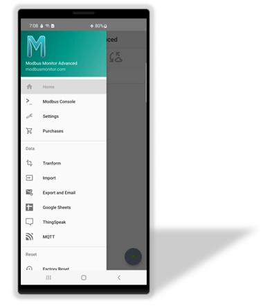{ .screenshot-center loading="lazy" }

## Introduction

The Modbus Monitor Advanced is a comprehensive **3-in-1 solution**: Modbus Client, Server, and Sensor Server in a single Android application. This professional app allows you to poll Modbus-speaking devices for data directly from your mobile device.

The Modbus Monitor Advanced operates in two primary modes: **Master (Client)** and **Slave (Server)**. The operation, configuration, and communication differ based on the selected mode. The paid version includes all features of the free app and excels in professional features, configuration options, and ease of data input.

**Master (Client) Mode**: The app polls remote devices to retrieve data, which is then displayed in your chosen data format, including raw data.

**Slave (Server) Mode**: Your phone or tablet acts as a Modbus TCP Slave Device, allowing other devices on the network to poll your device for data.

The advantage of the Modbus Monitor Advanced is that it combines both modes in one application, eliminating the need to purchase separate apps.

**Essential App Features**:

- **⚙️ Settings** - Configure protocols, timing, and cloud integrations  
- **📤 Export/Import** - CSV data management and email sharing
- **☁️ Cloud Integration** - Google Sheets, ThingSpeak, MQTT support
- **🔄 Data Management** - Real-time logging, statistics, and data transformations

### Core Capabilities

**Communication Channels (4)**:

- **TCP/IP** - Wi-Fi and Ethernet networks
- **USB-OTG** - Direct serial connections  
- **Bluetooth** - Wireless serial communication
- **Cloud/IoT** - MQTT and custom protocols

**Protocol Support (8)**:

Modbus TCP, UDP, Serial RTU, Serial ASCII, RTU over TCP, ASCII over TCP, ThingSpeak, Google Sheets, and MQTT

**Data Management**:

- CSV import/export with timed intervals (second/minute/hour)
- Email export and cloud integration (ThingSpeak, Google Sheets)
- Real-time logging and statistical analysis

### Operation Modes

- **Client Mode**: Poll remote devices with full protocol flexibility
- **Server Mode**: Turn Android into Modbus TCP slave device
- **Sensor Mode**: Expose phone sensors via Modbus TCP protocol and MOdbus/TCP server

**Download**: [:material-google-play: Google Play Store](https://play.google.com/store/apps/details?id=com.Bhavan.Galex) | [:material-download: Official Site](https://quantumbitsolutions.com/purchase/)

**Requirements**: Android 6.0+ (API23) with network and USB permissions; USB OTG support required for serial connections

## Getting Started

### Main Interface Overview

The Modbus Monitor Advanced features an intuitive main interface designed for both novice and expert users. Understanding this interface is crucial for effective operation, as it serves as your command center for all Modbus communication activities.

**Interface Design Philosophy**:
The main screen combines **status indicators** with **action buttons** for streamlined operation. Each visual element serves a specific purpose - status lights show what's happening, buttons control operations, and data displays provide real-time feedback. This unified design eliminates the need to navigate between multiple screens during normal operation.

**For New Users**: Don't be overwhelmed by the interface - you'll primarily use just a few key elements:

- The **+ button [10]** to add new connections
- **Monitor Points [9]** to view your data
- **Client Mode [3]** to start/stop data collection

**For Advanced Users**: The interface provides comprehensive control over multiple simultaneous connections, with detailed statistics, server capabilities, and extensive configuration options all accessible from this single screen.

The main interface combines status indicators with action buttons for easy operation. Each row displays monitor points showing Name, Configuration details, current Modbus values, send/receive frames, and packet response times.

<figure markdown>  
  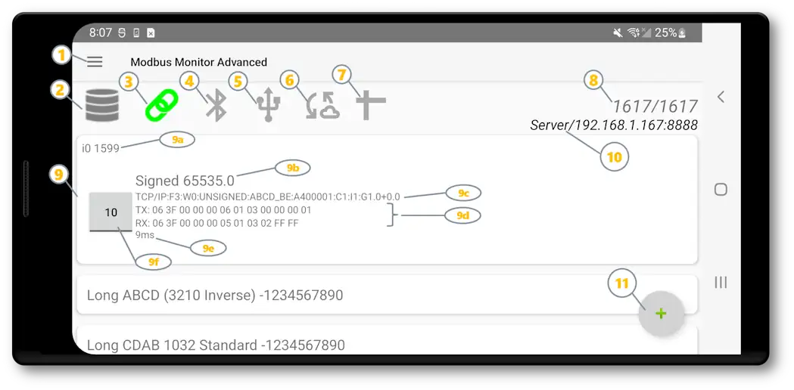
  <figcaption>Figure 1: Main interface with key controls and status indicators</figcaption>
</figure>

**Key Components**:

| Element | Reference | Description | Function |
|---------|-----------|-------------|----------|
| **[Hamburger Menu](#hamburger-menu)** | [1] | Main application menu | Access settings, import/export, cloud setup |
| **[Server Mode](#modbus-server-mode-slave)** | [2] | Server status/toggle | Start/stop Modbus TCP server functionality |
| **[Client Mode](#client-mode---polling-remote-devices)** | [3] | Client status/toggle | Start/stop Modbus client polling |
| **Bluetooth Status** | [4] | Communication indicators | Bluetooth control and status |
| **Serial Status** | [5] | USB Serial indicators | USB and USB-OTG connected device control panel and connection status |
| **IoT** | [6] | IoT status | IoT controls and status |
| **Packet Counters** | [7] | Statistics display | Good/Bad packet counts and error tracking |
| **Server Info** | [8] | Network details | IP address and port when server is active |
| **Monitor Points** | [9] | Data display area | Live values, config details, response times, click or swipe for edits |
| **Quick Add** | [10] | Add button | (+) button to create new monitor points |

!!! info "Detailed Coverage Ahead"
    Each of these interface elements will be explained in comprehensive detail throughout this guide. The numbered references [1]-[10] correspond to the annotations in the screenshot above, making it easy to follow along. New users should focus on elements [3], [9], and [10] to get started, while advanced users can utilize all features for complex multi-device scenarios.


### Quick Start (3 Steps)

!!! example "Get Connected in 3 Steps"
    1. **Add Monitor Point** - Press the **+** button to add a new Monitor Point with default settings
    2. **Configure Connection** - Click the Monitor Point and select "Change" to set up the Monitor Point. Click TCP/IP (Channel), set the IP Address and Port from a remote server, specify the Number of Registers, and the Protocol (Modbus TCP is the default)
    3. **Start Monitoring** - Click the **Link** icon to start polling the remote server and view the value

### Navigation Basics

**Primary Navigation**:

- **[Hamburger Menu [1]](#hamburger-menu)** - Access all app settings and features
- **Main Interface** - Your primary workspace for monitoring data
- **Monitor Point Dialogs** - Configure individual connections

**Quick Access Features**:

- **Settings** (via menu) - Configure app behavior and cloud features
- **Edit Monitor Point** (click or swipe) - Click on Monitor Point or swipe to see the menu for each monitoring point
- **Import/Export** (via menu) - Manage monitor point configurations
- **Help & Support** (via menu) - Access documentation and community

!!! tip "Learning Path"
    Start with the basics: add a monitor point, configure it, and start monitoring. Once comfortable, explore the advanced features through the [hamburger menu [1]](#hamburger-menu). Each feature has detailed explanations in the sections below.

## Hamburger Menu

<div class="grid cards" markdown>

-   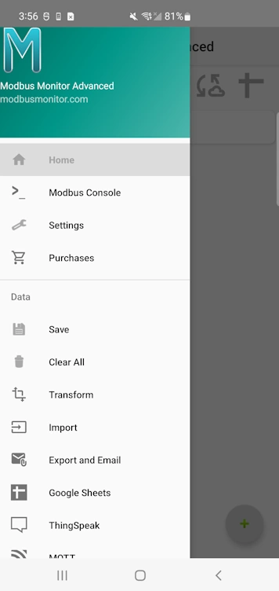{ width="300" style="display: block; margin: 0 auto;" }

-   **Main Application Menu**

    ---
    
    Access advanced features through the hamburger menu:
    
    **Main**
    
    - **Home** - Return to the main monitoring interface
    - **Modbus Console** - Access console mode features
    - **Settings** - Configure app behavior and protocols
    - **Purchases** - Verify license and purchase status
    
    **Data**

    - **Save** - Save current monitor point configuration
    - **Clear All** - Remove all monitor points and data
    - **Transform** - Legacy transformation utility to convert old monitor points to new types
    - **Import** - Load monitor points from CSV file in Downloads folder
    - **Export and Email** - Export all monitor points and configuration data to CSV in Downloads folder and send via email
    - **Google Sheets** - Real-time data publishing to spreadsheets (Add-on purchase required)
    - **ThingSpeak** - IoT dashboard and data visualization (Add-on purchase required)
    - **MQTT** - Industrial IoT messaging protocol (Add-on purchase required)
    
    **Reset & Maintenance**

    - **Factory Reset** - Restore app to default settings
    - **Reset Comm Counts** - Clear communication statistics
    - **Reset Statistics** - Reset performance counters
    
    **Exit**
    
    - **Help** - Access documentation links and application version information
    - **Exit** - Close application completely

</div>

## Settings

[:octicons-arrow-left-24: Back to Main Interface](#main-interface-overview)

Access comprehensive app configuration through **[Hamburger Menu [1]](#hamburger-menu) → Settings**. The Settings screen organizes all configuration options into logical categories for easy management of communication protocols, timing parameters, logging options, cloud integrations, and hardware-specific settings.

=== "Modbus Master"

    **Template settings for new monitor points in client mode operations.**
    
    | Setting | Type | Description | Default | Notes |
    |---------|------|-------------|---------|-------|
    | **IP Address** | Text | Default IP address for new monitor points | Device IP | Template for TCP/IP connections |
    | **Port** | Number | Default port for client connections | 502 | Standard Modbus TCP port |
    | **Slave ID** | Number | Default Modbus slave ID | 1 | Applied to new monitor points |
    | **Auto Start** | Switch | Start polling automatically when app launches | Disabled | Begins client mode on app start |
    
    !!! tip "Template Functionality"
        These settings serve as templates when creating new monitor points, saving you from entering the same information repeatedly for similar devices.

=== "Server"

    **Configuration options for [Modbus Server Mode](#modbus-server-mode-slave) operation.**
    
    | Setting | Type | Description | Default | Notes |
    |---------|------|-------------|---------|-------|
    | **Server Port** | Number | Port for Modbus TCP server | 8888 | See [Server Configuration](#server-configuration) |
    | **Modbus Server** | Switch | Show/hide server icon on main interface | Disabled | Enables [Server Mode [2]](#modbus-server-mode-slave) |
    | **Auto Start** | Switch | Automatically start server when app launches | Disabled | Useful for dedicated server deployments |
    
    !!! note "Server Configuration Cross-Reference"
        For detailed server setup including port guidelines and best practices, see the [Server Configuration](#server-configuration) section.

=== "Timing"

    **Fine-tune communication timing and performance parameters.**
    
    | Setting | Type | Description | Default | Range | Notes |
    |---------|------|-------------|---------|-------|-------|
    | **Timeout** | Number | Packet response timeout (milliseconds) | 1000 | 100-30000 | Increase for slow networks |
    | **Retries** | Number | Retry attempts for failed packets | 3 | 0-10 | 0 = no retries |
    | **Socket Timeout** | Number | TCP socket connection timeout | 30000 | 1000-60000 | Network connection limit |
    | **Inter-Message Wait** | Number | Delay between packets (milliseconds) | 20 | 0-5000 | Required for some devices |
    | **Interval** | Number | Polling interval for monitor points | 1000 | 100-3600000 | How often to poll each point |
    
    !!! warning "Performance Impact"
        Lower timeout values improve responsiveness but may cause failures on slow networks. Higher intervals reduce network traffic but delay data updates.

=== "Bluetooth"

    **Wireless communication security and connection options.**
    
    | Setting | Type | Description | Default | Security Impact |
    |---------|------|-------------|---------|------------------|
    | **Insecure Connections** | Switch | Allow insecure Bluetooth pairing | Disabled | Enables connections to older devices |
    
    !!! warning "Security Consideration"
        Insecure connections allow pairing with older Bluetooth devices that don't support modern security protocols. Enable only when necessary.

=== "Sleep"

    **Battery optimization and power management settings.**
    
    | Setting | Type | Description | Default | Impact |
    |---------|------|-------------|---------|--------|
    | **Battery Saver** | Switch | Stop communications during device sleep | Enabled | Improves battery life significantly |
    
    !!! tip "Power Management"
        Battery Saver automatically pauses all communication when your device sleeps, extending battery life for mobile use.

=== "Logs"

    **Control data logging, packet display, and debugging functionality.**
    
    | Setting | Type | Description | Default | Purpose |
    |---------|------|-------------|---------|----------|
    | **Show TX/RX** | Switch | Display packet data in interface | Disabled | Real-time packet debugging |
    | **Log Communications** | Switch | Log TX/RX frames and other info | Disabled | Detailed communication logging |
    | **CSV Log Period** | Number | CSV file logging interval (seconds) | 0 (disabled) | Automatic data export timing |
    
    !!! info "Debugging & Data Collection"
        Enable TX/RX display for real-time packet analysis. CSV logging saves data to Downloads folder for analysis.

=== "Google Sheets"

    **Real-time data publishing to Google Spreadsheets (Add-on required).**
    
    | Setting | Type | Description | Default | Notes |
    |---------|------|-------------|---------|-------|
    | **Use Google Sheets** | Switch | Enable Google Sheets data logging | Disabled | Requires Google account setup |
    | **Spreadsheet ID** | Text | Target spreadsheet identifier | Default ID | From your Google Sheets URL |
    | **Create New Sheet** | Switch | Create new sheet on app start | Disabled | Organizes data by session |
    | **Account Name** | Text | Connected Google account | Not Set | Read-only display |
    | **Account Setup** | Button | Configure Google account access | - | Opens account configuration |
    
    !!! note "Cloud Integration"
        Google Sheets integration requires the Google Sheets add-on purchase and Google account authentication.

=== "ThingSpeak"

    **IoT dashboard and data visualization platform (Add-on required).**
    
    | Setting | Type | Description | Default | Notes |
    |---------|------|-------------|---------|-------|
    | **Use ThingSpeak** | Switch | Enable ThingSpeak data publishing | Disabled | Requires API key |
    | **Write API Key** | Text | ThingSpeak channel write key | Default Key | From your ThingSpeak account |
    | **Test Sample Data** | Button | Send test data to verify connection | - | Validates configuration |
    
    !!! info "IoT Platform"
        ThingSpeak provides real-time charts, alerts, and data analysis. Requires ThingSpeak add-on and free/paid ThingSpeak account.

=== "MQTT"

    **Industrial IoT messaging protocol integration (Add-on required).**
    
    | Setting | Type | Description | Default | Notes |
    |---------|------|-------------|---------|-------|
    | **Use MQTT** | Switch | Enable MQTT topic publishing | Disabled | Requires broker configuration |
    | **Server URI** | Text | MQTT broker connection string | tcp://broker.hivemq.com:1883 | Include protocol and port |
    | **Client ID** | Text | Unique client identifier | Empty | Auto-generated if blank |
    | **Username** | Text | Broker authentication username | Empty | Leave blank for anonymous |
    | **Password** | Password | Broker authentication password | Empty | Secure credential storage |
    | **QoS** | Dropdown | Quality of Service level | 1 | 0=At most once, 1=At least once, 2=Exactly once |
    | **Sample Topic** | Text | Test topic for publishing | modbusmonitor/testtopic1 | Used for testing connection |
    | **Test Panel** | Button | Configuration and test interface | - | Validates MQTT setup |
    
    !!! tip "Industrial Integration"
        MQTT enables integration with AWS IoT, Azure IoT, Google Cloud IoT, and industrial automation systems. Supports secure and reliable data streaming.

### Settings Access & Navigation

**Access Path**: **[Hamburger Menu [1]](#hamburger-menu) → Settings**

**Navigation Tips**:
- Click tabs above to jump between setting categories
- Settings are automatically saved when changed
- Use device back button to return to main interface
- Each category focuses on related functionality

**Related Sections**:
- [Server Configuration](#server-configuration) - Detailed server setup
- [Client Mode](#client-mode---polling-remote-devices) - Communication setup  
- [Troubleshooting](#troubleshooting) - Common configuration issues

## Modbus Server Mode (Slave)

[:octicons-arrow-left-24: Back to Main Interface](#main-interface-overview)

Turn your Android device into a **Modbus TCP Server** that other devices can poll for data. This powerful feature effectively converts your phone or tablet into an industrial data server, enabling remote Modbus masters to access your device's data through standard Modbus TCP protocol.

<figure markdown>
  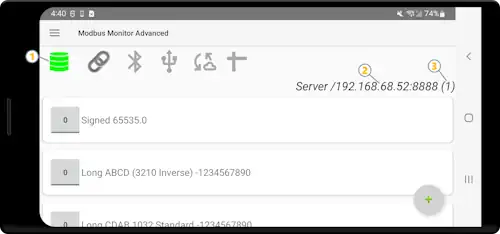{ width="500" }
  <figcaption>Server mode active [1] with IP address, port, [2] and connected client count displayed [3]</figcaption>
</figure>

!!! info "Server Mode Overview"
    Technically this functionality could be split into a separate "Modbus Server Android App", but it's included in the same app for convenience and ease of use.

### Core Concepts

#### Modbus Map Building
The server operates by building a **Modbus Map** through your monitor points list. Each monitor point you add represents a value stored in memory that gets served to Modbus clients when they request data from the corresponding address. This approach allows you to:

- **Share Monitor Points**: The same monitor point list is used for both Master (Client) and Slave (Server) operations, saving data entry steps
- **Memory Mapping**: Values are reflected in internal memory and automatically sent to clients when requested
- **Address Management**: Each monitor point defines specific register addresses that clients can access

#### Protocol Restrictions
**Important**: Server mode **only supports Modbus TCP protocol**. Any other protocol option selected in monitor points is ignored. For multiple protocol support in server mode, consider [Modbus Monitor XPF](https://quantumbitsolutions.com/windows-xpf-monitor/).

#### Data Flow Architecture
1. **Monitor Point Configuration**: Set up registers with addresses, data types, and function codes
2. **Memory Storage**: Values are stored in internal memory at specified addresses  
3. **Client Requests**: Remote Modbus masters poll your device using standard Modbus TCP
4. **Automatic Response**: App automatically responds with current values from internal registers
5. **Write Support**: Clients can write values to your server registers for bidirectional communication

### Server Mode Features

#### Core Functionality
- **Modbus TCP Protocol Only**: Server mode supports only Modbus TCP (other protocols ignored)
- **Shared Monitor Points**: Same monitor point list used for both Master and Slave operations
- **Multiple Client Support**: Handle multiple simultaneous client connections
- **Real-time Data Serving**: Serve live data to remote Modbus masters

#### Starting the Server
1. **Click Server Icon** on the main window to start/stop the Modbus TCP Server [1]
2. **View Connection Info**: Server IP Address and Port displayed when started successfully   [2]
3. **Monitor Clients**: Number in parentheses next to port shows connected client count [3]

### Server Configuration

<figure markdown>
  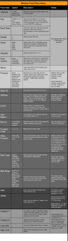{ width="450" }
  <figcaption>Figure 3: Server configuration settings accessible through Main Menu → Settings → Server</figcaption>
</figure>

**Access**: **[Hamburger Menu [1]](#hamburger-menu) → Settings → Server** (see [Settings](#settings) section for complete configuration reference)

#### Configuration Options

| Setting | Description | Default |
|---------|-------------|---------||
| **Server/Listen Port** | Port number for server operation | 8888 |
| **Modbus Server** | Show/hide Server icon on main window | Enabled |
| **Auto Start** | Automatically start server when app launches | Disabled |

!!! tip "Auto Start Feature"
    Enable "Auto Start" to automatically begin server operation when the app launches. This is useful for dedicated server deployments where the Android device serves as a permanent Modbus TCP server.

#### Configuration Access
**Path**: **[Hamburger Menu [1]](#hamburger-menu) → Settings → Server** (see [Settings](#settings) section for complete configuration reference)

#### Port Configuration Guidelines

**Standard vs. Practical Ports**:
- **Port 502**: Standard Modbus TCP port, but requires **rooted Android device**
- **Port 8888**: Recommended default - tested to work well on most Android devices
- **Ports > 1024**: Safe choice as Android blocks many ports below 1024 for security

**Special Port Setting: "0"**
- Setting port to "0" lets Android automatically find available port
- ⚠️ **Caution**: Can cause conflicts with other network devices
- Better to manually select a known-safe port number

**Real-World Port Conflicts**:
During testing, certain ports caused issues with other network services:
- **Port 5060**: Caused VoIP service problems (ringing and audio issues)
- **Common Service Ports**: Research existing network devices before selecting

**Port Selection Best Practices**:
1. **Research Network**: Identify existing devices and their port usage
2. **Avoid System Ports**: Stay above 1024 unless device is rooted
3. **Test Selection**: Verify chosen port doesn't conflict with existing services
4. **Document Choice**: Record selected port for future reference and troubleshooting
5. **Consider Environment**: Different sites may have different port restrictions

### Setting Up Monitor Points for Server Mode

<figure markdown>
  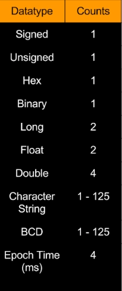{ width="500" }
  <figcaption>Figure 4: Monitor point configured for server mode with Modbus TCP protocol and proper addressing</figcaption>
</figure>

#### Prerequisites
**Before starting server mode, ensure**:
1. **Server Feature Enabled**: Check "Modbus Server?" in [Settings](#settings) to show server icon
2. **Monitor Points Added**: Must have at least one monitor point configured
3. **Correct Protocol**: All monitor points must use Modbus TCP protocol

#### Basic Server Setup Steps

**Step 1: Enable Server Feature**
- Navigate to **[Hamburger Menu [1]](#hamburger-menu) → Settings → Server**
- Check "Modbus Server?" option to place server icon on main interface
- This is the **only way** to access server functionality

**Step 2: Add Monitor Points**
- Click **(+)** button to add at least one monitoring point
- Server cannot start without monitor points in the list

**Step 3: Configure Each Monitor Point**
- Set up each point specifically for server operation
- Follow configuration requirements below

#### Server Monitor Point Configuration

**Critical Settings** (must be configured correctly):
- **Protocol**: Must be set to **Modbus TCP** (other protocols ignored)
- **Channel**: TCP/IP (other channels ignored)  
- **Address**: Starting register address (e.g., 0 for PLC address 40001)
- **Count**: Number of registers to serve (matches your data requirements)
- **Function Code**: 3 (Holding Registers) or 4 (Input Registers)
- **Data Type**: Choose appropriate type (Integer, Float, etc.)

**Ignored Settings in Server Mode**:
- **IP Address**: Server uses device IP automatically
- **Port**: Server uses port from Settings configuration

!!! warning "Address Translation Required"
    The address field uses **Modbus Protocol format**, not PLC addressing. For address translation help, see the [6-Digit Addressing Guide](../../guides/6-digit-addressing.md).

#### Example Configuration
```yaml
Server Setup Example:
  Protocol: Modbus TCP
  Address: 0 (PLC Address 40001)
  Count: 10 (for 5 float values × 2 words/float)
  Function: 3 (Holding Registers)
  Data Type: Float
```

### How Server Mode Works

#### Data Flow Process
1. **Monitor Point Setup**: Configure registers with addresses and data types
2. **Memory Management**: Values stored in internal memory at specified addresses
3. **Client Polling**: Remote masters poll your device using standard Modbus TCP
4. **Data Response**: App responds with current values from internal registers

#### Write Operations in Server Mode
- **Write Support**: Clients can write values to your server registers
- **Internal Storage**: Written values stored in internal memory
- **Value Retrieval**: Stored values returned when registers are polled
- **Preset Values**: Use "Write Preset Value" to populate registers with default data

## Monitor Points - Core Concept

<figure markdown>
  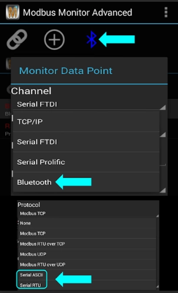{ width="450" }
  <figcaption>Figure 3: Monitor points showing live data from multiple devices</figcaption>
</figure>

**What are Monitor Points?**

A Monitor Point is similar to tags in a PLC and holds all information relevant to defining Modbus, the communication medium, display, and preset writing values. Each monitor point contains complete configuration for one data source:

- **Communication settings** - Protocol, IP address, port, channel selection
- **Modbus configuration** - Address, function codes, slave ID, register count  
- **Data formatting** - Display options, data types, scaling
- **Write values** - Preset values and mathematical transforms
- **Advanced features** - Coded messages, sensor integration

**Key Advantage**: Each point can use different protocols and connections, enabling multi-device SCADA functionality. With Modbus Monitor Advanced, you can set different protocols, IP addresses, ports, and channels for each Monitor Point Entry. This advanced SCADA-level data collection approach allows you to set and view live values from various operation modes through a single interface.

The full list of Monitor Points can be built by adding new items one at a time or importing thousands of items from a CSV file from email or the mobile device's Downloads folder.

### Monitor Point Management

<figure markdown>
  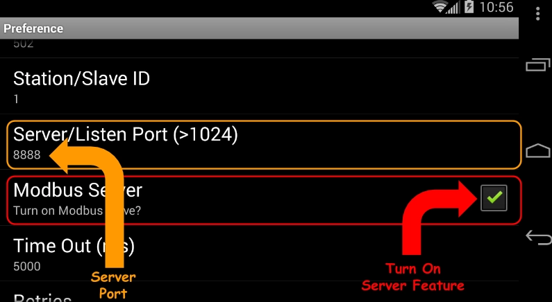{ width="400" }
  <figcaption>Figure 4: Management options (tap any monitor point to access)</figcaption>
</figure>

**Management Options**:

- **📞 Communications** - Start or stop the Modbus Client. This is the same as clicking on the Link Icon. This is also the default action when no item is selected and OK is clicked
- **➕ Add** - Add a new Monitor Point with default settings. This is the same as clicking the + floating button
- **❌ Remove** - Remove the selected item
- **✏️ Change** - Change or edit the selected Monitor Point. This option is usually used after a new item is added to configure or set up the Monitor Point
- **📋 Copy** - Copy the selected item to memory
- **📄 Paste** - Paste the copied item from memory and add it as a new item
- **✍️ Write** - Write and send a new value to Modbus. Modbus Write must be enabled for each item for this to work (Write is disabled by default to prevent accidents)
- **⚡ Write Preset Value** - Write the preset value to the Modbus Server. The preset value is set previously when setting up a new Monitor Point
- **👁️ Hide/Unhide Configuration** - Show or hide the line below the Register Name that displays a short description of the configuration

### Configuration Dialog

<figure markdown>
  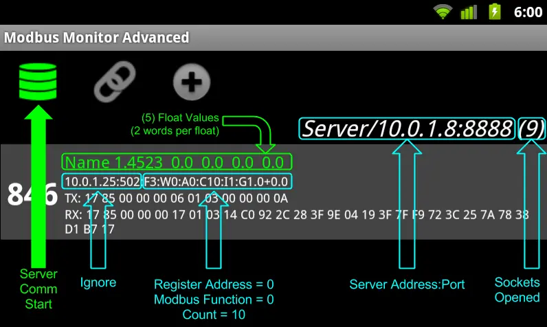{ width="500" }
  <figcaption>Figure 5: Detailed configuration with expandable sections</figcaption>
</figure>

**Configuration Sections**:
1. **📶 Channel** - Communication interface and protocol
2. **🔧 Modbus** - Address, function codes, display settings  
3. **🖥️ Sensor Server** - Android sensor integration
4. **🧮 Math** - Linear scaling and calculations
5. **💬 Coded Messages** - Text translation for numeric values

## Client Mode - Polling Remote Devices

<figure markdown>
  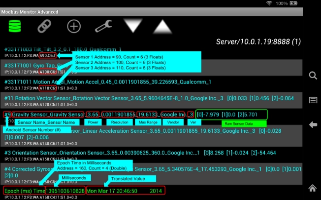{ width="500" }
  <figcaption>Figure 6: Client mode showing active data polling from multiple devices</figcaption>
</figure>

### Configuration Essentials

To start polling in Master Mode, Modbus Monitor Advanced requires at least one monitor point. You can add a monitor point by clicking the (+) button or selecting "Add" from the menu. When you click "Add" or (+), a monitor point is added with default settings and values. 

**Setup Steps**:
1. **Add Monitor Point** - Tap the monitor point in the list and select "Change" to edit the newly added point
2. **Select Channel** - Choose the physical or network device your remote device (server/slave) will use for communication
3. **Choose Protocol** - Select compatible protocol for your selected channel (see table above)
4. **Configure Connection** - Set IP address/port for TCP/IP or baud rate for serial connections
5. **Set Modbus Parameters** - Configure Slave ID, address, and register count
6. **Start Polling** - Click the "Link" icon to start polling from remote servers

**Channel Selection**:
- **🌐 TCP/IP** → Modbus TCP (Ethernet/Wi-Fi)
- **🔌 USB-OTG** → Modbus RTU/ASCII (Serial)  
- **📱 Bluetooth** → Modbus RTU/ASCII (Wireless)

**Protocol Compatibility**:

| Channel | Supported Protocols | Notes |
|---------|-------------------|-------|
| TCP/IP | Modbus TCP, UDP, RTU over TCP, ASCII over TCP | Works as Master and Server |
| Serial (USB-OTG) | Modbus RTU, Modbus ASCII | Serial communication only |
| Bluetooth | Modbus RTU, Modbus ASCII | Wireless serial communication |

!!! warning "Protocol Compatibility"
    Only certain protocols are compatible with each channel. Modbus Monitor Advanced will skip monitor points with incorrect Channel/Protocol combinations. If communication shows errors, ensure the correct Channel and Protocol are set for each monitor point.

**Addressing**: Uses 6-digit format supporting full 16-bit range (0-65535). This address is in the Modbus Protocol format, not the more common PLC address scheme. See [6-Digit Addressing Guide](../../guides/6-digit-addressing.md) for details.

**Count Field**: Registers to read (1 for integers, 2 for floats, max 125 per Modbus specification). Ensure the correct number of counts is programmed for the data type to be displayed.

!!! warning "Protocol Compatibility"
    Ensure correct Channel/Protocol combinations. Incorrect settings cause communication failures.

### Write Operations

<figure markdown>
  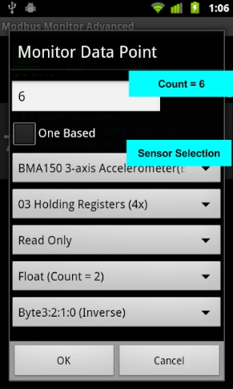{ width="400" }
  <figcaption>Figure 7: Write dialog for sending values to remote devices</figcaption>
</figure>

The Write Dialog box is displayed when selecting the "Write" option from the Monitor Point Management dialog. The header shows the name of the Monitor Point along with the Data Type. Enter the value in the write field and click the Change button.

**Write Capabilities**: 
- Send values to remote servers (disabled by default for safety)
- Works in both Master and Server modes
- In Master mode: write value included in Modbus packet sent to remote server
- In Server mode: write value stored in internal registers for remote masters to poll

**Multi-Device Support**: Each monitor point supports different protocols and connections, enabling write operations across multiple devices and networks simultaneously.

## Sensor Server Mode

<figure markdown>
  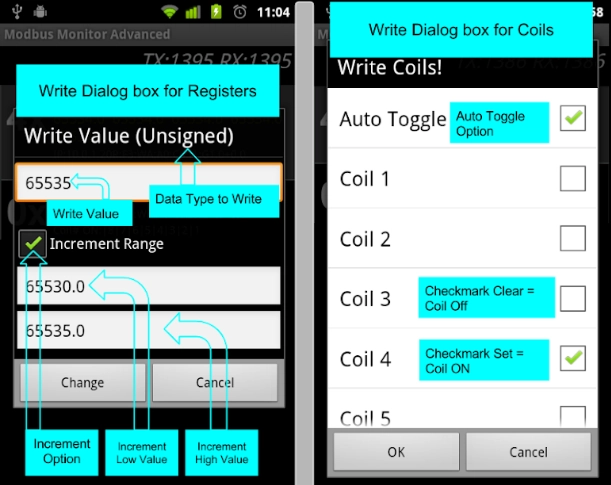{ width="500" }
  <figcaption>Figure 12: Sensor server setup showing Android sensor selection and automatic configuration</figcaption>
</figure>

**Sensor Server** is an innovative extension of the Modbus Server that exposes your Android device's built-in sensors through the Modbus TCP protocol.

### What is Sensor Server?

#### Core Concept
- **Hardware Integration**: Links Android sensors directly to Modbus registers  
- **No Programming Required**: Any Modbus TCP Master can access phone sensors
- **Automatic Configuration**: Sensor selection automatically configures register settings
- **Real-time Data**: Live sensor readings available via standard Modbus polling

#### Available Sensors
**Common Android Sensors**:
- **📱 Accelerometer**: Device motion and orientation
- **🧭 Gyroscope**: Angular velocity measurements  
- **🌟 Light Sensor**: Ambient light levels
- **🗓️ Orientation**: Device position in 3D space
- **🌡️ Temperature**: Ambient temperature (device-dependent)
- **📊 Barometer**: Atmospheric pressure
- **🧲 Magnetometer**: Magnetic field strength
- **📍 Proximity**: Object detection near device

### Configuring Sensor Server

<figure markdown>
  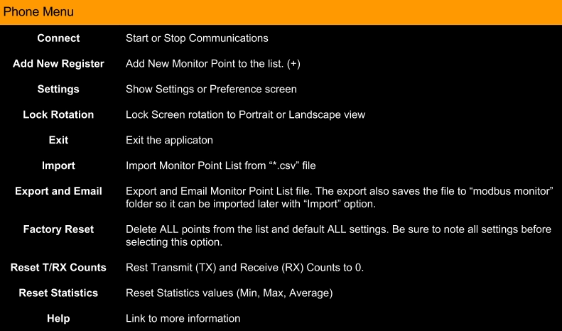{ width="600" }
  <figcaption>Figure 13: Automatic sensor information display showing specifications and real-time values</figcaption>
</figure>

#### Setup Process

1. **Enable Server Mode**: Turn on Modbus Server feature (required)
2. **Add Monitor Point**: Create new monitoring point
3. **Select Sensor**: Choose desired sensor from dropdown list
4. **Review Configuration**: Verify automatic settings
5. **Start Server**: Activate server to begin data collection

#### Automatic Configuration

**When you select a sensor, the app automatically**:
- **Updates Register Name**: Fills with comprehensive sensor specifications
- **Sets Count Field**: Configures to 6 words (3 floats × 2 words each)
- **Configures Protocol**: Sets to Modbus TCP
- **Sets Function Code**: Uses function 3 or 4
- **Sets Data Type**: Configures as Float

#### Sensor Information Display

**Register Name Format** (automatically generated):
```
Sensor #[number] [SensorName] 
Power:[value]mA Resolution:[value] 
Range:[value] Vendor:[name] Version:[number]
Raw Data: [0]xxx.xx [1]xxx.xx [2]xxx.xx
```

**Example Information**:
- **Sensor Number**: Internal Android sensor ID
- **Sensor Name**: Human-readable sensor type
- **Power Consumption**: Current draw in milliamps
- **Resolution**: Measurement precision
- **Maximum Range**: Sensor measurement limits
- **Vendor**: Sensor manufacturer
- **Version**: Hardware/driver version
- **Raw Data**: Live 3-axis readings in real-time

### Required Sensor Server Configuration

#### Mandatory Settings
```yaml
Sensor Server Requirements:
  Sensor Selection: [Choose from dropdown]
  Address: 0 (or any unused address)
  Count: 6 (minimum for 3 float values)
  Protocol: Modbus TCP
  Data Type: Float  
  Function: 3 or 4
```

!!! warning "Configuration Requirements"
    All fields above must be properly configured for Sensor Server to work correctly. The Count field must be minimum 6 words to accommodate the 3-axis float data.

### Understanding Sensor Data

#### Data Format
**3-Axis Readings**: Most sensors provide data in 3-dimensional arrays
- **[0] X-Axis**: First dimensional reading
- **[1] Y-Axis**: Second dimensional reading  
- **[2] Z-Axis**: Third dimensional reading

#### Data Interpretation
**Accelerometer Example**:
- **X-Axis**: Lateral acceleration (left/right)
- **Y-Axis**: Longitudinal acceleration (forward/back)
- **Z-Axis**: Vertical acceleration (up/down)
- **Units**: Typically m/s² (meters per second squared)

**Reference Documentation**: 
- 📖 [Android Sensor Developer Guide](https://developer.android.com/guide/topics/sensors/sensors_overview.html)
- 📋 Manufacturer sensor datasheets for specific interpretations

### Practical Applications

#### Industrial IoT Integration
- **Environmental Monitoring**: Use phone as environmental sensor station
- **Vibration Analysis**: Monitor equipment vibration via accelerometer
- **Light Control Systems**: Automatic lighting based on ambient conditions
- **Security Systems**: Motion detection and proximity alerts

#### Research and Development
- **Data Collection**: Gather sensor data for analysis projects  
- **Prototype Testing**: Quick sensor integration without custom programming
- **Educational Demonstrations**: Teach industrial protocols and sensor integration
- **Mobile Sensor Networks**: Deploy phones as distributed sensor nodes

## Professional Use Cases

### Field Service Applications
- **Equipment Diagnostics**: Quick troubleshooting of industrial devices
- **Configuration Backup**: Save and restore device settings
- **Performance Monitoring**: Track system performance over time
- **Communication Testing**: Verify network connectivity and protocols

### System Integration
- **Device Commissioning**: Validate new installations
- **Network Mapping**: Document system architectures
- **Protocol Verification**: Test custom implementations
- **Performance Optimization**: Identify communication bottlenecks

### Research & Development
- **Protocol Analysis**: Reverse engineer device communications
- **Custom Development**: Test new device implementations  
- **Educational Demos**: Teach Modbus fundamentals
- **Communication Studies**: Analyze traffic patterns

## Advanced Configuration Examples

### TCP/IP Network Setup
```yaml
Device Configuration:
  Channel: TCP/IP
  Protocol: Modbus TCP
  IP Address: 192.168.1.100
  Port: 502
  Slave ID: 1
  Address: 400001 (holding register 1)
  Count: 1
  Data Type: 16-bit Integer
```

### Serial/USB Configuration
```yaml
Serial Connection:
  Channel: Serial
  Protocol: Modbus RTU
  Baud Rate: 9600
  Data Bits: 8
  Parity: None
  Stop Bits: 1
  Slave ID: 1
  Address: 300001 (input register 1)
  Count: 2 (for 32-bit float)
```

### Multi-Device Monitoring
```yaml
Device 1 - PLC:
  TCP/IP → 192.168.1.10:502
Device 2 - HMI:  
  TCP/IP → 192.168.1.20:503
Device 3 - Sensor:
  Serial → USB-OTG @ 19200 baud
```

## Hardware Requirements

### Mobile Device Specifications
- **Android OS**: 8.0 (API 26) or higher
- **RAM**: 2GB minimum, 4GB recommended
- **Storage**: 100MB available space
- **Network**: Wi-Fi, 4G/5G for TCP/IP communication
- **USB**: OTG support for serial connections

### Serial Communication Hardware
- **USB-OTG Adapter**: For connecting serial devices
- **USB-to-RS485 Converter**: For industrial networks
- **Proper Grounding**: Essential for reliable communication
- **Quality Cables**: Use shielded cables in industrial environments

## Hardware & Cloud Integration

### USB Serial Requirements
**Recommended Chipsets**: FTDI FT232/FT4232, Prolific PL2303, Silicon Labs CP210x, CH340/CH341
**Hardware**: USB-OTG adapter, USB-to-RS485 converter for industrial networks

### Cloud Platform Add-ons
- **📊 Google Sheets** - Real-time data publishing and automated reports
- **☁️ ThingSpeak** - IoT dashboards, API access, alerts and triggers  
- **📡 MQTT** - Industrial IoT integration with AWS, Azure, Google Cloud

## Troubleshooting

### Common Issues

**Communication Problems**:
- **"?????" Values** - Unable to collect data from remote servers
  - Check IP address, port, and protocol settings
  - Verify network connectivity and device accessibility
  - Confirm correct Channel/Protocol combinations
- **Protocol Errors** - Ensure correct Channel/Protocol combinations (see compatibility table in Client Mode section)
- **Timeouts** - Increase timeout values in Settings → Timing

**Hardware Issues**:
- **USB Issues** - Verify OTG adapter compatibility and USB permissions
  - Ensure Android device supports USB-OTG
  - Check that USB serial adapter uses supported chipset (FTDI, Prolific, etc.)
  - Grant USB permissions when prompted
- **Bluetooth Connection** - Verify Bluetooth pairing and permissions
- **Network Connection** - Check Wi-Fi/Ethernet connectivity for TCP/IP mode

**Configuration Issues**:
- **Invalid Addresses** - Use 6-digit Modbus Protocol format, not PLC addressing
- **Wrong Register Count** - Set correct count for data type (1 for integers, 2 for floats)
- **Write Failures** - Enable write permissions for each monitor point (disabled by default)

### Diagnostic Steps
1. **Check Connection Status** - Monitor connection indicators on main interface
2. **Review Packet Counters** - Good/Bad packet statistics show communication health
3. **Verify Settings** - Double-check all configuration parameters
4. **Test Simple Configuration** - Start with basic TCP/IP connection before advanced setups
5. **Check Error Codes** - Reference [Error Codes Page](https://quantumbitsolutions.com/errors/)

### Support Resources
- 📧 **Email**: support@quantumbitsolutions.com
- 📖 **Documentation**: [quantumbitsolutions.com/help](https://quantumbitsolutions.com/help/)
- � **Forum**: [Expert community](https://quantumbitsolutions.com/forums/)

## Get Started Today

[:material-google-play: Download from Google Play Store](https://play.google.com/store/apps/details?id=com.Bhavan.Galex){ .md-button .md-button--primary }

**Professional Modbus monitoring** with unlimited monitor points, cloud integration, and priority support.

---

**Ready for serious industrial communication work on Android devices.**
