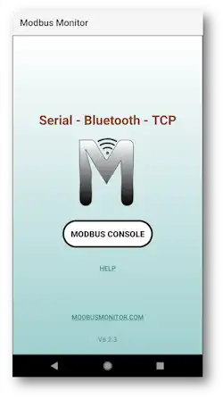
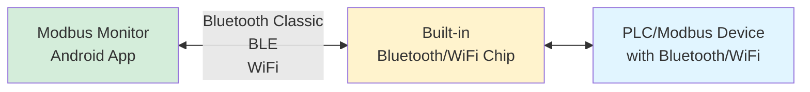
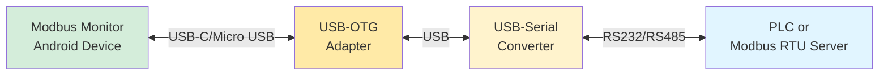

# Modbus Monitor - Modbus Console

**Mobile Modbus monitoring for field technicians and engineers**

!!! info "Free Version"
    Modbus Console is the free version of Modbus Monitor for Android devices. For advanced features, see the [Advanced Guide](advanced-guide.md).

<figure markdown style="text-align: center;">
{ .center loading="lazy" width="300" }
<figcaption>Modbus Monitor Android App</figcaption>
</figure>
## Overview

The free Modbus Monitor Android app provides essential Modbus monitoring capabilities on mobile devices.

**Perfect for:**

- **Field technicians** doing quick device checks
- **Students** learning Modbus protocols  
- **Automation engineers** troubleshooting systems
- **Basic industrial monitoring** and diagnostics

## Features

**Core Capabilities:**

- **Modbus TCP** - Network connections (WiFi/Ethernet) using Modbus/TCP protocol
- **Bluetooth & BLE** - Wireless connections using Modbus RTU protocol  
- **USB Serial** - Direct cable connections using Modbus RTU protocol
- **6-digit addressing scheme** - Industry standard format
- **Read/write operations** - Single and multiple registers


### Connection Diagrams

#### Wireless Connections (Bluetooth/WiFi)



#### Serial Connections (RS232/RS485)




!!! tip "Need More Protocol Combinations?"
    Looking for additional protocol combinations like **Modbus RTU over TCP** or **Modbus ASCII over TCP**? Check out the [**Modbus Monitor Advanced**](advanced-guide.md) version for enhanced protocol flexibility and professional features.

## Quick Start

### Step 1: Launch the Application

1. **Download** from Google Play Store
2. **Press "Modbus Console"** to begin
3. **Grant permissions** when prompted:

   **For Bluetooth connections:**

   - Android requires location permission (depending on OS version)
   - Allow Modbus Monitor to find, connect to, and determine relative position of nearby devices (click "Yes")
   - Skip Bluetooth permissions if only using TCP (click "No")

   **For USB Serial connections:**

   - Requires USB-to-Serial port via USB-OTG connection
   - "Open Modbus Monitor to handle FT232 USB UART?" (click "OK")
   - "Always open Modbus Monitor when FT232 USB UART is connected?" (click "OK")


### Step 2: Select Communication Channel

The app displays available communication channels in order:

1. **Modbus TCP** (always first) - For network connections
2. **Bluetooth Paired Devices** - Previously paired BT devices  
3. **Serial Devices** - Connected USB serial ports
4. **Bluetooth Classic** - Connect to Bluetooth SPP (Serial Port Profile) devices
5. **BLE Devices** - Bluetooth Low Energy devices

!!! note "Protocol Selection"
    - **Modbus TCP channel** -> Uses **Modbus TCP** protocol
    - **All other channels** -> Use **Modbus RTU** protocol

### Step 3: Configure Your Connection

Click the **three-dot menu** (...) in the top-right corner to configure:

#### For Modbus TCP:
- **IP Address** - Remote server IP address
- **Port** - Usually 502 (default Modbus port)
- **Station ID** - Device/slave address (usually 1)

#### For Serial Connections:
- **Baud Rate** - Communication speed (9600, 19200, etc.)
- **Data Bits** - Usually 8
- **Parity** - None, Even, or Odd
- **Stop Bits** - Usually 1

#### For Bluetooth Classic (SPP):

- **Pair device first** in Android Bluetooth settings
- Older Bluetooth SPP devices require pairing before use
- Once paired, select from "Bluetooth Paired Devices" list in app
- Configure serial parameters (baud rate, parity) in app settings

#### For BLE (Bluetooth Low Energy):
- **No pre-pairing required** - BLE devices can be discovered and connected directly
- Scan and connect directly from within Modbus Monitor app
- Select from "BLE Devices" list
- BLE offers easier setup for newer devices

## Understanding Modbus Addresses

The app uses the **6-digit addressing scheme** "Xnnnnnn":

- **First digit (X)** - Register type identifier (NOT function code)
- **5 digits (nnnnn)** - Register number (1-based addressing)

!!! warning "Common Confusion"
    The first digit is a **register type indicator**, not the Modbus function code. Many users confuse these concepts!

### Address Format Breakdown

**Example: 400001 breaks down as:**
- **4** = Register Type Indicator (Holding Register)  
- **00001** = Register Number (1)

```
[Type Prefix] [Register Number]
     4            00001
     |              |
Holding Register   Register #1
```

### Register Type Reference:

| Prefix | Register Type | Auto Function Code | Address Range | Access |
|--------|---------------|-------------------|---------------|--------|
| **0** | **Coils** | FC01 (Read) / FC05 (Write) | 000001-065536 | Read/Write |
| **1** | **Discrete Inputs** | FC02 (Read) | 100001-165536 | Read Only |
| **3** | **Input Registers** | FC04 (Read) | 300001-365536 | Read Only |
| **4** | **Holding Registers** | FC03 (Read) / FC06 (Write) | 400001-465536 | Read/Write |

### Common Address Examples:

| Address | Meaning | Use Case |
|---------|---------|----------|
| `400001` | 1st holding register | Temperature setpoint |
| `400025` | 25th holding register | Pressure control value |
| `300001` | 1st input register | Temperature sensor reading |
| `300010` | 10th input register | Flow rate measurement |
| `000001` | 1st coil | Motor start/stop control |
| `100001` | 1st discrete input | Emergency stop status |

!!! info "Complete Address Guide"
    **For detailed explanations, conversion from other tools, troubleshooting, and advanced topics:** 
    
    📖 **[6-Digit Addressing Scheme Guide](../../guides/6-digit-addressing.md)** - Complete reference with examples, device compatibility, and common mistakes to avoid
    
    **Additional Resources:**
    - [Modbus Monitor YouTube Channel](https://www.youtube.com/watch?v=eesPvKslLV8)
    - [Wikipedia Modbus Article](https://en.wikipedia.org/wiki/Modbus)

## Reading Data

### Single Register Read

1. **Enter 6-digit address** (e.g., `400001`)
2. **Click the arrow button** (→) 
3. **View results** - Data displays in integer format

Example: `400001` reads the first holding register

### Multiple Register Read

Use separators to read multiple consecutive registers:

| Separator | Example | Description |
|-----------|---------|-------------|
| `#` | `400001#5` | Read 5 registers starting at address 1 |
| `.` | `400001.5` | Read 5 registers starting at address 1 |
| `,` | `400001,5` | Read 5 registers starting at address 1 |

## Writing Data  

### Single Register Write

Use any of these separators between address and value:

| Separator | Example | Description |
|-----------|---------|-------------|
| `*` (Star) | `400001*995` | Write 995 to register 1 |
| `-` (Dash) | `400001-995` | Write 995 to register 1 |
| ` ` (Space) | `400001 995` | Write 995 to register 1 |

All examples above write the value **995** to holding register **1**.

## Troubleshooting

### Connection Issues

**Cannot connect to device:**
- Verify IP address and port settings
- Check network connectivity
- Ensure device supports Modbus TCP/RTU
- Confirm device is powered and accessible

**Bluetooth pairing problems:**
- Pair device in Android settings first
- Ensure device is in pairing mode
- Check Bluetooth is enabled on both devices

### Communication Errors

**No response from device:**
- Verify station/slave ID is correct
- Check communication parameters (baud rate, parity, etc.)
- Ensure correct protocol (TCP vs RTU)
- Test with known-good Modbus client

**Address errors:**
- Use 6-digit format (e.g., 400001, not 40001)
- Verify function code supports your operation
- Check device documentation for supported addresses

## Advanced Tips

### Efficient Monitoring
- **Use multiple reads** (`400001#10`) instead of single reads for efficiency
- **Monitor key registers** that indicate system status
- **Document working addresses** for future reference

### Best Practices
- **Start with simple reads** to verify communication
- **Test with manufacturer examples** when available  
- **Keep notes** of working configurations for different devices

## Getting the App

[:material-google-play: Download Free Version](https://play.google.com/store/apps/details?id=com.Bhavan.Hubble){ .md-button .md-button--primary }

## Upgrade Path

Ready for more features? The **Advanced Version** includes:

- Unlimited monitor points
- Serial/RTU support  
- Advanced data analysis
- Professional reporting
- Priority support

[:octicons-arrow-right-24: See Advanced Guide](advanced-guide.md)

## Support

- :material-cellphone: **App Store Reviews** - Rate and review on Google Play
- :material-web: **Community Forum** - Ask questions and share tips
- :material-email: **Basic Support** - Email support for critical issues

---

*This free version is perfect for getting started with mobile Modbus monitoring. Upgrade when you need advanced features for professional use.*