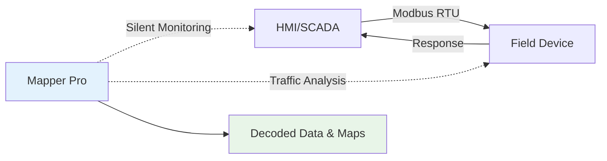

# Modbus Mapper Pro - User Manual

**Silently monitor and decode Modbus RTU traffic in real-world environments**

!!! info "Professional Network Analysis Tool"
    Modbus Mapper Pro is designed for system integrators, troubleshooters, and engineers who need to understand existing Modbus networks without disrupting operations.

## Overview

**Modbus Mapper Pro** silently "sniffs" Modbus RTU communications to help you:

- **Recover lost Modbus maps** from undocumented systems
- **Understand existing communications** between HMIs and devices
- **Troubleshoot network issues** without interrupting operations
- **Document legacy systems** for maintenance and upgrades
- **Validate new installations** against specifications

## Key Features

### Silent Traffic Analysis
- ✅ **Non-intrusive monitoring** - doesn't affect network traffic
- ✅ **Real-time decoding** of Modbus RTU frames
- ✅ **Automatic map building** from observed communications
- ✅ **Live data values** in multiple formats (Int, Float, String)
- ✅ **Traffic statistics** and communication patterns

### Professional Capabilities
- ✅ **Dual server support** - monitor two masters simultaneously
- ✅ **Frame-level analysis** - detailed protocol examination
- ✅ **Export capabilities** - save discoveries for documentation
- ✅ **Flexible licensing** - Full, Subscription, or Trial options
- ✅ **Enterprise deployment** ready

## How It Works

### The "Sniffing" Process

### What You See
1. **Live Communications** - Real-time frame capture and decoding
2. **Automatic Discovery** - Registers and coils found automatically  
3. **Data Interpretation** - Values shown in proper formats
4. **Network Mapping** - Communication patterns visualized
5. **Export Results** - Save discoveries as Modbus maps

## Use Cases

### System Recovery
**Problem:** "We lost the Modbus map for this 10-year-old system"
**Solution:** Connect Mapper Pro, let the HMI poll normally, recover the complete register map

### Troubleshooting
**Problem:** "The HMI shows wrong values but we don't know what it's requesting"  
**Solution:** Monitor the actual Modbus traffic to see what's being sent/received

### Documentation
**Problem:** "We need to document this legacy system before the upgrade"
**Solution:** Capture all communications over a period to build complete documentation

### Validation
**Problem:** "How do we verify the new system matches the old one?"
**Solution:** Compare traffic patterns and register usage between systems

## Getting Started

### System Requirements
- **Windows 10/11** (32-bit or 64-bit)
- **Serial port** or USB-to-RS485 adapter
- **Access to Modbus RTU network** (read-only connection)
- **No special software** on monitored devices required

### Quick Setup

=== "32-bit Version"

    **For older systems and embedded PCs:**
    
    [:material-download: Download 32-bit](https://quantumbitsolutions.com/download/ModbusMapperPro_x86.zip){ .md-button }

=== "64-bit Version"  

    **For modern Windows systems:**
    
    [:material-download: Download 64-bit](https://quantumbitsolutions.com/download/ModbusMapperPro_x64.zip){ .md-button }

=== "Microsoft Store"

    **For managed environments:**
    
    [:material-microsoft-windows: Get from Store](https://www.microsoft.com/store/apps/9P2BP76MNTXV){ .md-button }

### Installation Steps
1. **Download** appropriate version for your system
2. **Extract** files (portable - no installation needed)
3. **Connect** RS485 adapter to Modbus network
4. **Run** application and configure serial port
5. **Start monitoring** to capture traffic

## Advanced Features

### Dual Master Support
Monitor communications between **two separate masters** and one or more slaves:
- **Primary HMI** communications
- **Secondary system** (historian, backup HMI, etc.)
- **Separate analysis** for each master's traffic
- **Combined reporting** for complete system view

### Frame Analysis
**Detailed packet-level examination:**
- Raw hex frame display
- Function code identification
- Address and data decoding
- CRC validation results
- Timing analysis

### Data Format Detection
**Automatic recognition of data types:**
- 16-bit integers (signed/unsigned)
- 32-bit values with byte swapping
- Floating point numbers
- String data
- Bit fields and status registers

## Licensing Options

### Flexible Licensing Models

| License Type | Duration | Best For | Features |
|--------------|----------|----------|----------|
| **Full License** | Perpetual | Long-term use | All features, permanent |
| **Subscription** | Monthly/Annual | Project-based work | Lower upfront cost |
| **Trial** | Limited time | Evaluation | Full features for testing |

### Purchase Options
- [:material-cart: Full License](https://quantumbitsolutions.com/shop/modbus-mapper-pro/)
- [:material-refresh: Subscription](https://quantumbitsolutions.com/shop/modbus-mapper-pro-subscription/)  
- [:material-email: Enterprise Licensing](https://quantumbitsolutions.com/contact-us/)

## Troubleshooting

### Common Setup Issues

**No traffic detected:**
- Verify RS485 connections (A, B, and Ground)
- Check baud rate matches network settings
- Ensure adapter drivers are installed
- Confirm network is actually communicating

**Partial data capture:**
- Increase receive buffer size
- Check for high network traffic overwhelming adapter
- Verify cable quality and termination

**Decoding errors:**
- Confirm Modbus variant (RTU vs ASCII)
- Check for non-standard implementations
- Verify timing parameters

### Best Practices

**Hardware Setup:**
- Use **industrial-grade RS485 adapters** for reliability
- Ensure **proper termination** on network
- **Isolate monitoring connection** to prevent ground loops
- Use **twisted pair cable** for noise immunity

**Analysis Workflow:**
1. **Capture baseline** - Record normal operations
2. **Identify patterns** - Look for regular polling cycles  
3. **Document discoveries** - Export maps and analysis
4. **Validate findings** - Cross-reference with known data

## Support & Resources

### Getting Help
- 📧 **Direct Support** - Email assistance for licensed users
- 📖 **Documentation** - Comprehensive user guides  
- 🎥 **Video Tutorials** - Step-by-step demonstrations
- 💬 **Community Forum** - User discussions and tips

### Related Products
- 🖥️ **[Modbus Monitor XPF](../xpf/user-guide.md)** - Active monitoring and control
- 📱 **[Android Monitor](../android/advanced-guide.md)** - Mobile analysis tools
- ⚙️ **[Custom Solutions](../custom/overview.md)** - Tailored development

---

**Professional Modbus network analysis** - Mapper Pro provides the insights you need to understand, troubleshoot, and document existing Modbus systems.