```mermaid
graph TB
    subgraph M1["MODE 1: LISTEN ONLY 🔍"]
        direction LR
        
        C1["📱 Modbus<br/>Client"]
        S1["🖥️ Modbus<br/>Server"]
        TAP["📡 RS485<br/>Tap Point"]
        MP2["🔍 Mapper Pro<br/>Sniffer Only"]
        ANALYSIS["📊 Analyzer<br/>Decode + Logs"]

        C1 <-->|TX/RX| TAP
        TAP <-->|TX/RX| S1

        TAP -.-|Sniff Only| MP2
        MP2 -->|Captures| ANALYSIS
    end
```

```mermaid
graph TB
    subgraph M2["MODE 2: PASS-THROUGH🔄"]
        direction LR
        C2["📱 Modbus<br/>Client"]
        MP2["🔄 Mapper Pro<br/>Forwarding + Sniffing"]
        S2["🖥️ Modbus<br/>Server"]
        C2 <-->|TX/TX| MP2
        MP2 <-->|TX/RX| S2
        MP2 -.->|Captures| ANALYSIS["📊 Analyzes"]
    end
```

```mermaid
graph TB
    subgraph M3["MODE 3: MULTIPLEX 🔌"]
        direction LR
        CA["📱 Client A<br/>HMI"]
        CB["📊 Client B<br/>Historian"]
        MP3["🔌 Mapper Pro<br/>Intelligent Arbitration"]
        S3["🖥️ Modbus<br/>Server"]
        
        CA <-->|TX/RX| MP3
        CB <-->|TX/RX| MP3
        MP3 <-->|TX/RX| S3        
        
    end
```

!!! warning "📝 Document In Progress"
    This documentation is currently under construction. Content, examples, and diagrams are being updated and refined. Check back soon for the complete guide.

# Modbus Mapper Pro - User Manual

**Revolutionize Modbus Monitoring: See, Decode, and Analyze Like Never Before**
{ .screenshot-center loading="lazy" }


## Overview

**Modbus Mapper Pro** is software designed to help you understand, monitor, and troubleshoot Modbus devices **without interrupting your existing system**.

It excels at **real-time data monitoring, transparent Modbus RTU pass-through**, and **traffic sniffing**, giving you powerful tools to observe, analyze, and bridge Modbus communication live. The core architecture combines **transparent forwarding + protocol sniffing**, allowing you to:

- Sniff traffic (ideal for RS485)
- Use RS232 pass-through mode
- Multiplex RS232 or RS485 lines so multiple systems can share a single Modbus device — without special hardware

Think of it like this: your devices are already talking over RS485 cables. **Modbus Mapper Pro lets you watch, forward, or share that communication safely**.

**Three Operating Modes:**

1. **Mode 1: Listen Only** — Passively tap into RS485 networks to discover registers and analyze traffic without any risk to your system.

2. **Mode 2: Pass-Through** — Act as a transparent bridge between master and slave, forwarding all traffic while capturing every frame for debugging.

3. **Mode 3: Multiplex** — Allow multiple masters to share a single slave device safely using intelligent software-based arbitration.

**What You Get:**

- Automatic discovery of all registers being used
- Clear, human-readable values instead of raw hex
- Real-time charts, logs, and decoded Modbus frames
- Easy export for documentation and analysis
- Portable, No installation required — just run the application

!!! info "Professional Modbus RTU Analysis Tool"

    **Modbus Mapper Pro** is a powerful application built to simplify and solve the most challenging aspects of Modbus RTU communication. It is designed for system integrators, troubleshooters, automation engineers, and OEMs who need to understand, monitor, and optimize Modbus networks **without interrupting existing operations.**

## Understanding the User Interface

{ .screenshot-center loading="lazy" }

Before you start, let's get familiar with the application layout. These are the key components you'll see:


| # | Component | Purpose |
|---|-----------|---------|
| 1 | **Communications** | Configure COM port, baud rate, and connection settings for your RS485 adapter |
| 2 | **Client Request Viewer** | Real-time log showing all Modbus requests being sent to your device |
| 3 | **Live Modbus Map** | Table view of discovered registers with live values updating in real-time |
| 4 | **Traffic Log** | Raw Modbus message exchanges with timestamps for debugging and analysis |
| 5 | **Licensing** | Activate your license key when first launching (appears as modal dialog if needed) |
| 6 | **Settings & Help** | Access documentation, preferences, advanced options, and timeouts |
| 7 | **Server Port** | RS485 connection for Listen-Only (Mode 1), Pass-Through (Mode 2), or Multiplex (Mode 3) |
| 8 | **Client 1 Port** | First Modbus client connection for Pass-Through (Mode 2) or Multiplex (Mode 3) modes |
| 9 | **Client 2 Port** | Second Modbus client connection for Multiplex (Mode 3) mode only |
| 10 | **Control Panel** | LED status indicators and Start/Stop buttons for operations |
| 11 | **Mode Button** | Toggle between Listen Only (On for Mode 1), Pass-Through (Off for Mode 2), and Multiplex operating modes (Off for Mode 3) |

**Pro Tip:** Spend a minute familiarizing yourself with these components now. You'll refer back to them as we work through the steps below.

---

## Operating Modes: Complete Guide

This section covers everything you need to know about Modbus Mapper Pro's three operating modes—from quick visual overviews to detailed technical explanations.

!!! tip "Choose the Right Mode for Your Needs"
    **Mode 1** is 100% safe for any environment. **Modes 2 & 3** require brief network reconfiguration—just test first like you would with any network change.

---

### Quick Mode Comparison

**Not sure which mode to choose?** This table shows the key differences at a glance:

| Mode | Name | What It Does | Works With | Best For |
|------|------|--------------|------------|----------|
| 🔍 **Mode 1** | Listen Only | Watch traffic without touching anything | **RS485 only** (non-intrusive tap) | Learning, troubleshooting, discovery |
| 🔄 **Mode 2** | Pass-Through | Forward traffic while monitoring | RS232 or RS485 | Debugging, integration testing |
| 🔌 **Mode 3** | Multiplex | Share one device with multiple systems | RS232 or RS485 | Multi-master setups, cost savings |

**Technical Details:**

| Aspect | Mode 1 | Mode 2 | Mode 3 |
|--------|--------|--------|--------|
| **Connection Type** | Non-invasive tap on RS485 | Direct pass-through | Multi-client arbitration |
| **Data Flow** | Passive sniffing | Active forwarding | Intelligent routing |
| **Sniffing** | ✅ Always active | ✅ Captures traffic | ✅ Optional logging |
| **Network Impact** | Zero (100% passive) | Zero latency | Conflict-free routing |

!!! tip "Start Here"
    **New to Modbus?** Start with **Mode 1 (Listen Only)** — the safest option for RS485 networks. Just tap in, watch, and learn — you can't break anything!

!!! info "RS485 vs RS232"
    - **Mode 1** requires **RS485** for non-intrusive monitoring (tapping into existing network)
    - **Mode 2 & 3** work with both **RS232** and **RS485** (requires reconfiguring connections)

!!! success "🤖 AI Expert Advice: Which Mode Should You Use?"
    
    **Start with Mode 1 if:**
    - You're new to Modbus or this tool
    - You have an RS485 network already running
    - You don't want to risk disrupting anything
    - You need to discover what registers are being used
    - You're troubleshooting or learning a system
    
    **Use Mode 2 when:**
    - You're integrating new equipment and need visibility
    - You need to debug communication between specific devices
    - You can afford a brief disconnection to reconfigure
    - You want detailed frame-level analysis during active operation
    - You're commissioning or validating new installations
    
    **Choose Mode 3 when:**
    - You have multiple masters that need to access one slave
    - You want to avoid buying expensive hardware multiplexers ($200-500)
    - You need HMI + SCADA/Historian both connected
    - You're adding monitoring to a production system
    - You need backup master systems for redundancy
    
    **Golden Rule:** If unsure, start with **Mode 1**. It's risk-free, takes 2 minutes to set up, and gives you instant visibility into your network. You can always switch modes later once you understand your system better.

#### Comparison Table: All Three Modes

| Feature | Mode 1 (Listen Only) | Mode 2 (Pass-Through) | Mode 3 (Multiplex) |
|---------|---|---|---|
| **Adapters needed** | 1 (tap) | 2 (input/output) | 2+ (inputs/output) |
| **Master/Slave change** | No | Reconfigure | Reconfigure |
| **Forwarding** | No | Yes | Yes |
| **Sniffing** | Yes | Yes | Optional |
| **Best for** | Analysis | Integration+Monitoring | Multi-Master |
| **Setup time** | Minutes | Hours | Hours |
| **Risk level** | Very Low | Low | Low |

---

### MODE 1: LISTEN ONLY 🔍 (Non-Intrusive Sniffing)

**The passive observer** — Modbus Mapper Pro connects to your RS485 network as a non-invasive tap

#### Visual Overview



!!! tip "Mode 1: The Safest Choice"
    Mode 1 is the **safest** and most non-intrusive way to analyze live Modbus traffic. It never transmits—only listens passively to existing RS-485 communication. **Safe for production environments.**

#### How It Works

```
Master ⇄ Slave  
  ↑      ↑
  └──────┘
     ↓
Modbus Mapper Pro (RS485 adapter)
  ↓
Sniffs & analyzes all traffic
No frames transmitted
Builds live Modbus map
```

**Process:**

1. Connect RS485 adapter to the existing two-wire Modbus network
2. Application captures all frames from the bus
3. Frames are decoded and analyzed in real-time
4. Complete Modbus map is built automatically
5. No interruption to active master/slave communication

**When to Use:**

- ✅ Troubleshooting existing systems without changes
- ✅ Reverse-engineering devices with unknown register maps
- ✅ Production monitoring (zero risk, 100% passive)
- ✅ System documentation and performance analysis
- ✅ Legacy system analysis before upgrades

#### Real-World Example

**Scenario:** Your facility has an old Modbus device with no documentation, connected to an HMI.

**Solution:**

1. Tap RS485 adapter into the existing two-wire network
2. Launch Modbus Mapper Pro in Mode 1
3. Watch the HMI communicate with the device
4. Mapper Pro automatically discovers all registers and data types
5. Export the discovered map for documentation and use in other tools

**Result:** Complete register map within seconds, zero disruption, device continues operating normally.

---

### MODE 2: PASS-THROUGH 🔄 (Transparent Bridge + Sniffer)

**The transparent bridge** — Modbus Mapper Pro sits between Client and Server, forwarding all traffic while simultaneously capturing and analyzing

#### Visual Overview



!!! tip "Mode 2: Wire-Level Visibility"
    Acts as a transparent bridge with zero latency. **Requires network reconfiguration**—test thoroughly before production use.

#### How It Works

```
Client (Master) ──→ Modbus Mapper Pro ──→ Server (Slave)
                    (transparent forwarding)
                    (simultaneous sniffing)
                            ↓
                    Logs all traffic
                    Decodes all frames
                    Builds live Modbus map
```

**Process:**

1. Configure Mapper Pro as intermediate device between Client and Server
2. Client connects to Mapper Pro's input port
3. Server connects to Mapper Pro's output port
4. All frames are forwarded transparently (no modification)
5. Simultaneously, all traffic is captured, decoded, and analyzed
6. Live Modbus map builds as communication occurs

**Traffic Flow:**

- Client request → Mapper Pro → Server (transparent forwarding)
- Server response → Mapper Pro → Client (zero latency)
- All frames captured and decoded in real time

**When to Use:**

- ✅ System debugging during active integration
- ✅ Live monitoring of Client-Server communication
- ✅ Integration testing with existing devices
- ✅ Protocol validation and compliance checking
- ⚠️ **Requires brief network reconfiguration**

#### Real-World Example

**Scenario:** You're integrating a new HMI with an existing Modbus device, but communication seems unreliable.

**Solution:**

1. Install Mapper Pro between HMI and device in pass-through mode
2. HMI connects to Mapper Pro; Mapper Pro connects to device
3. System operates normally while Mapper Pro captures all traffic
4. View frame-by-frame communication in real-time
5. Identify CRC errors, timing issues, or data mismatches

**Result:** Complete visibility into communication, both devices work normally, issues identified and resolved without disruption.

---

### MODE 3: MULTIPLEX 🔌 (Two Masters → One Server)

**The intelligent multiplexer** — Multiple Masters (Clients) share a single Slave (Server) through Modbus Mapper Pro

#### Visual Overview



!!! tip "Mode 3: Multi-Master Made Easy"
    Enables multiple masters to share one slave via intelligent arbitration. **Requires network reconfiguration**—thoroughly test with non-critical devices before production deployment.

#### How It Works

```
Client A ──┐
           ├─→ Modbus Mapper Pro ──→ Server (Slave)
Client B ──┘   (intelligent arbitration)
             (optional sniffing)
             (timestamp & log all traffic)
```

**Process:**

1. Configure multiple Clients to connect to Mapper Pro
2. Mapper Pro connects to the single Slave device
3. Mapper Pro intelligently handles Modbus RTU protocol arbitration
4. Prevents collisions by sequencing requests from multiple Masters
5. Optionally captures and logs all traffic for analysis
6. All communication flows transparently to the Slave

**Why This Matters:**

- Traditional Modbus RTU allows only ONE Master per Slave
- Multiple Masters cause bus collisions and failures
- Hardware multiplexers cost $200-500+
- Software arbitration provides collision-free sharing at no extra hardware cost

**When to Use:**

- ✅ Development: Multiple test systems accessing one device
- ✅ HMI + SCADA/Historian both need device access
- ✅ System migration: Old and new systems coexist
- ✅ Cost savings: Avoid expensive hardware multiplexers
- ⚠️ **Thoroughly test before production deployment**

#### Real-World Example

**Scenario:** Your facility has one critical Modbus device, but both the production HMI and the data historian need access. No hardware multiplexer available.

**Solution:**

1. Install Mapper Pro with multiple client connections enabled
2. Production HMI connects to Mapper Pro input 1
3. Data historian connects to Mapper Pro input 2
4. Single Slave device connects to Mapper Pro output
5. Mapper Pro automatically arbitrates requests from both systems
6. Optional: Enable sniffing to log all traffic for compliance

**Result:** Two independent systems safely sharing one Modbus device, no collisions, reduced costs, complete visibility if needed.

---

## Quick Start Guide

!!! tip "Quick Reference"
    Want to get started fast? See our **[Quick Start Guide](quick-start.md)** for step-by-step setup instructions.

For quick reference, here's the essential getting started information:

--8<-- "products/mapper/quick-start.md:18:230"

---

## How Modbus Mapper Pro Works

### The "Sniffing" Process


### Real-Time Discovery

When you start Modbus Mapper Pro in Listen Only mode:

1. **Frame Capture** - All Modbus RTU frames are captured from the RS485 bus
2. **Frame Decoding** - Frames are decoded to extract function codes, addresses, and data
3. **Pattern Recognition** - Unique requests are identified and catalogued
4. **Data Type Inference** - System infers data types based on register patterns
5. **Map Construction** - Complete Modbus map is automatically built
6. **Live Display** - Data is shown in Excel-like grid with real-time updates

### Automatic Data Format Detection

The application intelligently recognizes common data types:

| Register Count | Detected Type | Example |
|---|---|---|
| 1 | 16-bit Integer | Temperature: 2345 → 23.45°C |
| 2 | 32-bit Float | Pressure: 101325 Pa |
| 2 | 32-bit Integer | Large counter values |
| 4+ | String | Device names, status text |
| Variable | Bit fields | Status flags, alarms |

### What Happens When You Start

Within **seconds** of pressing Start:

✅ **Modbus traffic detected** - Frames are captured from the RS485 bus  
✅ **Automatic decoding** - Raw frames translated to readable values  
✅ **182+ unique requests** typically discovered (varies by network activity)  
✅ **Complete register map** automatically built without manual entry  
✅ **Live data values** displayed with proper formatting  
✅ **Communication patterns** visualized and analyzed  
✅ **Zero disruption** to existing operations  

## Key Features

### 1. See Your Data in Real Numbers
Instead of confusing hex codes, see actual values (temperature: 23.5°C, pressure: 101 kPa)

- Automatically figures out what type of data each register holds
- Shows values in familiar formats (integers, decimals, text)
- Build complete data maps within seconds
- Save it all for later use

### 2. Multiple Systems, One Device
Share a single Modbus device between different programs without expensive equipment

- No special hardware needed — just software
- Prevents conflicts automatically
- Perfect for old and new systems working together

### 3. See Everything That's Happening
Watch communication in real-time as it happens

- See every message sent and received
- Watch timing and response patterns
- Spot problems as they occur
- Record everything for analysis

### 4. Find Missing Information
Discover registers and settings from devices without manuals

- Automatically maps out all devices talking on the network
- Shows register addresses and data types
- Builds documentation automatically
- No guessing needed

### 5. Customize Your View
Make data display the way you want it

- Change number formats (whole numbers, decimals, hex)
- Add labels to registers (e.g., "Temperature" instead of "Register 100")
- Adjust values for different units
- Create views for your specific needs

### 6. Complete Record of Everything
Keep detailed logs of all communication

- Every message in and out
- Timestamps for when things happened
- Raw data plus decoded meaning
- Search and analyze later

### 7. Simple to Use
Built for people, not just engineers

- Clean, familiar Excel-like grid
- One-click operations
- Helpful tips and guides
- No complicated setup

### 8. Works Anywhere
Use it how you want

- Portable — run from USB or anywhere
- Or install from Microsoft Store
- Windows 10/11
- Minutes to get started
---


### What You See
1. **Live Communications** - Real-time frame capture and decoding
2. **Automatic Discovery** - Registers and coils found automatically  
3. **Data Interpretation** - Values shown in proper formats
4. **Network Mapping** - Communication patterns visualized
5. **Export Results** - Save discoveries as Modbus maps

## Use Cases

### Industrial Automation
Monitor, diagnose, and optimize Modbus devices on factory floors or in distributed control systems. Identify bottlenecks, validate device behavior, and ensure optimal performance.

### SCADA Development
Streamline the integration and testing of Modbus networks in SCADA applications. Verify communication chains and validate data flows during development and deployment.

### Protocol Testing
Validate and troubleshoot communication between Modbus Clients and Servers with ease. Ensure compliance with Modbus specifications and identify non-standard implementations.

### System Optimization
Analyze traffic patterns to identify inefficiencies and improve performance in Modbus networks. Optimize polling rates, reduce latency, and maximize throughput.

### Legacy System Recovery
Recover documentation and Modbus maps from undocumented or legacy systems. Perfect for system upgrades, migrations, and knowledge transfer.

### Network Troubleshooting
Debug communication issues without disrupting live operations. See exactly what's being sent and received between devices.

---

## Key Capabilities

### Real-Time Monitoring
- Monitor unique Modbus requests within seconds
- Watch live data refresh as devices communicate
- Analyze communication patterns instantly
- No configuration delays or complex setup

### Automatic Discovery
- **Identifies all active Modbus communications** automatically
- **Learns register maps** from live traffic
- **Infers data types** from register patterns
- **Eliminates manual documentation** of registers

### Advanced Customization
- Fine-tune data interpretation per register
- Apply byte swapping for big-endian/little-endian conversion
- Scale values with gain/offset calculations
- Override auto-detected data types when needed

### Professional-Grade Analysis
- Frame-level protocol examination
- CRC validation and error checking
- Performance metrics and statistics
- Export capabilities for further analysis

### Dual Master Support (Multi-Master Communication)

Monitor communications between **two separate masters** and one or more slaves seamlessly:

**Traditional Modbus RTU Limitation:**
- Standard Modbus RTU allows only **one Master** to communicate with Slaves
- Multiple Masters cause **collisions and errors**
- Requires dedicated hardware or complex switches

**Modbus Mapper Pro Solution:**
- **Enable simultaneous communication** between multiple Masters and Slaves
- **Automatic conflict-free routing** of messages
- **No additional hardware** required
- **Real-time coordination** between clients

**Use Cases:**
- Primary HMI + Secondary monitoring system
- SCADA + Historian systems
- Backup system failover without reconfiguration
- Device testing with multiple controllers

### Frame Analysis

**Detailed packet-level examination capabilities:**

- **Raw hex frame display** - View every byte transmitted
- **Function code identification** - Recognize Modbus operation types (03, 04, 16, etc.)
- **Address and data decoding** - Extract meaningful information
- **CRC validation results** - Verify data integrity
- **Timing analysis** - Measure request/response delays and cycle times
- **Error tracking** - Identify corrupted frames and communication issues

### Data Format Detection

**Automatic recognition of data types with manual override capability:**

- **16-bit integers** (signed/unsigned) - Single register values
- **32-bit values** with byte swapping - Dual register combinations
- **Floating point numbers** - IEEE 754 standard formats
- **String data** - Multiple register sequences
- **Bit fields and status registers** - Individual bit interpretation
- **Custom formats** - User-definable data type mappings

## Licensing Options

### Flexible Licensing Models

| License Type | Duration | Best For | Features |
|--------------|----------|----------|----------|
| **Full License** | Perpetual | Long-term use | All features, permanent |
| **Subscription** | Monthly/Annual | Project-based work | Lower upfront cost |
| **Trial** | Limited time | Evaluation | Full features for testing |

### Purchase Options
- [:material-cart: Full License](https://quantumbitsolutions.com/shop/modbus-mapper-pro/)
- [:material-refresh: Subscription](https://quantumbitsolutions.com/shop/modbus-mapper-pro-subscription/)  
- [:material-email: Enterprise Licensing](https://quantumbitsolutions.com/contact-us/)

## Troubleshooting

### Common Problems & Quick Fixes

#### "Nothing is showing up" — No Traffic Detected

**What's happening?** Mapper Pro isn't seeing devices talk.

**Check these things:**

1. **Cables connected?**
   - Are A, B, and GND wires plugged into your adapter? 
   - Did you plug the USB into your computer?
   
2. **Right speed (Baud Rate)?**
   - Ask your device manager or documentation what speed to use
   - Common: 9600, 19200, 38400
   - Wrong speed = no traffic
   
3. **Adapter drivers installed?**
   - Plug in your USB adapter
   - Check Device Manager (Windows)
   - If it shows "?" or error, install drivers from USB adapter manufacturer
   
4. **Network actually running?**
   - Are your devices powered on?
   - Is your HMI/master device actually communicating?

**Still stuck?** Try unplugging everything for 10 seconds and reconnect.

#### "I see some data but not all" — Partial Data Capture

**What's happening?** Mapper Pro is seeing traffic but seems to be missing some.

**Try these:**

1. **Is your network very busy?**
   - Lots of devices talking at once can overwhelm the adapter
   - This is actually normal for factory floors
   - Solution: Use a better USB adapter (look for "industrial-grade")
   
2. **Check your cable quality**
   - Old or damaged RS485 cables cause data loss
   - Try a different cable if possible
   
3. **Restart Mapper Pro**
   - Stop listening and start again
   - Sometimes a fresh start helps

#### "The data looks wrong" — Decoding Issues

**What's happening?** Data shows up but values look incorrect or strange.

**Try these:**

1. **Wrong Modbus type?**
   - Ask your device manager: Is it "Modbus RTU" or "Modbus ASCII"?
   - Mapper Pro assumes RTU — if it's ASCII, data will look wrong
   
2. **Non-standard setup?**
   - Some devices don't follow Modbus rules exactly
   - Contact your device manufacturer for documentation
   
3. **Check data type**
   - Temperature shows "4521" instead of "45.21"?
   - In Mapper Pro, change the data type from "Integer" to "Float"

### Tips for Success

**Before you start:**
- ✅ Write down the baud rate from your HMI documentation
- ✅ Make sure your USB adapter has drivers installed
- ✅ Power on all your Modbus devices
- ✅ Verify your devices are actually communicating (ask your operator)

**When capturing data:**
- ✅ Let it run for 30 seconds before assuming something's wrong
- ✅ Save your discoveries immediately (you might need them later)
- ✅ If you get lost, restart fresh — it usually helps

**If you need more help:**
- 📖 Check the documentation for your specific devices
- 📞 Contact Modbus Mapper Pro support
- 💬 Check if other users had similar issues

## Support & Resources

### Getting Help
- 📧 **Direct Support** - Email assistance for licensed users
- 📖 **Documentation** - Comprehensive user guides  
- 🎥 **Video Tutorials** - Step-by-step demonstrations
- 💬 **Community Forum** - User discussions and tips

### Related Products
- 🖥️ **[Modbus Monitor XPF](../xpf/user-guide.md)** - Active monitoring and control
- 📱 **[Android Monitor](../android/advanced-guide.md)** - Mobile analysis tools
- ⚙️ **[Custom Solutions](../custom/overview.md)** - Tailored development

---

**Professional Modbus network analysis** - Mapper Pro provides the insights you need to understand, troubleshoot, and document existing Modbus systems.

---

<small>**Important Notice:** Modbus Mapper Pro is designed for development, testing, troubleshooting, and system analysis. While Mode 1 (Listen Only) is non-intrusive and safe for any environment, Modes 2 and 3 require network reconfiguration and should be tested in lab environments before production deployment. Users are responsible for assessing suitability for their specific applications, particularly in critical infrastructure, safety systems, or environments where operations impact health, safety, or essential services. Always follow your organization's change management procedures and obtain proper authorization before modifying live production systems. **This software is provided "as-is" without warranty of any kind. The developer is not liable for any damages, losses, or claims arising from use of this software.** See the End User License Agreement (EULA) for complete terms and conditions.</small>