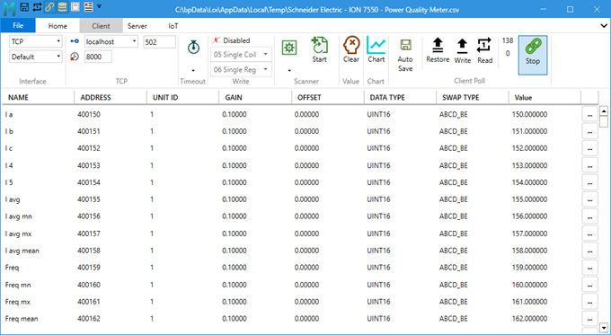
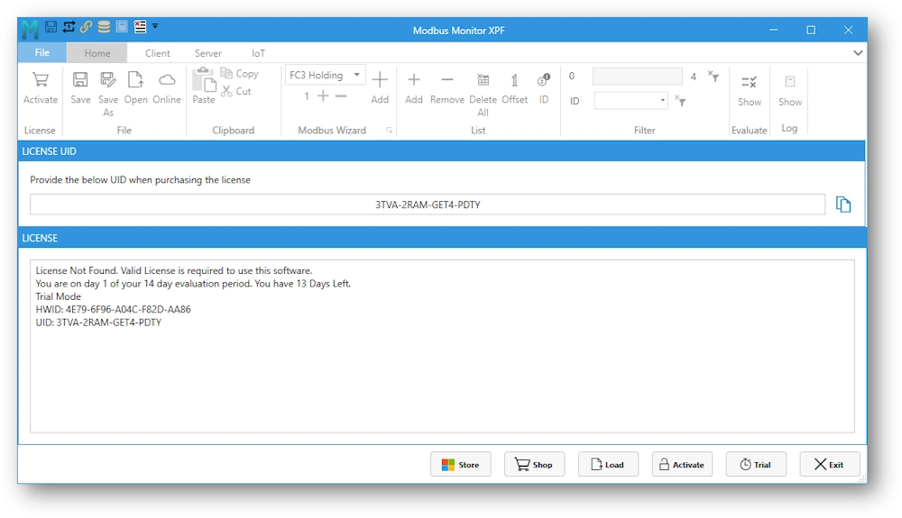
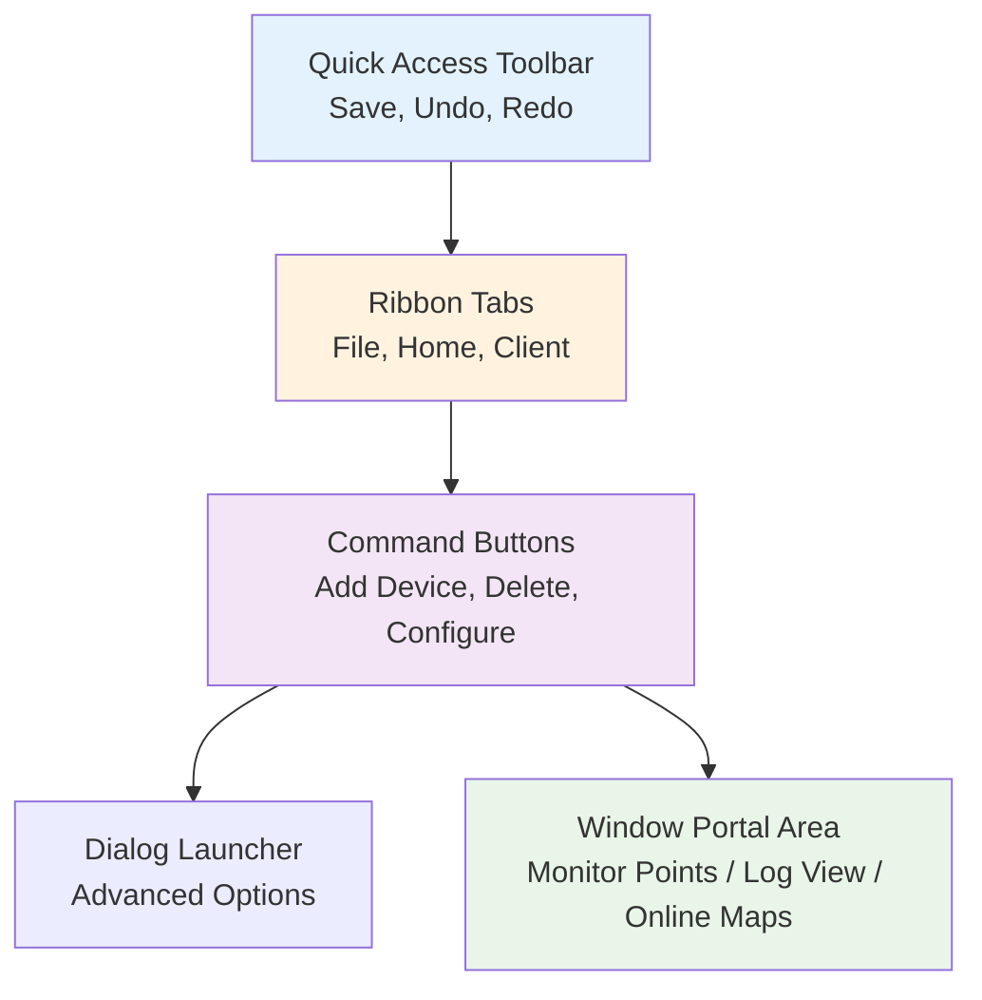
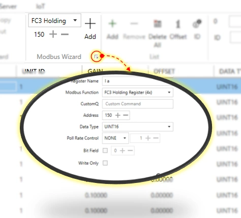
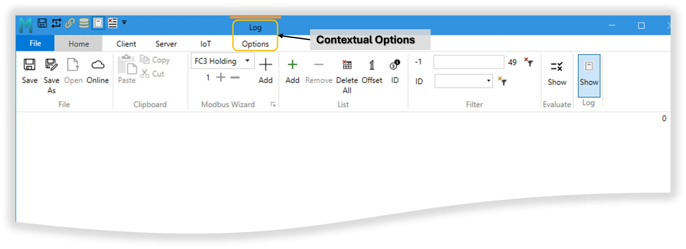
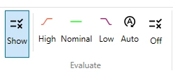
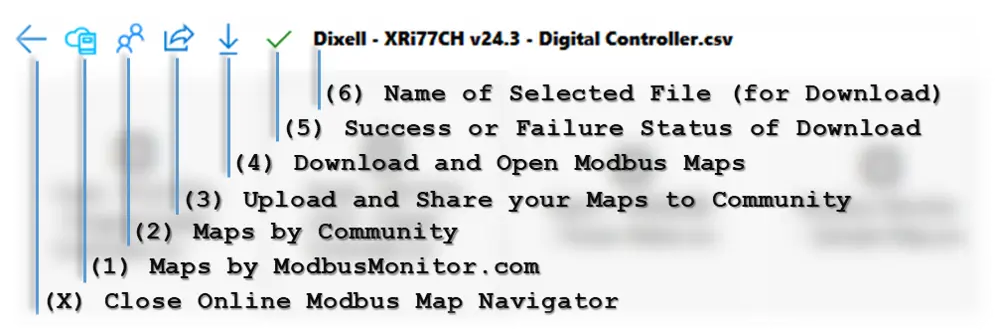
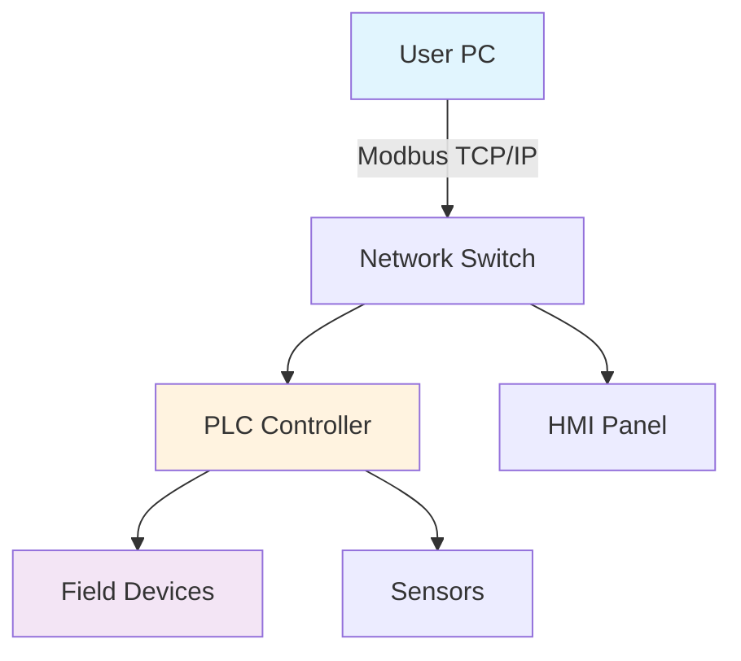

# Modbus Monitor XPF - User Guide

**A practical guide for controls engineers and technicians**

[TOC]

## 1. Introduction

**Modbus Monitor XPF** is a versatile Windows application for facilitating communication between a Windows-based PC and Modbus Client or Server devices. It handles both Client (Master) and Server (Slave) operations and supports all common Modbus variants: TCP/IP, Serial RTU, Serial ASCII, and RTU/ASCII over TCP.

{ .screenshot-shadow }

**One of the standout features** of Modbus Monitor XPF is its **dual functionality** - it encompasses both a Modbus Client and a Modbus Server **within a single application, running simultaneously**. This dual capability, combined with support for both Modbus Serial and Modbus TCP protocols, makes it an invaluable tool for various Modbus communication needs.

**What you can do with it:**

- Monitor live data from PLCs, drives, meters, and other Modbus devices
- Write values to registers and coils for testing or control
- Simulate Modbus devices for testing your own equipment
- Scan unknown devices to discover their register maps
- Log data for analysis and troubleshooting
- Validate register values against expected ranges
- **Run Client and Server modes simultaneously** on one PC

**Who this is for:**

- Controls engineers commissioning systems
- Maintenance technicians troubleshooting communications
- System integrators testing device compatibility  
- Equipment manufacturers validating Modbus implementations
- SCADA developers needing device simulation without physical hardware

### What Makes This Different

Most Modbus tools are either simple monitors or complex SCADA packages. XPF sits in the middle - it's powerful enough for serious work but simple enough to use quickly. The key advantages:

1. **Runs both Master and Slave simultaneously** - Test client-server interactions on one PC without physical devices
2. **Pre-built device maps** - Download factory-validated maps or community-contributed maps for common equipment
3. **Built-in data validation** - Automatic pass/fail testing with color coding
4. **Professional logging** - Proper timestamped records for troubleshooting
5. **Cross-platform protocol support** - Mix Modbus TCP, RTU, ASCII in the same session

### Learning Resources

Beyond this user guide, additional resources are available:

- 🎥 **[YouTube Tutorials](https://www.youtube.com/@ModbusMonitor/videos)** - Short demonstrations of features and workflows
- 📖 **[Online Help](https://quantumbitsolutions.com/xpf-help/)** - Comprehensive web-based documentation
- 💬 **[Community Forum](https://quantumbitsolutions.com/forums/)** - User discussions and troubleshooting help

## 2. Installation & Activation

### System Requirements

=== "Quick Reference"

    **Minimum Requirements:**
    
    - Windows 10 or 11 (64-bit recommended)
    - .NET Framework 4.8 or later
    - 4GB RAM minimum, 8GB recommended
    - 100-500 MB free disk space
    - Serial ports (USB-to-serial adapters work fine)
    - Network access for TCP/IP communications

=== "64-bit Version (Recommended)"

    | Component | Minimum | Recommended | Notes |
    |-----------|---------|-------------|--------|
    | **OS** | Windows 10 x64 | Windows 11 x64 | Most modern systems |
    | **RAM** | 4 GB | 8 GB+ | More memory = better performance |
    | **Storage** | 100 MB | 500 MB | Depends on log file size |
    | **.NET** | Framework 4.8+ | Latest Version | Usually pre-installed |
    | **Ports** | USB or Ethernet | Multiple adapters | For Modbus connections |

=== "32-bit Version"

    | Component | Minimum | Recommended | Notes |
    |-----------|---------|-------------|--------|
    | **OS** | Windows 10 x86 | Windows 11 x86 | Older or embedded systems |
    | **RAM** | 2 GB | 4 GB | 32-bit limit is ~3.5 GB total |
    | **Storage** | 100 MB | 200 MB | Smaller footprint |
    | **.NET** | Framework 4.8+ | Latest Version | Same as 64-bit |
    | **Ports** | USB or Ethernet | Multiple adapters | Full feature compatibility |

=== "Field Laptop Setup"

    **Recommended for field work:**
    
    - Rugged laptop with Windows 10/11
    - USB-to-serial adapter (FTDI chipset recommended)
    - Ethernet port for Modbus TCP
    - 8GB RAM for smooth operation
    - **Portable version** - No installation needed, runs from USB drive
    
    !!! tip "Field Technician Tip"
        Keep the portable version on a USB drive alongside your serial adapters. You can run it on any Windows machine without installation rights.

### Getting the Software

=== "Microsoft Store (Recommended)"

    **Install via Microsoft Store - Easiest Method**
    
    Search for "Modbus Monitor XPF" directly in the Microsoft Store on your Windows Desktop. Once installed, the application can be accessed from the Start Menu.
    
    **Benefits:**
    - **Automatic updates** and license management
    - **No admin rights** needed for installation
    - **Universal binary** - Works on both 32-bit and 64-bit Windows
    - **License per user** (not per machine) - follows your Microsoft Account
    - **Automatic cloud licensing** - Purchase and activate through Store
    
    [:material-microsoft-windows: Get from Microsoft Store](ms-windows-store://pdp/?productid=9PG862WL5HSM){ .md-button .md-button--primary }
    
    Or visit the web store: [Microsoft Store Product Page](https://www.microsoft.com/store/apps/9PG862WL5HSM)

=== "Direct Download from Web"

    **Install from the Web - Portable or Installer Options**
    
    Visit QuantumBitSolutions.com Download or Shop pages to download or purchase the application.
    
    **Portable Version:**
    - The software is a **portable version**, meaning it can be **run from any location without requiring installation**
    - **First launch note:** Slight delay is normal as the application unpacks files to a temporary location
    - Perfect for USB drives or systems without admin rights
    - Keep it with your field equipment for on-site troubleshooting
    
    **Choose your architecture and installation type:**

    | Architecture | Installer (Permanent Setup) | Portable (No Install) |
    |-------------|------------------------------|------------------------|
    | **64-bit** *(Recommended for modern systems)* | [:material-download: x64 Installer](https://quantumbitsolutions.com/download/ModbusMonitor_XPF_x64_Installer.zip){ .md-button } | [:material-download: x64 Portable](https://quantumbitsolutions.com/download/Modbus_Monitor_XPFx64.zip){ .md-button } |
    | **32-bit** *(Older systems only)* | [:material-download: x86 Installer](https://quantumbitsolutions.com/download/ModbusMonitor_XPF_x86_Installer.zip){ .md-button } | [:material-download: x86 Portable](https://quantumbitsolutions.com/download/Modbus_Monitor_XPFx86.zip){ .md-button } |

    **Additional Download Locations:**
    - [:material-download: Download Page](https://quantumbitsolutions.com/purchase/) - All versions available
    - [:material-cart: Shop Page](https://quantumbitsolutions.com/shop/) - Purchase with download links
    
    **What's the difference?**
    
    - **Installer:** Creates shortcuts, integrates with Windows, faster startup
    - **Portable:** No installation needed, run from USB drives, good for field work
    - **64-bit:** Works on modern Windows (2010+), handles large datasets better  
    - **32-bit:** Only needed for older Windows systems or embedded PCs

=== "Enterprise Purchase"

    **Volume licensing and site deployments**    
    - **Multiple machine licenses** available
    - **Offline licensing** for air-gapped networks
    - **Volume discounts** for large deployments
    - **Purchase orders** and invoice billing accepted
    
    [:material-email: Enterprise Sales](https://quantumbitsolutions.com/contact-us/){ .md-button }
    [:material-cart: Browse License Options](https://quantumbitsolutions.com/shop/){ .md-button }

!!! note "Which Version Should I Choose?"
    **Most users:** Choose the **64-bit version** - it works on modern Windows systems and handles large datasets better.
    
    **Use 32-bit version if:**
    - Running on older Windows systems (pre-2010)
    - Using embedded/industrial PCs with 32-bit OS
    - Company policy requires 32-bit applications
    
    **Installer vs Portable:**
    - **Installer:** Better for permanent desk setups, adds shortcuts and file associations
    - **Portable:** Better for field work, USB drives, or systems without admin rights

### License Activation

This section walks you through activating the license for your Modbus Monitor XPF software. The License window provides several buttons and fields to help you navigate the activation process.

**First Launch Experience:**

When you launch Modbus Monitor XPF for the first time, the **License window appears automatically**. This window displays:

- **UID (User Identification)** - Your unique identifier for license purchases
- **License Information Panel** - Shows current license status (Trial or Licensed)
- **Hardware ID (HWID)** - Used for certain license types
- **Licensing Buttons** - Store, Shop, Activate, Load, Trial, Exit

**Licensing Buttons Overview:**

| Button | Purpose | When to Use |
|--------|---------|-------------|
| **Store** | Microsoft Store purchase & activation | Purchase through Microsoft Store or activate Store license |
| **Shop** | Online shop page | Opens web browser to quantumbitsolutions.com/shop |
| **Activate** | Enter license key | After purchasing online key-based license |
| **Load** | Load license file | For `.lic` files (enterprise/offline licenses) |
| **Trial** | Start trial mode | Begin evaluation period with full features |
| **Exit** | Close license window | Exit the application |

!!! info "Trial Version - Full Featured Evaluation"
    **Free trial with ALL features unlocked** - No credit card required. Perfect for testing before purchase.
    
    **Starting Trial Mode:**
    1. Launch XPF for the first time
    2. License window appears automatically
    3. Click **"Trial"** button to begin evaluation period
    4. License Information Panel shows how many days are left in your evaluation period
    5. Start using the application immediately with limited functionality. Runtime and some features are restricted and requires full license.

**Main Steps to Activate the Software:**

1. **Purchase License** - Click "Store" or "Shop" button to visit licensing store and complete purchase
2. **Load or Enter Key** - After purchase, load license file (enterprise) or enter license key (online purchase)
3. **Verify Activation** - License Information Panel confirms activation status and trial mode is disabled

**Choose your activation method based on how you obtained the software:**

=== "Microsoft Store (Easiest)"

    **Automatic activation with Microsoft Account**
    
    The Microsoft Store version handles licensing automatically - no manual activation needed!
    
    **Purchase & Activation Flow:**
    
    1. **Open License Window**
       - Launch Modbus Monitor XPF
       - The license dialog appears automatically on first launch
       - Or go to **File Tab → About → Activate** button
    
    2. **Click "Store" Button**
       - Opens Microsoft Store purchase page
       - Your UID is automatically included in the purchase
    
    3. **Complete Purchase**
       - Sign in with your Microsoft Account
       - Complete payment in the Microsoft Store
       - Purchase is linked to your Microsoft Account
    
    4. **Activate License**
       - Return to XPF License window
       - **Click "Store" button again** to activate
       - System verifies purchase with Microsoft
       - Status changes to "Licensed" immediately
    
    **Benefits:**
    
    ✅ No manual license key entry required  
    ✅ Automatic renewal options available  
    ✅ License tied to Microsoft Account (not individual PC)  
    ✅ Easy reinstallation on any Windows device  
    ✅ Can be used on new computers with same Microsoft Account
    
    !!! tip "Multi-Computer Usage"
        Microsoft Store licenses follow your Microsoft Account. Install on multiple devices and sign in with the same account - the Store button activates on each installation automatically!
    
    !!! note "License Window Location"
        Access the license window through: **File Tab → About section → Activate button**
    
    <!-- Screenshot placeholder: xpf-store-activation.png -->
    <!-- Shows: License window with Store button highlighted, UID field, License Information Panel -->

=== "Online Purchase (Direct)"

    **Manual activation with license key**
    
    For licenses purchased directly from quantumbitsolutions.com using online Shop or purchase buttons.
    
    **Step-by-Step Activation:**
    
    1. **Get Your UID (BEFORE Purchasing!)**
       - Launch Modbus Monitor XPF
       - Go to **File Tab → About → Activate** button
       - License window opens showing your **UID (User Identification)**
       - Format looks like: `ABC123-DEF456-GHI789` or similar alphanumeric code
       - **Click "Copy" button** next to the UID field
       - Save this UID - it's required for purchasing your license
    
    2. **Purchase License Online**
       - Click the **"Shop"** button in the License window (opens shop page)
       - Or visit [:material-cart: quantumbitsolutions.com/shop](https://quantumbitsolutions.com/shop/) directly
       - Select **Modbus Monitor XPF** license
       - **Enter your UID** in the order form (critical step!)
       - Complete payment through the online system
    
    3. **Receive License Key via Email**
       - Check your email inbox (usually arrives within minutes)
       - License key format: `XXXX-XXXX-XXXX-XXXX-XXXX` (5 groups separated by dashes)
       - **Save this email** - you'll need it for reinstallation on other computers
       - Note: Key is permanently tied to your UID
    
    4. **Activate in XPF**
       - Return to the License window (File Tab → About → Activate)
       - Click **"Activate"** button in the Licensing Buttons section
       - **Paste your complete license key** in the entry field
       - System verifies the key online
       - License Information Panel updates to show **"Licensed"** status ✓
    
    !!! warning "Critical: Provide UID When Purchasing!"
        Your license key is permanently bound to your UID. If you purchase without providing your UID, the key won't work and you'll need to contact support for a replacement key.
    
    **License Window Components:**
    
    | Component | Description |
    |-----------|-------------|
    | **UID Field** | Displays your unique User Identification code |
    | **Copy Button** | Copies UID to clipboard for purchase form |
    | **License Information Panel** | Shows current license status (Trial or Licensed) |
    | **Activate Button** | Opens field to enter license key for activation |
    | **Shop Button** | Opens online shop to purchase license |
    
    **Troubleshooting:**
    
    - **"Invalid Key" error:** Verify you copied the entire key including all dashes, no extra spaces
    - **"UID Mismatch":** Key was purchased for different UID - contact support with both UID and key
    - **"Connection Error":** Activation requires internet connection - check firewall settings
    - **Key not working:** Ensure you're entering the key in the Activate dialog, not the Trial field
    
    { .screenshot-shadow }
    
    <!-- Additional screenshot needs:
         - xpf-license-dialog-annotated.png: Shows all buttons (Store, Shop, Activate, Load, Trial, Exit) with UID field and Copy button labeled
         - xpf-enter-key-dialog.png: Shows Activate dialog with license key entry field
         - xpf-activation-success.png: Shows License Information Panel with "Licensed" status
    -->

=== "Enterprise/Site License"

    **License file for multiple installations or air-gapped systems**
    
    For organizations needing multiple installations, offline activation, or centralized license management.
    
    **License Types:**
    
    | License Type | Use Case | Activation Method |
    |--------------|----------|-------------------|
    | **Site License** | Multiple PCs at one location | License file (`.lic`) or keys |
    | **Volume License** | Many installations, any location | Multiple keys or license files |
    | **Offline License** | Air-gapped networks, no internet | Special license file only |
    | **OEM License** | Bundled with equipment | Custom activation method |
    
    **Activation with License File (`.lic`):**
    
    1. **Contact Sales for Enterprise Licensing**
       - Email [:material-email: sales@quantumbitsolutions.com](mailto:sales@quantumbitsolutions.com)
       - Provide: Number of seats needed, deployment location(s), offline requirements
       - Discuss: Site license, volume pricing, offline activation needs
       - Receive: Quote and purchase order details
    
    2. **Receive License File**
       - Sales team provides special `.lic` license file after purchase
       - File contains all activation data embedded
       - **No internet connection required** for activation with license file
       - Can be used on multiple PCs (based on license terms)
    
    3. **Load License File on Each Computer**
       - Launch Modbus Monitor XPF
       - Open License window: **File Tab → About → Activate**
       - Click **"Load"** button in the Licensing Buttons section
       - File browser opens
       - Navigate to your `.lic` file location
       - Select the license file and click Open
       - License Information Panel immediately shows **"Licensed"** status
       - **No internet verification needed** - file contains authorization
    
    4. **Deploy to Multiple Systems**
       - Copy the same `.lic` file to all licensed computers (via USB, network share, etc.)
       - Install XPF on each system
       - Repeat Step 3 (Load License File) on each installation
       - All systems activate instantly with the same file
    
    **Alternative: Offline Key Activation**
    
    If you need to activate with a license key on air-gapped systems:
    
    1. **Generate Activation Request**
       - On offline PC: Open License window
       - Note your **UID** and **Hardware ID (HWID)** shown in License Information Panel
       - Provide these to support via email (from internet-connected PC)
    
    2. **Receive Offline License Key**
       - Support generates special offline key tied to your UID/HWID
       - Transfer key to offline system (USB drive, printed paper, etc.)
    
    3. **Enter Key on Offline System**
       - Click **"Activate"** button in License window
       - Enter the offline license key
       - System validates locally without internet
       - Status changes to "Licensed"
    
    **Enterprise Support Benefits:**
    
    ✅ Priority email support response (24-hour guarantee)  
    ✅ Optional phone support available  
    ✅ Custom Service Level Agreements (SLAs)  
    ✅ Dedicated account management  
    ✅ Volume discount pricing  
    ✅ Flexible deployment options (offline, network, etc.)  
    ✅ Purchase order and invoice billing accepted
    
    !!! tip "Recommended for Industrial Environments"
        License files (`.lic`) are ideal for secure facilities, air-gapped networks, or environments where internet access is restricted for security reasons.
    
    [:material-email: Contact Enterprise Sales](https://quantumbitsolutions.com/contact-us/){ .md-button .md-button--primary }
    [:material-cart: View Volume License Options](https://quantumbitsolutions.com/shop/){ .md-button }
    
    <!-- Screenshot placeholder: xpf-load-license-file.png -->
    <!-- Shows: License window with Load button highlighted, file browser dialog with .lic file selected -->

=== "Troubleshooting"

    **Common installation and activation issues**
    
    ### Installation Problems
    
    **Application won't start or crashes immediately:**
    
    - Install latest .NET Framework from Microsoft
    - Right-click XPF → "Run as Administrator"
    - Check Windows Defender isn't blocking the application
    - Verify system meets minimum requirements (Windows 10/11)
    
    **Serial ports not showing in interface:**
    
    - Install drivers for your USB-to-serial adapter
    - Check Device Manager for COM port assignments
    - Some generic adapters need specific drivers (FTDI, Prolific, etc.)
    - Try different USB ports if adapter not recognized
    
    **Network connection problems:**
    
    - Windows Firewall may block Modbus TCP (port 502)
    - Add firewall exception: Control Panel → Windows Defender Firewall → Allow an app
    - Corporate networks sometimes block non-standard ports
    - Verify IP address and subnet configuration
    
    ### Activation Issues
    
    **"Invalid Key" error when activating:**
    
    - Verify you copied the complete license key (including all dashes)
    - Check for extra spaces at beginning or end of key
    - Ensure key matches the UID shown in License window
    - Contact support if key was purchased for different UID
    
    **"Connection Error" during activation:**
    
    - Check internet connection is active
    - Verify firewall isn't blocking XPF's internet access
    - Try temporarily disabling antivirus software
    - Some corporate proxies block activation - contact IT
    
    **Microsoft Store activation not working:**
    
    - Ensure you're signed in with correct Microsoft Account
    - Check Microsoft Store app is updated to latest version
    - Try signing out and back in to Microsoft Account
    - Restart XPF after completing purchase
    
    **License shows "Expired" unexpectedly:**
    
    - Verify system clock is set correctly (wrong date can cause this)
    - Check if subscription renewal payment failed
    - Contact support to verify license status
    
    ### Performance Issues
    
    **Slow startup or sluggish performance:**
    
    - Close unnecessary applications consuming RAM
    - Check for Windows updates pending installation
    - Disable communication logging when not needed
    - Reduce number of monitor points being polled
    
    **High memory usage:**
    
    - Disable Event Log if not needed (major memory consumer)
    - Limit chart buffer size (set Samples value instead of unlimited)
    - Clear log files periodically
    - Reduce poll rate for large register lists
    
    ### Still Having Issues?
    
    📧 **Email Support:** support@quantumbitsolutions.com  
    💬 **Community Forum:** [quantumbitsolutions.com/forums](https://quantumbitsolutions.com/forums/)  
    📖 **Knowledge Base:** [Technical Resources](../../technical/index.md)

**License Comparison:**

| Feature | Trial | Standard | Enterprise |
|---------|-------|----------|------------|
| **Duration** | Time-limited | Perpetual | Perpetual |
| **Full Features** | ✅ Yes | ✅ Yes | ✅ Yes |
| **Updates** | During trial | 1 year included | Custom terms |
| **Installations** | 1 PC | 1 PC per license | Multiple PCs |
| **Support** | Community forum | Email support | Priority support |
| **Offline Use** | ✅ Yes | ✅ Yes | ✅ Yes (special activation) |
| **Price** | Free | [View pricing](https://quantumbitsolutions.com/shop/) | Contact sales |

## 3. Understanding the Interface

### Modbus Monitor XPF - Application Window

The main application window of Modbus Monitor XPF is organized into several key sections that work together to provide a comprehensive Modbus communication interface.

{ .screenshot-shadow }

**The application window contains five main areas:**

#### 1. Quick Access Toolbar

Located at the very top, this toolbar includes icons for common actions:

- **Save** - Quickly save your current configuration
- **Undo** - Reverse recent changes
- **Redo** - Reapply undone changes

!!! tip "Customize Your Toolbar"
    You can customize the Quick Access Toolbar with your most-used functions (Start/Stop polling, Clear, etc.) for faster access during operations.

#### 2. Ribbon Tabs

Below the Quick Access Toolbar, you'll find multiple tabs that organize all application features:

- **File** - Backstage view with file operations, licensing, settings, and links
- **Home** - Most frequently used commands (copy/paste, Modbus Wizard, list management)
- **Client** - Modbus Client (Master) operations (interface config, polling, scanner, charts)
- **Contextual Ribbon Tabs** - Additional tabs appear when specific features are active

The active tab is highlighted, making it easy to see which commands are currently available.

#### 3. Command Buttons (Ribbon Commands)

In the middle section of each ribbon tab, you'll find groups of related command buttons:

- **Add Device** - Add new monitor points to your list
- **Delete Device** - Remove selected monitor points
- **Offset ID** - Change address base or Unit ID for all points
- And many more, organized by function

Buttons are accompanied by icons and arrows indicating their functions and options.

#### 4. Dialog Launcher

Small buttons in the corner of command groups that open additional settings or options:

- Look for the small arrow icon in the bottom-right of command groups
- Opens extended dialogs with advanced configuration options
- Provides access to detailed settings not shown on the ribbon

#### 5. Window Portal Area

The main workspace at the bottom displays different information depending on the selected mode:

**Default View - Monitor Points List:**
- Table showing all your Modbus monitoring points
- Displays Name, Address, Unit ID, Value, and other register details
- This is where you configure what data to read/write

**Alternative Views (toggled via ribbon buttons):**
- **Log Window** - Shows communication events and Modbus traffic when Log button is toggled
- **Chart Window** - Displays time-series data visualization when Chart button is active
- **Online Maps Navigator** - Browse and download pre-built Modbus maps when Online button is toggled

Each view provides relevant information for the specific task being performed.

### Application Window - Ribbon Tabs Overview

The standard Modbus Monitor XPF ribbon contains the following tabs, from left to right:

| Tab | Purpose | Key Features |
|-----|---------|--------------|
| **📁 File** | Backstage view | File operations, licensing, theme settings, recent files, online resources |
| **🏠 Home** | Daily operations | Copy/paste, Modbus Wizard, list management, filtering, evaluation |
| **🔗 Client** | Modbus Client (Master) | Interface selection, timeouts, write functions, scanner, charts, poll controls |
| **⚙️ Contextual Tabs** | Context-sensitive | Log Options (when logging active), Chart Options (when chart active) |

!!! note "Contextual Tabs Appear Dynamically"
    Contextual tabs (also known as Option Tabs) appear only when you activate specific features. For example, selecting the Log option from the Home tab will make the "Log - Options" contextual tab appear with logging-specific controls.

### Key Concepts

**Monitor Points:** Each row in the Monitor Points table represents one Modbus address you want to read or write. Think of it as your "register shopping list" - you define what data you need, and XPF handles the polling.

**Client vs Server Mode:** 
- **Client (Master)** - You initiate communication, continuously polling remote devices for data
- **Server (Slave)** - You simulate a Modbus device, responding to requests from other masters
- **Simultaneous Operation** - Both modes can run at the same time on different interfaces

**Magic Codes:** Special text you add to the Name field of monitor points to enable advanced features like custom poll rates, bit field access, string length control, and date/time conversion (covered in detail in Monitor Points section).

**Dual Functionality:** XPF can operate as both Client and Server simultaneously, making it ideal for testing client-server interactions on a single PC without physical devices.

### Navigation Tips

**Quick Access Toolbar Customization:**
- Right-click the toolbar to add your most-used functions
- Common additions: Start/Stop polling, Save, Clear, Read Once
- Speeds up repetitive operations significantly

**Right-click Context Menus:**
- Most tables and fields have context menus with relevant options
- Right-click on monitor point rows for quick actions
- Context menus adapt to what you've selected

**Keyboard Shortcuts:**
- `Ctrl+S` - Save current configuration
- `Ctrl+O` - Open saved configuration  
- `Ctrl+C` / `Ctrl+V` - Copy/paste monitor points (works with Excel too)
- `Ctrl+X` - Cut selected rows
- `F5` - Refresh/update display
- `Shift+Click` - Select sequential rows
- `Ctrl+Click` - Select multiple non-sequential rows

**Window Portal Switching:**
- Use ribbon buttons to toggle between Monitor Points, Log, Chart, and Online Maps views
- Each view occupies the same screen space but shows different information
- Views can be switched without losing data in other views

!!! tip "Workflow Best Practice"
    1. Set up your monitor points first (define what you want to read/write)
    2. Configure communication settings (TCP/Serial, timeouts)
    3. Save your configuration before starting polling
    4. Test with "Read Once" before enabling continuous polling
    5. Save frequently - especially before making major changes

=== "Microsoft Store (Recommended)"

    **Easiest Installation Method:**
    
    1. **Search** for "Modbus Monitor XPF" in Microsoft Store
    2. **Install** directly from the store
    3. **Launch** from Start Menu
    4. **Activate** license through the store
    
    [:material-microsoft-windows: Open Microsoft Store](ms-windows-store://pdp/?productid=9PG862WL5HSM){ .md-button .md-button--primary }

=== "Direct Download"

    **Portable Version:**
    
    1. **Visit** [QuantumBitSolutions Download Page](https://quantumbitsolutions.com/purchase/)
    2. **Download** the portable executable
    3. **Run** from any location (no installation required)
    4. **First Launch** may have slight delay (unpacking files)
    
    [:material-download: Download Portable](https://quantumbitsolutions.com/purchase/){ .md-button }

## 🏠 Application Interface

### Main Window Layout

The Modbus Monitor XPF interface is organized into several key areas:



### Ribbon Tabs Overview

| Tab | Purpose | Key Features |
|-----|---------|--------------|
| **📁 File** | File operations & settings | Open/Save, Recent files, Licensing, Themes |
| **🏠 Home** | Daily operations | Copy/Paste, Modbus Wizard, List management |
| **🔗 Client** | Modbus Client (Master) | Interface config, Polling, Charts, Scanner |
| **⚙️ Contextual** | Context-sensitive options | Log Options, Chart Options (when active) |

## 🏠 Home Tab - Essential Operations

### File Operations

| Feature | Description | Usage |
|---------|-------------|-------|
| **💾 Save** | Save current Modbus map as CSV | Preserves configuration for reuse |
| **📂 Open** | Load previously saved map | Quick setup from saved files |
| **☁️ Online** | Access cloud-based maps | Community and factory maps |

### Clipboard Management

| Operation | Shortcut | Description |
|-----------|----------|-------------|
| **📋 Paste** | `Ctrl+V` | Paste from clipboard or Excel |
| **📄 Copy** | `Ctrl+C` | Copy selected rows |
| **✂️ Cut** | `Ctrl+X` | Copy and remove rows |

!!! tip "Excel Integration"
    You can copy monitor points directly from Excel and paste them into XPF. Use `Shift+Click` for sequential selection or `Ctrl+Click` for multiple rows.

### 🧙‍♂️ Modbus Wizard

The **Modbus Wizard** simplifies adding monitor points through a graphical interface:

{ .screenshot-shadow }

**Wizard Operations:**
- **👁️ View**: Examine existing monitor point configuration
- **✏️ Edit**: Modify Modbus function, address, data type using dropdown menus
- **➕ Add**: Create new monitor points with guided setup

### List Management

| Button | Function | Description |
|--------|----------|-------------|
| **➕ Add** | Add monitor point | Creates new row with incremented address |
| **➖ Remove** | Delete selected | Removes single or multiple selected points |
| **❌ Delete All** | Clear list | Removes all monitor points |
| **🔢 Offset** | Address base | Toggle between 0-based (0-65535) or 1-based (1-65536) |
| **🆔 ID** | Change Unit ID | Update Unit ID for all monitor points |

### Filter & Search

{ .screenshot-shadow }

| Component | Function |
|-----------|----------|
| **Row Index** | Shows currently selected row position |
| **Filter Text** | Search in Name and Address fields |
| **Total Rows** | Display total/filtered monitor points |
| **ID Filter** | Filter by Unit ID (Slave ID) |
| **Clear** | Reset filter to show all rows |

### 📊 Evaluate (Validation & Testing)

The **Evaluate** feature provides visual validation of Modbus values using conditional formatting:

{ .screenshot-shadow }

**Value Range Testing:**
- **🟢 Nominal**: Values within acceptable range (between Low and High limits)
- **🟡 High Limit**: Values at or above high threshold  
- **🔴 Low Limit**: Values at or below low threshold
- **🎨 Color Coding**: Automatic background coloring based on limits

**Configuration Options:**
- **✅ Enable/Disable**: Toggle evaluation for individual points
- **🎨 Color Selection**: Choose colors for each range
- **📝 String Limits**: Set same High/Low limits for text data
- **🔄 Auto Update**: Refresh display after each scan

### 📋 Events and Communication Log

Switch between Monitor Points view and Events Log for detailed communication analysis:

**Log Features:**
- **🔄 Start/Stop**: Control communication logging
- **🗑️ Clear**: Remove all log entries  
- **💾 Save As**: Export logs to text file
- **⚠️ Errors Only**: Filter to show only error events
- **📜 Auto Scroll**: Follow latest communication events
- **⏰ Timestamps**: All events include UTC timestamps

!!! warning "Performance Impact"
    Event logging consumes more processing power and memory. Turn off when not needed for better performance.

## 🌐 Online Maps Feature

Access pre-built Modbus maps from the cloud or share your configurations with the community:

{ .screenshot-shadow }

### Downloading Factory Maps

1. **Click** "Factory" icon and wait for cloud update
2. **Select** device from the available list
3. **Click** "Download" button
4. **Wait** for green checkmark confirmation
5. **Map opens** automatically when download completes

### Sharing Community Maps

1. **Click** "Community" icon
2. **Click** "Share" and select your XPF map file
3. **Wait** for green checkmark (upload success)
4. **Refresh** community list to see your contribution

| Icon | Function | Description |
|------|----------|-------------|
| **❌ Back** | Close navigator | Return to previous view |
| **🏭 Factory** | Official maps | Validated maps from manufacturer |
| **👥 Community** | User maps | Maps shared by community |
| **📤 Share** | Upload map | Contribute your map to community |
| **📥 Download** | Get map | Download selected map |
| **✅ Status** | Progress | Green=success, Red=error |

## 📊 Monitor Points Configuration

### Monitor Points Table Structure

Each row in the Monitor Points table represents a single Modbus register or group of registers to monitor:

| Column | Data Type | Example | Description |
|--------|-----------|---------|-------------|
| **Name** | String | `Water Temperature:16` | Descriptive name + magic codes |
| **Address** | Integer | `400001` | 6-digit Modbus address format |
| **Unit ID** | Byte (1-247) | `1` | Slave/Station ID |
| **Gain** | Float | `1.5` | Scaling multiplier (Y = mX + b) |
| **Offset** | Float | `100` | Value offset (Y = mX + b) |
| **Data Type** | Enum | `INT16` | Data interpretation format |
| **Swap Type** | Enum | `ABCD_BE` | Byte/word order for multi-register |
| **Value** | String/Number | `Solar Meter 123` | Current/set value |

### Detailed Field Descriptions

#### 1. Name Field - Enhanced with Magic Codes

The Name field supports special **Magic Key Codes** to enhance functionality:

##### String Length Control
```
Format: :xx
Usage: Water Temperature:16
Effect: Reads 16 continuous registers as string
```

##### Poll Rate Control  
```
Format: @xxxx (milliseconds)
Usage: Model Name@1000
Effect: Polls every 1000ms (1 second)
Special: @-1 = Poll once at start, @0 = Skip during polling
```

##### Bit Field Access
```
Format: .n (bit index 0-15)
Usage: Status Register.8  
Effect: Extracts bit 8 from 16-bit register
```

##### Date/Time Formats
```
Codes: DOS | EPOCH | EPOCHMS | DT2 | DT3 | DT4 | DT4P | DT6
Usage: Timestamp_DT6 + Data Type = DATETIME
Effect: Converts registers to date/time display
```

##### Multiple Magic Codes
```
Example: System_Status@-1:31.5
Effect: Poll once (@-1), 32 registers (:31), bit 5 (.5)
```

#### 2. Address Field - 6-Digit Format

The address system combines function code with register number:

| Function Code | Address Prefix | Type | Access |
|---------------|----------------|------|---------|
| **Function 1** | `0x` | Coils | Read/Write |
| **Function 2** | `1x` | Discrete Inputs | Read Only |
| **Function 3** | `4x` | Holding Registers | Read/Write |
| **Function 4** | `3x` | Input Registers | Read Only |

**Examples:**
- `400001` = First holding register (1-based)
- `400000` = First holding register (0-based)  
- `300001` = First input register (1-based)
- `000001` = First coil (1-based)
- `100001` = First discrete input (1-based)

#### 3. Data Type Options

| Type | Size | Range | Usage |
|------|------|-------|-------|
| **BIT** | 1 bit | 0/1 | Boolean values |
| **INT16** | 16-bit | -32,768 to 32,767 | Signed integers |
| **UINT16** | 16-bit | 0 to 65,535 | Unsigned integers (default) |
| **INT32** | 32-bit | ±2.1 billion | Large signed numbers |
| **UINT32** | 32-bit | 0 to 4.2 billion | Large unsigned numbers |
| **FLOAT32** | 32-bit | IEEE 754 | Floating point numbers |
| **INT64** | 64-bit | ±9.2×10¹⁸ | Very large integers |
| **UINT64** | 64-bit | 0 to 1.8×10¹⁹ | Very large unsigned |
| **DOUBLE64** | 64-bit | IEEE 754 | Double precision float |
| **HEX** | Variable | Hexadecimal | Raw hex display |
| **STRING** | Variable | Text | Character strings |
| **DATETIME** | Variable | Date/Time | Formatted timestamps |

#### 4. Swap Type for Multi-Register Data

When reading 32-bit or 64-bit values across multiple registers:

| Swap Type | Description | Byte Order |
|-----------|-------------|------------|
| **ABCD_BE** | Big-Endian (Default) | Most significant first |
| **CDBA_LE** | Little-Endian | Least significant first |
| **BADC_BEBS** | Big-Endian Byte Swap | Bytes swapped within words |
| **CDAB_LEBS** | Little-Endian Word Swap | Words swapped |

#### 5. Value Field Behavior

| Mode | Behavior | Interaction |
|------|----------|-------------|
| **Client Mode** | Displays polled values | Read-only, shows server data |
| **Server Mode** | Editable send values | Click to edit, sends to client |
| **Error State** | Red border | Click to see error message |

### Extended Configuration Options

#### Custom Commands (CustomQ)
Send raw Modbus commands in hexadecimal format:
```
Example: 11 04 00 6B 00 03
Usage: Custom function codes or manufacturer-specific commands
```

#### Charting Configuration  
Enable time-series visualization:
- **Axis Selection**: Choose axis 0 or 1 for multi-scale charting
- **Time Series**: Values plotted over time for trend analysis
- **Export**: Chart data saved as CSV for external analysis

#### Evaluate Limits
Set conditional formatting for value validation:
- **High Limit**: Upper threshold for acceptable values
- **Low Limit**: Lower threshold for acceptable values  
- **Nominal Range**: Values between high and low limits
- **Color Coding**: Visual indicators for each range

## 🔗 Modbus Client Operations

### Interface Configuration

The Client tab configures XPF as a Modbus Master device with comprehensive protocol support:

=== "TCP Connection Options"

    **Choose from 3 TCP protocol variants:**
    
    | Protocol | Interface | Protocol Options | Use Case |
    |----------|-----------|------------------|----------|
    | **Modbus TCP** | TCP | Default | Standard Ethernet Modbus |
    | **Modbus RTU over TCP** | TCP | RTU | Serial protocol over network |
    | **Modbus ASCII over TCP** | TCP | ASCII | ASCII protocol over network |
    
    **TCP Configuration:**
    ```yaml
    Interface: TCP
    IP Address: 192.168.1.100    # IPv4, IPv6, or hostname ("localhost")
    Modbus Port: 502             # Standard port (changeable)
    Timeout: 3000                # Connection timeout (ms)
    Protocol Options: Default/RTU/ASCII
    ```

=== "UDP Connection Options"

    **Choose from 3 UDP protocol variants:**
    
    | Protocol | Interface | Protocol Options | Use Case |
    |----------|-----------|------------------|----------|
    | **Modbus UDP** | UDP | Default | Standard UDP Modbus |
    | **Modbus RTU over UDP** | UDP | RTU | Serial protocol over UDP |
    | **Modbus ASCII over UDP** | UDP | ASCII | ASCII protocol over UDP |
    
    **UDP Configuration:**
    ```yaml
    Interface: UDP
    IP Address: 192.168.1.100    # IPv4, IPv6, or hostname
    Port: 502                    # Standard port (changeable)
    Timeout: 3000               # Response timeout (ms)
    Protocol Options: Default/RTU/ASCII
    ```

=== "Serial Connection Options"

    **Choose from 2 serial protocol variants:**
    
    | Protocol | Interface | Protocol Options | Use Case |
    |----------|-----------|------------------|----------|
    | **Modbus Serial RTU** | Serial | Default or RTU | Binary serial protocol |
    | **Modbus Serial ASCII** | Serial | ASCII | ASCII serial protocol |
    
    **Serial Configuration:**
    ```yaml
    Interface: Serial
    COM Port: COM1              # Available COM port
    Baud Rate: 9600             # 1200-115200 bps
    Data Bits: 8                # 7 or 8 bits
    Parity: None                # None, Even, Odd
    Stop Bits: 1                # 1 or 2 bits
    Protocol Options: Default/RTU/ASCII
    ```

### Timeout Settings

Critical timing parameters for reliable communication - **these settings are crucial for optimizing communication efficiency**:

| Parameter | Default | Range | Purpose & Impact |
|-----------|---------|-------|------------------|
| **Response Timeout** | 3000ms | 100-60000ms | Duration to gather all bytes from remote server including complete Modbus frame up to CRC. **Too short = false timeouts, too long = slow error detection** |
| **Inter-Frame Delay** | 20ms | 0-10000ms | Wait time between each monitor point in the list. **Prevents overwhelming slow devices or networks** |
| **Poll Rate** | 1000ms | 100-3600000ms | Delay before scanning entire list again. **Controls overall polling frequency** |

!!! tip "Timeout Optimization by Environment"
    **Fast Local Networks (LAN):**
    ```yaml
    Response Timeout: 1000ms    # Quick response expected
    Inter-Frame Delay: 5ms      # Minimal delay needed
    Poll Rate: 500ms           # Fast refresh rate
    ```
    
    **Slow Serial Connections:**
    ```yaml
    Response Timeout: 5000ms    # Allow for slow serial transmission
    Inter-Frame Delay: 50ms     # Prevent serial buffer overrun
    Poll Rate: 2000ms          # Reduce load on serial device
    ```
    
    **WAN/Internet Connections:**
    ```yaml
    Response Timeout: 10000ms   # Account for network latency
    Inter-Frame Delay: 100ms    # Prevent network congestion
    Poll Rate: 5000ms          # Conservative refresh rate
    ```

!!! warning "Critical Timing Considerations"
    These parameters directly affect:
    - **Network traffic management** - Higher delays = less network load
    - **Error detection speed** - Longer timeouts = slower fault detection  
    - **System responsiveness** - Shorter poll rates = more responsive but higher load
    - **Device compatibility** - Some devices need specific timing requirements

### Write Operations

Control how XPF handles value changes in the Value column:

| Mode | Function | Behavior |
|------|----------|----------|
| **Disabled** | Read Only | Value changes revert on next scan |
| **Auto** | Smart Write | Automatically selects single/multiple write functions |
| **Manual** | Function Select | Choose specific Modbus write function codes |

**Write Function Codes:**
- **Function 5 (0x05)**: Write Single Coil
- **Function 6 (0x06)**: Write Single Register  
- **Function 15 (0x0F)**: Write Multiple Coils
- **Function 16 (0x10)**: Write Multiple Registers

### Scanner Tool

Discover unknown Modbus addresses automatically:

**Scanner Configuration:**
1. **Start Address**: Beginning address in 6-digit format (e.g., 400001)
2. **Register Count**: Number of consecutive registers to scan
3. **Data Type**: Assumed data format for proper register calculation
4. **Swap Type**: Byte order for multi-register values
5. **Unit ID**: Target slave ID for scanning

**Scanner Process:**
1. Configure range and parameters
2. Click "Start" to begin systematic polling
3. Monitor results in real-time
4. Valid responses automatically added to monitor points list

### Chart Visualization

Transform monitor point data into time-series charts:

**Chart Setup:**
1. **Enable Charting**: Mark monitor points for charting in extended options
2. **Select Axis**: Choose axis 0 or 1 for different scales
3. **Switch View**: Click "Chart" button to open chart window

**Chart Controls:**
- **💾 Save**: Export chart data as CSV
- **🗑️ Clear**: Reset chart data buffer
- **🔍 Fit**: Auto-scale view to current data
- **📊 Samples**: Set buffer size (0 = unlimited, other = rolling window)

### Auto Save & Restore Features

#### Auto Save Feature: Effortless Data Management
**Automatically saves every scan to CSV files** - essential for data logging and analysis:

**How it works:**
- **Every polling cycle** gets saved automatically
- **CSV files** created in your Documents folder  
- **Filenames** generated seamlessly with timestamps
- **Data instantly added** to newly created files
- **All monitoring points** included in each save

**Benefits:**
- **Zero manual work** - set it and forget it
- **Perfect for Chart analysis** - export poll data for Excel/MATLAB
- **Continuous data logging** - never lose important readings
- **Post-analysis ready** - CSV format works with all analysis tools
- **Production environments** - automatic record keeping

**Usage Example:**
```
Documents/ModbusScan_2025-10-28_14-30-15.csv
Documents/ModbusScan_2025-10-28_14-31-15.csv
Documents/ModbusScan_2025-10-28_14-32-15.csv
```

#### Restore Feature: Device Configuration & Validation
**Write monitoring data directly into remote Modbus devices** - excellent for production setup:

**Capabilities:**
- **Program remote devices** with preset values from all monitoring points
- **Production environment tool** for efficient device configuration
- **Validate configurations** by writing known values and reading back
- **Batch configuration** - set multiple parameters simultaneously
- **Quality assurance** - verify device settings match specifications

**Use Cases:**
- **Manufacturing setup**: Program devices with factory configurations
- **Commissioning**: Set operational parameters on new installations
- **Testing**: Validate device behavior with known input values
- **Maintenance**: Restore devices to known-good configurations
- **Calibration**: Set reference values for sensor calibration

### Poll Controls

| Control | Function | Usage |
|---------|----------|-------|
| **▶️ Start** | Begin continuous polling | Regular monitoring operations |
| **⏸️ Stop** | End polling cycle | Stop data collection |
| **1️⃣ Read Once** | Single scan all points | One-time data snapshot |
| **✍️ Write Once** | Single write operation | Set value without continuous polling |

## 🖥️ Modbus Server Operations

XPF can simultaneously operate as both Client and Server, providing complete Modbus simulation capabilities.

### Server Capabilities

**Multi-Interface Support:**

✅ **TCP Server**: Standard Modbus TCP on port 502  
✅ **UDP Server**: Modbus UDP for specialized applications  
✅ **Multiple Serial**: Multiple COM ports with different settings  
✅ **Concurrent Operation**: All interfaces can run simultaneously

### TCP Server Configuration

| Setting | Options | Description |
|---------|---------|-------------|
| **Interface** | TCP/UDP | Choose network protocol |
| **Protocol** | Default/RTU/ASCII | Modbus variant over network |
| **Port** | 502 (default) | TCP/UDP port number |
| **IP Binding** | IPv4/IPv6/Both | Address family support |
| **Loopback** | Enabled/Disabled | Local testing vs network access |

### Serial Server Configuration

| Parameter | Options | Description |
|-----------|---------|-------------|
| **COM Port** | Available ports | Physical/virtual serial ports |
| **Baud Rate** | 1200-115200 | Communication speed |
| **Data Bits** | 7/8 | Character size |
| **Parity** | None/Even/Odd | Error detection |
| **Stop Bits** | 1/2 | Character termination |
| **Protocol** | RTU/ASCII | Modbus serial variant |

### Advanced Server Features

#### Traffic Capture (Sniffing)
Automatically build Modbus maps from client requests:

**Capture Settings:**
- **Enable**: Turn on automatic map building
- **Default Value**: Use 0 or register address as initial value
- **Auto Discovery**: Learn client communication patterns

**Use Cases:**
- **Reverse Engineering**: Discover unknown device maps
- **System Analysis**: Understand existing Modbus networks  
- **Testing**: Validate client behavior patterns

#### Simulation Capabilities
Generate realistic sensor data for testing:
- **Dynamic Values**: Simulate changing sensor readings
- **Pattern Generation**: Create predictable test data
- **Scenario Testing**: Validate client applications

#### Multiple Server Instances
Run multiple servers for complex testing:
- **Different Ports**: Multiple TCP servers on different ports
- **Mixed Protocols**: TCP + multiple serial interfaces
- **Device Simulation**: Each server represents different device type

## 🔧 Advanced Features & Tips

### Magic Code Reference

Quick reference for Name field enhancement codes:

| Code | Format | Purpose | Example |
|------|--------|---------|---------|
| **String Length** | `:nn` | Multi-register strings | `Device_Name:16` |
| **Poll Rate** | `@nnnn` | Custom timing (ms) | `Status@5000` |
| **Bit Access** | `.n` | Single bit from register | `Alarm_Status.7` |
| **Date/Time** | `DTx` | Timestamp conversion | `Timestamp_DT6` |
| **Combined** | Multiple | Complex configurations | `Data@1000:8.5` |

### Performance Optimization

#### Network Optimization
```yaml
Fast LAN:
  Response Timeout: 1000ms
  Inter-Frame Delay: 5ms
  Poll Rate: 500ms

Slow Serial:
  Response Timeout: 5000ms
  Inter-Frame Delay: 50ms
  Poll Rate: 2000ms

WAN/Internet:
  Response Timeout: 10000ms
  Inter-Frame Delay: 100ms
  Poll Rate: 5000ms
```

#### Memory Management
- **Disable Logging**: Turn off when not needed
- **Limit Chart Buffer**: Set samples to reasonable size
- **Filter Data**: Use evaluate filters to reduce display load

### Troubleshooting Guide

#### Common Connection Issues

| Problem | Symptoms | Solution |
|---------|----------|----------|
| **Timeout Errors** | Red border in Value field | Check network, increase timeout |
| **Wrong Values** | Unexpected data | Verify swap type and data type |
| **No Response** | All values show errors | Check IP address, port, Unit ID |
| **Slow Performance** | Delayed updates | Optimize poll rates and timing |

#### Error Message Analysis
Click on red-bordered Value cells to see detailed error messages:
- **Connection Refused**: Server not running or wrong port
- **Timeout**: Network issues or device not responding  
- **Illegal Function**: Unsupported Modbus function code
- **Illegal Address**: Register address not available on device

### Best Practices

#### Configuration Management
1. **Save Frequently**: Use CSV format for easy backup
2. **Document Settings**: Include descriptive names for monitor points
3. **Version Control**: Keep multiple versions of configurations
4. **Test Offline**: Use server mode to validate configurations

#### Production Deployment
1. **Validate Configuration**: Test thoroughly before production use
2. **Monitor Performance**: Watch for timeout errors and timing issues
3. **Plan Maintenance**: Schedule configuration updates during downtime
4. **Backup Data**: Regular exports of historical data

#### Security Considerations
1. **Network Isolation**: Use VPNs or isolated networks for Modbus
2. **Access Control**: Limit who can modify configurations
3. **Audit Logging**: Enable communication logs for security monitoring
4. **Regular Updates**: Keep XPF updated with latest security patches

---

## 📚 Additional Resources

### Learning Materials
- 🎥 **[YouTube Tutorials](https://www.youtube.com/@ModbusMonitor/videos)** - Step-by-step video guides
- 📖 **[Technical Documentation](../../technical/index.md)** - Protocol details and integration guides  
- 💬 **[Community Forum](https://quantumbitsolutions.com/forums/)** - User discussions and support

### Support Options
- 📧 **Email Support**: Direct assistance for licensed users
- 🌐 **Online Help**: Comprehensive web-based documentation
- 📞 **Professional Support**: Premium support plans available

### Related Products  
- 📱 **[Android Monitor](../android/advanced-guide.md)** - Mobile Modbus monitoring
- 🗺️ **[Modbus Mapper Pro](../mapper/user-manual.md)** - Network analysis and protocol sniffing
- ⚙️ **[Custom Solutions](../custom/overview.md)** - Tailored development services

!!! success "Ready to Get Started!"
    With this comprehensive guide, you're equipped to use Modbus Monitor XPF for all your Modbus communication needs. Start with the Quick Start section, then dive deeper into specific features as needed.

    **Installation Steps:**
    1. Download server edition
    2. Install via command line: `setup.exe /S`
    3. Configure as Windows Service
    4. Access via web interface

=== "Linux (Wine)"

    **Experimental Support:**
    1. Install Wine: `sudo apt install wine`
    2. Download Windows version
    3. Run: `wine ModbusMonitorXPF-Setup.exe`
    
    !!! warning "Limited Support"
        Linux support is experimental. Consider native alternatives.
3. **First Launch**
- Open Modbus Monitor XPF
- Configure your first connection
- Start monitoring!

## Configuration

### Connection Setup

| Parameter | Description | Example |
|-----------|-------------|---------|
| IP Address | Target device IP | 192.168.1.100 |
| Port | Modbus TCP port | 502 |
| Unit ID | Device unit identifier | 1 |
| Timeout | Connection timeout (ms) | 3000 |

### Register Configuration

!!! example "Sample Register Setup"
 ```
 Register 40001: Temperature Sensor
 Register 40002: Pressure Reading  
 Register 40003: Flow Rate
 ```

## User Interface

### Main Window Layout

The XPF interface consists of:

- **Menu Bar**: File operations and settings
- **Toolbar**: Quick access buttons
- **Connection Panel**: Device management
- **Data View**: Real-time values
- **Log Panel**: Communication history

## Advanced Features

### Data Export

Export your monitoring data in multiple formats:

- [x] CSV files
- [x] Excel spreadsheets  
- [x] PDF reports
- [x] JSON format

### Scripting Support

XPF supports automation through:

```python
# Example automation script
import xpf_api

# Connect to device
device = xpf_api.connect("192.168.1.100", 502)

# Read registers
temp = device.read_holding_register(40001)
print(f"Temperature: {temp}°C")
```


??? note "Advanced Configuration"
    This section contains advanced settings...


- [x] Download installer
- [x] Run installation  
- [ ] Configure settings
- [ ] Test connection


## 📊 System Architecture

