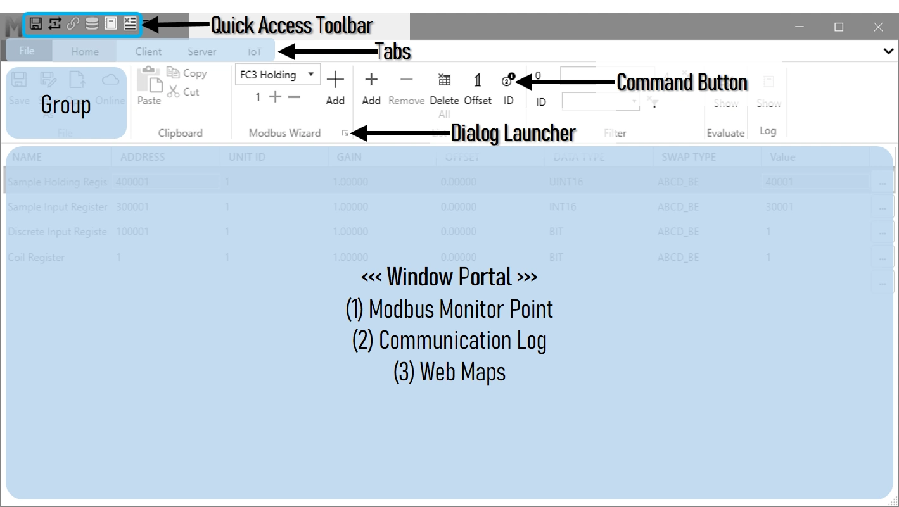
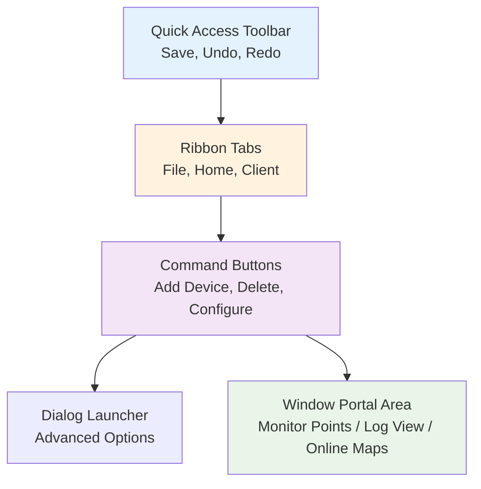
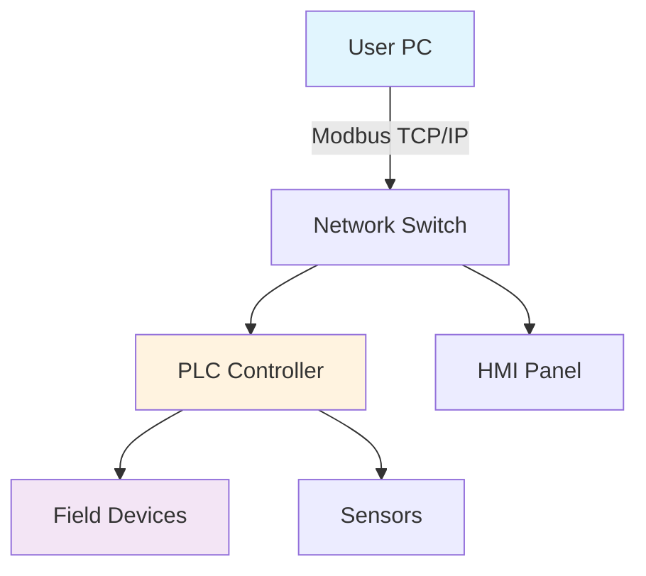

# Modbus Monitor XPF - User Guide

**A practical guide for controls engineers and technicians**

[TOC]

## 1. Introduction

**Modbus Monitor XPF** is a versatile Windows application for facilitating communication between a Windows-based PC and Modbus Client or Server devices. It handles both Client (Master) and Server (Slave) operations and supports all common Modbus variants: TCP/IP, Serial RTU, Serial ASCII, and RTU/ASCII over TCP.

{ .screenshot-shadow }

**One of the standout features** of Modbus Monitor XPF is its **dual functionality** - it encompasses both a Modbus Client and a Modbus Server **within a single application, running simultaneously**. This dual capability, combined with support for both Modbus Serial and Modbus TCP protocols, makes it an invaluable tool for various Modbus communication needs.

**What you can do with it:**

- Monitor live data from PLCs, drives, meters, and other Modbus devices
- Write values to registers and coils for testing or control
- Simulate Modbus devices for testing your own equipment
- Scan unknown devices to discover their register maps
- Log data for analysis and troubleshooting
- Validate register values against expected ranges
- **Run Client and Server modes simultaneously** on one PC

**Who this is for:**

- Controls engineers commissioning systems
- Maintenance technicians troubleshooting communications
- System integrators testing device compatibility  
- Equipment manufacturers validating Modbus implementations
- SCADA developers needing device simulation without physical hardware

### What Makes This Different

Most Modbus tools are either simple monitors or complex SCADA packages. XPF sits in the middle - it's powerful enough for serious work but simple enough to use quickly. The key advantages:

1. **Runs both Master and Slave simultaneously** - Test client-server interactions on one PC without physical devices
2. **Pre-built device maps** - Download factory-validated maps or community-contributed maps for common equipment
3. **Built-in data validation** - Automatic pass/fail testing with color coding
4. **Professional logging** - Proper timestamped records for troubleshooting
5. **Cross-platform protocol support** - Mix Modbus TCP, RTU, ASCII in the same session

### Learning Resources

Beyond this user guide, additional resources are available:

- 🎥 **[YouTube Tutorials](https://www.youtube.com/@ModbusMonitor/videos)** - Short demonstrations of features and workflows
- 📖 **[Online Help](https://quantumbitsolutions.com/xpf-help/)** - Comprehensive web-based documentation
- 💬 **[Community Forum](https://quantumbitsolutions.com/forums/)** - User discussions and troubleshooting help

## 2. Installation & Activation

### System Requirements

=== "Quick Reference"

    **Minimum Requirements:**
    
    - Windows 10 or 11 (64-bit recommended)
    - .NET Framework 4.8 or later
    - 4GB RAM minimum, 8GB recommended
    - 100-500 MB free disk space
    - Serial ports (USB-to-serial adapters work fine)
    - Network access for TCP/IP communications

=== "64-bit Version (Recommended)"

    | Component | Minimum | Recommended | Notes |
    |-----------|---------|-------------|--------|
    | **OS** | Windows 10 x64 | Windows 11 x64 | Most modern systems |
    | **RAM** | 4 GB | 8 GB+ | More memory = better performance |
    | **Storage** | 100 MB | 500 MB | Depends on log file size |
    | **.NET** | Framework 4.8+ | Latest Version | Usually pre-installed |
    | **Ports** | USB or Ethernet | Multiple adapters | For Modbus connections |

=== "32-bit Version"

    | Component | Minimum | Recommended | Notes |
    |-----------|---------|-------------|--------|
    | **OS** | Windows 10 x86 | Windows 11 x86 | Older or embedded systems |
    | **RAM** | 2 GB | 4 GB | 32-bit limit is ~3.5 GB total |
    | **Storage** | 100 MB | 200 MB | Smaller footprint |
    | **.NET** | Framework 4.8+ | Latest Version | Same as 64-bit |
    | **Ports** | USB or Ethernet | Multiple adapters | Full feature compatibility |

=== "Field Laptop Setup"

    **Recommended for field work:**
    
    - Rugged laptop with Windows 10/11
    - USB-to-serial adapter (FTDI chipset recommended)
    - Ethernet port for Modbus TCP
    - 8GB RAM for smooth operation
    - **Portable version** - No installation needed, runs from USB drive
    
    !!! tip "Field Technician Tip"
        Keep the portable version on a USB drive alongside your serial adapters. You can run it on any Windows machine without installation rights.

### Getting the Software

=== "Microsoft Store (Recommended)"

    **Install via Microsoft Store - Easiest Method**
    
    Search for "Modbus Monitor XPF" directly in the Microsoft Store on your Windows Desktop. Once installed, the application can be accessed from the Start Menu.
    
    **Benefits:**
    - **Automatic updates** and license management
    - **No admin rights** needed for installation
    - **Universal binary** - Works on both 32-bit and 64-bit Windows
    - **License per user** (not per machine) - follows your Microsoft Account
    - **Automatic cloud licensing** - Purchase and activate through Store
    
    [:material-microsoft-windows: Get from Microsoft Store](ms-windows-store://pdp/?productid=9PG862WL5HSM){ .md-button .md-button--primary }
    
    Or visit the web store: [Microsoft Store Product Page](https://www.microsoft.com/store/apps/9PG862WL5HSM)

=== "Direct Download from Web"

    **Install from the Web - Portable or Installer Options**
    
    Visit QuantumBitSolutions.com Download or Shop pages to download or purchase the application.
    
    **Portable Version:**
    - The software is a **portable version**, meaning it can be **run from any location without requiring installation**
    - **First launch note:** Slight delay is normal as the application unpacks files to a temporary location
    - Perfect for USB drives or systems without admin rights
    - Keep it with your field equipment for on-site troubleshooting
    
    **Choose your architecture and installation type:**

    | Architecture | Installer (Permanent Setup) | Portable (No Install) |
    |-------------|------------------------------|------------------------|
    | **64-bit** *(Recommended for modern systems)* | [:material-download: x64 Installer](https://quantumbitsolutions.com/download/ModbusMonitor_XPF_x64_Installer.zip){ .md-button } | [:material-download: x64 Portable](https://quantumbitsolutions.com/download/Modbus_Monitor_XPFx64.zip){ .md-button } |
    | **32-bit** *(Older systems only)* | [:material-download: x86 Installer](https://quantumbitsolutions.com/download/ModbusMonitor_XPF_x86_Installer.zip){ .md-button } | [:material-download: x86 Portable](https://quantumbitsolutions.com/download/Modbus_Monitor_XPFx86.zip){ .md-button } |

    **Additional Download Locations:**
    - [:material-download: Download Page](https://quantumbitsolutions.com/purchase/) - All versions available
    - [:material-cart: Shop Page](https://quantumbitsolutions.com/shop/) - Purchase with download links
    
    **What's the difference?**
    
    - **Installer:** Creates shortcuts, integrates with Windows, faster startup
    - **Portable:** No installation needed, run from USB drives, good for field work
    - **64-bit:** Works on modern Windows (2010+), handles large datasets better  
    - **32-bit:** Only needed for older Windows systems or embedded PCs

=== "Enterprise Purchase"

    **Volume licensing and site deployments**    
    - **Multiple machine licenses** available
    - **Offline licensing** for air-gapped networks
    - **Volume discounts** for large deployments
    - **Purchase orders** and invoice billing accepted
    
    [:material-email: Enterprise Sales](https://quantumbitsolutions.com/contact-us/){ .md-button }
    [:material-cart: Browse License Options](https://quantumbitsolutions.com/shop/){ .md-button }

!!! note "Which Version Should I Choose?"
    **Most users:** Choose the **64-bit version** - it works on modern Windows systems and handles large datasets better.
    
    **Use 32-bit version if:**
    - Running on older Windows systems (pre-2010)
    - Using embedded/industrial PCs with 32-bit OS
    - Company policy requires 32-bit applications
    
    **Installer vs Portable:**
    - **Installer:** Better for permanent desk setups, adds shortcuts and file associations
    - **Portable:** Better for field work, USB drives, or systems without admin rights

### License Activation

This section walks you through activating the license for your Modbus Monitor XPF software. The License window provides several buttons and fields to help you navigate the activation process.

**First Launch Experience:**

When you launch Modbus Monitor XPF for the first time, the **License window appears automatically**. This window displays:

- **UID (User Identification)** - Your unique identifier for license purchases
- **License Information Panel** - Shows current license status (Trial or Licensed)
- **Hardware ID (HWID)** - Used for certain license types
- **Licensing Buttons** - Store, Shop, Activate, Load, Trial, Exit

**Licensing Buttons Overview:**

| Button | Purpose | When to Use |
|--------|---------|-------------|
| **Store** | Microsoft Store purchase & activation | Purchase through Microsoft Store or activate Store license |
| **Shop** | Online shop page | Opens web browser to quantumbitsolutions.com/shop |
| **Activate** | Enter license key | After purchasing online key-based license |
| **Load** | Load license file | For `.lic` files (enterprise/offline licenses) |
| **Trial** | Start trial mode | Begin evaluation period with full features |
| **Exit** | Close license window | Exit the application |

!!! info "Trial Version - Full Featured Evaluation"
    **Free trial with ALL features unlocked** - No credit card required. Perfect for testing before purchase.
    
    **Starting Trial Mode:**
    1. Launch XPF for the first time
    2. License window appears automatically
    3. Click **"Trial"** button to begin evaluation period
    4. License Information Panel shows how many days are left in your evaluation period
    5. Start using the application immediately with limited functionality. Runtime and some features are restricted and requires full license.

**Main Steps to Activate the Software:**

1. **Purchase License** - Click "Store" or "Shop" button to visit licensing store and complete purchase
2. **Load or Enter Key** - After purchase, load license file (enterprise) or enter license key (online purchase)
3. **Verify Activation** - License Information Panel confirms activation status and trial mode is disabled

**Choose your activation method based on how you obtained the software:**

=== "Microsoft Store (Easiest)"

    **Automatic activation with Microsoft Account**
    
    The Microsoft Store version handles licensing automatically - no manual activation needed!
    
    **Purchase & Activation Flow:**
    
    1. **Open License Window**
       - Launch Modbus Monitor XPF
       - The license dialog appears automatically on first launch
       - Or go to **File Tab → About → Activate** button
    
    2. **Click "Store" Button**
       - Opens Microsoft Store purchase page
       - Your UID is automatically included in the purchase
    
    3. **Complete Purchase**
       - Sign in with your Microsoft Account
       - Complete payment in the Microsoft Store
       - Purchase is linked to your Microsoft Account
    
    4. **Activate License**
       - Return to XPF License window
       - **Click "Store" button again** to activate
       - System verifies purchase with Microsoft
       - Status changes to "Licensed" immediately
    
    **Benefits:**
    
    ✅ No manual license key entry required  
    ✅ Automatic renewal options available  
    ✅ License tied to Microsoft Account (not individual PC)  
    ✅ Easy reinstallation on any Windows device  
    ✅ Can be used on new computers with same Microsoft Account
    
    !!! tip "Multi-Computer Usage"
        Microsoft Store licenses follow your Microsoft Account. Install on multiple devices and sign in with the same account - the Store button activates on each installation automatically!
    
    !!! note "License Window Location"
        Access the license window through: **File Tab → About section → Activate button**
    
    <!-- Screenshot placeholder: xpf-store-activation.png -->
    <!-- Shows: License window with Store button highlighted, UID field, License Information Panel -->

=== "Online Purchase (Direct)"

    **Manual activation with license key**
    
    For licenses purchased directly from quantumbitsolutions.com using online Shop or purchase buttons.
    
    **Step-by-Step Activation:**
    
    1. **Get Your UID (BEFORE Purchasing!)**
       - Launch Modbus Monitor XPF
       - Go to **File Tab → About → Activate** button
       - License window opens showing your **UID (User Identification)**
       - Format looks like: `ABC123-DEF456-GHI789` or similar alphanumeric code
       - **Click "Copy" button** next to the UID field
       - Save this UID - it's required for purchasing your license
    
    2. **Purchase License Online**
       - Click the **"Shop"** button in the License window (opens shop page)
       - Or visit [:material-cart: quantumbitsolutions.com/shop](https://quantumbitsolutions.com/shop/) directly
       - Select **Modbus Monitor XPF** license
       - **Enter your UID** in the order form (critical step!)
       - Complete payment through the online system
    
    3. **Receive License Key via Email**
       - Check your email inbox (usually arrives within minutes)
       - License key format: `XXXX-XXXX-XXXX-XXXX-XXXX` (5 groups separated by dashes)
       - **Save this email** - you'll need it for reinstallation on other computers
       - Note: Key is permanently tied to your UID
    
    4. **Activate in XPF**
       - Return to the License window (File Tab → About → Activate)
       - Click **"Activate"** button in the Licensing Buttons section
       - **Paste your complete license key** in the entry field
       - System verifies the key online
       - License Information Panel updates to show **"Licensed"** status ✓
    
    !!! warning "Critical: Provide UID When Purchasing!"
        Your license key is permanently bound to your UID. If you purchase without providing your UID, the key won't work and you'll need to contact support for a replacement key.
    
    **License Window Components:**
    
    | Component | Description |
    |-----------|-------------|
    | **UID Field** | Displays your unique User Identification code |
    | **Copy Button** | Copies UID to clipboard for purchase form |
    | **License Information Panel** | Shows current license status (Trial or Licensed) |
    | **Activate Button** | Opens field to enter license key for activation |
    | **Shop Button** | Opens online shop to purchase license |
    
    **Troubleshooting:**
    
    - **"Invalid Key" error:** Verify you copied the entire key including all dashes, no extra spaces
    - **"UID Mismatch":** Key was purchased for different UID - contact support with both UID and key
    - **"Connection Error":** Activation requires internet connection - check firewall settings
    - **Key not working:** Ensure you're entering the key in the Activate dialog, not the Trial field
    
    { .screenshot-shadow }
    
    <!-- Additional screenshot needs:
         - xpf-license-dialog-annotated.png: Shows all buttons (Store, Shop, Activate, Load, Trial, Exit) with UID field and Copy button labeled
         - xpf-enter-key-dialog.png: Shows Activate dialog with license key entry field
         - xpf-activation-success.png: Shows License Information Panel with "Licensed" status
    -->

=== "Enterprise/Site License"

    **License file for multiple installations or air-gapped systems**
    
    For organizations needing multiple installations, offline activation, or centralized license management.
    
    **License Types:**
    
    | License Type | Use Case | Activation Method |
    |--------------|----------|-------------------|
    | **Site License** | Multiple PCs at one location | License file (`.lic`) or keys |
    | **Volume License** | Many installations, any location | Multiple keys or license files |
    | **Offline License** | Air-gapped networks, no internet | Special license file only |
    | **OEM License** | Bundled with equipment | Custom activation method |
    
    **Activation with License File (`.lic`):**
    
    1. **Contact Sales for Enterprise Licensing**
       - Email [:material-email: sales@quantumbitsolutions.com](mailto:sales@quantumbitsolutions.com)
       - Provide: Number of seats needed, deployment location(s), offline requirements
       - Discuss: Site license, volume pricing, offline activation needs
       - Receive: Quote and purchase order details
    
    2. **Receive License File**
       - Sales team provides special `.lic` license file after purchase
       - File contains all activation data embedded
       - **No internet connection required** for activation with license file
       - Can be used on multiple PCs (based on license terms)
    
    3. **Load License File on Each Computer**
       - Launch Modbus Monitor XPF
       - Open License window: **File Tab → About → Activate**
       - Click **"Load"** button in the Licensing Buttons section
       - File browser opens
       - Navigate to your `.lic` file location
       - Select the license file and click Open
       - License Information Panel immediately shows **"Licensed"** status
       - **No internet verification needed** - file contains authorization
    
    4. **Deploy to Multiple Systems**
       - Copy the same `.lic` file to all licensed computers (via USB, network share, etc.)
       - Install XPF on each system
       - Repeat Step 3 (Load License File) on each installation
       - All systems activate instantly with the same file
    
    **Alternative: Offline Key Activation**
    
    If you need to activate with a license key on air-gapped systems:
    
    1. **Generate Activation Request**
       - On offline PC: Open License window
       - Note your **UID** and **Hardware ID (HWID)** shown in License Information Panel
       - Provide these to support via email (from internet-connected PC)
    
    2. **Receive Offline License Key**
       - Support generates special offline key tied to your UID/HWID
       - Transfer key to offline system (USB drive, printed paper, etc.)
    
    3. **Enter Key on Offline System**
       - Click **"Activate"** button in License window
       - Enter the offline license key
       - System validates locally without internet
       - Status changes to "Licensed"
    
    **Enterprise Support Benefits:**
    
    ✅ Priority email support response (24-hour guarantee)  
    ✅ Optional phone support available  
    ✅ Custom Service Level Agreements (SLAs)  
    ✅ Dedicated account management  
    ✅ Volume discount pricing  
    ✅ Flexible deployment options (offline, network, etc.)  
    ✅ Purchase order and invoice billing accepted
    
    !!! tip "Recommended for Industrial Environments"
        License files (`.lic`) are ideal for secure facilities, air-gapped networks, or environments where internet access is restricted for security reasons.
    
    [:material-email: Contact Enterprise Sales](https://quantumbitsolutions.com/contact-us/){ .md-button .md-button--primary }
    [:material-cart: View Volume License Options](https://quantumbitsolutions.com/shop/){ .md-button }
    
    <!-- Screenshot placeholder: xpf-load-license-file.png -->
    <!-- Shows: License window with Load button highlighted, file browser dialog with .lic file selected -->

=== "Troubleshooting"

    **Common installation and activation issues**
    
    ### Installation Problems
    
    **Application won't start or crashes immediately:**
    
    - Install latest .NET Framework from Microsoft
    - Right-click XPF → "Run as Administrator"
    - Check Windows Defender isn't blocking the application
    - Verify system meets minimum requirements (Windows 10/11)
    
    **Serial ports not showing in interface:**
    
    - Install drivers for your USB-to-serial adapter
    - Check Device Manager for COM port assignments
    - Some generic adapters need specific drivers (FTDI, Prolific, etc.)
    - Try different USB ports if adapter not recognized
    
    **Network connection problems:**
    
    - Windows Firewall may block Modbus TCP (port 502)
    - Add firewall exception: Control Panel → Windows Defender Firewall → Allow an app
    - Corporate networks sometimes block non-standard ports
    - Verify IP address and subnet configuration
    
    ### Activation Issues
    
    **"Invalid Key" error when activating:**
    
    - Verify you copied the complete license key (including all dashes)
    - Check for extra spaces at beginning or end of key
    - Ensure key matches the UID shown in License window
    - Contact support if key was purchased for different UID
    
    **"Connection Error" during activation:**
    
    - Check internet connection is active
    - Verify firewall isn't blocking XPF's internet access
    - Try temporarily disabling antivirus software
    - Some corporate proxies block activation - contact IT
    
    **Microsoft Store activation not working:**
    
    - Ensure you're signed in with correct Microsoft Account
    - Check Microsoft Store app is updated to latest version
    - Try signing out and back in to Microsoft Account
    - Restart XPF after completing purchase
    
    **License shows "Expired" unexpectedly:**
    
    - Verify system clock is set correctly (wrong date can cause this)
    - Check if subscription renewal payment failed
    - Contact support to verify license status
    
    ### Performance Issues
    
    **Slow startup or sluggish performance:**
    
    - Close unnecessary applications consuming RAM
    - Check for Windows updates pending installation
    - Disable communication logging when not needed
    - Reduce number of monitor points being polled
    
    **High memory usage:**
    
    - Disable Event Log if not needed (major memory consumer)
    - Limit chart buffer size (set Samples value instead of unlimited)
    - Clear log files periodically
    - Reduce poll rate for large register lists
    
    ### Still Having Issues?
    
    📧 **Email Support:** support@quantumbitsolutions.com  
    💬 **Community Forum:** [quantumbitsolutions.com/forums](https://quantumbitsolutions.com/forums/)  
    📖 **Knowledge Base:** [Technical Resources](../../technical/index.md)

**License Comparison:**

| Feature | Trial | Standard | Enterprise |
|---------|-------|----------|------------|
| **Duration** | Time-limited | Perpetual | Perpetual |
| **Full Features** | ✅ Yes | ✅ Yes | ✅ Yes |
| **Updates** | During trial | 1 year included | Custom terms |
| **Installations** | 1 PC | 1 PC per license | Multiple PCs |
| **Support** | Community forum | Email support | Priority support |
| **Offline Use** | ✅ Yes | ✅ Yes | ✅ Yes (special activation) |
| **Price** | Free | [View pricing](https://quantumbitsolutions.com/shop/) | Contact sales |

## 3. Understanding the Interface

### Modbus Monitor XPF - Application Window

The main application window of Modbus Monitor XPF is organized into several key sections that work together to provide a comprehensive Modbus communication interface.

{ .screenshot-shadow }
*Figure 3.1: Main application interface showing five key areas (see numbered components below)*

**The application window contains five main areas:**

!!! tip "Cross-Reference with Screenshot"
    Each numbered section (**①②③④⑤**) in the screenshot above corresponds to the detailed descriptions below. Use this visual guide to quickly locate features in the actual application.

#### ① Quick Access Toolbar

Located at the very top, this toolbar provides one-click access to frequently used commands. **You can customize which buttons appear** by right-clicking the toolbar.

**Available Quick Access Toolbar Buttons:**

| Button | Function | Description |
|--------|----------|-------------|
| **Save** | Save configuration | Quickly save your current Modbus map configuration to CSV file |
| **Open** | Open file | Load previously saved configuration |
| **Chart** | Open chart view | Switch to Chart visualization window |
| **Read** | Read once | Poll all monitoring points once and stop |
| **Write** | Write once | Write selected monitor point value once |
| **Client** | Modbus Client | Start/Stop continuous polling of all monitoring points |
| **Server** | Modbus Server | Start/Stop Modbus Server |
| **Show** | Show log | Toggle Event Log / Communication Log view |
| **Start** | Log Controls| Start/Stop Communication events captures |
| **Clear** | Clear logs | Clear all entries from Communication Log window |

**Customization Options:**

- **Show Below the Ribbon**: Position toolbar below ribbon tabs instead of above
- **Checkmarks (✓)**: Indicate which buttons are currently visible on toolbar
- **Right-click**: Access customization menu any time
- **Add/Remove**: Click any button name to toggle its visibility

!!! tip "Recommended Quick Access Setup"
    **For daily operations**, most technicians keep these buttons visible:
    
    - **Save** - Quick configuration saves during field work
    - **Read** - Single poll to check current values
    - **Start/Stop** - Control polling quickly
    - **Show** - Toggle between Monitor Points and Log views
    - **Clear** - Clear logs between test runs
    
    This provides instant access to 90% of common operations without navigating through ribbon tabs.

#### ② Ribbon Tabs

Below the Quick Access Toolbar, you'll find multiple tabs that organize all application features:

**Standard Tabs (Always Visible):**

- **File** - Backstage view with file operations, licensing, settings, support, and links
- **Home** - Most frequently used commands (copy/paste, Modbus Wizard, list management)
- **Client** - Modbus Client (Master) operations (interface config, polling, scanner, charts)
- **Server** - Modbus Server (Slave) operations (interface config, Modbus TCP Server, Modbus RTU Server )
- **IoT** - IoT integration (ThingSpeak cloud logging, MQTT messaging for cloud/device communication)

**Contextual Tabs (Appear When Features Active):**

- **Log Options** - Appears when Event Log is active (filter, export, auto-scroll controls)
<!-- - **Chart Options** - Appears when Chart view is open (axis config, samples, data export)
- **Server Options** - Appears when Server mode is running (traffic capture, simulation settings) -->

The active tab is highlighted, making it easy to see which commands are currently available.

#### ③ Command Groups (Ribbon Commands)

In the middle section of each ribbon tab, you'll find groups of related command buttons:

- **Add Device** - Add new monitor points to your list
- **Delete Device** - Remove selected monitor points
- **Offset ID** - Change address base or Unit ID for all points
- And many more, organized by function

Buttons are accompanied by icons and arrows indicating their functions and options.

#### ④ Dialog Launcher

Small buttons in the corner of command groups that open additional settings or options:

| Feature | Location | Purpose |
|---------|----------|---------|
| **Arrow Icon** | Bottom-right of command groups | Opens extended dialogs |
| **Advanced Options** | Context-specific dialogs | Access detailed settings |
| **Extended Settings** | Beyond ribbon display | Configure advanced parameters |

#### ⑤ Window Portal Area

The main workspace at the bottom displays different information depending on the selected mode:

| View | Trigger | Display Content |
|------|---------|-----------------|
| **Monitor Points List** | Default view | Table showing all Modbus monitoring points with Name, Address, Unit ID, Value, and register details |
| **Log Window** | Log button toggled | Communication events and Modbus traffic history |
| **Chart Window** | Chart button active | Time-series data visualization and trend analysis |
| **Online Maps Navigator** | Online button toggled | Browse and download pre-built Modbus maps from factory/community |

Each view provides relevant information for the specific task being performed.

### Application Window - Ribbon Tabs Overview

The standard Modbus Monitor XPF ribbon contains the following tabs, from left to right:

**Standard Tabs (Always Visible):**

| Tab | Purpose | Key Features |
|-----|---------|--------------|
| **📁 File** | Backstage view | File operations, licensing, theme settings, recent files, online resources |
| **🏠 Home** | Daily operations | Copy/paste, Modbus Wizard, list management, filtering, evaluation |
| **🔗 Client** | Modbus Client (Master) | Interface selection, timeouts, write functions, scanner, charts, poll controls |
| **🌐 IoT** | Cloud integration | ThingSpeak logging, MQTT messaging, cloud-to-device communication |

**Contextual Tabs (Appear Dynamically):**

| Tab | Trigger | Key Features |
|-----|---------|--------------|
| **📊 Log Options** | Event Log active | Filter errors, export logs, auto-scroll, timestamp format, clear history |
| **📈 Chart Options** | Chart view open | Axis configuration, sample buffer size, fit to view, export chart data, clear buffer |


!!! note "How Contextual Tabs Work"
    Contextual tabs (also known as Option Tabs) appear only when you activate specific features, providing relevant controls without cluttering the interface.
    
    **Examples:**
    - Click **Show** button in Home tab → Log group → **Log Options** tab appears
    
    When you deactivate the feature (close log, close chart), the contextual tab automatically disappears.

### Key Concepts

**Monitor Points:** Each row in the Monitor Points table represents one Modbus address you want to read or write. Think of it as your "register shopping list" - you define what data you need, and XPF handles the polling, writing, retrying, data conversion, byte swap, and display formatting.

**Client vs Server Mode:** 

- **Client (Master)** - You initiate communication, continuously polling remote devices for data
- **Server (Slave)** - You simulate a Modbus device, responding to requests from other masters
- **Simultaneous Operation** - Both modes can run at the same time on different interfaces 

**Magic Codes:** Special text you add to the **Name** field of monitor points to enable advanced features like custom poll rates, bit field access, string length control, and date/time conversion (covered in detail in Monitor Points section).

**Dual Functionality:** XPF can operate as both Client and Server simultaneously, making it ideal for testing client-server interactions on a single PC without physical devices. 

### Navigation Tips

**Quick Access Toolbar Customization:**

| Action | Method | Details |
|--------|--------|---------|
| **Open Customization Menu** | Right-click anywhere on toolbar | Shows complete list of available buttons (11 options) |
| **Add/Remove Buttons** | Click button name in menu | Checkmark (✓) indicates button is currently visible |
| **Reposition Toolbar** | Select "Show Below the Ribbon" | Moves toolbar from top to below ribbon tabs |
| **Reset to Default** | Remove all, then add preferred buttons | Create your personalized button set |

**Customization Best Practices:**

- **Add buttons you use frequently** - Start, Stop, Read, Save, Show
- **Remove rarely-used buttons** - Keep toolbar uncluttered for faster access
- **Field work setup** - Save, Read, Start, Stop, Show (essential operations only)
- **Development setup** - Add Chart, Write for testing and analysis work
- **Position preference** - Below ribbon if you prefer buttons closer to data area

**Right-click Context Menus:**

| Feature | Usage | Behavior |
|---------|-------|----------|
| **Table Context Menus** | Right-click any table row | Relevant actions for selected item |
| **Field Context Menus** | Right-click input fields | Field-specific operations |
| **Adaptive Menus** | Context-sensitive | Options change based on selection |

**Keyboard Shortcuts:**

| Shortcut | Function | Usage |
|----------|----------|-------|
| `Ctrl+S` | Save configuration | Preserve current setup |
| `Ctrl+O` | Open configuration | Load saved file |
| `Ctrl+C` / `Ctrl+V` | Copy/paste | Works with Excel integration |
| `Ctrl+X` | Cut rows | Move selected items |
| `F5` | Refresh display | Update current view |
| `Shift+Click` | Select range | Sequential row selection |
| `Ctrl+Click` | Multi-select | Non-sequential rows |

**Window Portal Switching:**

| Feature | Method | Result |
|---------|--------|--------|
| **View Toggle** | Ribbon button clicks | Switch between Monitor Points, Log, Chart, Online Maps |
| **Shared Space** | Same screen area | Each view replaces previous in portal |
| **Data Persistence** | Background retention | Switching views doesn't lose data |

!!! tip "Workflow Best Practice"
    1. Set up your monitor points first (define what you want to read/write)
    2. Configure communication settings (TCP/Serial, timeouts)
    3. Save your configuration before starting polling
    4. Test with "Read Once" before enabling continuous polling
    5. Save frequently - especially before making major changes

=== "Microsoft Store (Recommended)"

    **Easiest Installation Method:**
    
    1. **Search** for "Modbus Monitor XPF" in Microsoft Store
    2. **Install** directly from the store
    3. **Launch** from Start Menu
    4. **Activate** license through the store
    
    [:material-microsoft-windows: Open Microsoft Store](ms-windows-store://pdp/?productid=9PG862WL5HSM){ .md-button .md-button--primary }

=== "Direct Download"

    **Portable Version:**
    
    1. **Visit** [QuantumBitSolutions Download Page](https://quantumbitsolutions.com/purchase/)
    2. **Download** the portable executable
    3. **Run** from any location (no installation required)
    4. **First Launch** may have slight delay (unpacking files)
    
    [:material-download: Download Portable](https://quantumbitsolutions.com/purchase/){ .md-button }

## 🏠 Application Interface

### Main Window Layout

The Modbus Monitor XPF interface is organized into several key areas:



### Ribbon Tabs Overview

| Tab | Purpose | Key Features |
|-----|---------|--------------|
| **📁 File** | File operations & settings | Open/Save, Recent files, Licensing, Themes |
| **🏠 Home** | Daily operations | Copy/Paste, Modbus Wizard, List management |
| **🔗 Client** | Modbus Client (Master) | Interface config, Polling, Charts, Scanner |
| **⚙️ Contextual** | Context-sensitive options | Log Options, Chart Options (when active) |

## 📁 File Tab (Backstage View)

The **File Tab** provides access to the backstage view containing essential file operations, application settings, license management, and resources. Click the **File** tab to enter this full-screen view.

### Home Section - File Navigation

The Home section provides quick access to your file system and document management:

| Feature | Icon/Button | Description |
|---------|-------------|-------------|
| **🏠 Home** | Home button | Navigate to Documents folder |
| **📂 Open** | Folder icon | Open folder in Windows Explorer |
| **⬆️ Up** | Up arrow | Move up one level in directory tree |
| **📍 Current Folder** | `<Documents>` | Displays current folder name |

**Workflow:**
1. Click **File Tab** to enter backstage view
2. Use **Home** to jump to Documents folder
3. Navigate folders with **Up** button
4. Click **Open** to browse in Windows Explorer
5. Select your XPF configuration file to load

### Recent Files Section

Quick access to recently used Modbus maps and configurations:

| Button | Function | Description |
|--------|----------|-------------|
| **🔄 Refresh** | Update list | Refresh the recent files list |
| **📂 Open Folder** | Show location | Opens folder containing selected file |
| **📄 Open File** | Load map | Loads selected configuration in XPF |
| **➖ Remove** | Delete entry | Remove selected file from recent list |
| **🗑️ Delete** | Clear all | Deletes all entries from recent list |

!!! tip "Quick File Access"
    The Recent Files list is the fastest way to switch between different device configurations. Your most commonly used maps are always one click away.

### About Section - Application Information

Access version information, documentation, and support resources:

| Option | Description | Action |
|--------|-------------|--------|
| **ℹ️ Version** | Current application version | Displays installed version number |
| **🔑 Activate** | License activation | Opens license window for activation |
| **📝 Submit Feedback** | User feedback | Direct feedback to developers |
| **📚 Documentation** | Online help | Access comprehensive online help |
| **🎥 Videos** | Tutorial videos | Links to YouTube tutorials |
| **📧 Contact Email** | Support contact | Email address for inquiries |
| **🔒 Privacy Policy** | Data handling | View privacy policy details |
| **📜 EULA** | License agreement | End User License Agreement terms |

**Quick Actions:**
- **Need help?** Click **Documentation** for online guides
- **New to XPF?** Click **Videos** for visual tutorials  
- **License issues?** Click **Activate** to manage licenses
- **Feature requests?** Use **Submit Feedback**

### Settings Section - Application Appearance

Customize the application theme to match your environment:

| Theme | Description | Best For |
|-------|-------------|----------|
| **☀️ Light** | Bright interface | Well-lit environments, daytime use |
| **🌙 Dark** | Dark interface | Low-light environments, reduced eye strain |
| **💻 System Default** | Follows Windows | Automatically matches Windows theme |

**Theme Selection:**
1. Click **File Tab** → **Settings**
2. Choose theme from dropdown
3. Theme applies immediately (no restart needed)

!!! tip "Field Work Preference"
    Many field technicians prefer **Dark theme** when working in dimly lit equipment rooms or cabinets.

### Exit - Close Application

**Exit** button safely closes the Modbus Monitor XPF application:

- **Saves** current window position and settings
- **Prompts** to save unsaved changes (if any)
- **Terminates** all active connections properly
- **Releases** serial ports and network resources

## 🏠 Home Tab - Essential Operations

The **Home Tab** contains the most frequently used commands for daily operations - everything you need for working with Modbus maps and monitoring points.

{ .screenshot-shadow }

### File Group - Document Management

| Feature | Description | Details |
|---------|-------------|---------|
| **💾 Save** | Save current document in CSV format | Preserves entire Modbus map configuration including monitor points, settings, and extended properties for reuse |
| **📂 Open** | Open previously saved file | Load saved XPF configuration files (CSV format) from any location |
| **☁️ Online** | Download Modbus Maps from online folder or community | Access pre-configured maps from (1) factory-released validated maps or (2) community-uploaded maps. See detailed explanation below. |

!!! note "CSV Format Benefits"
    XPF saves configurations as standard CSV files, making them easy to:
    
    - **Edit** in Excel or text editors for batch modifications
    - **Version control** using Git or other systems
    - **Share** with team members or across sites
    - **Document** device configurations for compliance

### Clipboard Group - Data Transfer

| Operation | Shortcut | Description |
|-----------|----------|-------------|
| **📋 Paste** | `Ctrl+V` | Paste from clipboard from selected row(s) - either from the application or Microsoft Excel. Adds to end of list. |
| **📄 Copy** | `Ctrl+C` | Copy selected single or multiple row(s) to clipboard. Multiple sequential rows can be selected with Shift+Click's first and last row. Multiple rows in any order using Control+Click. |
| **✂️ Cut** | `Ctrl+X` | Copy the content of the current item to clipboard and delete the item from the list. |

!!! tip "Excel Integration Workflow"
    **Typical workflow for Excel integration:**
    
    1. **Create** monitor point list in Excel with columns: Name, Address, Unit ID, Gain, Offset, Data Type, Swap Type
    2. **Select** rows in Excel (use Shift+Click for range, Ctrl+Click for individual)
    3. **Copy** with `Ctrl+C`
    4. **Switch** to XPF application
    5. **Select** starting row in monitor points list
    6. **Paste** with `Ctrl+V` - rows are added at end of list
    
    This is invaluable for batch device setup or migrating configurations.

### 🧙‍♂️ Modbus Wizard - GUI Configuration Tool

The **Modbus Wizard** simplifies adding and configuring monitor points through a graphical interface, eliminating the need to manually edit configuration files. The wizard can add a new monitor point on an empty row, allowing for easy configuration using the GUI instead of manual editing.

{ .screenshot-shadow }
*How to use Modbus Wizard to configure Modbus Monitor Point*

**Wizard Operations:**

| Operation | Description | Use Case |
|-----------|-------------|----------|
| **👁️ View** | Click on a row to view existing configuration | Examine current monitor point settings without making changes |
| **✏️ Edit** | Click on a row and use combo boxes to change settings | Modify Modbus Function, Modbus Address, Data Type, Magic Codes, etc. The wizard ensures proper unique Magic Codes are added automatically. |
| **➕ Add** | Add new monitor point by selecting well-known Modbus Function Type | Create new monitor points with guided setup - wizard handles Magic Code generation |

**Dialog Box Launcher:**
- Click the small arrow icon in the Modbus Wizard group corner
- Opens extended options and advanced wizard settings
- Provides access to additional configuration parameters

!!! tip "Magic Code Automation"
    The Modbus Wizard's biggest advantage is **automatic Magic Code management**. Instead of memorizing codes like `:16` for string length or `@1000` for poll rate, use the wizard's dropdown menus. The wizard adds proper codes automatically and ensures they're unique and valid.

### List Group - Monitor Point Management

Manage Monitor Points (also called Row or Item) in your configuration:

| Button | Function | Description |
|--------|----------|-------------|
| **➕ Add** | Add new Monitor Point | Creates new row with **default values**. Uses the last row and **increments the Modbus Address by one** for easy entry. |
| **➖ Remove** | Delete selected Monitor Point | Removes **single or multiple selected** items from Monitor Point List Table. Use `Ctrl+Click` to select multiple non-sequential items. |
| **❌ Delete All** | Delete All monitoring points | Removes **all Monitoring Points** from the Monitor Point List Table. Use with caution! |
| **🔢 Offset** | Set One Based mode | Set Offset to **1** or **0** for the Modbus Address listed in the Address Column. In other words, address values in the list start with **1 (1-65536)** or **0 (0-65535)**. |
| **🆔 ID** | Change ID for all monitoring points | Updates Unit ID (Station ID or Slave ID) for **all** monitoring points to the new value. Useful when changing target device. |

!!! example "Typical Workflow"
    **Adding multiple consecutive registers:**
    
    1. Add first register at address 400001
    2. Click **Add (+)** - automatically creates 400002
    3. Click **Add (+)** again - creates 400003
    4. Continue as needed - each Add increments by one
    
    **Bulk ID changes:**
    
    - If you need to change all monitor points from Slave ID 1 to Slave ID 5
    - Simply click **ID** button and enter 5
    - All monitor points update immediately

### Filter Group - Search and Filter Monitor Points

Search Name and Address fields to filter monitoring points based on search criteria:

{ .screenshot-shadow }

| Component | Function | Description |
|-----------|----------|-------------|
| **Left Number (Row Index)** | Selected Row Index | Shows the **index of the currently selected row** or monitor point. Especially handy when the list is filtered and you want to know the true index of the selected row. |
| **Filter Box (Text Entry)** | Text search | Enter the key value to filter the list by. All **Name** and **Address** fields containing the text will show up as a filtered list. |
| **Right Number (Total Rows)** | Total row count | Shows the **total number of rows or points** in the Monitor Points List (full or filtered). |
| **Clear Filter** | Reset filter | Clears the filter and shows all rows in the list. |
| **ID Box** | Unit ID filter | Select the **Unit ID (Slave ID or Station ID)** to filter the list further. Useful when working with multiple devices. |

!!! example "Filter Usage Scenarios"
    **Scenario 1: Finding temperature sensors**
    
    - Type `temp` in Filter Box
    - All monitor points with "temperature" in the name appear
    - Quickly locate all temperature-related registers
    
    **Scenario 2: Working with specific slave**
    
    - Select `ID: 5` from ID dropdown
    - Only registers for Slave ID 5 are displayed
    - Focus on single device configuration
    
    **Scenario 3: Combined filtering**
    
    - Filter by ID: 3 AND text: "status"
    - Shows only status registers for Slave 3
    - Precise targeting of specific registers

### 📊 Evaluate Group (Validate or Test)

Change the background colors of the Value cell based on the High, Low, and Nominal Limits. **Quickly validate the value from the Modbus device and test to see if it is within the valid range.**

{ .screenshot-shadow }
*Evaluate or Test Limits Settings*

#### Evaluate Filter Area

| Button | Function | Description |
|--------|----------|-------------|
| **�️ Show** | Extend toolbar | Click to extend the toolbar with more filtering options |
| **🔴 High** | Filter high values | Filter the list to show values that have **reached the High Limit** |
| **� Nominal** | Show nominal values | Display monitoring points with **Nominal Values** (within acceptable range) |
| **🔵 Low** | Filter low values | Filter the list to show values that have **reached the Low Limit** |
| **🔄 Auto** | Automatic update | **Automatically update** the UI with selected filters after each scan |
| **⭕ Off** | Toggle evaluate mode | Toggle Evaluate (Test) Mode **on or off** for all monitoring points |

#### Evaluate Limits Settings (Per Monitor Point)

Access these settings by clicking the **three ellipses (...)** at the end of each monitor point row:

| Setting | Options | Description |
|---------|---------|-------------|
| **✅ Evaluate** | Checkbox | Turn the Evaluate feature **on or off** for this specific monitor point |
| **🎨 Nominal Color** | Color picker | Choose a color for the **Nominal Value range**. The nominal range is calculated as values **between the Low Limit and High Limit**. |
| **🔻 Low Limit** | Value + Color | Choose a color to highlight the Value column when the value **equals or falls below the Low Limit**. The value can be **numerical or string** type. |
| **🔺 High Limit** | Value + Color | Choose a color to highlight the Value column when the value **equals or exceeds the High Limit**. The value can be **numerical or string** type. |
| **📝 String Mode** | Same High/Low | For String Data Type, set the **same High and Low Limit** for exact string matching |

!!! example "Practical Applications"
    **Quality Control Testing:**
    
    - Set High Limit: 100, Low Limit: 0, Nominal: Green
    - Values 0-100 show green (pass)
    - Values outside range show red/yellow (fail)
    - Instant visual validation during production testing
    
    **Equipment Health Monitoring:**
    
    - Motor temperature: High=80°C (Red), Low=10°C (Blue), Nominal=Green
    - Pressure sensor: High=150 PSI (Red), Nominal=Green
    - Quick identification of out-of-spec conditions
    
    **String Validation:**
    
    - Device status should be "RUNNING"
    - Set High Limit = Low Limit = "RUNNING", Nominal Color = Green
    - Any other status shows as error color

### 📋 Log Group - Events and Communication Log

Switch to the Events Log Window to view **Modbus communications and general events**. The Monitoring Points area is switched to show event logs in the same area. Use the **"Log"** button to switch between both views.

**Log Button Behavior:**

- **Location**: The Log button is in the **Home tab** or Ribbon Header
- **Toggle Function**: Switches between Event Log view and Monitoring Point view
- **Stay-On Indicator**: This button stays on during Log Monitoring
- **Deactivate**: Click again to turn off the Communication Traffic Monitoring view portal (but communication traffic still monitors if it started already)

**Activating Logging:**

1. You can enable logging using a configuration or project file
2. Or by clicking the **Start button** in the contextual Log Options tab
3. Once enabled, logging remains active during Log Monitoring

**Communication Log Features:**

| Button | Function | Description |
|--------|----------|-------------|
| **▶️ Start/Stop** | Control logging | Click **Start** to begin communication logging in comma-delimited text format. Click **Stop** to pause logging. |
| **🗑️ Clear** | Remove entries | Clear all logs from the display window |
| **💾 Save As** | Export logs | Save displayed log to text file for analysis or archival |
| **⚠️ Errors** | Error filter | Show **only communication events with Errors** - filters out successful transactions |
| **📜 Scroll** | Auto-scroll | Scroll to the **latest communication log** entry automatically |
| **⏰ Timestamps** | UTC time | All events in the window are **time-stamped with UTC** for accurate correlation |

!!! tip "Logging Best Practices"
    **Hints:**
    
    - If the file or project is saved, **traffic monitoring will automatically start** the next time the project is loaded
    - Communication traffic monitoring will **continue if it has already begun**, even though the communication traffic view is hidden
    - The Log button only toggles the **view** - logging itself runs independently

!!! warning "Performance Impact"
    The Events log consumes **more processing power and memory** to log data at a high rate. Therefore, **turn off this feature when not needed** for optimal performance, especially during long-term monitoring or when polling many registers at high speed.

## 🌐 Online Button - Cloud-Based Modbus Maps

View and Download Online Modbus Maps from either **(1) factory-released maps** by Modbus Monitor or **(2) community-uploaded maps** from users. Toggle the **Online** button in the File group located in the Home tab to activate this feature. **An internet connection is required** to use this feature.

{ .screenshot-shadow }
*How to download pre-defined Modbus Map*

### Online Maps Navigator - Interface Components

| # | Icon/Button | Function | Description |
|---|-------------|----------|-------------|
| **❌** | **X (Back)** | Close navigator | Close this Online Map navigator and go back to the previous view |
| **1** | **🏭 Factory** | Maps from Factory | Officially released and validated Modbus Maps |
| **2** | **👥 Community** | Community Maps | Click to see maps shared by others in the user community |
| **3** | **📤 Share** | Upload | Upload your Modbus Map and share with the online community |
| **4** | **📥 Download** | Download | Download selected Online Maps to local system |
| **5** | **✅ Status** | Progress Indicator | Download or Upload status:<br>**Green Check mark**: All went OK<br>**Red Cross**: Error downloading. Download process interrupted or check the Internet connection. |
| **6** | **📄 Name** | File display | Name of the map just downloaded or selected |

### Downloading Factory Maps - Step by Step

**To Download Files:**

1. Click on the **Factory Icon [1]** and wait for the list to update from the cloud
2. Click on the **File Name** from the list of available devices; the file name appears in the text area **[6]**
3. Click on the **Download button [4]**
4. The Modbus Map of the devices **automatically opens** when the file successfully downloads after the **green check mark [5]** appears and the online button closes

!!! tip "Factory Maps Advantage"
    Factory maps are **officially validated** and tested. They're your best starting point for common industrial equipment like VFDs, meters, and PLCs from major manufacturers.

### Uploading Community Maps - Step by Step

**To Upload File:**

1. Click on **Community icon [2]**
2. Click on the **Share Icon [3]** and choose the local XPF Modbus Map data file from your computer
3. **Green Check** shows **[5]** when the file is successfully uploaded to the cloud
4. Click on the **Community Files Maps icon [2]** to refresh the list of files in the window and see your contribution

!!! example "Sharing Your Work"
    **When to share your maps:**
    
    - You've created a map for equipment without factory support
    - You've enhanced an existing map with additional registers
    - You've documented a custom or proprietary device
    - You want to help other users with the same equipment
    
    Your contributions help the entire community!

## 📊 Monitor Points Configuration

### Monitor Points Table Structure

Each row in the Monitor Points table represents a single Modbus register or group of registers to monitor:

| Column | Data Type | Example | Description |
|--------|-----------|---------|-------------|
| **Name** | String | `Water Temperature:16` | Descriptive name + magic codes |
| **Address** | Integer | `400001` | 6-digit Modbus address format |
| **Unit ID** | Byte (1-247) | `1` | Slave/Station ID |
| **Gain** | Float | `1.5` | Scaling multiplier (Y = mX + b) |
| **Offset** | Float | `100` | Value offset (Y = mX + b) |
| **Data Type** | Enum | `INT16` | Data interpretation format |
| **Swap Type** | Enum | `ABCD_BE` | Byte/word order for multi-register |
| **Value** | String/Number | `Solar Meter 123` | Current/set value |

### Detailed Field Descriptions

#### 1. Name Field - Enhanced with Magic Codes

The Name field supports special **Magic Key Codes** to enhance functionality:

##### String Length Control
```
Format: :xx
Usage: Water Temperature:16
Effect: Reads 16 continuous registers as string
```

##### Poll Rate Control  
```
Format: @xxxx (milliseconds)
Usage: Model Name@1000
Effect: Polls every 1000ms (1 second)
Special: @-1 = Poll once at start, @0 = Skip during polling
```

##### Bit Field Access
```
Format: .n (bit index 0-15)
Usage: Status Register.8  
Effect: Extracts bit 8 from 16-bit register
```

##### Date/Time Formats
```
Codes: DOS | EPOCH | EPOCHMS | DT2 | DT3 | DT4 | DT4P | DT6
Usage: Timestamp_DT6 + Data Type = DATETIME
Effect: Converts registers to date/time display
```

##### Multiple Magic Codes
```
Example: System_Status@-1:31.5
Effect: Poll once (@-1), 32 registers (:31), bit 5 (.5)
```

#### 2. Address Field - 6-Digit Format

The address system combines function code with register number:

| Function Code | Address Prefix | Type | Access |
|---------------|----------------|------|---------|
| **Function 1** | `0x` | Coils | Read/Write |
| **Function 2** | `1x` | Discrete Inputs | Read Only |
| **Function 3** | `4x` | Holding Registers | Read/Write |
| **Function 4** | `3x` | Input Registers | Read Only |

**Examples:**
- `400001` = First holding register (1-based)
- `400000` = First holding register (0-based)  
- `300001` = First input register (1-based)
- `000001` = First coil (1-based)
- `100001` = First discrete input (1-based)

#### 3. Data Type Options

| Type | Size | Range | Usage |
|------|------|-------|-------|
| **BIT** | 1 bit | 0/1 | Boolean values |
| **INT16** | 16-bit | -32,768 to 32,767 | Signed integers |
| **UINT16** | 16-bit | 0 to 65,535 | Unsigned integers (default) |
| **INT32** | 32-bit | ±2.1 billion | Large signed numbers |
| **UINT32** | 32-bit | 0 to 4.2 billion | Large unsigned numbers |
| **FLOAT32** | 32-bit | IEEE 754 | Floating point numbers |
| **INT64** | 64-bit | ±9.2×10¹⁸ | Very large integers |
| **UINT64** | 64-bit | 0 to 1.8×10¹⁹ | Very large unsigned |
| **DOUBLE64** | 64-bit | IEEE 754 | Double precision float |
| **HEX** | Variable | Hexadecimal | Raw hex display |
| **STRING** | Variable | Text | Character strings |
| **DATETIME** | Variable | Date/Time | Formatted timestamps |

#### 4. Swap Type for Multi-Register Data

When reading 32-bit or 64-bit values across multiple registers:

| Swap Type | Description | Byte Order |
|-----------|-------------|------------|
| **ABCD_BE** | Big-Endian (Default) | Most significant first |
| **CDBA_LE** | Little-Endian | Least significant first |
| **BADC_BEBS** | Big-Endian Byte Swap | Bytes swapped within words |
| **CDAB_LEBS** | Little-Endian Word Swap | Words swapped |

#### 5. Value Field Behavior

| Mode | Behavior | Interaction |
|------|----------|-------------|
| **Client Mode** | Displays polled values | Read-only, shows server data |
| **Server Mode** | Editable send values | Click to edit, sends to client |
| **Error State** | Red border | Click to see error message |

### Extended Configuration Options

#### Custom Commands (CustomQ)
Send raw Modbus commands in hexadecimal format:
```
Example: 11 04 00 6B 00 03
Usage: Custom function codes or manufacturer-specific commands
```

#### Charting Configuration  
Enable time-series visualization:
- **Axis Selection**: Choose axis 0 or 1 for multi-scale charting
- **Time Series**: Values plotted over time for trend analysis
- **Export**: Chart data saved as CSV for external analysis

#### Evaluate Limits
Set conditional formatting for value validation:
- **High Limit**: Upper threshold for acceptable values
- **Low Limit**: Lower threshold for acceptable values  
- **Nominal Range**: Values between high and low limits
- **Color Coding**: Visual indicators for each range

## 🔗 Modbus Client Operations

### Interface Configuration

The Client tab configures XPF as a Modbus Master device with comprehensive protocol support:

=== "TCP Connection Options"

    **Choose from 3 TCP protocol variants:**
    
    | Protocol | Interface | Protocol Options | Use Case |
    |----------|-----------|------------------|----------|
    | **Modbus TCP** | TCP | Default | Standard Ethernet Modbus |
    | **Modbus RTU over TCP** | TCP | RTU | Serial protocol over network |
    | **Modbus ASCII over TCP** | TCP | ASCII | ASCII protocol over network |
    
    **TCP Configuration:**
    ```yaml
    Interface: TCP
    IP Address: 192.168.1.100    # IPv4, IPv6, or hostname ("localhost")
    Modbus Port: 502             # Standard port (changeable)
    Timeout: 3000                # Connection timeout (ms)
    Protocol Options: Default/RTU/ASCII
    ```

=== "UDP Connection Options"

    **Choose from 3 UDP protocol variants:**
    
    | Protocol | Interface | Protocol Options | Use Case |
    |----------|-----------|------------------|----------|
    | **Modbus UDP** | UDP | Default | Standard UDP Modbus |
    | **Modbus RTU over UDP** | UDP | RTU | Serial protocol over UDP |
    | **Modbus ASCII over UDP** | UDP | ASCII | ASCII protocol over UDP |
    
    **UDP Configuration:**
    ```yaml
    Interface: UDP
    IP Address: 192.168.1.100    # IPv4, IPv6, or hostname
    Port: 502                    # Standard port (changeable)
    Timeout: 3000               # Response timeout (ms)
    Protocol Options: Default/RTU/ASCII
    ```

=== "Serial Connection Options"

    **Choose from 2 serial protocol variants:**
    
    | Protocol | Interface | Protocol Options | Use Case |
    |----------|-----------|------------------|----------|
    | **Modbus Serial RTU** | Serial | Default or RTU | Binary serial protocol |
    | **Modbus Serial ASCII** | Serial | ASCII | ASCII serial protocol |
    
    **Serial Configuration:**
    ```yaml
    Interface: Serial
    COM Port: COM1              # Available COM port
    Baud Rate: 9600             # 1200-115200 bps
    Data Bits: 8                # 7 or 8 bits
    Parity: None                # None, Even, Odd
    Stop Bits: 1                # 1 or 2 bits
    Protocol Options: Default/RTU/ASCII
    ```

### Timeout Settings

Critical timing parameters for reliable communication - **these settings are crucial for optimizing communication efficiency**:

| Parameter | Default | Range | Purpose & Impact |
|-----------|---------|-------|------------------|
| **Response Timeout** | 3000ms | 100-60000ms | Duration to gather all bytes from remote server including complete Modbus frame up to CRC. **Too short = false timeouts, too long = slow error detection** |
| **Inter-Frame Delay** | 20ms | 0-10000ms | Wait time between each monitor point in the list. **Prevents overwhelming slow devices or networks** |
| **Poll Rate** | 1000ms | 100-3600000ms | Delay before scanning entire list again. **Controls overall polling frequency** |

!!! tip "Timeout Optimization by Environment"
    **Fast Local Networks (LAN):**
    ```yaml
    Response Timeout: 1000ms    # Quick response expected
    Inter-Frame Delay: 5ms      # Minimal delay needed
    Poll Rate: 500ms           # Fast refresh rate
    ```
    
    **Slow Serial Connections:**
    ```yaml
    Response Timeout: 5000ms    # Allow for slow serial transmission
    Inter-Frame Delay: 50ms     # Prevent serial buffer overrun
    Poll Rate: 2000ms          # Reduce load on serial device
    ```
    
    **WAN/Internet Connections:**
    ```yaml
    Response Timeout: 10000ms   # Account for network latency
    Inter-Frame Delay: 100ms    # Prevent network congestion
    Poll Rate: 5000ms          # Conservative refresh rate
    ```

!!! warning "Critical Timing Considerations"
    These parameters directly affect:
    - **Network traffic management** - Higher delays = less network load
    - **Error detection speed** - Longer timeouts = slower fault detection  
    - **System responsiveness** - Shorter poll rates = more responsive but higher load
    - **Device compatibility** - Some devices need specific timing requirements

### Write Operations

Control how XPF handles value changes in the Value column:

| Mode | Function | Behavior |
|------|----------|----------|
| **Disabled** | Read Only | Value changes revert on next scan |
| **Auto** | Smart Write | Automatically selects single/multiple write functions |
| **Manual** | Function Select | Choose specific Modbus write function codes |

**Write Function Codes:**
- **Function 5 (0x05)**: Write Single Coil
- **Function 6 (0x06)**: Write Single Register  
- **Function 15 (0x0F)**: Write Multiple Coils
- **Function 16 (0x10)**: Write Multiple Registers

### Scanner - Modbus Address Discovery Tool

**Poll remote server to discover new Modbus Addresses or build Modbus Map for devices without public Modbus Maps.** This is invaluable when Modbus Maps are unknown or unavailable from manufacturers.

**Scanner Configuration Parameters:**

| # | Field | Format | Description |
|---|-------|--------|-------------|
| **1** | **Start** | 6-digit format | Start Address to begin scanner (e.g., 400001 for holding registers) |
| **2** | **Regs** | Number | Number of registers or polls to serially scan consecutively |
| **3** | **Data** | Data Type | Assumed Data Type. The program **automatically calculates** the number of registers (1, 2, 4) to request depending on the Data Type selected |
| **4** | **Swap** | Swap Type | Data Swap for 32-bit or 64-bit data values (ABCD, CDBA, BADC, CDAB) |
| **5** | **ID** | Byte (1-247) | Server ID (Slave ID) to start scanning |

**Scanner Process:**

1. **Configure** the range and parameters above
2. **Click "Start"** to begin systematic polling of consecutive addresses
3. **Monitor** results in real-time as scanner tests each address
4. **Valid responses** are automatically added to monitor points list
5. **Invalid addresses** are skipped (no response or error)

!!! example "Typical Scanner Usage"
    **Scenario: Unknown PLC registers**
    
    - Start: 400001 (Holding registers)
    - Regs: 100 (scan 100 consecutive registers)
    - Data: INT16 (assume 16-bit values)
    - Swap: ABCD_BE (big-endian)
    - ID: 1 (slave device 1)
    
    Scanner will poll 400001 through 400100, adding responsive registers to your monitor points list automatically.

### Charts - Data Trends Visualization

**Modbus charting is essential for anyone working with industrial automation and control systems.** With Modbus Monitor XPF, you can effortlessly visualize your Modbus data through time series, making it easier to analyze trends and patterns.

**Why Use Charts?**

- **Visualize data values over time** - See trends and patterns emerge
- **Compare multiple signals** - Track relationships between different registers
- **Identify anomalies** - Spot unusual behavior or drift
- **Performance analysis** - Evaluate system behavior under different conditions
- **Quality control** - Monitor process stability and consistency

**Chart Setup Process:**

1. **Tag Monitor Points**: To see the trending data, the monitoring point **must be tagged and included in the chart**
2. **Enable Charting**: Access via the extended button (three dots) in each monitor point row
3. **Choose Axis**: Select either **axis 0 or 1** for different Y-axis scales (useful for comparing values with different ranges)
4. **Switch View**: Click the **Chart** button in the Client tab to switch to Chart Window

**Chart Option Context Menu - Controls:**

| Button | Function | Description |
|--------|----------|-------------|
| **💾 Save** | Export data | Saves chart data as a **CSV file** in the user documents folder for post-analysis with Excel, MATLAB, or other tools |
| **🗑️ Clear** | Reset buffer | Clears all chart data from the buffer and display |
| **🔍 Fit** | Auto-scale | Adjusts the range to **fit the chart to the current view** automatically |
| **📊 Samples** | Buffer size | Sets the buffer size to store data:<br>**0** = All data stored (chart does not pan, uses available memory)<br>**Other value** = Controls the size of the window that pans the chart by the buffer size |

!!! tip "Chart Best Practices"
    **Effective charting strategies:**
    
    - **Use dual axes** when comparing values with vastly different ranges (e.g., temperature 0-100°C on axis 0, pressure 0-3000 PSI on axis 1)
    - **Set appropriate sample buffer** - Use 0 for short tests, use limited buffer (e.g., 1000 samples) for long-term monitoring to prevent memory issues
    - **Save regularly** - Export chart data periodically during long tests
    - **Combine with Auto Save** - Use the Auto Save feature to capture all data points automatically

!!! example "Real-World Applications"
    **Process monitoring:**
    - Chart temperature, pressure, and flow rate over 8-hour shift
    - Identify process drift or instability
    - Compare against spec limits
    
    **Equipment commissioning:**
    - Monitor startup behavior
    - Verify settling time and stability
    - Document performance for baseline

### Auto Save & Restore Features

#### Auto Save Feature: Effortless Data Management
**Automatically saves every scan to CSV files** - essential for data logging and analysis:

**How it works:**
- **Every polling cycle** gets saved automatically
- **CSV files** created in your Documents folder  
- **Filenames** generated seamlessly with timestamps
- **Data instantly added** to newly created files
- **All monitoring points** included in each save

**Benefits:**
- **Zero manual work** - set it and forget it
- **Perfect for Chart analysis** - export poll data for Excel/MATLAB
- **Continuous data logging** - never lose important readings
- **Post-analysis ready** - CSV format works with all analysis tools
- **Production environments** - automatic record keeping

**Usage Example:**
```
Documents/ModbusScan_2025-10-28_14-30-15.csv
Documents/ModbusScan_2025-10-28_14-31-15.csv
Documents/ModbusScan_2025-10-28_14-32-15.csv
```

#### Restore Feature: Device Configuration & Validation
**Write monitoring data directly into remote Modbus devices** - excellent for production setup:

**Capabilities:**
- **Program remote devices** with preset values from all monitoring points
- **Production environment tool** for efficient device configuration
- **Validate configurations** by writing known values and reading back
- **Batch configuration** - set multiple parameters simultaneously
- **Quality assurance** - verify device settings match specifications

**Use Cases:**
- **Manufacturing setup**: Program devices with factory configurations
- **Commissioning**: Set operational parameters on new installations
- **Testing**: Validate device behavior with known input values
- **Maintenance**: Restore devices to known-good configurations
- **Calibration**: Set reference values for sensor calibration

### Poll Controls

| Control | Function | Usage |
|---------|----------|-------|
| **▶️ Start** | Begin continuous polling | Regular monitoring operations |
| **⏸️ Stop** | End polling cycle | Stop data collection |
| **1️⃣ Read Once** | Single scan all points | One-time data snapshot |
| **✍️ Write Once** | Single write operation | Set value without continuous polling |

## 🖥️ Modbus Server (Slave) Operations

**Modbus Server or Slave can be used to learn the Modbus Protocol for beginners and simulate real-world devices for advanced developers needing millisecond responses to fine-tune the system.** The Modbus Server can be started simultaneously on both interfaces (TCP and Serial).

**Why Use Server Mode?**

- **SCADA Development**: Simulate Modbus devices for development without physical hardware
- **Learning**: Understand Modbus Protocol through hands-on experimentation
- **Testing**: Validate client implementations against known-good server
- **Device Simulation**: Replace expensive equipment during development
- **Production Setup**: Configure and test systems before hardware installation

### Server Capabilities - Multi-Interface Support

**One of the key strengths** of the Modbus Monitor XPF application is its **ability to run multiple servers with two physical interfaces simultaneously**.

✅ **TCP Server**: Standard Modbus TCP on port 502 (or custom port)  
✅ **UDP Server**: Modbus UDP for specialized applications  
✅ **Multiple Serial Servers**: Multiple COM ports (COM10, COM11, COM12, etc.) each with its own baud rate settings  
✅ **Concurrent Operation**: TCP server can run concurrently with multiple Serial Ports - all interfaces active simultaneously
✅ **Six Protocol Variants**: Support for all Modbus TCP, UDP, RTU, and ASCII combinations

!!! example "Multiple Servers, Multiple Interfaces"
    The image shows how the TCP and Serial sections are ready for configuration:
    
    - **Modbus TCP server** running on Port 502
    - **Modbus RTU on COM10** at 9600 baud
    - **Modbus RTU on COM11** at 19200 baud
    - **Modbus RTU on COM12** at 115200 baud
    
    All servers run **simultaneously** with independent settings!

### TCP/UDP Server Configuration

| Setting | Options | Description |
|---------|---------|-------------|
| **Interface** | TCP / UDP | Two interface types available:<br>**TCP**: Modbus TCP server started on the port when enabled<br>**UDP**: Modbus UDP server started on the port when enabled |
| **Protocol Options** | Default / RTU / ASCII | Six Modbus Protocols available:<br>**Default**: Modbus TCP or Modbus UDP (selected by interface)<br>**RTU**: Modbus RTU over TCP or Modbus RTU over UDP<br>**ASCII**: Modbus ASCII over TCP or Modbus ASCII over UDP |
| **Server Port** | Number | Port number for Modbus Server. **Default Port 502** (standard Modbus port) |
| **Server IP** | IPv4/IPv6/Both/Loopback | **IPv4**: Create server on IPv4 address range<br>**IPv6**: Create server in IPv6 address range<br>**Both**: Create server supporting both IPv4 and IPv6<br>**Loopback**: Enable to use local loopback address automatically ("127.0.0.1" or "localhost" for IPv4, "::1" for IPv6) Uncheck to specify your own address |
| **Enable** | Checkbox | **Enable**: Start Modbus TCP or UDP server<br>**Disable**: Don't start on TCP or UDP interfaces |

**Six Modbus Varieties for Server Mode** based on combination of Interface and Protocol Options:

1. Modbus TCP (Interface=TCP, Protocol=Default)
2. Modbus RTU over TCP (Interface=TCP, Protocol=RTU)
3. Modbus ASCII over TCP (Interface=TCP, Protocol=ASCII)
4. Modbus UDP (Interface=UDP, Protocol=Default)
5. Modbus RTU over UDP (Interface=UDP, Protocol=RTU)
6. Modbus ASCII over UDP (Interface=UDP, Protocol=ASCII)

### Serial (RTU/ASCII) Server Configuration

| Parameter | Options | Description |
|-----------|---------|-------------|
| **COM Port** | Available COM ports | Select the COM Port to run the Modbus RTU Server on. **Note**: Multiple COM Ports are supported, each with different communication settings. Enable all COM ports that need a server. |
| **Baud Rate** | 1200-115200 bps | Communication speed for serial connection |
| **Data Bits** | 7 / 8 bits | Character size (typically 8 bits for RTU) |
| **Parity** | None / Even / Odd | Error detection method |
| **Stop Bits** | 1 / 2 bits | Character termination |
| **Protocol** | Default/RTU/ASCII | **Default**: Start Modbus RTU server on selected COM Port<br>**RTU**: Same as default (binary protocol)<br>**ASCII**: Modbus ASCII server on selected COM Port |

### Advanced Server Features

#### Capture - Modbus Map Traffic Sniffer

**Effortlessly sniff Modbus Map traffic from connected clients and automatically build Modbus Maps.** This feature is invaluable when Modbus Maps are unknown or unavailable from manufacturers, providing a way to discover the addresses the Modbus Master is using.

**How It Works:**

When enabled, the Capture feature monitors incoming Modbus requests from clients and automatically creates monitor points based on those requests. This "learns" the Modbus map by observing real communication.

**Capture Settings:**

| Setting | Options | Description |
|---------|---------|-------------|
| **On** | Enable | Enable the addition of Modbus Monitoring points based on Modbus Requests. **Note**: The server must be running for this feature to work. |
| **Off** | Disable | Disable the Capture or Modbus Traffic sniffer |
| **Default Value 0** | Fill with zero | Fill **"0"** as the value into the newly created Modbus Map entries |
| **Auto Value** | Fill with address | Use the **Modbus Register address as the fill value** for newly created entries |

**Use Cases:**

1. **Reverse Engineering**: When you don't have documentation for a Modbus device
   - Start XPF Server on same network/port
   - Let existing client connect and communicate
   - XPF captures all register accesses automatically
   - Result: Complete Modbus map discovered from live traffic

2. **System Analysis**: Understanding existing Modbus networks
   - Place XPF between client and server (monitoring mode)
   - Capture reveals which registers are actually used
   - Identify active vs. unused registers

3. **Protocol Validation**: Testing client implementations
   - Enable capture while your client polls the server
   - Verify client is requesting correct registers
   - Check function codes and access patterns

!!! tip "Capture Best Practices"
    - **Start with clean list**: Clear monitor points before enabling capture
    - **Use Default Value 0**: Easier to identify newly captured points
    - **Let it run**: Allow all client operations to complete for full map
    - **Review results**: Captured points may need refinement (names, data types)
    - **Save immediately**: Export captured map before making changes

#### Server Start/Stop - Concurrent Operation

**Both the Modbus TCP server (when Enabled) and Modbus RTU server start simultaneously (when the COM port is selected).**

**Server Control:**

- **Single Button**: One Start/Stop control manages all enabled servers
- **TCP Server**: Starts if Interface is set to TCP or UDP and Enable is checked
- **Serial Servers**: Start automatically for all selected COM ports
- **Simultaneous Start**: All configured servers start together
- **Independent Operation**: Each server operates independently once started
- **Clean Shutdown**: Stop button properly closes all server connections

**Status Indicators:**

- **Running**: Button shows "Stop" and servers are active
- **Stopped**: Button shows "Start" and no servers are running
- **Connection Count**: (if displayed) Shows number of active client connections

!!! tip "Multiple Server Strategy"
    **Common configuration patterns:**
    
    - **Development**: TCP on port 502 for SCADA testing
    - **Integration**: TCP + Serial for mixed client testing  
    - **Production Simulation**: Multiple serial ports for multi-device emulation
    - **Protocol Testing**: Same data on TCP and Serial for comparison

#### Multiple Server Instances - Advanced Setup

Run multiple servers for complex testing scenarios:

**Multiple Servers, Single Interface:**

It is common practice to run **multiple instances** of the server on the same interface, such as TCP, by running multiple instances of the Modbus Monitor XPF application, each with different TCP port numbers.

**Example Configuration:**

- **Instance 1**: Modbus TCP on Port 502 (standard)
- **Instance 2**: Modbus RTU over TCP on Port 602
- **Instance 3**: Modbus TCP on Port 503 (alternate device)

Each instance:
- Runs as separate XPF application window
- Has its own Modbus map configuration
- Responds independently to client requests
- Simulates different devices or device types

**Benefits:**

- **Different Ports**: Multiple TCP servers on different ports
- **Mixed Protocols**: TCP + multiple serial interfaces simultaneously
- **Device Simulation**: Each server represents different device type or model
- **Load Testing**: Multiple servers for testing client handling of multiple devices

## 🌐 IoT Integration - MQTT & Cloud Connectivity

!!! info "Feature Documentation In Progress"
    The MQTT and IoT integration features are available in Modbus Monitor XPF. Comprehensive documentation for these features is currently being prepared and will be added soon.

### MQTT Protocol Support

Modbus Monitor XPF includes **MQTT messaging** capabilities for cloud and device communication, enabling IoT integration scenarios.

**Key Capabilities** (Documentation forthcoming):

- **MQTT Client**: Connect to MQTT brokers for data publishing
- **Topic Mapping**: Map Modbus registers to MQTT topics
- **Bi-directional**: Support for both publishing (Device-to-Cloud) and subscribing (Cloud-to-Device)
- **QoS Levels**: Quality of Service configuration options
- **TLS/SSL**: Secure connections to cloud platforms

### IoT Platform Integration

**ThingSpeak Cloud Logging:**

ThingSpeak integration provides cloud-based data logging and visualization capabilities.

*(Detailed configuration and usage documentation will be added here)*

**MQTT Broker Connection:**

Connect to popular MQTT brokers including:

- AWS IoT Core
- Azure IoT Hub
- Eclipse Mosquitto
- HiveMQ
- Other standard MQTT brokers

*(Detailed configuration and usage documentation will be added here)*

### Use Cases for IoT Integration

**Potential Applications:**

1. **Remote Monitoring**: Push Modbus data to cloud for remote access
2. **Data Aggregation**: Collect data from multiple sites to central cloud platform
3. **Alert/Notification**: Trigger cloud-based alerts on Modbus events
4. **Historical Logging**: Store long-term data in cloud databases
5. **Mobile Access**: Access Modbus data via cloud-connected mobile apps

!!! note "Coming Soon"
    Detailed step-by-step guides for MQTT configuration, ThingSpeak setup, and IoT platform integration will be added to this section. Check back for updates or contact support for assistance with IoT features.

## 🔧 Advanced Features & Tips

### Magic Code Reference

Quick reference for Name field enhancement codes:

| Code | Format | Purpose | Example |
|------|--------|---------|---------|
| **String Length** | `:nn` | Multi-register strings | `Device_Name:16` |
| **Poll Rate** | `@nnnn` | Custom timing (ms) | `Status@5000` |
| **Bit Access** | `.n` | Single bit from register | `Alarm_Status.7` |
| **Date/Time** | `DTx` | Timestamp conversion | `Timestamp_DT6` |
| **Combined** | Multiple | Complex configurations | `Data@1000:8.5` |

### Performance Optimization

#### Network Optimization
```yaml
Fast LAN:
  Response Timeout: 1000ms
  Inter-Frame Delay: 5ms
  Poll Rate: 500ms

Slow Serial:
  Response Timeout: 5000ms
  Inter-Frame Delay: 50ms
  Poll Rate: 2000ms

WAN/Internet:
  Response Timeout: 10000ms
  Inter-Frame Delay: 100ms
  Poll Rate: 5000ms
```

#### Memory Management
- **Disable Logging**: Turn off when not needed
- **Limit Chart Buffer**: Set samples to reasonable size
- **Filter Data**: Use evaluate filters to reduce display load

### Troubleshooting Guide

#### Common Connection Issues

| Problem | Symptoms | Solution |
|---------|----------|----------|
| **Timeout Errors** | Red border in Value field | Check network, increase timeout |
| **Wrong Values** | Unexpected data | Verify swap type and data type |
| **No Response** | All values show errors | Check IP address, port, Unit ID |
| **Slow Performance** | Delayed updates | Optimize poll rates and timing |

#### Error Message Analysis
Click on red-bordered Value cells to see detailed error messages:
- **Connection Refused**: Server not running or wrong port
- **Timeout**: Network issues or device not responding  
- **Illegal Function**: Unsupported Modbus function code
- **Illegal Address**: Register address not available on device

### Best Practices

#### Configuration Management
1. **Save Frequently**: Use CSV format for easy backup
2. **Document Settings**: Include descriptive names for monitor points
3. **Version Control**: Keep multiple versions of configurations
4. **Test Offline**: Use server mode to validate configurations

#### Production Deployment
1. **Validate Configuration**: Test thoroughly before production use
2. **Monitor Performance**: Watch for timeout errors and timing issues
3. **Plan Maintenance**: Schedule configuration updates during downtime
4. **Backup Data**: Regular exports of historical data

#### Security Considerations
1. **Network Isolation**: Use VPNs or isolated networks for Modbus
2. **Access Control**: Limit who can modify configurations
3. **Audit Logging**: Enable communication logs for security monitoring
4. **Regular Updates**: Keep XPF updated with latest security patches

---

## 📚 Additional Resources

### Learning Materials
- 🎥 **[YouTube Tutorials](https://www.youtube.com/@ModbusMonitor/videos)** - Step-by-step video guides
- 📖 **[Technical Documentation](../../technical/index.md)** - Protocol details and integration guides  
- 💬 **[Community Forum](https://quantumbitsolutions.com/forums/)** - User discussions and support

### Support Options
- 📧 **Email Support**: Direct assistance for licensed users
- 🌐 **Online Help**: Comprehensive web-based documentation
- 📞 **Professional Support**: Premium support plans available

### Related Products  
- 📱 **[Android Monitor](../android/advanced-guide.md)** - Mobile Modbus monitoring
- 🗺️ **[Modbus Mapper Pro](../mapper/user-manual.md)** - Network analysis and protocol sniffing
- ⚙️ **[Custom Solutions](../custom/overview.md)** - Tailored development services

!!! success "Ready to Get Started!"
    With this comprehensive guide, you're equipped to use Modbus Monitor XPF for all your Modbus communication needs. Start with the Quick Start section, then dive deeper into specific features as needed.

    **Installation Steps:**
    1. Download server edition
    2. Install via command line: `setup.exe /S`
    3. Configure as Windows Service
    4. Access via web interface

=== "Linux (Wine)"

    **Experimental Support:**
    1. Install Wine: `sudo apt install wine`
    2. Download Windows version
    3. Run: `wine ModbusMonitorXPF-Setup.exe`
    
    !!! warning "Limited Support"
        Linux support is experimental. Consider native alternatives.
3. **First Launch**
- Open Modbus Monitor XPF
- Configure your first connection
- Start monitoring!

## Configuration

### Connection Setup

| Parameter | Description | Example |
|-----------|-------------|---------|
| IP Address | Target device IP | 192.168.1.100 |
| Port | Modbus TCP port | 502 |
| Unit ID | Device unit identifier | 1 |
| Timeout | Connection timeout (ms) | 3000 |

### Register Configuration

!!! example "Sample Register Setup"
 ```
 Register 40001: Temperature Sensor
 Register 40002: Pressure Reading  
 Register 40003: Flow Rate
 ```

## User Interface

### Main Window Layout

The XPF interface consists of:

- **Menu Bar**: File operations and settings
- **Toolbar**: Quick access buttons
- **Connection Panel**: Device management
- **Data View**: Real-time values
- **Log Panel**: Communication history

## Advanced Features

### Data Export

Export your monitoring data in multiple formats:

- [x] CSV files
- [x] Excel spreadsheets  
- [x] PDF reports
- [x] JSON format

### Scripting Support

XPF supports automation through:

```python
# Example automation script
import xpf_api

# Connect to device
device = xpf_api.connect("192.168.1.100", 502)

# Read registers
temp = device.read_holding_register(40001)
print(f"Temperature: {temp}°C")
```


??? note "Advanced Configuration"
    This section contains advanced settings...


- [x] Download installer
- [x] Run installation  
- [ ] Configure settings
- [ ] Test connection


## 📊 System Architecture

