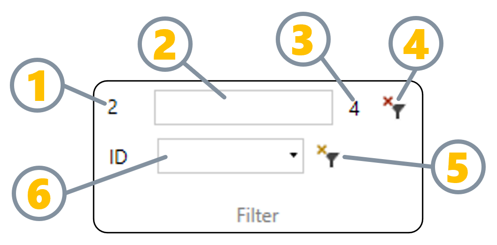
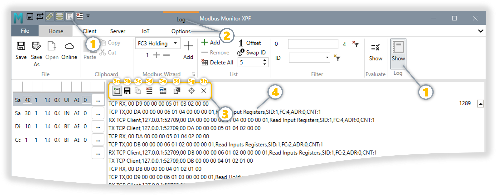
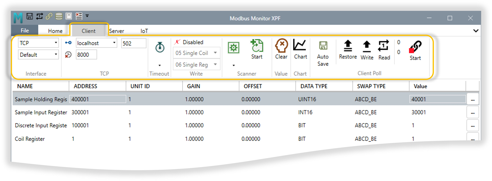
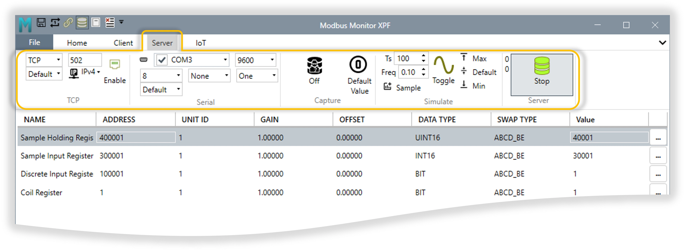

# Modbus Monitor XPF - User Guide

**A practical guide for controls engineers and technicians**

<!-- [TOC] -->

## 1. Introduction

**Modbus Monitor XPF** is a versatile Windows application for facilitating communication between a Windows-based PC and Modbus Client or Server devices. It handles both Client (Master) and Server (Slave) operations and supports all common Modbus variants: TCP/IP, Serial RTU, Serial ASCII, and RTU/ASCII over TCP.

{ .screenshot-shadow }

**One of the standout features** of Modbus Monitor XPF is its **dual functionality** - it encompasses both a Modbus Client and a Modbus Server **within a single application, running simultaneously**. This dual capability, combined with support for both Modbus Serial and Modbus TCP protocols, makes it an invaluable tool for various Modbus communication needs.

**What you can do with it:**

- Monitor live data from PLCs, drives, meters, and other Modbus devices
- Write values to registers and coils for testing or control
- Simulate Modbus devices for testing your own equipment
- Scan unknown devices to discover their register maps
- Log data for analysis and troubleshooting
- Validate register values against expected ranges
- **Run Client and Server modes simultaneously** on one PC

**Who this is for:**

- Controls engineers commissioning systems
- Maintenance technicians troubleshooting communications
- System integrators testing device compatibility  
- Equipment manufacturers validating Modbus implementations
- SCADA developers needing device simulation without physical hardware

### What Makes This Different

Most Modbus tools are either simple monitors or complex SCADA packages. XPF sits in the middle - it's powerful enough for serious work but simple enough to use quickly. The key advantages:

1. **Runs both Master and Slave simultaneously** - Test client-server interactions on one PC without physical devices
2. **Pre-built device maps** - Download factory-validated maps or community-contributed maps for common equipment
3. **Built-in data validation** - Automatic pass/fail testing with color coding
4. **Professional logging** - Proper timestamped records for troubleshooting
5. **Cross-platform protocol support** - Mix Modbus TCP, RTU, ASCII in the same session

### Learning Resources

Beyond this user guide, additional resources are available:

- **[YouTube Tutorials](https://www.youtube.com/@ModbusMonitor/videos)** - Short demonstrations of features and workflows
- **[Online Help](https://quantumbitsolutions.com/xpf-help/)** - Comprehensive web-based documentation
- **[Community Forum](https://quantumbitsolutions.com/forums/)** - User discussions and troubleshooting help

## 2. Installation & Activation

### System Requirements

=== "Quick Reference"

    **Minimum Requirements:**
    
    - Windows 10 or 11 (64-bit recommended)
    - .NET Framework 4.8 or later
    - 4GB RAM minimum, 8GB recommended
    - 100-500 MB free disk space
    - Serial ports (USB-to-serial adapters work fine)
    - Network access for TCP/IP communications

=== "64-bit Version (Recommended)"

    | Component | Minimum | Recommended | Notes |
    |-----------|---------|-------------|--------|
    | **OS** | Windows 10 x64 | Windows 11 x64 | Most modern systems |
    | **RAM** | 4 GB | 8 GB+ | More memory = better performance |
    | **Storage** | 100 MB | 500 MB | Depends on log file size |
    | **.NET** | Framework 4.8+ | Latest Version | Usually pre-installed |
    | **Ports** | USB or Ethernet | Multiple adapters | For Modbus connections |

=== "32-bit Version"

    | Component | Minimum | Recommended | Notes |
    |-----------|---------|-------------|--------|
    | **OS** | Windows 10 x86 | Windows 11 x86 | Older or embedded systems |
    | **RAM** | 2 GB | 4 GB | 32-bit limit is ~3.5 GB total |
    | **Storage** | 100 MB | 200 MB | Smaller footprint |
    | **.NET** | Framework 4.8+ | Latest Version | Same as 64-bit |
    | **Ports** | USB or Ethernet | Multiple adapters | Full feature compatibility |

=== "Field Laptop Setup"

    **Recommended for field work:**
    
    - Rugged laptop with Windows 10/11
    - USB-to-serial adapter (FTDI chipset recommended)
    - Ethernet port for Modbus TCP
    - 8GB RAM for smooth operation
    - **Portable version** - No installation needed, runs from USB drive
    
    !!! tip "Field Technician Tip"
        Keep the portable version on a USB drive alongside your serial adapters. You can run it on any Windows machine without installation rights.

### Getting the Software

=== "Microsoft Store (Recommended)"

    **Install via Microsoft Store - Easiest Method**
    
    Search for "Modbus Monitor XPF" directly in the Microsoft Store on your Windows Desktop. Once installed, the application can be accessed from the Start Menu.
    
    **Benefits:**
    - **Automatic updates** and license management
    - **No admin rights** needed for installation
    - **Universal binary** - Works on both 32-bit and 64-bit Windows
    - **License per user** (not per machine) - follows your Microsoft Account
    - **Automatic cloud licensing** - Purchase and activate through Store
    
    [:material-microsoft-windows: Get from Microsoft Store](ms-windows-store://pdp/?productid=9PG862WL5HSM){ .md-button .md-button--primary }
    
    Or visit the web store: [Microsoft Store Product Page](https://www.microsoft.com/store/apps/9PG862WL5HSM)

=== "Direct Download from Web"

    **Install from the Web - Portable or Installer Options**
    
    Visit QuantumBitSolutions.com Download or Shop pages to download or purchase the application.
    
    **Portable Version:**
    - The software is a **portable version**, meaning it can be **run from any location without requiring installation**
    - **First launch note:** Slight delay is normal as the application unpacks files to a temporary location
    - Perfect for USB drives or systems without admin rights
    - Keep it with your field equipment for on-site troubleshooting
    
    **Choose your architecture and installation type:**

    | Architecture | Installer (Permanent Setup) | Portable (No Install) |
    |-------------|------------------------------|------------------------|
    | **64-bit** *(Recommended for modern systems)* | [:material-download: x64 Installer](https://quantumbitsolutions.com/download/ModbusMonitor_XPF_x64_Installer.zip){ .md-button } | [:material-download: x64 Portable](https://quantumbitsolutions.com/download/Modbus_Monitor_XPFx64.zip){ .md-button } |
    | **32-bit** *(Older systems only)* | [:material-download: x86 Installer](https://quantumbitsolutions.com/download/ModbusMonitor_XPF_x86_Installer.zip){ .md-button } | [:material-download: x86 Portable](https://quantumbitsolutions.com/download/Modbus_Monitor_XPFx86.zip){ .md-button } |

    **Additional Download Locations:**
    - [:material-download: Download Page](https://quantumbitsolutions.com/purchase/) - All versions available
    - [:material-cart: Shop Page](https://quantumbitsolutions.com/shop/) - Purchase with download links
    
    **What's the difference?**
    
    - **Installer:** Creates shortcuts, integrates with Windows, faster startup
    - **Portable:** No installation needed, run from USB drives, good for field work
    - **64-bit:** Works on modern Windows (2010+), handles large datasets better  
    - **32-bit:** Only needed for older Windows systems or embedded PCs

=== "Enterprise Purchase"

    **Volume licensing and site deployments**    
    - **Multiple machine licenses** available
    - **Offline licensing** for air-gapped networks
    - **Volume discounts** for large deployments
    - **Purchase orders** and invoice billing accepted
    
    [:material-email: Enterprise Sales](https://quantumbitsolutions.com/contact-us/){ .md-button }
    [:material-cart: Browse License Options](https://quantumbitsolutions.com/shop/){ .md-button }

!!! note "Which Version Should I Choose?"
    **Most users:** Choose the **64-bit version** - it works on modern Windows systems and handles large datasets better.
    
    **Use 32-bit version if:**
    - Running on older Windows systems (pre-2010)
    - Using embedded/industrial PCs with 32-bit OS
    - Company policy requires 32-bit applications
    
    **Installer vs Portable:**
    - **Installer:** Better for permanent desk setups, adds shortcuts and file associations
    - **Portable:** Better for field work, USB drives, or systems without admin rights

### License Activation

This section walks you through activating the license for your Modbus Monitor XPF software. The License window provides several buttons and fields to help you navigate the activation process.

**First Launch Experience:**

When you launch Modbus Monitor XPF for the first time, the **License window appears automatically**. This window displays:

- **UID (User Identification)** - Your unique identifier for license purchases
- **License Information Panel** - Shows current license status (Trial or Licensed)
- **Hardware ID (HWID)** - Used for certain license types
- **Licensing Buttons** - Store, Shop, Activate, Load, Trial, Exit

**Licensing Buttons Overview:**

| Button | Purpose | When to Use |
|--------|---------|-------------|
| **Store** | Microsoft Store purchase & activation | Purchase through Microsoft Store or activate Store license |
| **Shop** | Online shop page | Opens web browser to quantumbitsolutions.com/shop |
| **Activate** | Enter license key | After purchasing online key-based license |
| **Load** | Load license file | For `.lic` files (enterprise/offline licenses) |
| **Trial** | Start trial mode | Begin evaluation period with full features |
| **Exit** | Close license window | Exit the application |

!!! info "Trial Version - Full Featured Evaluation"
    **Free trial with ALL features unlocked** - No credit card required. Perfect for testing before purchase.
    
    **Starting Trial Mode:**
    1. Launch XPF for the first time
    2. License window appears automatically
    3. Click **"Trial"** button to begin evaluation period
    4. License Information Panel shows how many days are left in your evaluation period
    5. Start using the application immediately with limited functionality. Runtime and some features are restricted and requires full license.

**Main Steps to Activate the Software:**

1. **Purchase License** - Click "Store" or "Shop" button to visit licensing store and complete purchase
2. **Load or Enter Key** - After purchase, load license file (enterprise) or enter license key (online purchase)
3. **Verify Activation** - License Information Panel confirms activation status and trial mode is disabled

**Choose your activation method based on how you obtained the software:**

=== "Microsoft Store (Easiest)"

    **Automatic activation with Microsoft Account**
    
    The Microsoft Store version handles licensing automatically - no manual activation needed!
    
    **Purchase & Activation Flow:**
    
    1. **Open License Window**
       - Launch Modbus Monitor XPF
       - The license dialog appears automatically on first launch
       - Or go to **File Tab → About → Activate** button
    
    2. **Click "Store" Button**
       - Opens Microsoft Store purchase page
       - Your UID is automatically included in the purchase
    
    3. **Complete Purchase**
       - Sign in with your Microsoft Account
       - Complete payment in the Microsoft Store
       - Purchase is linked to your Microsoft Account
    
    4. **Activate License**
       - Return to XPF License window
       - **Click "Store" button again** to activate
       - System verifies purchase with Microsoft
       - Status changes to "Licensed" immediately
    
    **Benefits:**
    
    - No manual license key entry required  
    - Automatic renewal options available  
    - License tied to Microsoft Account (not individual PC)  
    - Easy reinstallation on any Windows device  
    - Can be used on new computers with same Microsoft Account
    
    !!! tip "Multi-Computer Usage"
        Microsoft Store licenses follow your Microsoft Account. Install on multiple devices and sign in with the same account - the Store button activates on each installation automatically!
    
    !!! note "License Window Location"
        Access the license window through: **File Tab → About section → Activate button**
    
    <!-- Screenshot placeholder: xpf-store-activation.png -->
    <!-- Shows: License window with Store button highlighted, UID field, License Information Panel -->

=== "Online Purchase (Direct)"

    **Manual activation with license key**
    
    For licenses purchased directly from quantumbitsolutions.com using online Shop or purchase buttons.
    
    **Step-by-Step Activation:**
    
    1. **Get Your UID (BEFORE Purchasing!)**
       - Launch Modbus Monitor XPF
       - Go to **File Tab → About → Activate** button
       - License window opens showing your **UID (User Identification)**
       - Format looks like: `ABC123-DEF456-GHI789` or similar alphanumeric code
       - **Click "Copy" button** next to the UID field
       - Save this UID - it's required for purchasing your license
    
    2. **Purchase License Online**
       - Click the **"Shop"** button in the License window (opens shop page)
       - Or visit [:material-cart: quantumbitsolutions.com/shop](https://quantumbitsolutions.com/shop/) directly
       - Select **Modbus Monitor XPF** license
       - **Enter your UID** in the order form (critical step!)
       - Complete payment through the online system
    
    3. **Receive License Key via Email**
       - Check your email inbox (usually arrives within minutes)
       - License key format: `XXXX-XXXX-XXXX-XXXX-XXXX` (5 groups separated by dashes)
       - **Save this email** - you'll need it for reinstallation on other computers
       - Note: Key is permanently tied to your UID
    
    4. **Activate in XPF**
       - Return to the License window (File Tab → About → Activate)
       - Click **"Activate"** button in the Licensing Buttons section
       - **Paste your complete license key** in the entry field
       - System verifies the key online
       - License Information Panel updates to show **"Licensed"** status
    
    !!! warning "Critical: Provide UID When Purchasing!"
        Your license key is permanently bound to your UID. If you purchase without providing your UID, the key won't work and you'll need to contact support for a replacement key.
    
    **License Window Components:**
    
    | Component | Description |
    |-----------|-------------|
    | **UID Field** | Displays your unique User Identification code |
    | **Copy Button** | Copies UID to clipboard for purchase form |
    | **License Information Panel** | Shows current license status (Trial or Licensed) |
    | **Activate Button** | Opens field to enter license key for activation |
    | **Shop Button** | Opens online shop to purchase license |
    
    **Troubleshooting:**
    
    - **"Invalid Key" error:** Verify you copied the entire key including all dashes, no extra spaces
    - **"UID Mismatch":** Key was purchased for different UID - contact support with both UID and key
    - **"Connection Error":** Activation requires internet connection - check firewall settings
    - **Key not working:** Ensure you're entering the key in the Activate dialog, not the Trial field
    
    { .screenshot-shadow }
    
    <!-- Additional screenshot needs:
         - xpf-license-dialog-annotated.png: Shows all buttons (Store, Shop, Activate, Load, Trial, Exit) with UID field and Copy button labeled
         - xpf-enter-key-dialog.png: Shows Activate dialog with license key entry field
         - xpf-activation-success.png: Shows License Information Panel with "Licensed" status
    -->

=== "Enterprise/Site License"

    **License file for multiple installations or air-gapped systems**
    
    For organizations needing multiple installations, offline activation, or centralized license management.
    
    **License Types:**
    
    | License Type | Use Case | Activation Method |
    |--------------|----------|-------------------|
    | **Site License** | Multiple PCs at one location | License file (`.lic`) or keys |
    | **Volume License** | Many installations, any location | Multiple keys or license files |
    | **Offline License** | Air-gapped networks, no internet | Special license file only |
    | **OEM License** | Bundled with equipment | Custom activation method |
    
    **Activation with License File (`.lic`):**
    
    1. **Contact Sales for Enterprise Licensing**
       - Email [:material-email: sales@quantumbitsolutions.com](mailto:sales@quantumbitsolutions.com)
       - Provide: Number of seats needed, deployment location(s), offline requirements
       - Discuss: Site license, volume pricing, offline activation needs
       - Receive: Quote and purchase order details
    
    2. **Receive License File**
       - Sales team provides special `.lic` license file after purchase
       - File contains all activation data embedded
       - **No internet connection required** for activation with license file
       - Can be used on multiple PCs (based on license terms)
    
    3. **Load License File on Each Computer**
       - Launch Modbus Monitor XPF
       - Open License window: **File Tab → About → Activate**
       - Click **"Load"** button in the Licensing Buttons section
       - File browser opens
       - Navigate to your `.lic` file location
       - Select the license file and click Open
       - License Information Panel immediately shows **"Licensed"** status
       - **No internet verification needed** - file contains authorization
    
    4. **Deploy to Multiple Systems**
       - Copy the same `.lic` file to all licensed computers (via USB, network share, etc.)
       - Install XPF on each system
       - Repeat Step 3 (Load License File) on each installation
       - All systems activate instantly with the same file
    
    **Alternative: Offline Key Activation**
    
    If you need to activate with a license key on air-gapped systems:
    
    1. **Generate Activation Request**
       - On offline PC: Open License window
       - Note your **UID** and **Hardware ID (HWID)** shown in License Information Panel
       - Provide these to support via email (from internet-connected PC)
    
    2. **Receive Offline License Key**
       - Support generates special offline key tied to your UID/HWID
       - Transfer key to offline system (USB drive, printed paper, etc.)
    
    3. **Enter Key on Offline System**
       - Click **"Activate"** button in License window
       - Enter the offline license key
       - System validates locally without internet
       - Status changes to "Licensed"
    
    **Enterprise Support Benefits:**
    
    - Priority email support response (24-hour guarantee)  
    - Optional phone support available  
    - Custom Service Level Agreements (SLAs)  
    - Dedicated account management  
    - Volume discount pricing  
    - Flexible deployment options (offline, network, etc.)  
    - Purchase order and invoice billing accepted
    
    !!! tip "Recommended for Industrial Environments"
        License files (`.lic`) are ideal for secure facilities, air-gapped networks, or environments where internet access is restricted for security reasons.
    
    [:material-email: Contact Enterprise Sales](https://quantumbitsolutions.com/contact-us/){ .md-button .md-button--primary }
    [:material-cart: View Volume License Options](https://quantumbitsolutions.com/shop/){ .md-button }
    
    <!-- Screenshot placeholder: xpf-load-license-file.png -->
    <!-- Shows: License window with Load button highlighted, file browser dialog with .lic file selected -->

=== "Troubleshooting"

    **Common installation and activation issues**
    
    ### Installation Problems
    
    **Application won't start or crashes immediately:**
    
    - Install latest .NET Framework from Microsoft
    - Right-click XPF → "Run as Administrator"
    - Check Windows Defender isn't blocking the application
    - Verify system meets minimum requirements (Windows 10/11)
    
    **Serial ports not showing in interface:**
    
    - Install drivers for your USB-to-serial adapter
    - Check Device Manager for COM port assignments
    - Some generic adapters need specific drivers (FTDI, Prolific, etc.)
    - Try different USB ports if adapter not recognized
    
    **Network connection problems:**
    
    - Windows Firewall may block Modbus TCP (port 502)
    - Add firewall exception: Control Panel → Windows Defender Firewall → Allow an app
    - Corporate networks sometimes block non-standard ports
    - Verify IP address and subnet configuration
    
    ### Activation Issues
    
    **"Invalid Key" error when activating:**
    
    - Verify you copied the complete license key (including all dashes)
    - Check for extra spaces at beginning or end of key
    - Ensure key matches the UID shown in License window
    - Contact support if key was purchased for different UID
    
    **"Connection Error" during activation:**
    
    - Check internet connection is active
    - Verify firewall isn't blocking XPF's internet access
    - Try temporarily disabling antivirus software
    - Some corporate proxies block activation - contact IT
    
    **Microsoft Store activation not working:**
    
    - Ensure you're signed in with correct Microsoft Account
    - Check Microsoft Store app is updated to latest version
    - Try signing out and back in to Microsoft Account
    - Restart XPF after completing purchase
    
    **License shows "Expired" unexpectedly:**
    
    - Verify system clock is set correctly (wrong date can cause this)
    - Check if subscription renewal payment failed
    - Contact support to verify license status
    
    ### Performance Issues
    
    **Slow startup or sluggish performance:**
    
    - Close unnecessary applications consuming RAM
    - Check for Windows updates pending installation
    - Disable communication logging when not needed
    - Reduce number of monitor points being polled
    
    **High memory usage:**
    
    - Disable Event Log if not needed (major memory consumer)
    - Limit chart buffer size (set Samples value instead of unlimited)
    - Clear log files periodically
    - Reduce poll rate for large register lists
    
    ### Still Having Issues?
    
    **Email Support:** support@quantumbitsolutions.com  
    **Community Forum:** [quantumbitsolutions.com/forums](https://quantumbitsolutions.com/forums/)  
    **Knowledge Base:** [Technical Resources](../../technical/index.md)

**License Comparison:**

| Feature | Trial | Standard | Enterprise |
|---------|-------|----------|------------|
| **Duration** | Time-limited | Perpetual | Perpetual |
| **Full Features** | Yes | Yes | Yes |
| **Updates** | During trial | 1 year included | Custom terms |
| **Installations** | 1 PC | 1 PC per license | Multiple PCs |
| **Support** | Community forum | Email support | Priority support |
| **Offline Use** | Yes | Yes | Yes (special activation) |
| **Price** | Free | [View pricing](https://quantumbitsolutions.com/shop/) | Contact sales |

## 3. Understanding the Interface

### Application Window

The main application window of Modbus Monitor XPF is organized into several key sections that work together to provide a comprehensive Modbus communication interface.

{ .screenshot-shadow }
*Figure 3.1: Main application interface showing five key areas (1, 2, 3, 4, 5)*

**Interface Component Structure:**


**The application window contains five main areas:**

!!! tip "Cross-Reference with Screenshot and Diagram"
    Each numbered section (**1, 2, 3, 4, 5**) in the annotated screenshot and the diagram above corresponds to the detailed descriptions below. Use these visual guides to quickly locate features in the actual application.

#### 1. Quick Access Toolbar

Located at the very top, this toolbar provides one-click access to frequently used commands. **You can customize which buttons appear** by right-clicking the toolbar.

**Available Quick Access Toolbar Buttons:**

| Button | Function | Description |
|--------|----------|-------------|
| **Save** | Save configuration | Quickly save your current Modbus map configuration to CSV file |
| **Open** | Open file | Load previously saved configuration |
| **Chart** | Open chart view | Switch to Chart visualization window |
| **Read** | Read once | Poll all monitoring points once and stop |
| **Write** | Write once | Write selected monitor point value once |
| **Client** | Modbus Client | Start/Stop continuous polling of all monitoring points |
| **Server** | Modbus Server | Start/Stop Modbus Server |
| **Show** | Show log | Toggle Event Log / Communication Log view |
| **Start** | Log Controls| Start/Stop Communication events captures |
| **Clear** | Clear logs | Clear all entries from Communication Log window |

**Customization Options:**

- **Show Below the Ribbon**: Position toolbar below ribbon tabs instead of above
- **Checkmarks**: Indicate which buttons are currently visible on toolbar
- **Right-click**: Access customization menu any time
- **Add/Remove**: Click any button name to toggle its visibility

!!! tip "Recommended Quick Access Setup"
    **For daily operations**, most technicians keep these buttons visible:
    
    - **Save** - Quick configuration saves during field work
    - **Read** - Single poll to check current values
    - **Start/Stop** - Control polling quickly
    - **Show** - Toggle between Monitor Points and Log views
    - **Clear** - Clear logs between test runs
    
    This provides instant access to 90% of common operations without navigating through ribbon tabs.

#### 2. Ribbon Tabs Overview

Below the Quick Access Toolbar, you'll find multiple tabs that organize all application features. The standard Modbus Monitor XPF ribbon contains the following tabs, from left to right:

**Standard Tabs (Always Visible):**

| Tab | Purpose | Key Features |
|-----|---------|--------------|
| **File** | Backstage view | File operations, licensing, theme settings, recent files, online resources, exit |
| **Home** | Main Operations | Copy/paste, Modbus Wizard, list management, filtering, evaluation |
| **Client** | Modbus Client (Master) | Interface selection, timeouts, write functions, scanner, charts, poll controls |
| **Server** | Modbus Server (Slave) | Interface config, Modbus TCP Server, Modbus RTU Server, traffic capture, simulation |
| **IoT** | Cloud integration | ThingSpeak logging, MQTT messaging, cloud-to-device communication |

**Contextual Tabs (Appear Dynamically):**

| Tab | Trigger | Key Features |
|-----|---------|--------------|
| **Log Options** | Event Log active | Filter errors, export logs, auto-scroll, timestamp format, clear history |

!!! note "How Contextual Tabs Work"
    Contextual tabs (also known as Option Tabs) appear only when you activate specific features, providing relevant controls without cluttering the interface.
    
    **Examples:**
    - Click **Show** button in Home tab → Log group → **Log Options** tab appears
    
    When you deactivate the feature (close log, close chart), the contextual tab automatically disappears.

The active tab is highlighted, making it easy to see which commands are currently available.

#### 3. Command Groups (Ribbon Commands)

In the middle section of each ribbon tab, you'll find groups of related command buttons:

- **Add Device** - Add new monitor points to your list
- **Delete Device** - Remove selected monitor points
- **Offset ID** - Change address base or Unit ID for all points
- And many more, organized by function

Buttons are accompanied by icons and arrows indicating their functions and options.

#### 4. Dialog Launcher

Small buttons in the corner of command groups that open additional settings or options:

| Feature | Location | Purpose |
|---------|----------|---------|
| **Arrow Icon** | Bottom-right of command groups | Opens extended dialogs |
| **Advanced Options** | Context-specific dialogs | Access detailed settings |
| **Extended Settings** | Beyond ribbon display | Configure advanced parameters |

#### 5. Window Portal Area

The main workspace at the bottom displays different information depending on the selected mode:

| View | Trigger | Display Content |
|------|---------|-----------------|
| **Monitor Points List** | Default view | Table showing all Modbus monitoring points with Name, Address, Unit ID, Value, and register details |
| **Log Window** | Log button toggled | Communication events and Modbus traffic history |
| **Chart Window** | Chart button active | Time-series data visualization and trend analysis |
| **Online Maps Navigator** | Online button toggled | Browse and download pre-built Modbus maps from factory/community |

Each view provides relevant information for the specific task being performed.

### Complete Ribbon Tab Reference

This section provides comprehensive coverage of all ribbon tabs and their functionality. Each tab contains groups of related commands organized by function.

#### File Tab

The **File Tab** provides access to the backstage view containing essential file operations, application settings, license management, and resources. Click the **File** tab to enter this full-screen view.

##### Home Section

The Home section provides quick access to your file system and document management:

| Feature | Icon/Button | Description |
|---------|-------------|-------------|
| **Home** | Home button | Navigate to Documents folder |
| **Open** | Folder icon | Open folder in Windows Explorer |
| **Up** | Up arrow | Move up one level in directory tree |
| **Current Folder** | `<Documents>` | Displays current folder name |

##### Recent Section

Quick access to recently used Modbus maps and configurations:

| Button | Function | Description |
|--------|----------|-------------|
| **Refresh** | Update list | Refresh the recent files list |
| **Open Folder** | Show location | Opens folder containing selected file |
| **Open File** | Load map | Loads selected configuration in XPF |
| **Remove** | Delete entry | Remove selected file from recent list |
| **Delete** | Clear all | Deletes all entries from recent list |

!!! tip "Quick File Access"
    The Recent Files list is the fastest way to switch between different device configurations. Your most commonly used maps are always one click away.

##### About Section

Access version information, documentation, and support resources:

| Option | Description | Action |
|--------|-------------|--------|
| **Version** | Current application version | Displays installed version number |
| **Activate** | License activation | Opens license window for activation |
| **Submit Feedback** | User feedback | Direct feedback to developers |
| **Documentation** | Online help | Access comprehensive online help |
| **Videos** | Tutorial videos | Links to YouTube tutorials |
| **Contact Email** | Support contact | Email address for inquiries |
| **Privacy Policy** | Data handling | View privacy policy details |
| **EULA** | License agreement | End User License Agreement terms |

**Quick Actions:**

- **Need help?** Click **Documentation** for online guides
- **New to XPF?** Click **Videos** for visual tutorials  
- **License issues?** Click **Activate** to manage licenses
- **Feature requests?** Use **Submit Feedback**

##### Settings Section

Customize the application theme to match your environment:

| Theme | Description | Best For |
|-------|-------------|----------|
| **Light** | Bright interface | Well-lit environments, daytime use |
| **Dark** | Dark interface | Low-light environments, reduced eye strain |
| **System Default** | Follows Windows | Automatically matches Windows theme |

**Theme Selection:**

1. Click **File Tab** → **Settings**
2. Choose theme from dropdown
3. Theme applies immediately (no restart needed)

!!! tip "Field Work Preference"
    Many field technicians prefer **Dark theme** when working in dimly lit equipment rooms or cabinets.

##### Exit

**Exit** button safely closes the Modbus Monitor XPF application:

- **Saves** current window position and settings
- **Prompts** to save unsaved changes (if any)
- **Terminates** all active connections properly
- **Releases** serial ports and network resources

#### Home Tab

The **Home Tab** contains the most frequently used commands for essential operations - everything you need for working with Modbus maps and monitoring points.


##### File Group

**Import and Export Documents** - Manage Documents, Import and Export Modbus Maps in CSV format. Access pre-built Modbus Maps for common devices (VFDs, Energy Meters, PLCs) from factory-validated or community sources.

| Feature | Description | Details |
|---------|-------------|---------|
| **Save** | Save current document in CSV format | Preserves entire Modbus map configuration including monitor points, settings, and extended properties for reuse |
| **Save As** | Save As New document | Preserves entire Modbus map configuration including monitor points, settings, and extended properties for reuse |
| **Open** | Open previously saved file | Load saved XPF configuration files (CSV format) from any location |
| **Online** | Download Modbus Maps from online folder or community | Access pre-configured maps from (1) factory-released validated maps or (2) community-uploaded maps. See detailed explanation below. |

!!! note "CSV Format Benefits"
    XPF saves configurations as standard CSV files, making them easy to:
    
    - **Edit** in Excel or text editors for batch modifications
    - **Version control** using Git or other systems
    - **Share** with team members or across sites
    - **Document** device configurations for compliance

##### Clipboard Group

**Copy and Paste Operations** - Transfer data between XPF and external applications like Excel. Copy, paste, and cut monitor points for quick duplication or reorganization.

| Operation | Shortcut | Description |
|-----------|----------|-------------|
| **Paste** | `Ctrl+V` | Paste from clipboard from selected row(s) - either from the application or Microsoft Excel. Adds to end of list. |
| **Copy** | `Ctrl+C` | Copy selected single or multiple row(s) to clipboard. Multiple sequential rows can be selected with Shift+Click's first and last row. Multiple rows in any order using Control+Click. |
| **Cut** | `Ctrl+X` | Copy the content of the current item to clipboard and delete the item from the list. |

##### Modbus Wizard Group

The **Modbus Wizard** provides a streamlined interface for configuring monitor points without manually editing the table. Access it by clicking the **Dialog Launcher** (small arrow) in the Modbus Wizard group corner.

{ .screenshot-shadow }
*Modbus Wizard configuration interface*

**Configuration Fields:**

| Field | Purpose | Options/Format |
|-------|---------|----------------|
| **Register Name** | Descriptive identifier | Text field - name your monitor point |
| **Modbus Function** | Register type and access | See [Function Codes](#2-address-field-6-digit-format) reference below |
| **Sub-Function** | Function variant *(FC8 only)* | Appears for FC8 Diagnostics - e.g., "0 (0x0) Return Query Data" |
| **Device ID** | Device identification type *(FC43-14 only)* | Appears for FC43-14 - e.g., "01 Get Basic Device ID (stream)" |
| **Object ID** | MEI object identifier *(FC43-14 only)* | Appears for FC43-14 - Object number (00-FF hexadecimal) |
| **CustomQ** | Custom Modbus Packet | Add PDU part of the Modbus Command to send any command  |
| **Data Request** | Request address/value | Address or data value for the request |
| **Address** |  Modbus Address | Zero or One based Modbus Address (see [6-digit format](#2-address-field-6-digit-format)) |
| **Data Type** | Data interpretation | See [Data Types](#3-data-type-options) reference below |
| **Poll Rate Control** | Update frequency | NONE, SKIP, ONCE, INTERVAL (Adjust Poll Rate value) |
| **Bit Field** | Extract specific bit | 0-15 for 16-bit registers - selects individual bit |
| **Write Only** | Skip during reads | Checkbox - for write-only registers |

!!! info "Function-Specific Fields"
    The wizard dynamically displays additional fields based on the selected Modbus Function:
    
    - **FC8 Diagnostics**: Shows `Sub-Function` dropdown with diagnostic test options
    - **FC43-14 Read Device Identification**: Shows `Device ID` and `Object ID` fields for MEI object selection
    - These fields only appear when their corresponding function is selected

##### List Group

**Add and Remove Points** - Add, remove, or modify monitor points in bulk. Change addressing modes (0-based/1-based), swap Unit IDs globally, or set decimal precision for all numeric displays.

The **List Group** provides essential tools for managing your Monitor Points (also called Rows or Items) in the configuration table:

| Button | Function | Description |
|--------|----------|-------------|
| **Add** | Add new point | Creates new row with default values. Automatically **increments address by one** from the last row for quick sequential entry. |
| **Remove** | Delete selected point(s) | Removes selected monitor point(s) from the table. Select multiple with `Ctrl+Click` (non-sequential) or `Shift+Click` (range). |
| **Delete All** | Clear entire list | Removes **ALL monitor points** from the table. **Use with caution** - this action cannot be undone! |
| **Offset** | Toggle address base | Switch between **1-based** (1-65536) and **0-based** (0-65535) addressing for all addresses in the list. |
| **Swap ID** | Change Unit ID globally | Updates **Unit ID** (Slave/Station ID) for **all monitor points** at once. Useful when reconfiguring for a different device. |
| **Decimal Places** | Set display precision | Configure the number of decimal places for displaying numeric values throughout the application. |

##### Filter Group

**Search and Filter Monitor Points** - Search Name and Address fields to quickly locate specific monitor points. Filter large lists by text search or Unit ID to focus on relevant registers during troubleshooting or configuration.

{ .screenshot-shadow }

**Filter Components:**

| Label | Component | Description |
|-------|-----------|-------------|
| **1** | **Row Index**| Shows the **index of the currently selected row**. Especially useful when the list is filtered to know the true row number. -1 when none Selected.|
| **2** | **Filter Text Box** | Enter text to search. Filters all **Name** and **Address** fields that contain the entered text. |
| **3** | **Total Rows** | Shows the **total number of rows** in the current view (filtered or full list). |
| **4** | **Clear Filter**| Clears the text filter and shows all rows in the list. |
| **5** | **Clear ID** | Clears the ID filter and shows all rows in the list. |
| **6** | **ID Dropdown** | Select **Unit ID** (Slave ID or Station ID) to filter by device. Combine with text filter for precise results. |

##### Evaluate Group

**Value Validation and Testing** - Validate register values against configurable limits with automatic color coding. Set pass/fail thresholds for quality control testing or equipment health monitoring.

Change the background colors of the Value cell based on the High, Low, and Nominal Limits. **Quickly validate the value from the Modbus device and test to see if it is within the valid range.**

{ .screenshot-shadow }

##### Log Group

**Communication Monitoring and Logging** - View and record all Modbus communication traffic for troubleshooting. Filter errors, export logs to file, and timestamp all events for accurate diagnostics.

{ .screenshot-shadow }
*Four key areas: 1 Log Group (Home Tab), 2 Options Tab, 3 Quick Access Header (3a-3h), 4 Log Window*

**Complete Log Controls Reference:**

All log controls in one comprehensive table. Labels **1**, **2**, **3a-3h**, and **4** correspond to the screenshot above.

| Label | Control | Location | Type | Function |
|-------|---------|----------|------|----------|
| **1** | **Show** | Home Tab → Log Group | Toggle Button | Show/hide Event Log view. **Pressed**: Replaces Monitor Points table with log display, Options tab appears. **Released**: Returns to Monitor Points table. |
| **2** | **Log/Options Tab** | Contextual Ribbon | Dynamic Tab | Appears when log is active. Contains logging and filter controls. Disappears when log closed (logging continues in background if started). |
| **2** | **Filter** | Quick Access Header or Options Tab | Text Input Box | Real-time text search. Type to filter log entries, clear to show all. Case-insensitive search. |
| **2** | **Errors** | Options Tab | Toggle Button | **Checked**: Show errors only (timeouts, exceptions). **Unchecked**: Show all events (success + errors). |
| **3a or 2** | **Start/Stop** | Quick Access Header or Options Tab | Toggle Button | **Start**: Begin capturing events. **Stop**: Pause recording. Auto-resumes if saved while running. |
| **3b or 2** | **Auto Save** | Quick Access Header or Options Tab | Toggle Button | **ON**: Continuously writes log to Documents folder. **OFF**: Logs remain in memory only. |
| **3c or 2** | **Copy All** | Quick Access Header or Options Tab | Button | Export all visible log entries to clipboard (timestamp + details). Paste into Excel, email, or text editor. Click on any log entry to enable this button. |
| **3d  or 2** | **Clear** | Quick Access Header or Options Tab | Button | Delete all log entries from display. **Warning**: Cannot be undone. Save or copy important logs first. |
| **3e** | **Save** | Quick Access Header | Button | Save current log entries to a file in Documents folder. |
| **3f** | **Float** | Quick Access Header | Button | Float the Log window outside the application's main window as a separate window. |
| **3g** | **Expand** | Quick Access Header | Button | Expand log window to full screen or restore to normal size. |
| **3h or 2** | **Close** | Quick Access Header or Options Tab | Button | Close Log Window and return to Monitor Points (logging continues in background if started). |
| **4** | **Log Window** | Window Portal Area | Display Panel | Shows timestamped communication events. Replaces Monitor Points table when log is active. |

##### Online Maps Group

**Cloud-Based Modbus Maps** - View and Download Online Modbus Maps from either **(1) factory-released maps** by Modbus Monitor or **(2) community-uploaded maps** from users. Toggle the **Online** button in the File group located in the Home tab to activate this feature. **An internet connection is required** to use this feature.


*How to download pre-defined Modbus Map*

#### Client Tab

**Client Mode Overview:** XPF operates as a Modbus Master (Client) when you want to read data from or write data to remote Modbus devices. In this mode, XPF initiates all communication by sending requests to Modbus Server devices (PLCs, drives, meters, sensors) and processes their responses.



##### Client Tab Groups & Features

**Complete reference for all Client tab ribbon groups and their functionality:**

| Group | Purpose | Key Features | Description |
|-------|---------|--------------|-------------|
| **Interface** | Protocol Selection | Interface Type, Protocol Options, One-Based Toggle | Choose connection type (TCP/UDP/Serial) and Modbus protocol variant (Standard/RTU/ASCII) |
| **TCP** | Network Settings | IP Address, Port, Connection Timeout | Configure Ethernet-based connections with IP address, port number, and connection timeout settings |
| **COM** | Serial Settings | COM Port, Baud Rate, Data Bits, Parity, Stop Bits | Configure serial communication parameters for RTU/ASCII over RS232/RS485 connections |
| **Timeout** | Timing Control | Response Timeout, Inter-Frame Delay, Poll Rate, Retries | Critical timing parameters for reliable communication and performance optimization |
| **Write** | Write Operations | Auto/Manual Mode, Function Code Selection | Control how value changes are written to devices - automatic smart selection or manual function code control |
| **Scanner** | Address Discovery | Start Address, Register Count, Data Type, Swap Type, Unit ID | Systematically discover unknown registers and automatically build monitor point lists |
| **Value** | Data Management | Clear Values Toggle | **Click**: Immediately clears all values from display. **Toggle ON**: Automatically clears all monitor point values before starting each polling cycle for fresh data collection |
| **Chart** | Data Visualization | Chart Button | Switch to real-time charting view for trending analysis of tagged monitor points |
| **Client Poll** | Operation Control | Auto Save, Restore, Write, Read, Statistics, Start/Stop | Main operational controls for polling, data collection, and client status monitoring |

#### Server Tab

**Server Mode Overview:** XPF operates as a Modbus Server (Slave) when you want to simulate Modbus devices or provide data to Modbus Client applications. In this mode, XPF responds to requests from Modbus Master devices (SCADA systems, HMIs, PLCs) by serving data from your configured monitor points.



##### Server Tab Groups & Features

**Complete reference for all Server tab ribbon groups and their functionality:**

| Group | Purpose | Key Features | Description |
|-------|---------|--------------|-------------|
| **TCP** | Network Server | Interface Type, Port, Protocol Options, IP Configuration, Enable | Configure TCP/UDP Modbus servers with protocol variants and network settings |
| **Serial** | COM Port Servers | COM Port Selection, Baud Rate, Data Bits, Parity, Stop Bits, Protocol | Configure serial Modbus servers on multiple COM ports with individual settings |
| **Capture** | Traffic Analysis | On/Off Toggle, Auto Value/Default Value | Automatically capture incoming requests and build Modbus maps from live traffic |
| **Simulate** | Data Generation | Sample Time, Frequency, Sample Generator, Value Controls | Advanced simulation engine for generating dynamic test data patterns |
| **Server** | Operation Control | Statistics, Connection Count, Start/Stop | Main server control with connection monitoring and operational status |

#### IoT Tab

**IoT Integration Overview:** The IoT tab provides cloud connectivity features for logging Modbus data to cloud platforms and enabling remote monitoring capabilities.

**Key IoT Features:**

| Group | Purpose | Key Features | Description |
|-------|---------|--------------|-------------|
| **ThingSpeak** | Cloud Logging | API Key, Channel ID, Field Mapping | Log monitor point values to ThingSpeak cloud platform for remote monitoring and analysis |
| **MQTT** | Messaging Protocol | Broker Configuration, Topic Publishing, Real-time Messaging | Publish Modbus data via MQTT for IoT device communication and cloud integration |

#### Key Concepts


**Modbus Map / List:** The Modbus Map (or Monitor Points List) is the complete collection of data points you want to communicate with on a Modbus device. Think of it as your “register shopping list” — a centralized view showing all Modbus addresses you plan to read or write. Each entry in this list includes its address, function code, data type, and optional pre- or post-processing settings. Together, these entries form a dictionary of Modbus data that defines what the XPF application will handle. XPF then automatically manages polling, writing, retries, data conversions, byte-swapping, and display formatting across the entire list.

**Monitor Point:** A Monitor Point is a single data entry within the Modbus Map — representing one Modbus register or coil you want to read or write. You configure its details (address, function code, data type, scaling, and optional pre/post-processing). Each Monitor Point operates as an independent tag, allowing you to precisely define what data you want and how it should be processed. XPF then performs all background operations for that point: polling, retrying, converting, swapping bytes if needed, and displaying formatted values.

!!! example "Modbus Map and Monitor Points - Practical Example"
    **Understanding the relationship between Modbus Map and Monitor Points:**
    
    | NAME | ADDRESS | UNIT ID | GAIN | OFFSET | DATA TYPE | SWAP TYPE | VALUE |
    |------|---------|---------|------|--------|-----------|-----------|-------|
    | Motor Speed | `400001` | 1 | 1.00000 | 0.00000 | UINT16 | ABCD_BE | 1450 |
    | Line Voltage | `300001` | 1 | 1.00000 | 0.00000 | INT16 | ABCD_BE | 230 |
    | Pump Status | `100001` | 1 | 1.00000 | 0.00000 | BIT | ABCD_BE | 1 |
    | Coil Register | `000001` | 1 | 1.00000 | 0.00000 | BIT | ABCD_BE | 1 |
    
    **Key Points:**
    
    - The **entire table above** represents your **Modbus Map/List**
    - **Each row** (e.g., Motor Speed, Line Voltage) represents one **Monitor Point**
    - Each Monitor Point has all 8 columns: NAME, ADDRESS (6-digit), UNIT ID, GAIN, OFFSET, DATA TYPE, SWAP TYPE, VALUE
    - Address format: `4xxxxx`=Holding Reg | `3xxxxx`=Input Reg | `1xxxxx`=Discrete Input | `0xxxxx`=Coil
    - XPF automatically handles all polling, conversions, and formatting for every Monitor Point in the list

**Client vs Server Mode:** 

- **Client (Master)** - You initiate communication, continuously polling remote devices for data
- **Server (Slave)** - You simulate a Modbus device, responding to requests from other masters
- **Simultaneous Operation** - Both modes can run at the same time on different interfaces 

**XPF Functionality Architecture:**

=== "Client Mode (Master)"

    **XPF initiates communication to read/write data from remote Modbus devices**

    ```mermaid
    graph LR
        subgraph MAPLIST["Modbus Map"]
            direction TB
            ADDR1["40001 | Read Holding | INT16<br/>Motor Speed RPM"]
            ADDR2["40002 | Read Holding Reg | FLOAT32<br/>Line Voltage V"]
            ADDR3["00001 | Read Coil | BOOL<br/>Pump Running Status"]
            
            ADDR1 ~~~ ADDR2 ~~~ ADDR3
        end
        
        subgraph XPF["XPF - CLIENT MODE"]
            direction TB
            MAPLIST
            ENGINE["Polling Engine"]
        end
        
        PLC["PLC<br/>Holding Registers<br/>192.168.1.10 or RTU"]
        VFD["VFD Drive<br/>Speed Control<br/>192.168.1.10 or RTU"]
        METER["Energy Meter<br/>Power Data<br/>192.168.1.10 or RTU"]
        
        XPF -->|"(1) Send Read Request<br/>Modbus TCP"| PLC
        PLC -->|"(2) Return Data<br/>Register Values"| XPF
        
        XPF -->|"(1) Send Read Request<br/>Modbus RTU"| VFD
        VFD -->|"(2) Return Data<br/>Speed, Status"| XPF
        
        XPF -->|"(1) Send Read Request<br/>Modbus TCP"| METER
        METER -->|"(2) Return Data<br/>Voltage, Current"| XPF
        
        style XPF fill:#e3f2fd,stroke:#1976d2,stroke-width:4px
        style MAPLIST fill:#fff,stroke:#1976d2,stroke-width:2px
        style ADDR1 fill:#f5f5f5,stroke:#90caf9,stroke-width:1px
        style ADDR2 fill:#f5f5f5,stroke:#90caf9,stroke-width:1px
        style ADDR3 fill:#f5f5f5,stroke:#90caf9,stroke-width:1px
        style ENGINE fill:#bbdefb,stroke:#1976d2,stroke-width:2px
        style PLC fill:#fff9c4,stroke:#ff6f00,stroke-width:2px
        style VFD fill:#fff9c4,stroke:#ff6f00,stroke-width:2px
        style METER fill:#fff9c4,stroke:#ff6f00,stroke-width:2px
    ```

    **Client Mode Flow:**
    
    1. **Configure Monitor Points** - Define which registers/coils to read/write
    2. **XPF sends requests** - Polls devices according to configured timing
    3. **Devices respond** - Send back register values, coil states
    4. **XPF processes data** - Apply scaling, byte swapping, display formatting
    5. **Log communication** - Track all transactions for troubleshooting

    **Use Cases:** Monitor PLCs, read sensor data, control VFDs, commissioning systems

=== "Server Mode (Slave)"

    **XPF responds to requests from external Modbus masters (SCADA, HMI, PLC)**

    ```mermaid
    graph RL
        subgraph XPF["XPF - SERVER MODE"]
            direction TB
            LISTEN["Server Listener"]
            SVRDATA            
        end
        
        subgraph SVRDATA["Modbus Map"]
            direction TB
            REG1["40001 | Holding | INT16<br/>Process Value 1"]
            REG2["40002 | Holding | FLOAT32<br/>Temperature C"]
            REG3["00001 | Coil | BOOL<br/>Alarm Status"]
            
            REG1 ~~~ REG2 ~~~ REG3
        end
        
        SCADA["SCADA System<br/>TCP Client<br/>192.168.1.100"]
        HMI["HMI Panel<br/>RTU Client<br/>COM2"]
        PLCM["PLC Master<br/>TCP Client<br/>192.168.1.50"]
        
        SCADA -->|"(1) Send Read Request<br/>Modbus TCP"| XPF
        XPF -->|"(2) Return Data<br/>From Data Table"| SCADA
        
        HMI -->|"(1) Send Read Request<br/>Modbus RTU"| XPF
        XPF -->|"(2) Return Data<br/>Register Values"| HMI
        
        PLCM -->|"(1) Send Write Request<br/>Function 06/16"| XPF
        XPF -->|"(2) Confirm Write<br/>Update Data Table"| PLCM
        
        style XPF fill:#e8f5e9,stroke:#388e3c,stroke-width:4px
        style SVRDATA fill:#fff,stroke:#388e3c,stroke-width:2px
        style REG1 fill:#f5f5f5,stroke:#81c784,stroke-width:1px
        style REG2 fill:#f5f5f5,stroke:#81c784,stroke-width:1px
        style REG3 fill:#f5f5f5,stroke:#81c784,stroke-width:1px
        style LISTEN fill:#c8e6c9,stroke:#388e3c,stroke-width:2px
        style SCADA fill:#fce4ec,stroke:#c2185b,stroke-width:2px
        style HMI fill:#fce4ec,stroke:#c2185b,stroke-width:2px
        style PLCM fill:#fce4ec,stroke:#c2185b,stroke-width:2px
    ```

    **Server Mode Flow:**
    
    1. **Configure Server Data** - Set up registers, coils, and initial values
    2. **External master sends request** - SCADA/HMI asks for data
    3. **XPF processes request** - Validates function code, address range
    4. **XPF sends response** - Provides requested data or write confirmation
    5. **Log transaction** - Track all requests for analysis

    **Use Cases:** Simulate devices for testing, act as protocol gateway, development without hardware

!!! tip "Simultaneous Operation - Run Both Modes Together"
    **XPF can operate as Client AND Server at the same time:**
    
    - **Client mode** reads data from real PLCs (Modbus TCP on port 502)
    - **Server mode** provides that data to SCADA (Modbus RTU on COM1)
    - Each mode uses independent interface configuration
    - Perfect for protocol conversion, testing, or acting as a data bridge

**Magic Codes:** Special text you add to the **Name** field of monitor points to enable advanced features like custom poll rates, bit field access, string length control, and date/time conversion (covered in detail in Monitor Points section).

**Dual Functionality:** XPF can operate as both Client and Server simultaneously, making it ideal for testing client-server interactions on a single PC without physical devices. 

#### Navigation Tips

**Quick Access Toolbar Customization:**

| Action | Method | Details |
|--------|--------|---------|
| **Open Customization Menu** | Right-click anywhere on toolbar | Shows complete list of available buttons (11 options) |
| **Add/Remove Buttons** | Click button name in menu | Checkmark indicates button is currently visible |


**Customization Best Practices:**

- **Add buttons you use frequently** - Start, Stop, Read, Save, Show
- **Remove rarely-used buttons** - Keep toolbar uncluttered for faster access
- **Field work setup** - Save, Read, Start, Stop, Show (essential operations only)
- **Development setup** - Add Chart, Write for testing and analysis work
- **Position preference** - Below ribbon if you prefer buttons closer to data area

**Right-click Context Menus:**

| Feature | Usage | Behavior |
|---------|-------|----------|
| **Table Context Menus** | Right-click any table row | Relevant actions for selected item |
| **Field Context Menus** | Right-click input fields | Field-specific operations |
| **Adaptive Menus** | Context-sensitive | Options change based on selection |

**Keyboard Shortcuts:**

| Shortcut | Function | Usage |
|----------|----------|-------|
| `Ctrl+S` | Save configuration | Preserve current setup |
| `Ctrl+O` | Open configuration | Load saved file |
| `Ctrl+C` / `Ctrl+V` | Copy/paste | Works with Excel integration |
| `Ctrl+X` | Cut rows | Move selected items |
| `Shift+Click` | Select range | Sequential row selection |
| `Ctrl+Click` | Multi-select | Non-sequential rows |

**Window Portal Switching:**

| Feature | Method | Result |
|---------|--------|--------|
| **View Toggle** | Ribbon button clicks | Switch between Monitor Points, Log, Chart, Online Maps |
| **Shared Space** | Same screen area | Each view replaces previous in portal |
| **Data Persistence** | Background retention | Switching views doesn't lose data |

!!! tip "Workflow Best Practice"
    1. Set up your monitor points first (define what you want to read/write)
    2. Configure communication settings (TCP/Serial, timeouts)
    3. Save your configuration before starting polling
    4. Test with "Read Once" before enabling continuous polling
    5. Save frequently - especially before making major changes

### File Tab

The **File Tab** provides access to the backstage view containing essential file operations, application settings, license management, and resources. Click the **File** tab to enter this full-screen view.

#### Home Section

The Home section provides quick access to your file system and document management:

| Feature | Icon/Button | Description |
|---------|-------------|-------------|
| **Home** | Home button | Navigate to Documents folder |
| **Open** | Folder icon | Open folder in Windows Explorer |
| **Up** | Up arrow | Move up one level in directory tree |
| **Current Folder** | `<Documents>` | Displays current folder name |

#### Recent Section

Quick access to recently used Modbus maps and configurations:

| Button | Function | Description |
|--------|----------|-------------|
| **Refresh** | Update list | Refresh the recent files list |
| **Open Folder** | Show location | Opens folder containing selected file |
| **Open File** | Load map | Loads selected configuration in XPF |
| **Remove** | Delete entry | Remove selected file from recent list |
| **Delete** | Clear all | Deletes all entries from recent list |

!!! tip "Quick File Access"
    The Recent Files list is the fastest way to switch between different device configurations. Your most commonly used maps are always one click away.

#### About Section

Access version information, documentation, and support resources:

| Option | Description | Action |
|--------|-------------|--------|
| **Version** | Current application version | Displays installed version number |
| **Activate** | License activation | Opens license window for activation |
| **Submit Feedback** | User feedback | Direct feedback to developers |
| **Documentation** | Online help | Access comprehensive online help |
| **Videos** | Tutorial videos | Links to YouTube tutorials |
| **Contact Email** | Support contact | Email address for inquiries |
| **Privacy Policy** | Data handling | View privacy policy details |
| **EULA** | License agreement | End User License Agreement terms |

**Quick Actions:**

- **Need help?** Click **Documentation** for online guides
- **New to XPF?** Click **Videos** for visual tutorials  
- **License issues?** Click **Activate** to manage licenses
- **Feature requests?** Use **Submit Feedback**

#### Settings Section

Customize the application theme to match your environment:

| Theme | Description | Best For |
|-------|-------------|----------|
| **Light** | Bright interface | Well-lit environments, daytime use |
| **Dark** | Dark interface | Low-light environments, reduced eye strain |
| **System Default** | Follows Windows | Automatically matches Windows theme |


**Theme Selection:**

1. Click **File Tab** → **Settings**
2. Choose theme from dropdown
3. Theme applies immediately (no restart needed)

!!! tip "Field Work Preference"
    Many field technicians prefer **Dark theme** when working in dimly lit equipment rooms or cabinets.

#### Exit

**Exit** button safely closes the Modbus Monitor XPF application:

- **Saves** current window position and settings
- **Prompts** to save unsaved changes (if any)
- **Terminates** all active connections properly
- **Releases** serial ports and network resources

### Home Tab

The **Home Tab** contains the most frequently used commands for essential Operations - everything you need for working with Modbus maps and monitoring points.


#### File Group

**Import and Export Documents** - Manage Documents, Import and Export Modbus Maps in CSV format. Access pre-built Modbus Maps for common devices (VFDs, Energy Meters, PLCs) from factory-validated or community sources.

| Feature | Description | Details |
|---------|-------------|---------|
| **Save** | Save current document in CSV format | Preserves entire Modbus map configuration including monitor points, settings, and extended properties for reuse |
| **Save As** | Save As New document | Preserves entire Modbus map configuration including monitor points, settings, and extended properties for reuse |
| **Open** | Open previously saved file | Load saved XPF configuration files (CSV format) from any location |
| **Online** | Download Modbus Maps from online folder or community | Access pre-configured maps from (1) factory-released validated maps or (2) community-uploaded maps. See detailed explanation below. |

!!! note "CSV Format Benefits"
    XPF saves configurations as standard CSV files, making them easy to:
    
    - **Edit** in Excel or text editors for batch modifications
    - **Version control** using Git or other systems
    - **Share** with team members or across sites
    - **Document** device configurations for compliance

#### Clipboard Group

**Copy and Paste Operations** - Transfer data between XPF and external applications like Excel. Copy, paste, and cut monitor points for quick duplication or reorganization.

| Operation | Shortcut | Description |
|-----------|----------|-------------|
| **Paste** | `Ctrl+V` | Paste from clipboard from selected row(s) - either from the application or Microsoft Excel. Adds to end of list. |
| **Copy** | `Ctrl+C` | Copy selected single or multiple row(s) to clipboard. Multiple sequential rows can be selected with Shift+Click's first and last row. Multiple rows in any order using Control+Click. |
| **Cut** | `Ctrl+X` | Copy the content of the current item to clipboard and delete the item from the list. |

#### Modbus Wizard

The **Modbus Wizard** provides a streamlined interface for configuring monitor points without manually editing the table. Access it by clicking the **Dialog Launcher** (small arrow) in the Modbus Wizard group corner.

{ .screenshot-shadow }
*Modbus Wizard configuration interface*

**Configuration Fields:**

| Field | Purpose | Options/Format |
|-------|---------|----------------|
| **Register Name** | Descriptive identifier | Text field - name your monitor point |
| **Modbus Function** | Register type and access | See [Function Codes](#2-address-field-6-digit-format) reference below |
| **Sub-Function** | Function variant *(FC8 only)* | Appears for FC8 Diagnostics - e.g., "0 (0x0) Return Query Data" |
| **Device ID** | Device identification type *(FC43-14 only)* | Appears for FC43-14 - e.g., "01 Get Basic Device ID (stream)" |
| **Object ID** | MEI object identifier *(FC43-14 only)* | Appears for FC43-14 - Object number (00-FF hexadecimal) |
| **CustomQ** | Custom Modbus Packet | Add PDU part of the Modbus Command to send any command  |
| **Data Request** | Request address/value | Address or data value for the request |
| **Address** |  Modbus Address | Zero or One based Modbus Address (see [6-digit format](#2-address-field-6-digit-format)) |
| **Data Type** | Data interpretation | See [Data Types](#3-data-type-options) reference below |
| **Poll Rate Control** | Update frequency | NONE, SKIP, ONCE, INTERVAL (Adjust Poll Rate value) |
| **Bit Field** | Extract specific bit | 0-15 for 16-bit registers - selects individual bit |
| **Write Only** | Skip during reads | Checkbox - for write-only registers |

!!! info "Function-Specific Fields"
    The wizard dynamically displays additional fields based on the selected Modbus Function:
    
    - **FC8 Diagnostics**: Shows `Sub-Function` dropdown with diagnostic test options
    - **FC43-14 Read Device Identification**: Shows `Device ID` and `Object ID` fields for MEI object selection
    - These fields only appear when their corresponding function is selected

!!! tip "Quick Reference"
    For complete details on Function Codes, Data Types, and address formats, see the **[Monitor Points Configuration](#monitor-points-table-configuration)** section below.

**How to Use:**

1. **View Existing Point**: Click any row in Monitor Points table - Wizard displays current settings
2. **Edit Configuration**: 
   - Select row to edit
   - Change values in Wizard dropdowns/fields
   - Click **OK** to apply changes
3. **Add New Point**:
   - Click empty row or Add button
   - Fill in Register Name
   - Select Modbus Function from dropdown
   - Configure Data Type and optional settings
   - Click **OK** to create

**Common Scenarios:**

=== "Reading Device Information"

    **Setup:**
    - Register Name: `Device Model`
    - Modbus Function: `FC43 (0x2B) Encapsulated Interface Transport`
    - CustomQ: `28` (typical string length)
    - Data Type: `BIT` or `STRING`
    
    **Result:** Reads device identification strings (manufacturer, model, version)

=== "Temperature Sensor"

    **Setup:**
    - Register Name: `Water Temp`
    - Modbus Function: `FC04 (0x04) Input Registers`
    - Data Type: `INT16` or `FLOAT32`
    - Poll Rate Control: `NONE` (default polling)
    
    **Result:** Continuous monitoring of read-only temperature value

=== "Alarm Status Bit"

    **Setup:**
    - Register Name: `High Temp Alarm`
    - Modbus Function: `FC02 (0x02) Discrete Inputs`
    - Data Type: `BIT`
    - Bit Field: `5` (extracts bit 5)
    
    **Result:** Monitors specific alarm bit in status register

=== "Setpoint Control"

    **Setup:**
    - Register Name: `Target Speed`
    - Modbus Function: `FC03 (0x03) Holding Registers`
    - Data Type: `UINT16`
    - Write Only: Unchecked (read and write)
    
    **Result:** Bidirectional control - read current setpoint, write new values

!!! tip "Wizard Advantages"
    **Why use the Wizard instead of direct table editing:**
    
    - **Validation**: Ensures valid combinations of function codes and data types
    - **Guided Setup**: Dropdown menus prevent common configuration errors
    - **No Syntax Errors**: Automatically formats addresses and codes correctly
    - **Beginner Friendly**: Visual interface easier than memorizing Modbus specifications
    - **Quick Changes**: Faster than navigating table columns for adjustments

#### List Group

**Add and Remove Points** - Add, remove, or modify monitor points in bulk. Change addressing modes (0-based/1-based), swap Unit IDs globally, or set decimal precision for all numeric displays.

The **List Group** provides essential tools for managing your Monitor Points (also called Rows or Items) in the configuration table:

| Button | Function | Description |
|--------|----------|-------------|
| **Add** | Add new point | Creates new row with default values. Automatically **increments address by one** from the last row for quick sequential entry. |
| **Remove** | Delete selected point(s) | Removes selected monitor point(s) from the table. Select multiple with `Ctrl+Click` (non-sequential) or `Shift+Click` (range). |
| **Delete All** | Clear entire list | Removes **ALL monitor points** from the table. **Use with caution** - this action cannot be undone! |
| **Offset** | Toggle address base | Switch between **1-based** (1-65536) and **0-based** (0-65535) addressing for all addresses in the list. |
| **Swap ID** | Change Unit ID globally | Updates **Unit ID** (Slave/Station ID) for **all monitor points** at once. Useful when reconfiguring for a different device. |
| **Decimal Places** | Set display precision | Configure the number of decimal places for displaying numeric values throughout the application. |

!!! example "Typical Workflow"
    **Adding multiple consecutive registers:**
    
    1. Add first register at address 400001
    2. Click **Add (+)** - automatically creates 400002
    3. Click **Add (+)** again - creates 400003
    4. Continue as needed - each Add increments by one
    
    **Bulk ID changes:**
    
    - If you need to change all monitor points from Slave ID 1 to Slave ID 5
    - Simply click **ID** button and enter 5
    - All monitor points update immediately

#### Filter Group

**Search and Filter Monitor Points** - Search Name and Address fields to quickly locate specific monitor points. Filter large lists by text search or Unit ID to focus on relevant registers during troubleshooting or configuration.

{ .screenshot-shadow }

**Filter Components:**

| Label | Component | Description |
|-------|-----------|-------------|
| **1** | **Row Index**| Shows the **index of the currently selected row**. Especially useful when the list is filtered to know the true row number. -1 when none Selected.|
| **2** | **Filter Text Box** | Enter text to search. Filters all **Name** and **Address** fields that contain the entered text. |
| **3** | **Total Rows** | Shows the **total number of rows** in the current view (filtered or full list). |
| **4** | **Clear Filter**| Clears the text filter and shows all rows in the list. |
| **5** | **Clear ID** | Clears the ID filter and shows all rows in the list. |
| **6** | **ID Dropdown** | Select **Unit ID** (Slave ID or Station ID) to filter by device. Combine with text filter for precise results. |


!!! tip "How Filtering Works"
    **Text Search:**
    - Type any text in the filter box
    - Results show all monitor points where Name OR Address contains your search text
    - Case-insensitive search
    - Use partial matches (e.g., "temp" finds "Temperature", "temp_sensor", "Water Temp")
    
    **ID Filter:**
    - Select specific Unit ID from dropdown
    - Shows only monitor points for that device
    - Combine with text filter for double-filtering
    
    **Combined Example:**
    - Filter Text: `status`
    - ID: `3`
    - Result: Only status-related registers from Unit ID 3

!!! example "Common Filter Scenarios"
    **Finding all temperature sensors:**
    ```
    Filter Box: temp
    Result: Shows all points with "temp" in name or address
    ```
    
    **Working with specific device:**
    ```
    ID Dropdown: 5
    Result: Shows only Slave ID 5 registers
    ```
    
    **Precise targeting:**
    ```
    Filter Box: alarm
    ID Dropdown: 2
    Result: All alarm-related points from device 2 only
    ```

#### Evaluate Group

**Value Validation and Testing** - Validate register values against configurable limits with automatic color coding. Set pass/fail thresholds for quality control testing or equipment health monitoring.

Change the background colors of the Value cell based on the High, Low, and Nominal Limits. **Quickly validate the value from the Modbus device and test to see if it is within the valid range.**

{ .screenshot-shadow }

#### Evaluate Filter Area

| Button | Function | Description |
|--------|----------|-------------|
| **Show** | Extend toolbar | Click to extend the toolbar with more filtering options |
| **High** | Filter high values | Filter the list to show values that have **reached the High Limit** |
| **Nominal** | Show nominal values | Display monitoring points with **Nominal Values** (within acceptable range) |
| **Low** | Filter low values | Filter the list to show values that have **reached the Low Limit** |
| **Auto** | Automatic update | **Automatically update** the UI with selected filters after each scan |
| **Off** | Toggle evaluate mode | Toggle Evaluate (Test) Mode **on or off** for all monitoring points |

#### Evaluate Limits Settings (Per Monitor Point)

Fine-tune validation thresholds for individual monitor points. Each point can have custom limits and color coding independent of others in your list.


Click the **three dots (...)** button at the end of any monitor point row to open the Evaluate Limits dialog shown above.

|Label | Setting | Options | Description |
|------|---------|---------|-------------|
|**1**| **Three Dots (...)** | Button | Opens the Evaluate Limits settings dialog for this monitor point |
|**2**| **Evaluate** | Checkbox | Turn the Evaluate feature **on or off** for this specific monitor point |
|**3**| **Nominal Color** | Color picker | Choose a color for the **Nominal Value range**. The nominal range is calculated as values **between the Low Limit and High Limit**. |
|**4**| **Low Limit** | Value + Color | Choose a color to highlight the Value column when the value **equals or falls below the Low Limit**. The value can be **numerical or string** type. |
|**5**| **High Limit** | Value + Color | Choose a color to highlight the Value column when the value **equals or exceeds the High Limit**. The value can be **numerical or string** type. |
|**4 + 5**| **String Mode** | Same High/Low | For String Data Type, set the **same High and Low Limit** for exact string matching |

!!! example "Practical Applications"
    **Quality Control Testing:**
    
    - Set High Limit: 100, Low Limit: 0, Nominal: Green
    - Values 0-100 show green (pass)
    - Values outside range show red/yellow (fail)
    - Instant visual validation during production testing
    
    **Equipment Health Monitoring:**
    
    - Motor temperature: High=80°C (Red), Low=10°C (Blue), Nominal=Green
    - Pressure sensor: High=150 PSI (Red), Nominal=Green
    - Quick identification of out-of-spec conditions
    
    **String Validation:**
    
    - Device status should be "RUNNING"
    - Set High Limit = Low Limit = "RUNNING", Nominal Color = Green
    - Any other status shows as error color

#### Log Group

**Communication Monitoring and Logging** - View and record all Modbus communication traffic for troubleshooting. Filter errors, export logs to file, and timestamp all events for accurate diagnostics.

{ .screenshot-shadow }
*Four key areas: 1 Log Group (Home Tab), 2 Options Tab, 3 Quick Access Header (3a-3h), 4 Log Window*

**Complete Log Controls Reference:**

All log controls in one comprehensive table. Labels **1**, **2**, **3a-3h**, and **4** correspond to the screenshot above.

| Label | Control | Location | Type | Function |
|-------|---------|----------|------|----------|
| **1** | **Show** | Home Tab → Log Group | Toggle Button | Show/hide Event Log view. **Pressed**: Replaces Monitor Points table with log display, Options tab appears. **Released**: Returns to Monitor Points table. |
| **2** | **Log/Options Tab** | Contextual Ribbon | Dynamic Tab | Appears when log is active. Contains logging and filter controls. Disappears when log closed (logging continues in background if started). |
| **2** | **Filter** | Quick Access Header or Options Tab | Text Input Box | Real-time text search. Type to filter log entries, clear to show all. Case-insensitive search. |
| **2** | **Errors** | Options Tab | Toggle Button | **Checked**: Show errors only (timeouts, exceptions). **Unchecked**: Show all events (success + errors). |
| **3a or 2** | **Start/Stop** | Quick Access Header or Options Tab | Toggle Button | **Start**: Begin capturing events. **Stop**: Pause recording. Auto-resumes if saved while running. |
| **3b or 2** | **Auto Save** | Quick Access Header or Options Tab | Toggle Button | **ON**: Continuously writes log to Documents folder. **OFF**: Logs remain in memory only. |
| **3c or 2** | **Copy All** | Quick Access Header or Options Tab | Button | Export all visible log entries to clipboard (timestamp + details). Paste into Excel, email, or text editor. Click on any log entry to enable this button. |
| **3d  or 2** | **Clear** | Quick Access Header or Options Tab | Button | Delete all log entries from display. **Warning**: Cannot be undone. Save or copy important logs first. |
| **3e** | **Save** | Quick Access Header | Button | Save current log entries to a file in Documents folder. |
| **3f** | **Float** | Quick Access Header | Button | Float the Log window outside the application's main window as a separate window. |
| **3g** | **Expand** | Quick Access Header | Button | Expand log window to full screen or restore to normal size. |
| **3h or 2** | **Close** | Quick Access Header or Options Tab | Button | Close Log Window and return to Monitor Points (logging continues in background if started). |
| **4** | **Log Window** | Window Portal Area | Display Panel | Shows timestamped communication events. Replaces Monitor Points table when log is active. |

!!! tip "Quick Start Workflow"
    1. Click **Show** (1) → Log window appears (4), Options tab (2) opens
    2. Click **Start** (3a) → Begin recording Modbus traffic
    3. Optional: Toggle **Errors** (3f) or type in **Filter** (3g) to focus on specific events
    4. Click **Copy All** (3b) to export, or **Save** (3d) for continuous file backup
    5. Click **Clear** (3c) between test runs to remove old entries
    6. Click **Close** (3e) or **Show** (1) again to return to Monitor Points

##### Log Entries Display (Window Portal Area)

**Where Log Entries Appear** - When you click the **Show** button (1), the **Window Portal Area** (the main workspace below the ribbon) switches from showing the Monitor Points table to displaying the **Event Log**.

**Log Entry Display Characteristics:**

| Feature | Description | Details |
|---------|-------------|---------|
| **Location** | Window Portal Area | Same area where Monitor Points table normally displays |
| **Entry Format** | Timestamped rows | Each log entry shows: **Timestamp** • **Event Type** • **Details** • **Status** |
| **Timestamps** | UTC format | All events time-stamped with UTC for accurate correlation across time zones |
| **Auto-Update** | Real-time | New entries appear immediately as communication occurs (when logging is started) |
| **Scroll View** | Vertical scrolling | Older entries scroll up as new ones arrive at bottom |
| **Capacity** | Memory-based | Limited to 10000 entries before deleting old items (clear periodically for performance) |

**What Gets Logged:**

- **Modbus Requests**: Function code, address, unit ID, data sent
- **Modbus Responses**: Data received, byte count, success/failure status  
- **Communication Errors**: Timeouts, CRC errors, exception codes, connection failures
- **System Events**: Connection established/closed, configuration changes, poll cycle start/stop
- **Timestamps**: Precise timing for troubleshooting timing-related issues

!!! example "Sample Log Entries"
    **Complete Poll Cycle with System Events:**
    ```
    07:19:56:511585, Poll Once: True
    07:19:56:766466, Client-STARTING
    07:19:58:820433, Server Found 127.0.0.1:502
    07:19:58:825077, Client-RUNNING
    ```
    
    **Successful Read (Holding Registers):**
    ```
    07:19:58:833472, TCP TX, 00 01 00 00 00 06 01 03 00 00 00 01, Read Holding Registers, SID:1, FC:3, ADR:0, CNT:1
    07:19:58:861535, TCP RX, 00 01 00 00 00 05 01 03 02 00 00
    ```
    
    **Modbus Exception Error 1 - Illegal Function (Input Registers):**
    ```
    07:19:58:908104, TCP TX, 00 02 00 00 00 06 01 04 00 00 00 01, Read Input Registers, SID:1, FC:4, ADR:0, CNT:1
    07:19:58:923572, TCP RX, 00 02 00 00 00 03 01 84 01
    07:19:58:926070, Illegal Function, ERR:1, SID:1 FC:84, Sample Input Register, 300001, 1, 1, 0, INT16, ABCD_BE, 30001,,
    ```
    
    **Modbus Exception Error 1 - Illegal Function (Discrete Inputs):**
    ```
    07:19:58:955758, TCP TX, 00 03 00 00 00 06 01 02 00 00 00 01, Read Inputs Registers, SID:1, FC:2, ADR:0, CNT:1
    07:19:58:970172, TCP RX, 00 03 00 00 00 03 01 82 01
    07:19:58:970512, Illegal Function, ERR:1, SID:1 FC:82, Discrete Input Register, 100001, 1, 1, 0, BIT, ABCD_BE, 1,,
    ```
    
    **Modbus Exception Error 1 - Illegal Function (Coils):**
    ```
    07:19:59:001799, TCP TX, 00 04 00 00 00 06 01 01 00 00 00 01, Read Coils, SID:1, FC:1, ADR:0, CNT:1
    07:19:59:016788, TCP RX, 00 04 00 00 00 03 01 81 01
    07:19:59:017054, Illegal Function, ERR:1, SID:1 FC:81, Coil Register, 1, 1, 1, 0, BIT, ABCD_BE, 1,,
    ```
    
    **Client Stop:**
    ```
    07:20:00:052399, Client-STOPPED
    ```

**Viewing Tips:**

- **Recent entries appear at bottom** - Scroll down to see latest events
- **Filtering reduces clutter** - Use Errors toggle (4) to hide successful transactions
- **Text search narrows focus** - Type in Filter box (4) to find specific device, register, or error type
- **Copy for analysis** - Click Copy All (3) to export all visible entries to clipboard

##### Understanding Log View Toggle

| Control | Location | Function | State Indicator |
|---------|----------|----------|-----------------|
| **Show Button** | Home tab → Log Group | Toggles between Monitor Points and Event Log views | Button stays pressed/highlighted when Log view is active |
| **Quick Access** | Can add to Quick Access Toolbar | One-click access without navigating to Home tab | Recommended for frequent troubleshooting |

**View Behavior:**

- **Click Show**: Monitor Points table → Event Log display (button stays pressed)
- **Click Show Again**: Event Log → Monitor Points table (button released)
- **Shared Portal**: Both views occupy the same Window Portal Area
- **Data Preserved**: Switching views doesn't lose Monitor Points or Log data

!!! tip "Quick Access Recommendation"
    Right-click the **Show** button and add it to your Quick Access Toolbar for one-click switching during active troubleshooting sessions. 

##### Complete Interface Overview

**Visual relationship between all four labeled sections:**


**Key Relationships:**

- **Section 1** (Home Tab) triggers everything - click **Show** to begin
- **Section 2** (Options Tab) appears automatically and **contains sections 3 and 4**
- **Section 3** (Log Group in Options) provides **recording control buttons**
- **Section 4** (Filter Group in Options) provides **search and filter controls**
- **Both 3 and 4** affect what you see in the **Window Portal Area** (log entries display)

##### Practical Use Cases

!!! example "Troubleshooting Connection Issues"
    **Scenario:** Device not responding
    
    **Steps:**
    1. Click **Show** → Event Log appears
    2. Click **Start** in Options tab
    3. Click **Errors** toggle to filter errors only
    4. Type device name or address in **Filter** box
    5. Attempt connection from Client tab
    6. Review log entries for timeout/error messages
    7. Click **Copy All** to send to support team
    
    **Benefits:** Isolated error messages with exact timestamps

!!! example "Monitoring Communication Health"
    **Scenario:** Verify stable polling operation
    
    **Steps:**
    1. Start logging before beginning poll cycle
    2. Enable **Save** toggle for automatic file backup
    3. Run polling for extended period (hours/days)
    4. Periodically check **Errors** toggle to verify no issues
    5. Review saved log file for patterns or intermittent errors
    
    **Benefits:** Long-term reliability validation with automatic archival

!!! example "Protocol Analysis for Custom Devices"
    **Scenario:** Reverse-engineering unknown device behavior
    
    **Steps:**
    1. Enable logging and **Save** toggle
    2. Send test commands to device
    3. Use **Filter** to search for specific function codes
    4. Click **Copy All** → Paste into protocol analyzer
    5. Compare request/response patterns
    
    **Benefits:** Complete transaction history for protocol documentation

##### Best Practices

!!! tip "Logging Best Practices"
    **Optimize Your Workflow:**
    
    - **Save Before Logging**: Enable the **Save** toggle before starting long monitoring sessions
    - **Filter Proactively**: Use **Errors** toggle during troubleshooting to reduce noise
    - **Clear Regularly**: Click **Clear** between test runs to avoid confusion
    - **Text Search**: Use specific keywords (register address, function code, device name) for precise filtering
    - **Quick Access**: Add **Show** and **Clear** to Quick Access Toolbar for rapid access
    - **Project Auto-Start**: Saved projects remember logging state - automatically resumes if it was active

!!! warning "Performance Impact"
    **Resource Considerations:**
    
    - Event logging consumes **CPU cycles** and **memory** to capture high-speed communication
    - **High poll rates** (many registers per second) increase logging overhead significantly
    - **Disable logging** when not actively troubleshooting for optimal performance
    - **Clear logs periodically** during long sessions to free memory
    - **Text filtering** searches all entries in real-time - may slow down with thousands of entries
    
    **Recommendation:** Turn off logging during normal production operation unless you need historical records.

!!! info "Data Persistence"
    **What Gets Saved:**
    
    - **With Save Toggle ON**: Log file continuously updated in Documents folder
    - **With Save Toggle OFF**: Logs exist only in memory, cleared when:
        - You click **Clear** button
        - You close XPF application
        - You switch to another configuration file
    
    **File Location:** Check your Windows Documents folder for auto-saved log files (typically named with timestamp).

#### Online Maps

**Cloud-Based Modbus Maps** - View and Download Online Modbus Maps from either **(1) factory-released maps** by Modbus Monitor or **(2) community-uploaded maps** from users. Toggle the **Online** button in the File group located in the Home tab to activate this feature. **An internet connection is required** to use this feature.


*How to download pre-defined Modbus Map*

**Interface Components:**

| # | Icon/Button | Function | Description |
|---|-------------|----------|-------------|
| **1** | **Online** | Online Maps | Click the cloud button or Back button to toggle the Online Map navigator open or closed |
| **2a** | **X (Back)** | Close navigator | Click the cloud button or Back button to toggle the Online Map navigator open or closed |
| **2b** | **Factory** | Maps from Factory | Officially released and validated Modbus Maps |
| **2c** | **Community** | Community Maps | View maps shared by others in the user community |
| **2d** | **Share** | Upload | Upload your Modbus Map and share it with the online community |
| **2e** | **Download** | Download | Download selected Online Maps to your local system |
| **2f** | **Status** | Progress Indicator | Download or Upload status:<br>**Green Check mark**: Operation completed successfully<br>**Red Cross**: Error occurred. Download process was interrupted or there's an Internet connection issue. |
| **2g** | **Name** | File display | Name of the map just downloaded or currently selected |
| **3** | **Maps** | Online Maps | List of Online Maps available by Manufacturer, Model, and Type. Use the search filter to quickly filter the list by Manufacturer or Model.|

**Downloading Factory Maps:**

1. Click on the **Factory Icon [1]** and wait for the list to update from the cloud
2. Click on the **File Name** from the list of available devices; the file name appears in the text area **[6]**
3. Click on the **Download button [4]**
4. The Modbus Map of the devices **automatically opens** when the file successfully downloads after the **green check mark [5]** appears and the online button closes

!!! tip "Factory Maps Advantage"
    Factory maps are **officially validated** and tested. They're your best starting point for common industrial equipment like VFDs, meters, and PLCs from major manufacturers.

**Uploading Community Maps:**

Users can upload their own custom Modbus Maps to share with the community or store them in the cloud repository for backup and easy access across multiple installations. This collaborative feature helps build a comprehensive library of device configurations.

**[YouTube Video on using Online Maps](https://www.youtube.com/embed/7c_ZKHzH_ew)** - Short demonstrations of features and workflows

**Steps to Upload your Modbus Map:**

1. Click on **Community icon [2c]**
2. Click on the **Share Icon [2d]** and choose the local XPF Modbus Map data file from your computer
3. **Green Check** shows **[2f]** when the file is successfully uploaded to the cloud
4. Click on the **Community Files Maps icon [2c]** to refresh the list of files in the window and see your contribution

!!! example "Sharing Your Work"
    **When to share your maps:**
    
    - You've created a map for equipment without factory support
    - You've enhanced an existing map with additional registers
    - You've documented a custom or proprietary device
    - You want to help other users with the same equipment
    
    Your contributions help the entire community!

## Monitor Points Configuration

**Monitor Points** are similar to PLC tags - each one represents a specific data point you want to read or write on a Modbus device. Just as PLC tags map to memory addresses in a controller, Monitor Points map to Modbus registers and coils with all the configuration needed to access and interpret the data correctly.

This section explains everything you need to know about configuring Monitor Points, including address formats, data types, scaling options, and advanced features. Whether you're setting up a simple temperature sensor or complex multi-register data structures, understanding these configuration options is essential for effective Modbus communication.

### Monitor Points Structure

Each row in the Monitor Points table represents a single Modbus register or group of registers to monitor:

|Number| Column | Data Type | Example | Description |
|------|--------|-----------|---------|-------------|
|1| **Name** | String | `Water Temperature:16` | Descriptive name + [magic codes](#1-name-field-enhanced-with-magic-codes) for advanced features |
|2| **Address** | Integer | `400001` | [6-digit Modbus address format](#2-address-field-6-digit-format) |
|3| **Unit ID** | Byte (1-247) | `1` | Slave/Station ID (1-247) |
|4| **Gain** | Float | `1.5` | Scaling multiplier: `Y = (Gain * X) + Offset` |
|5| **Offset** | Float | `100` | Value offset: `Y = (Gain * X) + Offset` |
|6| **Data Type** | Enum | `INT16` | [Data interpretation format](#3-data-type-options) (INT16, UINT16, FLOAT32, STRING, etc.) |
|7| **Swap Type** | Enum | `ABCD_BE` | [Byte/word order](#4-swap-type-for-multi-register-data) for multi-register data |
|8| **Value** | String/Number | `123.45` | Shows latest polled value, red border for errors, editable for writes |
|9| **Extra (...)** | Button | `...` | Additional Options such as CommandQ, Chart, Simulate|
|10| **CustomQ** | Hex String | `11 04 00 6B` | [Custom Modbus command](#custom-commands-customq) in hexadecimal |
|11| **Chart** | Checkbox | Checked / Unchecked | Enable charting for this monitor point to display value trends over time |
|12| **Axis** | Integer | `0` or `1` | Assign to chart axis (0 or 1) for multi-scale time-series visualization |
|13| **Simulate** | Checkbox | Checked / Unchecked | Enable simulation mode (Server mode only) to generate test values without actual device |

### Detailed Field Descriptions

#### 1. Name Field - Enhanced with Magic Codes

The Name field supports special **Magic Key Codes** to enhance functionality:

##### String Length Control
```
Format: :xx
Usage: Water Temperature:16
Effect: Reads 16 continuous registers as string
```

##### Poll Rate Control  
```
Format: @xxxx (milliseconds)
Usage: Model Name@1000
Effect: Polls every 1000ms (1 second)
Special: @-1 = Poll once at start, @0 = Skip during polling
```

##### Bit Field Access
```
Format: .n (bit index 0-15)
Usage: Status Register.8  
Effect: Extracts bit 8 from 16-bit register
```

##### Date/Time Formats

**DATETIME Display Format** - To display Date Time values with Magic Codes, you need to add a Magic Code to the Name field and set the Data Type to **DATETIME**. The processor uses the code (DOS, EPOCH, DT3, DT4, etc.) in the Name field to properly request the number of registers required for this display format to decode and display time properly.

!!! note "No Modbus Standard for DateTime"
    There is no official Modbus standard for date time representation, so analyze the manufacturer's documentation to determine the number of registers required to fetch date and time. Then, simply choose the correct Magic Code from the table below. Use **Swap Type** settings to match the remote device's byte order.

**DateTime Magic Codes:**

| Magic Code | Registers | Register Layout | Description |
|------------|-----------|-----------------|-------------|
| **DOS** | 2 | `[YYMMDD]` `[hhmmss]` | DOS Time Stamp Y1980, 2 Registers |
| **WIN** | 2 | Same as DOS | Windows compatible DOS format |
| **EPOCH** | 2 | Unix timestamp (32-bit) | Unix Epoch, 2 Registers |
| **EPOCHMS** | 4 | Unix timestamp (64-bit ms) | Unix Epoch in Milliseconds (4 Registers) |
| **DT2** | 2 | `[Date]` `[Time]` | Same as DOS format |
| **DT3** | 3 | `[YY\|MM]` `[DD\|hh]` `[mm\|ss]` | Date Time, 3 Registers |
| **DT4** | 4 | `[YY\|MM]` `[DD\|hh]` `[mm\|ss]` `[ms]` | Date Time, 4 Registers |
| **DT4P** | 4 | `[XX\|YY]` `[MM\|DD]` `[hh\|mm]` `[ms]` | Date Time Y2000 Modbus Plus, 4 Registers |
| **DT6** | 6 | `[YYYY]` `[MMMM]` `[DDDD]` `[HHHH]` `[MMMM]` `[SSSS]` | Date Time, 6 Registers |
| **DT7** | 7 | `[Sec\|Min]` `[Hour\|Day]` `[Month\|Year]` `[Weekday]` | Date Time, 7 Registers |

**Detailed Format Specifications:**

=== "DOS Format (2 Registers)"

    **DOS Time Stamp Y1980 - Uses Windows API DosDateTimeToFileTime()**
    
    ```
    Usage: System_Clock_DOS + Data Type = DATETIME
    Registers: 2
    ```
    
    | Register | Format | Description |
    |----------|--------|-------------|
    | N | `YY\|MM\|DD` | Date: Year\|Month\|Day |
    | N+1 | `hh\|mm\|ss` | Time: Hour\|Minute\|Second |
    
    **Windows API Function:**
    ```c
    BOOL DosDateTimeToFileTime(
      [in]  WORD       wFatDate,    // Register N
      [in]  WORD       wFatTime,    // Register N+1
      [out] LPFILETIME lpFileTime
    );
    ```

=== "DT3 Format (3 Registers)"

    **3-Register DateTime - Common in Samsung Battery Systems**
    
    ```
    Usage: BMS_RTC_DT3 + Data Type = DATETIME
    Example: Samsung Battery System BMS RTC Write [YY-MM-DD hh:mm:ss]
    Registers: 3
    ```
    
    | Register | Hex Address | Format | Description |
    |----------|-------------|--------|-------------|
    | N | 0x0000 | `YY\|MM` | MSB(Year) - LSB(Month) |
    | N+1 | 0x0001 | `DD\|hh` | MSB(Day) - LSB(Hour) |
    | N+2 | 0x0002 | `mm\|ss` | MSB(Minute) - LSB(Second) |
    
    **Example Addresses:**
    ```
    Reg 1: [Address(Hex): 0x0000] MSB(Year)-LSB(Month)
    Reg 2: [Address(Hex): 0x0001] MSB(Day)-LSB(Hour)
    Reg 3: [Address(Hex): 0x0002] MSB(Minute)-LSB(Second)
    ```

=== "DT4 Format (4 Registers)"

    **4-Register DateTime with Milliseconds**
    
    ```
    Usage: Timestamp_DT4 + Data Type = DATETIME
    Registers: 4
    ```
    
    | Register | Format | Description |
    |----------|--------|-------------|
    | N | `YY\|MM` | Year\|Month |
    | N+1 | `DD\|hh` | Day\|Hour |
    | N+2 | `mm\|ss` | Minute\|Second |
    | N+3 | `fff` | Milliseconds |

=== "DT4P Format (4 Registers)"

    **Modbus Plus Y2000 DateTime Format**
    
    ```
    Usage: ModbusPlus_Time_DT4P + Data Type = DATETIME
    Registers: 4
    ```
    
    | Register | Format | Description |
    |----------|--------|-------------|
    | N | `XX\|YY` | Year (2-digit, base 2000) |
    | N+1 | `MM\|DD` | Month\|Day |
    | N+2 | `hh\|mm` | Hour\|Minute |
    | N+3 | `ms` | Milliseconds |

=== "DT6 Format (6 Registers)"

    **6-Register DateTime - Full Separate Registers**
    
    ```
    Usage: System_Timestamp_DT6 + Data Type = DATETIME
    Registers: 6
    ```
    
    | Register | Content | Description |
    |----------|---------|-------------|
    | N | `YYYY` | Year (4 digits) |
    | N+1 | `MMMM` | Month (1-12) |
    | N+2 | `DDDD` | Day (1-31) |
    | N+3 | `HHHH` | Hour (0-23) |
    | N+4 | `MMMM` | Minute (0-59) |
    | N+5 | `SSSS` | Second (0-59) |

=== "DT7 Format (7 Registers)"

    **7-Register DateTime with Weekday**
    
    ```
    Usage: Extended_Clock_DT7 + Data Type = DATETIME
    Registers: 7
    ```
    
    | Register | Format | Description |
    |----------|--------|-------------|
    | N | `Sec\|Min` | Second\|Minute |
    | N+1 | `Hour\|Day` | Hour\|Day |
    | N+2 | `Month\|Year` | Month\|Year |
    | N+3 | `Weekday` | Day of week (0-6) |

=== "EPOCH Formats"

    **Unix Timestamp Formats**
    
    **EPOCH (2 Registers):**
    ```
    Usage: Unix_Time_EPOCH + Data Type = DATETIME
    Registers: 2 (32-bit timestamp)
    ```
    
    **EPOCHMS (4 Registers):**
    ```
    Usage: Unix_TimeMS_EPOCHMS + Data Type = DATETIME
    Registers: 4 (64-bit timestamp in milliseconds)
    ```

**Implementation Examples:**

!!! example "DateTime Configuration Examples"

    **Samsung Battery System:**
    ```
    Name: BMS_RTC_DT3
    Address: 400001
    Data Type: DATETIME
    Registers Used: 3 (400001, 400002, 400003)
    ```
    
    **PLC with DOS Format:**
    ```
    Name: System_Clock_DOS
    Address: 400010
    Data Type: DATETIME
    Registers Used: 2 (400010, 400011)
    ```
    
    **Industrial Controller with Full DateTime:**
    ```
    Name: Controller_Time_DT6
    Address: 300001
    Data Type: DATETIME
    Registers Used: 6 (300001-300006)
    ```

**Important Notes:**

- Always set **Data Type = DATETIME** when using DateTime Magic Codes
- Use **Swap Type** settings to match device byte order (ABCD_BE, CDBA_LE, etc.)
- Consult manufacturer documentation for register layout and byte ordering
- Test with known timestamps to verify correct interpretation
- Some devices may use zero-based or one-based addressing - adjust accordingly

##### Multiple Magic Codes
```
Example: System_Status@-1:31.5
Effect: Poll once (@-1), 32 registers (:31), bit 5 (.5)
```

#### 2. Address Field - 6-Digit Format

The **6-digit addressing format** provides an explicit and standardized way to identify both the register type and its address in a single number. This format is used in XPF and many other Modbus tools to simplify configuration.

**Format Structure:**

```
[Type Prefix Digit] [5-Digit Register Address]
```

**Example: 400001 breaks down as:**
- **4** = Register Type Indicator (Holding Register)
- **00001** = Register Number (1)

!!! info "Prefix Digit ≠ Function Code"
    **Important:** The first digit is a **register type indicator**, not the Modbus function code itself (though they're related). 
    
    - **Type Prefix** → Tells you what kind of register (Coil, Discrete Input, Input Register, Holding Register)
    - **Function Code** → The actual Modbus command used to read/write that register type
    
    For example, address `400001` uses type prefix `4` (Holding Register), which is typically accessed using **Function Code 03** (Read) or **06/16** (Write).

**Register Type Prefix Table:**

| Prefix Digit | Register Type | Typical Function Codes | Address Range (6-Digit) | Access |
|--------------|---------------|------------------------|-------------------------|---------|
| **0xxxxx** | Coils | FC01 (Read) / FC05, FC15 (Write) | 000001–065536 | Read/Write |
| **1xxxxx** | Discrete Inputs | FC02 (Read) | 100001–165536 | Read Only |
| **3xxxxx** | Input Registers | FC04 (Read) | 300001–365536 | Read Only |
| **4xxxxx** | Holding Registers | FC03 (Read) / FC06, FC16 (Write) | 400001–465536 | Read/Write |

**Visual Breakdown:**


**Key Concepts:**

- **First digit (0, 1, 3, or 4)**: Indicates **register type** (not function code directly)
- **Last five digits (00000–65535)**: The **actual register address**
- **Zero-based vs One-based**: Devices may start counting from 0 or 1
  - **Zero-based:** First register = 0 (e.g., `400000`)
  - **One-based:** First register = 1 (e.g., `400001`)

!!! example "Address Examples - Understanding the Format"
    
    **Complete breakdown showing all components:**
    
    | 6-Digit Address | Type Prefix | Register # | Function Code | Physical Location | Zero-Based |
    |-----------------|-------------|------------|---------------|-------------------|------------|
    | `400001` | 4 (Holding) | 1 | FC03 (Read) | First holding register | 0 |
    | `400123` | 4 (Holding) | 123 | FC03 (Read) | 123rd holding register | 122 |
    | `300005` | 3 (Input) | 5 | FC04 (Read) | 5th input register | 4 |
    | `000013` | 0 (Coil) | 13 | FC01 (Read) | 13th coil | 12 |
    | `100008` | 1 (Discrete) | 8 | FC02 (Read) | 8th discrete input | 7 |

!!! tip "Converting from Other Modbus Tools"
    **If you're used to entering "Function Code + Address" separately (like Modbus Poll):**
    
    | Your Tool Shows | XPF 6-Digit Format | Conversion |
    |-----------------|-------------------|------------|
    | FC03, Address 123 | `400123` | Prefix `4` + `00123` |
    | FC04, Address 5 | `300005` | Prefix `3` + `00005` |
    | FC01, Address 13 | `000013` | Prefix `0` + `00013` |
    | FC02, Address 8 | `100008` | Prefix `1` + `00008` |
    
    **Quick Reference:**
    - **FC01/05/15** (Coils) → Prefix **0**
    - **FC02** (Discrete Inputs) → Prefix **1**  
    - **FC03/06/16** (Holding Registers) → Prefix **4**
    - **FC04** (Input Registers) → Prefix **3**

**Special Function Codes (Do NOT Use 6-Digit Address Format):**

| Function Code | Hex | Description | Use Case |
|---------------|-----|-------------|----------|
| **FC07** | 0x07 | Read Exception Status | Device error/status flags |
| **FC08** | 0x08 | Diagnostics | Device diagnostic tests (requires Sub-Function) |
| **FC11** | 0x0B | Get Comm Event Counter | Communication event counter |
| **FC12** | 0x0C | Get Comm Event Log | Communication event log retrieval |
| **FC17** | 0x11 | Report Server ID | Server/slave identification |
| **FC43** | 0x2B | Encapsulated Interface Transport | MEI - Device ID, date/time sync |
| **FC43-14** | 0x2B-0x0E | Read Device Identification | Manufacturer, model, serial strings (requires Device ID & Object ID) |
| **FC43-15** | 0x2B-0x0F | Read Date and Time | Clock read |
| **FC43-16** | 0x2B-0x10 | Write Date and Time | Clock synchronization |

!!! info "Why No 6-Digit Format for Special Functions?"
    Special function codes (FC07, FC08, FC11, FC12, FC17, FC43) don't follow the 6-digit addressing scheme because they:
    
    - Operate on device-level data (not specific registers)
    - Use different request/response structures
    - Require additional parameters (Sub-Function, Object ID, Device ID)
    - Are configured through the **Modbus Wizard** with specialized fields

!!! tip "Choosing Address Mode: Zero-Based vs One-Based"
    **Most devices use 1-based addressing** (addresses start at 1), but some use 0-based (addresses start at 0). 
    
    - Check your device documentation for its addressing convention
    - Use the **Offset** button in the List Group to switch between modes globally
    - `400001` (1-based) and `400000` (0-based) both refer to the first physical holding register

#### 3. Unit ID (Slave/Station ID)

The Unit ID identifies which Modbus slave device to communicate with on the network:

| Range | Description | Common Usage |
|-------|-------------|--------------|
| **1-247** | Valid Slave IDs | Standard Modbus device addressing |
| **0** | Broadcast address | Not recommended for normal operations |
| **248-255** | Reserved | Not used in standard Modbus |

**Key Points:**
- Each device on a Modbus network must have a unique Unit ID
- Use the **Swap ID** button in List Group to change all monitor points at once
- TCP/IP devices often use Unit ID 1 or match their IP last octet

#### 4. Gain (Scaling Multiplier)

Apply linear scaling to raw Modbus values using the formula: **`Y = (Gain * X) + Offset`**

| Value | Effect | Example |
|-------|--------|---------|
| **1.0** | No scaling (default) | Raw value displayed as-is |
| **0.1** | Divide by 10 | Convert tenths to units (e.g., 235 → 23.5) |
| **10** | Multiply by 10 | Amplify small values |
| **-1** | Invert sign | Convert positive to negative |

**Common Applications:**
- Temperature conversion: Gain = 0.1 (tenths of degree to degrees)
- Pressure scaling: Gain = 0.01 (convert to proper decimal places)
- Current measurement: Gain = 0.001 (milliamps to amps)

#### 5. Offset (Value Adjustment)

Add or subtract a constant from the scaled value: **`Y = (Gain * X) + Offset`**

| Value | Effect | Example |
|-------|--------|---------|
| **0** | No offset (default) | Scaled value used as-is |
| **-273.15** | Celsius to Kelvin | Temperature conversion |
| **32** | Celsius to Fahrenheit | After gain of 1.8 |

**Processing Order:** Raw Value → Gain (multiply) → Offset (add) → Display

#### 6. Data Type (Data Interpretation)

Defines how to interpret the raw Modbus register data.

**Available Data Types:**

| Type | Size | Range | Usage |
|------|------|-------|-------|
| **BIT** | 1 bit | 0/1 | Boolean values |
| **INT16** | 16-bit | -32,768 to 32,767 | Signed integers |
| **UINT16** | 16-bit | 0 to 65,535 | Unsigned integers (default) |
| **INT32** | 32-bit | +/- 2.1 billion | Large signed numbers |
| **UINT32** | 32-bit | 0 to 4.2 billion | Large unsigned numbers |
| **FLOAT32** | 32-bit | IEEE 754 | Floating point numbers |
| **INT64** | 64-bit | +/- 9.2 x 10^18 | Very large integers |
| **UINT64** | 64-bit | 0 to 1.8 x 10^19 | Very large unsigned |
| **DOUBLE64** | 64-bit | IEEE 754 | Double precision float |
| **HEX** | Variable | Hexadecimal | Raw hex display |
| **STRING** | Variable | Text | Character strings |
| **DATETIME** | Variable | Date/Time | Formatted timestamps |

**Most Common Types:**
- **UINT16**: Unsigned 16-bit integer (0-65535) - default for most registers
- **INT16**: Signed 16-bit integer (-32768 to 32767) - for negative values
- **FLOAT32**: 32-bit floating point - for decimal precision
- **STRING**: Text data - use with `:xx` magic code for length

#### 7. Swap Type (Byte/Word Order)

Controls byte ordering for multi-register data (32-bit, 64-bit values spanning multiple registers).

**Available Swap Types:**

| Swap Type | Description | Byte Order |
|-----------|-------------|------------|
| **ABCD_BE** | Big-Endian (Default) | Most significant first |
| **CDBA_LE** | Little-Endian | Least significant first |
| **BADC_BEBS** | Big-Endian Byte Swap | Bytes swapped within words |
| **CDAB_LEBS** | Little-Endian Word Swap | Words swapped |

**Quick Selection Guide:**
- **ABCD_BE** (Big-Endian): Try this first for most devices
- **CDBA_LE** (Little-Endian): If ABCD shows wrong values
- **BADC_BEBS / CDAB_LEBS**: For devices with swapped byte/word order

#### 8. Value (Current/Display Value)

The Value field serves multiple purposes depending on mode and state:

| Mode | Display | Interaction |
|------|---------|-------------|
| **Client Mode** | Shows latest polled value | Read-only, auto-updates during polling |
| **Server Mode** | Editable field | Click to edit, sends value to requesting clients |
| **Error State** | Empty with red border | Click cell to view error message details |
| **Evaluate Mode** | Color-coded background | Indicates pass/fail based on limits |

#### 9. Extra (...) Button

Click the **three dots (...)** button at the end of each row to access extended options:

**Available Options:**

- **Evaluate Limits**: Set High/Low thresholds with color coding
- **CustomQ**:Custom Modbus command in hexadecimal
- **Chart**:Enable charting for this monitor point to display value trends over time
- **Simulate**:Simulation mode

#### 10. CustomQ (Custom Modbus Command)

Send raw Modbus PDU commands in hexadecimal format for special function codes or manufacturer-specific commands.

**Format:** Space-separated hex bytes (PDU only, no MBAP header or CRC)

**Examples:**
```
11 04 00 6B 00 03    # Read File Record
14 0E 06 ...         # Write File Record
2B 0E 01 00          # Read Device Identification
```

**Use Cases:**

- Custom function codes not in standard Modbus
- Manufacturer-specific diagnostics
- Advanced MEI commands
- File transfer operations

#### 11. Chart (Enable Charting)

Enable time-series charting for this monitor point to visualize value trends over time. 

!!! info "Complete Chart Guide"
    For detailed chart setup, configuration, and advanced features, see the **[Charts - Data Trends Visualization](#charts---data-trends-visualization)** section below.

| State | Result |
|-------|--------|
| **Checked** | Values plotted on chart in real-time, click Chart Button in Client tab to view |
| **Unchecked** | Monitor point excluded from chart (default)|

**Requirements:** Client mode must be running (polling active) for data collection

#### 12. Axis (Chart Axis Assignment)

Assign monitor point to specific chart axis for multi-scale visualization: 

| Value | Purpose | Example |
|-------|---------|---------|
| **0** | Left axis | Temperature (0-100°C) |
| **1** | Right axis | Pressure (0-1000 PSI) |

**Benefits of Dual Axis:**

- Compare values with different scales simultaneously
- Temperature and pressure on same chart
- Speed and current measurements together

!!! info "Chart Axis Configuration"
    For complete dual-axis setup and multi-signal charting examples, see the **[Charts - Data Trends Visualization](#charts---data-trends-visualization)** section below.

#### 13. Simulate (Simulation Mode)

Enable simulation mode to generate test values without requiring an actual Modbus device.

| State | Mode | Behavior |
|-------|------|----------|
| **Checked** | Simulation ON | Generates test patterns (ramp, sine, random) |
| **Unchecked** | Normal mode | Uses actual device communication |

**Available Only In:** Server mode - allows testing without physical hardware

**Simulation Patterns:**

- **Ramp**: Incrementing values for testing trending
- **Sine Wave**: Oscillating pattern for dynamic testing
- **Random**: Random values within configured range
- **Static**: User-defined constant value

## Modbus Client Operations

**Client Mode Overview:** XPF operates as a Modbus Master (Client) when you want to read data from or write data to remote Modbus devices. In this mode, XPF initiates all communication by sending requests to Modbus Server devices (PLCs, drives, meters, sensors) and processes their responses. You can simultaneously connect to multiple devices using different interfaces and protocols.

**Supported Interfaces & Protocols:**

| Interface | Protocol Variants | Use Case |
|-----------|------------------|----------|
| **TCP** | Modbus TCP, RTU over TCP, ASCII over TCP | Ethernet networks, most common for modern industrial systems |
| **UDP** | Modbus UDP, RTU over UDP, ASCII over UDP | Connectionless Ethernet, broadcasting applications |
| **Serial** | Modbus RTU, Modbus ASCII | Legacy systems, direct serial connections, RS485 networks |

**Key Capabilities:**

- **Multi-Protocol Support** - Connect TCP, UDP, and Serial devices simultaneously
- **Continuous Polling** - Automatic data collection from all configured monitor points
- **Smart Write Operations** - Automatic or manual function code selection for register writes
- **Advanced Scanner** - Discover unknown registers and build device maps automatically
- **Real-Time Charting** - Visualize data trends and patterns over time
- **Auto Save & Restore** - Automatic data logging and value restoration to devices


### Client Tab Groups & Features

**Complete reference for all Client tab ribbon groups and their functionality:**

| Group | Purpose | Key Features | Description |
|-------|---------|--------------|-------------|
| **Interface** | Protocol Selection | Interface Type, Protocol Options, One-Based Toggle | Choose connection type (TCP/UDP/Serial) and Modbus protocol variant (Standard/RTU/ASCII) |
| **TCP** | Network Settings | IP Address, Port, Connection Timeout | Configure Ethernet-based connections with IP address, port number, and connection timeout settings |
| **COM** | Serial Settings | COM Port, Baud Rate, Data Bits, Parity, Stop Bits | Configure serial communication parameters for RTU/ASCII over RS232/RS485 connections |
| **Timeout** | Timing Control | Response Timeout, Inter-Frame Delay, Poll Rate, Retries | Critical timing parameters for reliable communication and performance optimization |
| **Write** | Write Operations | Auto/Manual Mode, Function Code Selection | Control how value changes are written to devices - automatic smart selection or manual function code control |
| **Scanner** | Address Discovery | Start Address, Register Count, Data Type, Swap Type, Unit ID | Systematically discover unknown registers and automatically build monitor point lists |
| **Value** | Data Management | Clear Values Toggle | **Click**: Immediately clears all values from display. **Toggle ON**: Automatically clears all monitor point values before starting each polling cycle for fresh data collection |
| **Chart** | Data Visualization | Chart Button | Switch to real-time charting view for trending analysis of tagged monitor points - see [Charts - Data Trends Visualization](#charts---data-trends-visualization) for complete setup |
| **Client Poll** | Operation Control | Auto Save, Restore, Write, Read, Statistics, Start/Stop | Main operational controls for polling, data collection, and client status monitoring |

**Detailed Group Breakdown:**

=== "Interface Group"

    **Primary connection and protocol configuration**
    
    | Control | Options | Function |
    |---------|---------|----------|
    | **Interface Type** | TCP, UDP, Serial | Selects physical connection method |
    | **Protocol Options** | Default, RTU, ASCII | Chooses Modbus protocol variant |
    | **One Based** | Checkbox | Switches between 0-based and 1-based addressing |
    
    **Protocol Selection Guide:**
    - **TCP + Default** = Standard Modbus TCP (most common)
    - **TCP + RTU** = Modbus RTU protocol over TCP/IP
    - **TCP + ASCII** = Modbus ASCII protocol over TCP/IP
    - **Serial + Default/RTU** = Standard Modbus RTU over serial
    - **Serial + ASCII** = Modbus ASCII over serial

=== "TCP Group"

    **Ethernet network connection settings**
    
    | Setting | Format | Range | Purpose |
    |---------|--------|-------|---------|
    | **IP Address** | IPv4/IPv6/Hostname | Any valid IP | Target device network address |
    | **Port** | Integer | 1-65535 | TCP port (502 = standard Modbus) |
    | **Connection Timeout** | Milliseconds | 0-65535 | Time to establish TCP connection |
    
    **Common Configurations:**
    ```yaml
    Local PLC: 192.168.1.100:502
    Remote HMI: plc.company.com:502  
    Custom Port: 10.0.1.50:1502
    ```

=== "COM Group"

    **Serial communication parameters**
    
    | Parameter | Options | Typical Values |
    |-----------|---------|----------------|
    | **COM Port** | Available ports | COM1, COM3, USB-Serial adapters |
    | **Baud Rate** | 300-921600 | 9600, 19200, 38400, 115200 |
    | **Data Bits** | 7, 8 | 8 (most common) |
    | **Parity** | None, Even, Odd, Mark, Space | None (most common) |
    | **Stop Bits** | None, One, Two, 1.5 | One (standard) |
    
    **Standard Serial Settings:**
    ```yaml
    Common RTU: 9600,8,N,1
    High Speed: 115200,8,N,1
    Legacy ASCII: 1200,7,E,1
    ```

=== "Timeout Group"

    **Critical communication timing parameters**
    
    | Parameter | Range | Default | Impact |
    |-----------|-------|---------|--------|
    | **Response Timeout** | 100-60000ms | 3000ms | How long to wait for device response |
    | **Inter-Frame Delay** | 0-10000ms | 20ms | Delay between monitor point requests |
    | **Poll Rate** | 100-3600000ms | 1000ms | Delay before repeating full scan |
    | **Retries** | 1-65535 | 3 | Number of retry attempts for failed requests |

=== "Write Group"

    **Value writing control and function code selection**
    
    | Mode | Function | Behavior |
    |------|----------|----------|
    | **Auto** | Smart Selection | Automatically chooses single/multiple write functions |
    | **Manual** | User Control | Manually select Function 05/06/15/16 |
    | **Disabled** | Read Only | Prevents accidental writes, values revert on scan |
    
    **Available Write Functions:**
    - **FC05** - Write Single Coil
    - **FC06** - Write Single Register
    - **FC15** - Write Multiple Coils
    - **FC16** - Write Multiple Registers

=== "Scanner Group"

    **Automated register discovery and mapping**
    
    | Field | Purpose | Example |
    |-------|---------|---------|
    | **Start** | Starting address | 400001 (first holding register) |
    | **Regs** | Number to scan | 100 (scan 100 consecutive addresses) |
    | **Data** | Assumed data type | UINT16, FLOAT32, INT32 |
    | **Swap** | Byte order | ABCD_BE, CDBA_LE |
    | **ID** | Target Unit ID | 1-247 |
    
    **Scanner Process:**
    1. Configure parameters above
    2. Click "Start" to begin systematic polling
    3. Valid responses automatically added to monitor points
    4. Invalid addresses skipped
    5. Results appear in main monitor points list

=== "Client Poll Group"

    **Main operational controls for data collection**
    
    | Control | Function | Usage |
    |---------|----------|-------|
    | **Auto Save** | CSV data logging | Automatically saves every scan to timestamped CSV files |
    | **Restore** | Upload values | Writes current monitor point values back to remote devices |
    | **Write** | Single write | Writes selected monitor point value once |
    | **Read** | Single poll | Polls all monitor points once and stops |
    | **Statistics** | TX/RX counters | Shows communication statistics and frames per second <br> Click to reset counters to 0 on next poll |
    | **Start/Stop** | Master control | Begins/ends continuous polling operation |

### Interface Configuration

The Client tab configures XPF as a Modbus Master device with comprehensive protocol support:

=== "TCP Connection Options"

    **Choose from 3 TCP protocol variants:**
    
    | Protocol | Interface | Protocol Options | Use Case |
    |----------|-----------|------------------|----------|
    | **Modbus TCP** | TCP | Default | Standard Ethernet Modbus |
    | **Modbus RTU over TCP** | TCP | RTU | Serial protocol over network |
    | **Modbus ASCII over TCP** | TCP | ASCII | ASCII protocol over network |
    
    **TCP Configuration:**
    ```yaml
    Interface: TCP
    IP Address: 192.168.1.100    # IPv4, IPv6, or hostname ("localhost")
    Modbus Port: 502             # Standard port (changeable)
    Timeout: 3000                # Connection timeout (ms)
    Protocol Options: Default/RTU/ASCII
    ```

=== "UDP Connection Options"

    **Choose from 3 UDP protocol variants:**
    
    | Protocol | Interface | Protocol Options | Use Case |
    |----------|-----------|------------------|----------|
    | **Modbus UDP** | UDP | Default | Standard UDP Modbus |
    | **Modbus RTU over UDP** | UDP | RTU | Serial protocol over UDP |
    | **Modbus ASCII over UDP** | UDP | ASCII | ASCII protocol over UDP |
    
    **UDP Configuration:**
    ```yaml
    Interface: UDP
    IP Address: 192.168.1.100    # IPv4, IPv6, or hostname
    Port: 502                    # Standard port (changeable)
    Timeout: 3000               # Response timeout (ms)
    Protocol Options: Default/RTU/ASCII
    ```

=== "Serial Connection Options"

    **Choose from 2 serial protocol variants:**
    
    | Protocol | Interface | Protocol Options | Use Case |
    |----------|-----------|------------------|----------|
    | **Modbus Serial RTU** | Serial | Default or RTU | Binary serial protocol |
    | **Modbus Serial ASCII** | Serial | ASCII | ASCII serial protocol |
    
    **Serial Configuration:**
    ```yaml
    Interface: Serial
    COM Port: COM1              # Available COM port
    Baud Rate: 9600             # 1200-115200 bps
    Data Bits: 8                # 7 or 8 bits
    Parity: None                # None, Even, Odd
    Stop Bits: 1                # 1 or 2 bits
    Protocol Options: Default/RTU/ASCII
    ```

### Timeout Settings

Critical timing parameters for reliable communication - **these settings are crucial for optimizing communication efficiency**:

| Parameter | Default | Range | Purpose & Impact |
|-----------|---------|-------|------------------|
| **Response Timeout** | 3000ms | 0-65535ms | Duration to gather all bytes from remote server including complete Modbus frame up to CRC. **Too short = false timeouts, too long = slow error detection** |
| **Inter-Frame Delay** | 20ms | 0-65535ms | Wait time between each monitor point in the list. **Prevents overwhelming slow devices or networks** |
| **Poll Rate** | 1000ms | 0-65535ms | Delay before scanning entire list again. **Controls overall polling frequency**. **WARNING: Setting to 0 may cause UI slowdown/freezing as continuous polling impacts UI responsiveness. Recommended minimum: 20ms** |
| **Retries** | 3 | 1-65535 | Number of retry attempts for failed requests. **Higher values improve reliability on unreliable networks but increase error recovery time** |

!!! tip "Timeout Optimization by Environment"
    **Fast Local Networks (LAN):**
    ```yaml
    Response Timeout: 1000ms    # Quick response expected
    Inter-Frame Delay: 5ms      # Minimal delay needed
    Poll Rate: 500ms           # Fast refresh rate
    ```
    
    **Slow Serial Connections:**
    ```yaml
    Response Timeout: 5000ms    # Allow for slow serial transmission
    Inter-Frame Delay: 50ms     # Prevent serial buffer overrun
    Poll Rate: 2000ms          # Reduce load on serial device
    ```
    
    **WAN/Internet Connections:**
    ```yaml
    Response Timeout: 10000ms   # Account for network latency
    Inter-Frame Delay: 100ms    # Prevent network congestion
    Poll Rate: 5000ms          # Conservative refresh rate
    ```

!!! warning "Critical Timing Considerations"
    These parameters directly affect:

    - **Network traffic management** - Higher delays = less network load
    - **Error detection speed** - Longer timeouts = slower fault detection  
    - **System responsiveness** - Shorter poll rates = more responsive but higher load
    - **Device compatibility** - Some devices need specific timing requirements

### Write Operations

Control how XPF handles value changes in the Value column:

| Mode | Function | Behavior |
|------|----------|----------|
| **Disabled** | Read Only | Value changes revert on next scan |
| **Auto** | Smart Write | Automatically selects single/multiple write functions |
| **Manual** | Function Select | Choose specific Modbus write function codes |

**Write Function Codes:**

- **Function 5 (0x05)**: Write Single Coil
- **Function 6 (0x06)**: Write Single Register  
- **Function 15 (0x0F)**: Write Multiple Coils
- **Function 16 (0x10)**: Write Multiple Registers

### Scanner - Modbus Address Discovery Tool

**Poll remote server to discover new Modbus Addresses or build Modbus Map for devices without public Modbus Maps.** This is invaluable when Modbus Maps are unknown or unavailable from manufacturers.

**Scanner Configuration Parameters:**

| # | Field | Format | Description |
|---|-------|--------|-------------|
| **1** | **Start** | 6-digit format | Start Address to begin scanner (e.g., 400001 for holding registers) |
| **2** | **Regs** | Number | Number of registers or polls to serially scan consecutively |
| **3** | **Data** | Data Type | Assumed Data Type. The program **automatically calculates** the number of registers (1, 2, 4) to request depending on the Data Type selected |
| **4** | **Swap** | Swap Type | Data Swap for 32-bit or 64-bit data values (ABCD, CDBA, BADC, CDAB) |
| **5** | **ID** | Byte (1-247) | Server ID (Slave ID) to start scanning |

**Scanner Process:**

1. **Configure** the range and parameters above
2. **Click "Start"** to begin systematic polling of consecutive addresses
3. **Monitor** results in real-time as scanner tests each address
4. **Valid responses** are automatically added to monitor points list
5. **Invalid addresses** are skipped (no response or error)

!!! example "Typical Scanner Usage"
    **Scenario: Unknown PLC registers**
    
    - Start: 400001 (Holding registers)
    - Regs: 100 (scan 100 consecutive registers)
    - Data: INT16 (assume 16-bit values)
    - Swap: ABCD_BE (big-endian)
    - ID: 1 (slave device 1)
    
    Scanner will poll 400001 through 400100, adding responsive registers to your monitor points list automatically.

### Charts - Data Trends Visualization

**Modbus charting is essential for anyone working with industrial automation and control systems.** With Modbus Monitor XPF, you can effortlessly visualize your Modbus data through time series, making it easier to analyze trends and patterns.


**Why Use Charts?**

- **Visualize data values over time** - See trends and patterns emerge
- **Compare multiple signals** - Track relationships between different registers
- **Identify anomalies** - Spot unusual behavior or drift
- **Performance analysis** - Evaluate system behavior under different conditions
- **Quality control** - Monitor process stability and consistency

#### Chart Setup & Configuration

**Complete step-by-step process to enable and configure charting:**

##### Step 1: Enable Chart for Monitor Points

**Configure individual monitor points for charting:**


*Monitor Point chart configuration options*

1. **Client**:
      - Click the **Client Tab** to find the **Chart Group** 
   
2. **Access Chart Settings**:
      - Click the **three dots (...)** button at the end of any monitor point row   
      - Extended options dialog opens

3. **Enable Charting**:
      - Check the **Chart** checkbox to include this point in trending
      - **Unchecked**: Monitor point excluded from chart (default)
      - **Checked**: Values plotted on chart in real-time
      - **Select Chart Axis**:
         - **Axis 0 (Left)**: Primary Y-axis scale (e.g., Temperature 0-100°C)
         - **Axis 1 (Right)**: Secondary Y-axis scale (e.g., Pressure 0-1000 PSI)
         - **Benefits**: Compare values with different scales simultaneously
4. **View Chart**
      - Click the **Chart** button in the **Chart Group** on the [Client tab](#client-tab-groups--features) to view the floating chart window
      - For detailed chart controls, see [Chart Controls & Options](#step-4-chart-controls--options) below

5. **Optimize Performance**
      - Configure timeout settings in the [Client tab](#client-tab-groups--features) to minimize delays between polls
      - **Nyquist Rate**: Poll rate should be at least 2x faster than the fastest expected data changes for smooth graphs
      - See [Timeout Settings](#timeout-settings) for optimization guidelines


##### Step 2: Start Data Collection

**Begin polling to collect chart data:**

Refer to [Modbus Client Operations](#modbus-client-operations) on locations of Client controls.

1. **Configure Client Connection**:
      - Set up TCP, UDP, or Serial connection in Client tab
      - Configure proper IP address, COM port, and communication parameters
      - Verify timeout settings for reliable data collection

2. **Start Continuous Polling**:
      - Click **Start** button in Client Poll group
      - Polling must be active for chart data collection
      - Monitor points with Chart enabled begin data accumulation

3. **Verify Data Collection**:
      - Check TX/RX counters show active communication
      - Monitor point values should update in real-time
      - Any communication errors will affect chart data quality

##### Step 3: Access Chart View

**Switch to chart display and configure visualization:**

**Open Chart Window**:
    - Click **Chart** button in Client tab → Chart group
    - Chart pops out as floting winow
    - All chart-enabled points appear as trending lines


*Complete chart window showing dual-axis trending*

**Complete Chart Interface Reference**:

   **Main Chart Interface Components:**
   
   | Label | Component | Location | Function | Details |
   |-------|-----------|----------|----------|---------|
   | **1** | **Control Toolbar** | Top horizontal bar | Chart operation controls | Contains all chart control buttons (1a-1g) detailed in [Control Toolbar Breakdown](#control-toolbar-breakdown-reference-label-1-from-interface-above) below |
   | **2** | **Chart Plot Area**| Main display | Time-series visualization <br> Delta Measurement | Multi-colored trend lines with dual Y-axes support <br> Multiple crosshair sets as overlay |
   | **3** | **Location Info** | Right Top | Selection Info | Show XY value of selection inside Plot Area |
   | **4** | **Trend Lines** | Within plot area | Data visualization | Color-coded lines representing each monitor point's values over time |
   | **5** | **Left Y-Axis** | Left vertical edge | Primary scale <br> (Axis 0) | Default axis for most monitor points (e.g., Temperature, Flow) |
   | **6** | **Right Y-Axis** | Right vertical edge | Secondary scale <br>  (Axis 1) | Alternative axis for different value ranges (e.g., Pressure, Current) |
   | **7** | **Legend Area** | Right side panel | Series identification | Shows monitor point names, colors, and current values for each trend line |
   

**Chart Interactive Features & Measurements:**

| Feature | Mouse Action | Visual Result | Data Display | Usage |
|---------|-------------|---------------|--------------|-------|
| **Crosshair Placement** | Left Click on Chart Plot (Label 2) | Vertical & horizontal lines appear as overlay | Exact X,Y coordinates in display area (1g) | Precise value measurement at specific time points |
| **Delta Measurement** | Multiple Crosshair Clicks | Multiple crosshair sets as overlay | Coordinate differences between points (1g) | Calculate change rates, time intervals, and value differences |
| **Axis 0 Data Reading** | Click on Left Y-Axis area (Label 3) | Crosshair shows Axis 0 scale | Temperature, Flow, Level readings | Monitor primary process variables |
| **Axis 1 Data Reading** | Click on Right Y-Axis area (Label 4) | Crosshair shows Axis 1 scale | Pressure, Current, Power readings | Monitor secondary scale variables |
| **Time Point Selection** | Click on X-Axis area (Label 5) | Vertical crosshair line | Timestamp and all values at that time | Analyze specific time moments |
| **Trend Line Analysis** | Click near Trend Lines (Label 6) | Highlight selected trend | Individual monitor point value | Focus on specific data series |
| **Legend Interaction** | Click on Legend Area (Label 7) | Highlight/hide trend lines | Monitor point details | Show/hide specific data series |
| **Pan Navigation** | Right-click Mouse Drag on Chart Plot | Scroll through historical data | Updated time range display | Review past trends when buffer is limited |
| **Zoom Control** | Mouse Wheel on Chart Plot | Zoom in/out on time axis | Focused time period view | Examine specific time intervals in detail |

**Control Toolbar Breakdown (Reference Label 1 from interface above):**

The control toolbar contains all chart operation controls. Each button provides specific functionality:

| Label | Control | Function | Description |
|-------|---------|----------|-------------|
| **1a** | **Save Toggle** | Auto CSV Export | **Toggle ON**: Automatically saves chart data to CSV files in Documents folder during data collection<br>**Toggle OFF**: No automatic saving (manual export only)<br>**File Location**: `Documents\ChartData_YYYY-MM-DD_HH-MM-SS.csv` |
| **1b** | **Clear** | Reset Chart Buffer | Immediately clears all chart data from memory and display<br>**Warning**: Cannot be undone - save important data first<br>**Effect**: Chart starts fresh with next data points |
| **1c** | **Fit** | Auto-Scale Axes | Automatically adjusts both Y-axis ranges to fit all visible data<br>**Smart Scaling**: Considers both Axis 0 (left) and Axis 1 (right) simultaneously<br>**Usage**: Click after data collection or when chart appears off-screen |
| **1d** | **Samples** | Buffer Size Control | **Value = 0**: Unlimited buffer (all data retained, chart doesn't pan)<br>**Value > 0**: Rolling window buffer (chart pans left as new data arrives)<br>**Range**: 0 to 999,999 samples<br>**Memory Impact**: Larger buffers use more RAM |
| **1e** | **Start/Pause** | Chart Update Control | **Started State**: Chart updates in real-time with incoming data<br>**Paused State**: Chart display frozen (data collection continues in background)<br>**Button Text**: Shows "Started" or "Paused" dynamically<br>**Visual**: Play icon when paused, Pause icon when running |
| **1f** | **Clear Crosshairs** | Remove Measurement Lines | Removes crosshair lines and coordinate display from chart<br>**Reset Function**: Clears all placed crosshairs and delta measurements<br>**Delta Reset**: Removes coordinate difference calculations |
| **1g** | **Coordinate Display** | Live Position Feedback | **Live Coordinates**: Shows X,Y values under mouse cursor<br>**Crosshair Coordinates**: Displays exact X,Y when crosshairs are active<br>**Delta Calculations**: Shows differences between multiple crosshair points<br>**Format**: `X: 123.456  Y: 78.90` |

**Dual-Axis Coordinate System:**

| Axis | Label | Location | Scale Purpose | Coordinate Display | Monitor Point Assignment |
|------|-------|----------|---------------|-------------------|--------------------------|
| **Axis 0** | Label 3 | Left Y-Axis | Primary scale | Left side values in crosshair display | Default axis - Temperature, Flow, Level, Percentage |
| **Axis 1** | Label 4 | Right Y-Axis | Secondary scale | Right side values in crosshair display | Alternative scale - Pressure, Current, Power, Voltage |
| **X-Axis** | Label 5 | Bottom | Time progression | Time values in crosshair display | Universal time axis for all monitor points |


**Advanced Control Functions:**

!!! tip "Chart Control Best Practices"
    **Optimize chart performance for different scenarios:**
    
    **Real-Time Monitoring:**
    - **Save Toggle**: ON (auto-save for audit trail)
    - **Samples**: 1000-5000 (manageable buffer size)
    - **Start/Pause**: Started (continuous updates)
    - **Crosshairs**: Use for spot measurements
    
    **Data Analysis:**
    - **Save Toggle**: ON (capture complete dataset)
    - **Samples**: 0 (unlimited for complete history)
    - **Start/Pause**: Paused (freeze for analysis)
    - **Fit**: Use frequently to optimize view
    
    **Performance Testing:**
    - **Save Toggle**: ON (document test results)
    - **Samples**: 10000+ (capture complete test)
    - **Clear**: Reset between test runs
    - **Crosshairs**: Mark critical events

**Sample Buffer Configuration:**

| Setting | Behavior | Use Case |
|---------|----------|----------|
| **0 (Unlimited)** | All data stored, chart doesn't pan | Short tests, complete data retention |
| **100-1000** | Rolling window, chart pans left | Medium-term monitoring, memory management |
| **5000+** | Large rolling buffer | Long-term trending, high-frequency data |

!!! warning "Memory Considerations"
    **Buffer Size Impact:**
    
    - **Unlimited (0)**: Uses increasing memory over time - suitable for tests under 1 hour
    - **Limited buffer**: Fixed memory usage - required for continuous 24/7 monitoring
    - **High poll rates**: Consider smaller buffers to prevent memory exhaustion
    - **Multiple axes**: Memory usage increases with number of chart-enabled points

#### Advanced Chart Features

##### Dual-Axis Configuration

**Optimize multi-signal visualization with different scales:**

**When to Use Dual Axes:**

- **Different Value Ranges**: Temperature (0-100°C) vs Pressure (0-3000 PSI)
- **Different Units**: Speed (RPM) vs Current (Amps) vs Temperature (°C)
- **Correlation Analysis**: Compare process variables with different scales

**Configuration Strategy:**

```yaml
Axis 0 (Left) - Process Variables:
  - Temperature: 0-150°C
  - Flow Rate: 0-500 GPM
  - Level: 0-100%

Axis 1 (Right) - Electrical Variables:
  - Motor Current: 0-50 Amps
  - Power: 0-100 kW
  - Frequency: 0-60 Hz
```

##### Real-Time Performance Optimization

**Optimize chart performance for different monitoring scenarios:**

| Scenario | Poll Rate | Buffer Size | Axis Strategy | Best Practices |
|----------|-----------|-------------|---------------|----------------|
| **Quick Test** | 100-500ms | 0 (unlimited) | Single axis | Save data before clearing |
| **Process Monitoring** | 1-5 seconds | 1000-5000 | Dual axis | Enable Auto Save |
| **Long-term Trending** | 30-60 seconds | 10000+ | Dual axis | Regular CSV export |
| **High-speed Capture** | 50-100ms | 500-1000 | Single axis | Limited duration |

#### Chart Data Export & Analysis

##### CSV Export Format

**Chart data export structure for external analysis:**

**Export Process:**

1. **Initiate Export**:
   - Click **Save** button in chart controls
   - File save dialog opens
   - Default location: Windows Documents folder

2. **CSV File Structure**:
   ```csv
    Timestamp,Monitor_Point_1,Monitor_Point_2...
    11/3/2025 6:46:08 AM,40001,30001
    11/3/2025 6:46:10 AM,40001,30001
    11/3/2025 6:46:11 AM,40001,30001
   ```

3. **Analysis Applications**:
   - **Excel**: Statistical analysis, additional charting
   - **MATLAB**: Advanced signal processing, FFT analysis
   - **Python/R**: Custom analytics, machine learning
   - **Process historians**: Long-term data storage

##### Integration with Auto Save

**Combine charting with automatic data logging:**

!!! tip "Complete Data Capture Strategy"
    **For comprehensive data collection:**
    
    1. **Enable Auto Save**: Captures ALL monitor points every poll cycle
    2. **Enable Charts**: Visual real-time trends for selected points  
    3. **Export Charts**: Detailed time-series data for specific analysis
    4. **Result**: Complete audit trail + focused trending analysis

#### Common Chart Use Cases

##### Process Control Applications

**Industrial process monitoring and optimization:**

!!! example "Temperature Control Loop"
    **Scenario**: Monitor PID temperature controller performance
    
    **Chart Configuration:**
    ```yaml
    Axis 0 (Temperature):
      - Setpoint: 85.0°C (400001)
      - Process Variable: 84.7°C (400002) 
      - Output: 67.5% (400003)
    
    Axis 1 (Status):
      - Alarm Status: False (100001)
      - Manual Mode: False (100002)
    ```
    
    **Benefits**:
    - Visualize setpoint tracking performance
    - Monitor controller output response  
    - Identify oscillations or instability
    - Correlate alarms with process conditions

##### Equipment Commissioning

**Validate new equipment performance:**

!!! example "Motor Drive Startup"
    **Scenario**: Commission variable frequency drive
    
    **Chart Setup**:
    ```yaml
    Axis 0 (Mechanical):
      - Speed Command: 1750 RPM (400010)
      - Actual Speed: 1748 RPM (400011)
      - Torque: 78.3% (400012)
    
    Axis 1 (Electrical):
      - Motor Current: 12.4 Amps (400020)
      - DC Bus Voltage: 485 VDC (400021)
      - Power: 8.7 kW (400022)
    ```
    
    **Analysis Goals**:
    - Verify speed tracking accuracy
    - Check acceleration/deceleration rates
    - Monitor current during load changes
    - Document performance baselines

##### Quality Control Testing

**Automated pass/fail validation with visualization:**

!!! example "Batch Process Validation"
    **Scenario**: Monitor batch reactor parameters
    
    **Combined Tools**:
    - **Charts**: Real-time trending of critical parameters
    - **Evaluate Limits**: Automatic pass/fail validation  
    - **Auto Save**: Complete batch record for compliance
    
    **Implementation**:
    1. Set High/Low limits on all critical parameters
    2. Enable charting for visual confirmation
    3. Enable Auto Save for audit trail
    4. Monitor color-coded limit violations in real-time

#### Troubleshooting Chart Issues

##### Common Problems & Solutions

| Problem | Symptoms | Solution |
|---------|----------|----------|
| **No data appearing** | Empty chart, no lines | Verify polling is active, check monitor point Chart checkbox |
| **Chart not updating** | Frozen display | Check Client connection, verify communication success |
| **Memory issues** | Slow performance, crashes | Reduce buffer size, limit number of chart points |
| **Wrong scaling** | Data off-screen | Click **Fit** button, check axis assignments |
| **Export failure** | CSV save errors | Check disk space, verify Documents folder access |

##### Performance Optimization

**Maximize chart performance for your application:**

!!! tip "Chart Performance Best Practices"
    **Optimize for your monitoring needs:**
    
    **High-Speed Monitoring (≤100ms poll rate):**
    - Limit to 5-10 chart points maximum
    - Use buffer size 500-1000 samples
    - Single axis preferred
    - Export data frequently
    
    **Process Monitoring (1-10 second poll rate):**
    - Up to 20 chart points manageable
    - Buffer size 1000-5000 samples  
    - Dual axis effective
    - Combine with Auto Save
    
    **Long-Term Trending (≥30 second poll rate):**
    - Unlimited chart points
    - Large buffer (10000+ samples)
    - Full dual-axis utilization
    - Regular CSV exports for archival

!!! example "Memory Usage Calculation"
    **Estimate memory requirements:**
    
    ```
    Memory Usage = Points × Buffer Size × 8 bytes
    
    Example: 10 points × 1000 samples × 8 bytes = 80 KB
    Large Setup: 50 points × 10000 samples × 8 bytes = 4 MB
    ```
    
    **Guidelines**: Keep total chart memory under 50 MB for optimal performance.

### Auto Save & Restore Features

#### Auto Save Feature: Effortless Data Management
**Automatically saves every scan to CSV files** - essential for data logging and analysis:

**How it works:**

- **Every polling cycle** gets saved automatically
- **CSV files** created in your Documents folder  
- **Filenames** generated seamlessly with timestamps
- **Data instantly added** to newly created files
- **All monitoring points** included in each save

**Benefits:**

- **Zero manual work** - set it and forget it
- **Perfect for Chart analysis** - export poll data for Excel/MATLAB
- **Continuous data logging** - never lose important readings
- **Post-analysis ready** - CSV format works with all analysis tools
- **Production environments** - automatic record keeping

**Usage Example:**
```
Documents/ModbusScan_2025-10-28_14-30-15.csv
Documents/ModbusScan_2025-10-28_14-31-15.csv
Documents/ModbusScan_2025-10-28_14-32-15.csv
```

#### Restore Feature: Device Configuration & Validation
**Write monitoring data directly into remote Modbus devices** - excellent for production setup:

**Capabilities:**

- **Program remote devices** with preset values from all monitoring points
- **Production environment tool** for efficient device configuration
- **Validate configurations** by writing known values and reading back
- **Batch configuration** - set multiple parameters simultaneously
- **Quality assurance** - verify device settings match specifications

**Use Cases:**

- **Manufacturing setup**: Program devices with factory configurations
- **Commissioning**: Set operational parameters on new installations
- **Testing**: Validate device behavior with known input values
- **Maintenance**: Restore devices to known-good configurations
- **Calibration**: Set reference values for sensor calibration

### Client Poll - Controls


    
| Control | Function | Usage |
|---------|----------|-------|
| **Auto Save** | CSV data logging | Automatically saves every scan to timestamped CSV files in `My Documents` folder |
| **Restore** | Upload values | Writes current monitor point values back to remote devices |
| **Write** | Single write | Writes selected monitor point value once |
| **Read** | Single poll | Polls all monitor points once and stops |
| **Statistics** | TX/RX counters | Shows communication statistics and frames per second <br> Click to reset counters to 0 on next poll |
| **Start/Stop** | Master control | Begins/ends continuous polling operation |


## Modbus Server (Slave) Operations - Tab

**Server Mode Overview:** XPF operates as a Modbus Server (Slave) when you want to simulate Modbus devices or provide data to Modbus Client applications. In this mode, XPF responds to requests from Modbus Master devices (SCADA systems, HMIs, PLCs) by serving data from your configured monitor points. This is invaluable for development, testing, and device simulation without requiring physical hardware.


**Supported Server Interfaces & Protocols:**

| Interface | Protocol Variants | Use Case |
|-----------|------------------|----------|
| **TCP** | Modbus TCP, RTU over TCP, ASCII over TCP | Standard Ethernet Modbus servers, most common for modern applications |
| **UDP** | Modbus UDP, RTU over UDP, ASCII over UDP | Connectionless servers, broadcasting, specialized applications |
| **Serial** | Modbus RTU, Modbus ASCII | Legacy system simulation, RS485 network simulation, direct serial connections |

**Key Server Capabilities:**

- **Multi-Interface Concurrent Operation** - Run TCP and multiple Serial servers simultaneously
- **Traffic Capture & Learning** - Automatically build Modbus maps from incoming client requests
- **Advanced Simulation Engine** - Generate dynamic test data with sine waves, ramps, and patterns
- **Real Device Simulation** - Millisecond response times for realistic device behavior
- **Multi-Protocol Support** - Six protocol combinations (TCP/UDP × Default/RTU/ASCII)
- **Multiple Instance Support** - Run multiple server instances on different ports/interfaces

**Why Use Server Mode?**

- **SCADA Development**: Simulate Modbus devices for development without physical hardware
- **Learning**: Understand Modbus Protocol through hands-on experimentation  
- **Testing**: Validate client implementations against known-good server responses
- **Device Simulation**: Replace expensive equipment during development and testing
- **Production Setup**: Configure and test systems before hardware installation
- **Protocol Analysis**: Capture and analyze Modbus communication patterns
- **Training**: Provide safe learning environment for Modbus communication


### Server Tab Groups & Features

**Complete reference for all Server tab ribbon groups and their functionality:**

| Group | Purpose | Key Features | Description |
|-------|---------|--------------|-------------|
| **TCP** | Network Server | Interface Type, Port, Protocol Options, IP Configuration, Enable | Configure TCP/UDP Modbus servers with protocol variants and network settings |
| **Serial** | COM Port Servers | COM Port Selection, Baud Rate, Data/Parity/Stop Bits, Protocol | Configure serial Modbus servers on multiple COM ports with individual settings |
| **Capture** | Traffic Analysis | On/Off Toggle, Auto Value/Default Value | Automatically capture incoming requests and build Modbus maps from live traffic |
| **Simulate** | Data Generation | Sample Time, Frequency, Sample Generator, Value Controls | Advanced simulation engine for generating dynamic test data patterns |
| **Server** | Operation Control | Statistics, Connection Count, Start/Stop | Main server control with connection monitoring and operational status |

**Detailed Group Breakdown:**

=== "TCP Group"

    **Network-based Modbus server configuration**
    
    | Control | Options | Function |
    |---------|---------|----------|
    | **Interface** | TCP, UDP | Select network protocol (TCP or UDP) |
    | **Port** | 1-65535 | Server listening port (502 = standard Modbus) |
    | **Protocol Options** | Default, RTU, ASCII | Modbus protocol variant over TCP/UDP |
    | **IP Configuration** | IPv4, IPv6, Both, Loopback | Network interface binding options |
    | **Enable** | Checkbox | Activate TCP/UDP server when Start is pressed |
    
    **Six Network Protocol Combinations:**
    - **TCP + Default** = Standard Modbus TCP server
    - **TCP + RTU** = Modbus RTU protocol over TCP
    - **TCP + ASCII** = Modbus ASCII protocol over TCP  
    - **UDP + Default** = Standard Modbus UDP server
    - **UDP + RTU** = Modbus RTU protocol over UDP
    - **UDP + ASCII** = Modbus ASCII protocol over UDP
    
    **IP Configuration Options:**
    ```yaml
    IPv4: Bind to IPv4 addresses only
    IPv6: Bind to IPv6 addresses only  
    Both: Support both IPv4 and IPv6 clients
    Loopback: Use 127.0.0.1 (IPv4) or ::1 (IPv6)
    Custom: Specify exact IP address to bind
    ```

=== "Serial Group"

    **COM port-based Modbus server configuration**
    
    | Parameter | Options | Purpose |
    |-----------|---------|---------|
    | **COM Port** | Available ports | Select COM port(s) for serial servers |
    | **Baud Rate** | 300-921600 bps | Serial communication speed |
    | **Data Bits** | 7, 8 | Character size (8 for RTU, 7/8 for ASCII) |
    | **Parity** | None, Even, Odd, Mark, Space | Error detection method |
    | **Stop Bits** | None, One, Two, 1.5 | Character termination |
    | **Protocol** | Default/RTU, ASCII | Serial Modbus protocol variant |
    
    **Multiple COM Port Support:**
    - **Simultaneous Servers** - Enable multiple COM ports concurrently
    - **Individual Settings** - Each COM port has independent baud/parity/stop bit settings
    - **Mixed Protocols** - Run RTU on COM1, ASCII on COM2 simultaneously
    - **Scalable Configuration** - Support for COM1 through high-numbered USB ports
    
    **Common Serial Configurations:**
    ```yaml
    Standard RTU: 9600,8,N,1 (Default/RTU protocol)
    High Speed: 115200,8,N,1 (Default/RTU protocol)  
    ASCII Mode: 1200,7,E,1 (ASCII protocol)
    Legacy: 1200,8,N,2 (older devices)
    ```

=== "Capture Group"

    **Intelligent traffic analysis and map building**
    
    | Feature | Mode | Behavior |
    |---------|------|----------|
    | **Capture Toggle** | On/Off | Enable automatic Modbus map creation from incoming requests |
    | **Value Assignment** | Auto Value | Use register address as initial value (e.g., register 400001 = value 400001) |
    | **Value Assignment** | Default Value | Fill new monitor points with zero/false values |
    
    **How Capture Works:**
    1. **Server Running** - Capture only works when server is active
    2. **Client Requests** - Monitor incoming Modbus function codes and addresses  
    3. **Auto Creation** - Automatically create monitor points for requested registers
    4. **Value Population** - Fill with address value or default zero
    5. **Map Building** - Build complete device map from observed traffic
    
    **Use Cases:**
    - **Reverse Engineering** - Discover what registers a client application needs
    - **Device Simulation** - Build maps by observing real device communication
    - **System Analysis** - Understand existing Modbus network traffic patterns
    - **Documentation** - Generate register maps from undocumented systems

=== "Simulate Group"

    **Advanced dynamic data generation engine**
    
    | Control | Range | Purpose |
    |---------|-------|---------|
    | **Ts (Sample Time)** | 1-1000000 ms | Update rate for simulation engine |
    | **Freq (Frequency)** | 0.01-1000000 Hz | Sine wave frequency for dynamic simulation |
    | **Sample Button** | Action | Add sample monitor point with sine wave pattern |
    | **Toggle Button** | Action | Enable/disable simulation on all monitor points |
    | **Max/Default/Min** | Actions | Set all simulated values to maximum/default/minimum ranges |
    
    **Simulation Patterns Available:**
    - **Sine Wave** - `Value = Amplitude × sin(2π × Freq × time)`
    - **Ramp** - Linear increase/decrease over time
    - **Random** - Random values within data type range
    - **Static** - User-defined constant values
    - **Step** - Square wave patterns
    
    **Advanced Features:**
    - **Nyquist Rate** - Values update twice per sample time for accurate waveforms
    - **Per-Point Control** - Enable simulation individually via monitor point checkboxes
    - **Data Type Aware** - Simulation respects INT16, UINT32, FLOAT32 ranges automatically
    - **Real-Time Updates** - Clients see live changing data for dynamic testing

=== "Server Group"

    **Main operational control and monitoring**
    
    | Display | Function | Information |
    |---------|----------|-------------|
    | **TX/RX Counter** | Statistics | Shows total messages processed (requests + responses) |
    | **Connection Count** | Active Clients | Number of currently connected TCP clients |
    | **Start/Stop Button** | Master Control | Starts/stops all enabled servers simultaneously |
    
    **Server Operation:**
    - **Simultaneous Start** - All enabled servers (TCP + Serial) start together
    - **Independent Protocols** - Each server operates with its configured protocol
    - **Connection Monitoring** - Track active TCP connections in real-time
    - **Performance Stats** - Monitor message throughput and response times
    - **Clean Shutdown** - Proper disconnection of all clients and COM ports

### Powerful Multi-Server Architecture - Revolutionary Time & Hardware Savings

**Game-Changing Feature:** XPF's most powerful capability is running **multiple Modbus servers simultaneously on different interfaces** - a revolutionary approach that **saves significant time and eliminates the need for extra hardware**.

**Traditional Approach vs. XPF Multi-Server:**

| Traditional Method | XPF Multi-Server Approach | Savings |
|-------------------|---------------------------|---------|
| Multiple PCs/devices needed | **Single XPF instance** | **Hardware cost elimination** |
| Separate software licenses | **One XPF license** | **Licensing cost reduction** |
| Complex setup coordination | **Unified configuration** | **Setup time reduction (hours → minutes)** |
| Multiple maintenance points | **Single point of control** | **Maintenance simplification** |

**What XPF Can Run Simultaneously:**

=== "Network Servers (TCP/UDP)"

    **Single Network Interface, Multiple Protocols:**
    
    ```yaml
    # All running simultaneously on one PC:
    TCP Server:     Port 502 (Standard Modbus TCP)
    TCP RTU Server: Port 503 (RTU over TCP) 
    UDP Server:     Port 502 (Modbus UDP)
    UDP RTU Server: Port 504 (RTU over UDP)
    ```
    
    **Benefits:**
    - **No additional network hardware** required
    - **Test different protocols** against same data set
    - **Client compatibility testing** - validate against multiple protocol variants
    - **Development efficiency** - switch protocols without hardware changes

=== "Serial Servers (COM Ports)"

    **Multiple COM Ports, Independent Settings:**
    
    ```yaml
    # All running simultaneously:
    COM1: 9600 baud,   8,N,1 (Standard RTU - Legacy devices)
    COM3: 19200 baud,  8,N,1 (High-speed RTU - Modern PLCs)
    COM4: 115200 baud, 8,N,1 (Ultra-fast RTU - Performance testing)
    COM5: 1200 baud,   7,E,1 (ASCII protocol - Historical systems)
    ```
    
    **Hardware Elimination:**
    - **No multiple test devices** needed
    - **No serial multiplexers** required  
    - **No additional COM port expansion cards**
    - **USB-to-serial adapters** provide unlimited COM ports

=== "Mixed Interface Deployment"

    **Network + Serial Simultaneously:**
    
    ```yaml
    # Complete test environment on one PC:
    TCP Server:    Port 502    (Ethernet clients)
    UDP Server:    Port 502    (UDP clients)  
    COM1 RTU:      9600 baud   (Legacy serial devices)
    COM3 RTU:      19200 baud  (Modern serial devices)
    COM5 ASCII:    1200 baud   (ASCII protocol testing)
    ```
    
    **Real-World Applications:**
    - **Complete system simulation** - Network + Serial devices
    - **Migration testing** - Old serial + new TCP clients
    - **Protocol bridging** - Serial-to-Ethernet gateway simulation
    - **Training environments** - Multiple protocols for learning

**Massive Time and Cost Savings:**

!!! success "Quantified Benefits"

    **Hardware Savings:**
    ```
    Traditional Setup:
    - 4 Industrial Modbus devices = $1,200-$4,500
        (PLCs: $300-$800 each, I/O modules: $150-$400 each, 
         VFDs: $250-$600 each, HMIs: $500-$1,200 each)
      - Multi-port serial cards = $75-$250
      - Ethernet switches/media converters = $150-$450
      - RS485 repeaters/isolators = $100-$300
      - Cables and terminators = $50-$200
      - Total Hardware: $1,575-$5,700
    
    XPF Approach:
      - Single PC with XPF = $0 extra hardware
      - USB-to-RS485/RS232 adapters = $25-$150
      - Basic Ethernet switch (if needed) = $30-$80
      - Total Hardware: $55-$230
    
    Savings: $1,520-$5,470 (87-96% reduction)
    ```
    
    **Time Savings:**
    ```
    Traditional Setup Time:
    - Device procurement: 2-4 weeks
    - Individual configuration: 4-8 hours  
    - Integration testing: 8-16 hours
    - Total Time: 3-5 weeks
    
    XPF Setup Time:
    - Download and install: 15 minutes
    - Configure all servers: 30-60 minutes
    - Start testing: Immediate
    - Total Time: 1-2 hours
    
    Savings: 99% faster deployment
    ```

**Enterprise-Level Capabilities:**

- **Development Teams**: Simulate entire Modbus networks on developer laptops
- **System Integration**: Test complex multi-protocol systems without physical devices  
- **Training Centers**: Provide complete Modbus learning environments per student
- **Field Service**: Carry comprehensive test environment on portable devices
- **Quality Assurance**: Validate client software against all protocol combinations

### Server Capabilities - Multi-Interface Support

**Technical Implementation:** XPF's **multi-threaded server architecture** enables true concurrent operation across all interfaces with **independent protocol stacks** for each server instance.

!!! example "Complete Multi-Server Configuration"
    The image shows how the TCP and Serial sections are ready for configuration:
    
    - **Modbus TCP server** running on Port 502
    - **Modbus RTU on COM10** at 9600 baud
    - **Modbus RTU on COM11** at 19200 baud
    - **Modbus RTU on COM12** at 115200 baud
    
    All servers run **simultaneously** with independent settings!

### TCP/UDP Server Configuration

| Setting | Options | Description |
|---------|---------|-------------|
| **Interface** | TCP / UDP | Two interface types available:<br>**TCP**: Modbus TCP server started on the port when enabled<br>**UDP**: Modbus UDP server started on the port when enabled |
| **Protocol Options** | Default / RTU / ASCII | Six Modbus Protocols available:<br>**Default**: Modbus TCP or Modbus UDP (selected by interface)<br>**RTU**: Modbus RTU over TCP or Modbus RTU over UDP<br>**ASCII**: Modbus ASCII over TCP or Modbus ASCII over UDP |
| **Server Port** | Number | Port number for Modbus Server. **Default Port 502** (standard Modbus port) |
| **Server IP** | IPv4/IPv6/Both/Loopback | **IPv4**: Create server on IPv4 address range<br>**IPv6**: Create server in IPv6 address range<br>**Both**: Create server supporting both IPv4 and IPv6<br>**Loopback**: Enable to use local loopback address automatically ("127.0.0.1" or "localhost" for IPv4, "::1" for IPv6) Uncheck to specify your own address |
| **Enable** | Checkbox | **Enable**: Start Modbus TCP or UDP server<br>**Disable**: Don't start on TCP or UDP interfaces |

**Six Modbus Varieties for Server Mode** based on combination of Interface and Protocol Options:

1. Modbus TCP (Interface=TCP, Protocol=Default)
2. Modbus RTU over TCP (Interface=TCP, Protocol=RTU)
3. Modbus ASCII over TCP (Interface=TCP, Protocol=ASCII)
4. Modbus UDP (Interface=UDP, Protocol=Default)
5. Modbus RTU over UDP (Interface=UDP, Protocol=RTU)
6. Modbus ASCII over UDP (Interface=UDP, Protocol=ASCII)

### Serial (RTU/ASCII) Server Configuration

| Parameter | Options | Description |
|-----------|---------|-------------|
| **COM Port** | Available COM ports | Select the COM Port to run the Modbus RTU Server on. **Note**: Multiple COM Ports are supported, each with different communication settings. Enable all COM ports that need a server. |
| **Baud Rate** | 1200-115200 bps | Communication speed for serial connection |
| **Data Bits** | 7 / 8 bits | Character size (typically 8 bits for RTU) |
| **Parity** | None / Even / Odd | Error detection method |
| **Stop Bits** | 1 / 2 bits | Character termination |
| **Protocol** | Default/RTU/ASCII | **Default**: Start Modbus RTU server on selected COM Port<br>**RTU**: Same as default (binary protocol)<br>**ASCII**: Modbus ASCII server on selected COM Port |

### Advanced Server Features

#### Capture - Modbus Map Traffic Sniffer

**Effortlessly sniff Modbus Map traffic from connected clients and automatically build Modbus Maps.** This feature is invaluable when Modbus Maps are unknown or unavailable from manufacturers, providing a way to discover the addresses the Modbus Master is using.

**How It Works:**

When enabled, the Capture feature monitors incoming Modbus requests from clients and automatically creates monitor points based on those requests. This "learns" the Modbus map by observing real communication.

**Capture Settings:**

| Setting | Options | Description |
|---------|---------|-------------|
| **On** | Enable | Enable the addition of Modbus Monitoring points based on Modbus Requests. **Note**: The server must be running for this feature to work. |
| **Off** | Disable | Disable the Capture or Modbus Traffic sniffer |
| **Default Value 0** | Fill with zero | Fill **"0"** as the value into the newly created Modbus Map entries |
| **Auto Value** | Fill with address | Use the **Modbus Register address as the fill value** for newly created entries |

**Use Cases:**

1. **Reverse Engineering**: When you don't have documentation for a Modbus device   
      - Start XPF Server on same network/port
      - Let existing client connect and communicate
      - XPF captures all register accesses automatically
      - Result: Complete Modbus map discovered from live traffic

2. **System Analysis**: Understanding existing Modbus networks   
      - Place XPF between client and server (monitoring mode)
      - Capture reveals which registers are actually used
      - Identify active vs. unused registers

3. **Protocol Validation**: Testing client implementations   
      - Enable capture while your client polls the server
      - Verify client is requesting correct registers
      - Check function codes and access patterns

!!! tip "Capture Best Practices"

    - **Start with clean list**: Clear monitor points before enabling capture
    - **Use Default Value 0**: Easier to identify newly captured points
    - **Let it run**: Allow all client operations to complete for full map
    - **Review results**: Captured points may need refinement (names, data types)
    - **Save immediately**: Export captured map before making changes

#### Server Start/Stop - Concurrent Operation

**Both the Modbus TCP server (when Enabled) and Modbus RTU server start simultaneously (when the COM port is selected).**

**Server Control:**

- **Single Button**: One Start/Stop control manages all enabled servers
- **TCP Server**: Starts if Interface is set to TCP or UDP and Enable is checked
- **Serial Servers**: Start automatically for all selected COM ports
- **Simultaneous Start**: All configured servers start together
- **Independent Operation**: Each server operates independently once started
- **Clean Shutdown**: Stop button properly closes all server connections

**Status Indicators:**

- **Running**: Button shows "Stop" and servers are active
- **Stopped**: Button shows "Start" and no servers are running
- **Connection Count**: (if displayed) Shows number of active client connections

!!! tip "Multiple Server Strategy"
    **Common configuration patterns:**
    
    - **Development**: TCP on port 502 for SCADA testing
    - **Integration**: TCP + Serial for mixed client testing  
    - **Production Simulation**: Multiple serial ports for multi-device emulation
    - **Protocol Testing**: Same data on TCP and Serial for comparison

#### Multiple Server Instances - Advanced Setup

Run multiple servers for complex testing scenarios:

**Multiple Servers, Single Interface:**

It is common practice to run **multiple instances** of the server on the same interface, such as TCP, by running multiple instances of the Modbus Monitor XPF application, each with different TCP port numbers.

**Example Configuration:**

- **Instance 1**: Modbus TCP on Port 502 (standard)
- **Instance 2**: Modbus RTU over TCP on Port 602
- **Instance 3**: Modbus TCP on Port 503 (alternate device)

Each instance:
- Runs as separate XPF application window
- Has its own Modbus map configuration
- Responds independently to client requests
- Simulates different devices or device types

**Benefits:**

- **Different Ports**: Multiple TCP servers on different ports
- **Mixed Protocols**: TCP + multiple serial interfaces simultaneously
- **Device Simulation**: Each server represents different device type or model
- **Load Testing**: Multiple servers for testing client handling of multiple devices

## IoT Integration - MQTT & Cloud Connectivity

Modbus Monitor XPF includes comprehensive **MQTT messaging** capabilities for cloud and device communication, enabling Industrial IoT integration scenarios. Connect your Modbus devices to cloud platforms, publish data to MQTT brokers, and enable bi-directional communication between industrial equipment and cloud services.

### Quick Start

1. **Access MQTT Panel**: Open Modbus Monitor XPF and locate the **IoT** tab on the ribbon (available when MQTT connector is installed)
2. **Configure Broker**: Enter broker **Host** (e.g., `broker.hivemq.com`) and **Port** (typically `1883` for standard, `8883` for TLS)
3. **Set Client ID**: Enter a unique **Client ID** for your connection (e.g., `ModbusMonitor-MyPC-01`)
4. **Authenticate** (optional): Enter username and password if required by broker
5. **Enable TLS** (optional): Check **TLS/SSL** and select certificates for encrypted connections
6. **Subscribe to Topics**: Add topics to monitor (e.g., `devices/+/status`), then click **Subscribe**
7. **Test Connection**: Click **Send** to publish a test message

### Accessing the MQTT Panel

The MQTT controls are located in the **IoT** tab on the ribbon interface. The entire MQTT group appears only when your installation includes the MQTT connector feature.

**Panel Organization:**
- **Broker Settings** (top section): Connection parameters and authentication
- **Topic Management** (middle section): Subscribe/unsubscribe to MQTT topics
- **Utilities** (bottom section): Send, console, logging, and connection controls

### Broker Connection Settings

Configure your MQTT broker connection with the following parameters:

| Setting | Description | Example / Notes |
|---------|-------------|-----------------|
| **Host** | MQTT broker address (domain or IP) | `broker.hivemq.com`, `192.168.1.10`, `mqtt.example.com` |
| **Port** | Broker port number | `1883` (standard), `8883` (TLS/SSL), `8083`/`8084` (WebSocket) |
| **Timeout (ms)** | Connection timeout in milliseconds | `5000` (5 seconds) - increase for slow networks |
| **KeepAlive (s)** | MQTT keep-alive interval in seconds | `60` - maintains connection, detects disconnects |
| **Version** | MQTT protocol version | `3.1.1` (most common), `5.0` (latest), `3.1` (legacy) |
| **Client ID** | Unique identifier for this MQTT client | Must be unique per connection to avoid conflicts |
| **Username** | Authentication username | Leave empty for anonymous brokers |
| **Password** | Authentication password | Leave empty for anonymous brokers |

**Connection Settings Best Practices:**

- **Client ID**: Use descriptive, unique IDs like `ModbusMonitor-Site1-PLC1`
- **Timeout**: Increase for cellular/satellite connections (10000ms+)
- **KeepAlive**: Standard is 60 seconds; increase to 300+ for unreliable networks
- **Version**: Use 3.1.1 unless broker specifically requires 5.0 or 3.1

!!! tip "Public Test Brokers"
    For testing MQTT functionality, use these public brokers:
    
    - **HiveMQ**: `broker.hivemq.com` : `1883` (no authentication)
    - **Eclipse Mosquitto**: `test.mosquitto.org` : `1883` (no authentication)
    - **EMQX**: `broker.emqx.io` : `1883` (no authentication)
    
    **Note:** Public brokers are for testing only - never send sensitive data!

### TLS/SSL Secure Connections

Enable encrypted MQTT connections for production deployments and cloud platforms.

**TLS/SSL Configuration:**

| Setting | Purpose | Details |
|---------|---------|---------|
| **TLS/SSL Checkbox** | Enable encrypted transport | Check to activate TLS (typically uses port 8883) |
| **CA Certificate** | Validate broker identity | Click **CA** button to select CA certificate file (`.crt`, `.pem`) |
| **Client Certificate** | Mutual authentication | Click **Client** button to select client cert/key (`.pfx`, `.p12`, `.pem`) |
| **WebSocket Checkbox** | MQTT over WebSocket | Enable for browser-based or cloud connections requiring WebSocket transport |

**Certificate Setup Steps:**

1. **Enable TLS**: Check the **TLS/SSL** checkbox
2. **CA Certificate** (broker validation):
   - Public CA: Not required if broker uses certificates from trusted CAs (Let's Encrypt, DigiCert, etc.)
   - Self-signed: Click **CA** button and select broker's CA certificate file
3. **Client Certificate** (mutual TLS):
   - If broker requires client authentication, click **Client** button
   - Select client certificate file (PFX/PKCS12 with private key, or separate cert/key files)
4. **Verify Hostname**: Ensure broker hostname matches certificate CN or SAN

**Common Certificate Formats:**

| Format | Extension | Usage |
|--------|-----------|-------|
| **PEM** | `.pem`, `.crt` | CA certificates, public certificates (text format) |
| **PKCS12** | `.pfx`, `.p12` | Client certificates with private key (binary, password-protected) |
| **DER** | `.der`, `.cer` | Binary certificate format (less common) |

!!! warning "Certificate Security"
    - **Protect private keys**: Never share client certificate private keys
    - **Validate certificates**: Verify broker certificate before trusting
    - **Use strong passwords**: Protect PFX/P12 files with strong passwords
    - **Check expiration**: Monitor certificate expiration dates

### Topic Management

MQTT uses hierarchical topics for organizing messages. XPF supports subscribing to multiple topics with wildcard support.

**Topic Field and Controls:**

| Control | Function | Usage |
|---------|----------|-------|
| **Topic ComboBox** | Enter/select topics | Type topic names or select from history |
| **Add Button** | Add to subscription list | Adds current topic to active subscriptions |
| **Remove Button** | Remove from list | Removes selected topic from subscriptions |
| **Subscribe Button** | Subscribe to all topics | Activates subscriptions for all topics in list |
| **Unsubscribe Button** | Unsubscribe from all | Clears all active subscriptions |

**MQTT Topic Wildcards:**

| Wildcard | Symbol | Description | Example |
|----------|--------|-------------|---------|
| **Single-level** | `+` | Matches one topic level | `devices/+/status` matches `devices/plc1/status`, `devices/sensor2/status` |
| **Multi-level** | `#` | Matches all remaining levels | `sensors/#` matches `sensors/temp`, `sensors/temp/zone1`, `sensors/pressure/tank3` |

**Topic Examples:**

```
# Specific topics (no wildcards)
factory/line1/plc/register1
building/hvac/temperature

# Single-level wildcards
devices/+/status              # All device statuses
sensors/temperature/+         # All temperature zones

# Multi-level wildcards
factory/#                     # Everything under factory
devices/+/data/#             # All data from all devices

# Combined wildcards
site/+/equipment/#           # All equipment data from all sites
```

**Topic Best Practices:**

- **Hierarchical Structure**: Use logical hierarchy (site/building/equipment/measurement)
- **Lowercase**: Stick to lowercase for consistency
- **Descriptive**: Use clear, self-documenting topic names
- **Avoid Spaces**: Use underscores or hyphens instead (`device_1` not `device 1`)
- **Limit Depth**: Keep hierarchy under 7 levels for manageability

!!! tip "Testing Topics"
    Subscribe to `#` (all topics) temporarily to see all broker activity, but remove this before production use as it consumes bandwidth and memory.

### Publishing Messages

Send test messages or publish data to MQTT topics.

**Publish Controls:**

1. **Select Topic**: Enter or select target topic in Topic ComboBox
2. **Click Send**: Publishes a test message to the selected topic
3. **Verify**: Check Console or external MQTT client to confirm message receipt

**Publishing Workflow:**

```
Step 1: Enter topic     → test/modbusmonitor
Step 2: Click Send      → Message published
Step 3: Verify Console  → Confirm TX count increased
```

!!! note "Message Content"
    The **Send** button publishes a sample/test message. For publishing actual Modbus data to MQTT topics, configure topic mapping in the main application settings.

### Console and Debug Logging

Monitor MQTT communication and diagnose connection issues with the built-in console and logging features.

**Console Features:**

| Button/Control | Function | Purpose |
|----------------|----------|---------|
| **Console Button** | Open MQTT console | View incoming/outgoing messages in real-time |
| **Log Toggle** | Enable/disable debug logging | Enable for troubleshooting, disable for production |
| **Message Display** | Timestamped entries | Shows TX (transmitted) and RX (received) messages |

**What Gets Logged:**

- **Connection Events**: Connected, disconnected, reconnection attempts
- **Published Messages**: Topics and payloads sent (TX)
- **Received Messages**: Topics and payloads received (RX)
- **Errors**: Connection failures, authentication errors, timeouts
- **Subscription Changes**: Topic subscriptions and unsubscriptions

**Debug Log Usage:**

1. Click **Log** toggle to enable debug logging
2. Perform MQTT operations (connect, subscribe, publish)
3. Review console for detailed TX/RX information
4. Disable logging after troubleshooting to reduce overhead

### Connection Status and Counters

Monitor MQTT connection health and message statistics.

**Status Indicators:**

| Indicator | Location | Information Displayed |
|-----------|----------|----------------------|
| **Counter Label** | Top of panel | Shows TX/RX/Error counts in format `TX: 123 / RX: 456 / Err: 0` |
| **Connection Button** | Bottom of panel | Shows connection state with icon (connected/disconnected/error) |
| **Subscribe Button** | Middle section | Background color indicates subscription count |

**Counter Information:**

- **TX (Transmitted)**: Number of messages published
- **RX (Received)**: Number of messages received from subscriptions
- **Error**: Number of communication errors encountered

**Double-Click Counter**: Double-click the counter label for additional statistics and details.

### MQTT Broker Examples

#### Example 1: Public Broker (No TLS)

Connect to HiveMQ public broker for testing.

**Configuration:**

```yaml
Host: broker.hivemq.com
Port: 1883
KeepAlive: 60
Client ID: ModbusMonitor-MyPC-01
Username: (leave empty)
Password: (leave empty)
TLS/SSL: Unchecked
WebSocket: Unchecked
```

**Steps:**

1. Enter settings above
2. Add topic: `test/modbusmonitor`
3. Click **Subscribe**
4. Click **Send** to publish test message
5. Verify message in Console

#### Example 2: TLS Broker with Client Certificate

Connect to secure broker with mutual TLS authentication.

**Configuration:**

```yaml
Host: mqtt.example.com
Port: 8883
Client ID: ModbusMonitor-Site1-PLC1
Username: deviceuser
Password: (your password)
TLS/SSL: Checked
CA: ca.crt (broker CA certificate)
Client: client.pfx (client cert with private key)
WebSocket: Unchecked
```

**Steps:**

1. Check **TLS/SSL** checkbox
2. Click **CA** button, select `ca.crt`
3. Click **Client** button, select `client.pfx`
4. Enter username/password
5. Add topics and subscribe
6. Verify connection status shows "Connected"

#### Example 3: AWS IoT Core Connection

Connect to AWS IoT Core with certificate-based authentication.

**Configuration:**

```yaml
Host: your-endpoint.iot.region.amazonaws.com
Port: 8883
Client ID: ModbusMonitor-AWS-Client1
TLS/SSL: Checked
CA: AmazonRootCA1.pem
Client: device-certificate.pfx (contains cert + key)
```

**AWS-Specific Notes:**

- Client ID must match AWS IoT policy
- Use X.509 certificates from AWS IoT console
- Topics must match AWS IoT policy permissions

#### Example 4: Azure IoT Hub Connection

Connect to Azure IoT Hub using SAS token authentication.

**Configuration:**

```yaml
Host: your-hub.azure-devices.net
Port: 8883
Client ID: your-device-id
Username: your-hub.azure-devices.net/your-device-id/?api-version=2021-04-12
Password: (SAS token)
TLS/SSL: Checked
```

**Azure-Specific Notes:**

- Username format specific to Azure IoT Hub
- Password is SharedAccessSignature (SAS) token
- Generate SAS tokens from Azure portal or CLI

### Troubleshooting

#### Connection Issues

**Cannot Connect to Broker:**

| Problem | Solution |
|---------|----------|
| Hostname not resolving | Verify DNS resolution, try IP address instead |
| Connection timeout | Check firewall rules, verify broker is running, increase timeout value |
| Port blocked | Verify network allows outbound traffic on MQTT ports (1883, 8883) |
| Wrong protocol | Match protocol version to broker (3.1.1 vs 5.0) |

**Quick Test:**

```powershell
# Test basic connectivity (Windows PowerShell)
Test-NetConnection broker.hivemq.com -Port 1883

# Test with telnet
telnet broker.hivemq.com 1883
```

#### Authentication Failures

**Username/Password Rejected:**

- Verify credentials are correct (check for typos, case sensitivity)
- Confirm broker requires authentication (try without credentials first)
- Check broker logs for specific auth failure reasons

**Certificate Authentication Failed:**

- Verify certificate files are correct format (PEM, PFX)
- Check certificate hasn't expired
- Ensure certificate CN/SAN matches broker hostname
- Verify client certificate is authorized by broker CA
- Check file permissions (can application read certificate files?)

#### Message Delivery Issues

**Messages Not Arriving:**

| Issue | Check |
|-------|-------|
| Wrong topic | Verify subscribed topic matches published topic |
| Wildcard mismatch | Check wildcard usage (+, #) matches topic structure |
| QoS mismatch | Verify broker/client QoS settings compatible |
| Not connected | Ensure connection status shows "Connected" |
| Buffer overflow | Check if too many messages overwhelming client |

**Subscription Problems:**

- Confirm subscriptions active (Subscribe button clicked after adding topics)
- Check subscription count indicator on Subscribe button
- Verify topic names (no trailing spaces, correct case)
- Review broker logs for subscription rejections

#### Console Issues

**Console Empty or Not Updating:**

- Enable **Log** toggle to see debug information
- Verify messages are actually being sent/received (check broker logs)
- Click **Console** button to ensure window is visible
- Check filter settings if console view is filtered

### Common Use Cases

#### Use Case 1: Remote Monitoring

**Scenario**: Monitor industrial equipment from remote locations via cloud MQTT broker.

**Setup:**

1. Configure XPF to poll Modbus devices locally
2. Connect to cloud MQTT broker (AWS IoT, Azure IoT Hub)
3. Map Modbus register values to MQTT topics
4. Publish data at regular intervals
5. Subscribe remote dashboard/mobile app to same topics

**Benefits:**
- Real-time remote visibility
- Historical data collection
- Alert notifications
- Multi-site monitoring

#### Use Case 2: Data Aggregation

**Scenario**: Collect data from multiple factory sites to central analytics platform.

**Architecture:**

```
Site 1: Modbus → XPF → MQTT → Cloud Broker
Site 2: Modbus → XPF → MQTT → Cloud Broker
Site 3: Modbus → XPF → MQTT → Cloud Broker
                                    ↓
                          Analytics Platform
```

#### Use Case 3: Bi-directional Control

**Scenario**: Monitor Modbus devices and receive control commands from cloud.

**Topics:**

- **Publish**: `factory/line1/plc/data` (sensor readings)
- **Subscribe**: `factory/line1/plc/commands` (setpoint changes)

**Workflow:**

1. XPF polls Modbus devices, publishes data to MQTT
2. Cloud application analyzes data
3. Cloud publishes control commands to command topics
4. XPF receives commands, writes to Modbus devices

### FAQ

**Q: What MQTT versions are supported?**  
A: Select from the Version dropdown: 3.1, 3.1.1 (most common), and 5.0 (latest). Use 3.1.1 unless your broker specifically requires a different version.

**Q: Do I need to provide a Client ID?**  
A: Yes, always use a unique Client ID for each connected instance. Some brokers accept empty IDs and generate temporary IDs, but using unique IDs prevents connection conflicts and enables persistent sessions.

**Q: What certificate formats are accepted?**  
A: Common formats include PEM (`.crt`, `.pem`) for CA certificates, and PFX/PKCS12 (`.pfx`, `.p12`) for client certificates with private keys. Some brokers also support separate certificate and key files.

**Q: Can I connect to multiple brokers simultaneously?**  
A: The current implementation supports one broker connection at a time. To connect to multiple brokers, run multiple instances of XPF or use a broker bridge/federation.

**Q: How do I map Modbus data to MQTT topics?**  
A: Topic mapping configuration is available in the IoT tab settings. Detailed documentation for topic mapping will be added in a future update.

**Q: What happens if the connection drops?**  
A: XPF automatically attempts to reconnect using the configured timeout and keep-alive settings. Check the connection status indicator and console logs for reconnection activity.

**Q: Is there a message size limit?**  
A: MQTT protocol supports up to 256MB per message, but practical limits depend on your broker configuration and network. Most implementations limit messages to 1-10MB.

**Q: Can I use wildcards when publishing?**  
A: No, wildcards (`+`, `#`) are only supported for subscriptions. Publishing requires a specific topic without wildcards.

### ThingSpeak Cloud Integration

ThingSpeak provides cloud-based data logging, visualization, and MATLAB analytics integration.

**ThingSpeak MQTT Configuration:**

```yaml
Host: mqtt3.thingspeak.com
Port: 1883 (or 8883 for TLS)
Client ID: (any unique ID)
Username: (your ThingSpeak username or MQTT device credentials)
Password: (your MQTT API key)
```

**Topic Format for ThingSpeak:**

```
channels/<channel_id>/publish
```

!!! note "ThingSpeak Documentation"
    Detailed ThingSpeak integration guide with channel setup, API key configuration, and data formatting will be added in a future update. Visit [ThingSpeak.com](https://thingspeak.com) for platform documentation.

## Advanced Features & Tips

### Magic Code Reference

Quick reference for Name field enhancement codes:

| Code | Format | Purpose | Example |
|------|--------|---------|---------|
| **String Length** | `:nn` | Multi-register strings | `Device_Name:16` |
| **Poll Rate** | `@nnnn` | Custom timing (ms) | `Status@5000` |
| **Bit Access** | `.n` | Single bit from register | `Alarm_Status.7` |
| **Date/Time** | `DTx` | Timestamp conversion <br> see [Date/Time Format](#datetime-formats) | `Timestamp_DT6` |
| **Combined** | Multiple | Complex configurations | `Data@1000:8.5` |

### Performance Optimization

#### Network Optimization
```yaml
Fast LAN:
  Response Timeout: 1000ms
  Inter-Frame Delay: 5ms
  Poll Rate: 500ms

Slow Serial:
  Response Timeout: 5000ms
  Inter-Frame Delay: 50ms
  Poll Rate: 2000ms

WAN/Internet:
  Response Timeout: 10000ms
  Inter-Frame Delay: 100ms
  Poll Rate: 5000ms
```

#### Memory Management

- **Disable Logging**: Turn off when not needed
- **Limit Chart Buffer**: Set samples to reasonable size
- **Filter Data**: Use evaluate filters to reduce display load

### Troubleshooting Guide

#### Common Connection Issues

| Problem | Symptoms | Solution |
|---------|----------|----------|
| **Timeout Errors** | Red border in Value field | Check network, increase timeout |
| **Wrong Values** | Unexpected data | Verify swap type and data type |
| **No Response** | All values show errors | Check IP address, port, Unit ID |
| **Slow Performance** | Delayed updates | Optimize poll rates and timing |

#### Error Message Analysis
Click on red-bordered Value cells to see detailed error messages:

- **Connection Refused**: Server not running or wrong port
- **Timeout**: Network issues or device not responding  
- **Illegal Function**: Unsupported Modbus function code
- **Illegal Address**: Register address not available on device

### Best Practices

#### Configuration Management
1. **Save Frequently**: Use CSV format for easy backup
2. **Document Settings**: Include descriptive names for monitor points
3. **Version Control**: Keep multiple versions of configurations
4. **Test Offline**: Use server mode to validate configurations

#### Production Deployment
1. **Validate Configuration**: Test thoroughly before production use
2. **Monitor Performance**: Watch for timeout errors and timing issues
3. **Plan Maintenance**: Schedule configuration updates during downtime
4. **Backup Data**: Regular exports of historical data

#### Security Considerations
1. **Network Isolation**: Use VPNs or isolated networks for Modbus
2. **Access Control**: Limit who can modify configurations
3. **Audit Logging**: Enable communication logs for security monitoring
4. **Regular Updates**: Keep XPF updated with latest security patches

---

## Additional Resources

### Learning Materials
- **[YouTube Tutorials](https://www.youtube.com/@ModbusMonitor/videos)** - Step-by-step video guides
- **[Technical Documentation](../../technical/index.md)** - Protocol details and integration guides  
- **[Community Forum](https://quantumbitsolutions.com/forums/)** - User discussions and support

### Support Options
- **Email Support**: Direct assistance for licensed users
- **Online Help**: Comprehensive web-based documentation
- **Professional Support**: Premium support plans available

### Related Products  
- **[Android Monitor](../android/advanced-guide.md)** - Mobile Modbus monitoring
- **[Modbus Mapper Pro](../mapper/user-manual.md)** - Network analysis and protocol sniffing
- **[Custom Solutions](../custom/overview.md)** - Tailored development services

!!! success "Ready to Get Started!"
    With this comprehensive guide, you're equipped to use Modbus Monitor XPF for all your Modbus communication needs. Start with the Quick Start section, then dive deeper into specific features as needed.

    **Installation Steps:**
    1. Download server edition
    2. Install via command line: `setup.exe /S`
    3. Configure as Windows Service
    4. Access via web interface

=== "Linux (Wine)"

    **Experimental Support:**
    1. Install Wine: `sudo apt install wine`
    2. Download Windows version
    3. Run: `wine ModbusMonitorXPF-Setup.exe`
    
    !!! warning "Limited Support"
        Linux support is experimental. Consider native alternatives.
3. **First Launch**
   
   - Open Modbus Monitor XPF
   - Configure your first connection
   - Start monitoring!

## Configuration

### Connection Setup

| Parameter | Description | Example |
|-----------|-------------|---------|
| IP Address | Target device IP | 192.168.1.100 |
| Port | Modbus TCP port | 502 |
| Unit ID | Device unit identifier | 1 |
| Timeout | Connection timeout (ms) | 3000 |

### Register Configuration

!!! example "Sample Register Setup"
 ```
 Register 40001: Temperature Sensor
 Register 40002: Pressure Reading  
 Register 40003: Flow Rate
 ```

## User Interface

### Main Window Layout

The XPF interface consists of:

- **Menu Bar**: File operations and settings
- **Toolbar**: Quick access buttons
- **Connection Panel**: Device management
- **Data View**: Real-time values
- **Log Panel**: Communication history

## Advanced Features

### Data Export

Export your monitoring data in multiple formats:

- [x] CSV files
- [x] Excel spreadsheets  
- [x] PDF reports
- [x] JSON format

### Scripting Support

XPF supports automation through:

```python
# Example automation script
import xpf_api

# Connect to device
device = xpf_api.connect("192.168.1.100", 502)

# Read registers
temp = device.read_holding_register(40001)
print(f"Temperature: {temp}°C")
```


??? note "Advanced Configuration"
    This section contains advanced settings...


- [x] Download installer
- [x] Run installation  
- [ ] Configure settings
- [ ] Test connection


## System Architecture


