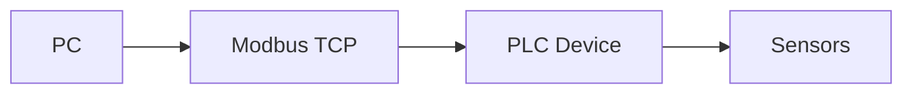
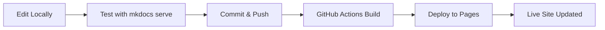
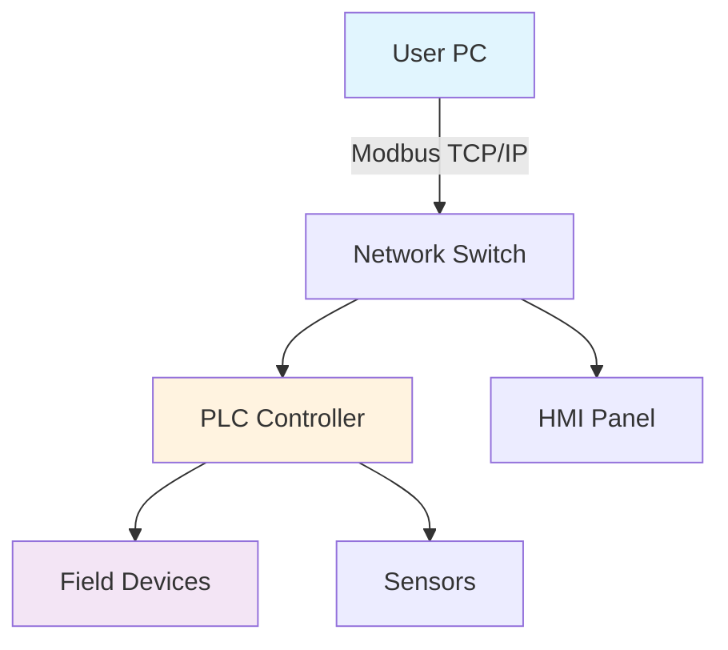

# Modbus Monitor XPF - Complete Guide

!!! info "Documentation Version"
    **Version**: 1.0 • **Last Updated**: January 2025  
    Professional Modbus monitoring and analysis tool


[TOC]

## 🚀 Quick Start

!!! tip "New to XPF?"
    Follow this 5-minute setup guide to get started immediately.
    

### System Requirements
- Windows 10 or later
- .NET Framework 4.8+
- Minimum 4GB RAM

### Installation Steps

1. **Download XPF**
   - Visit [download page](https://example.com/download)
   - Choose your version

2. **Platform-Specific Installation**

=== "Windows"

    **System Requirements:**
    - Windows 10/11 (64-bit)
    - .NET Framework 4.8+
    - 4GB RAM minimum

    **Installation Steps:**
    1. Download `ModbusMonitorXPF-Setup.exe`
    2. Right-click → "Run as Administrator"
    3. Follow installation wizard
    4. Launch from Start Menu

=== "Windows Server"

    **System Requirements:**
    - Windows Server 2019+
    - .NET Framework 4.8+
    - 8GB RAM recommended

    **Installation Steps:**
    1. Download server edition
    2. Install via command line: `setup.exe /S`
    3. Configure as Windows Service
    4. Access via web interface

=== "Linux (Wine)"

    **Experimental Support:**
    1. Install Wine: `sudo apt install wine`
    2. Download Windows version
    3. Run: `wine ModbusMonitorXPF-Setup.exe`
    
    !!! warning "Limited Support"
        Linux support is experimental. Consider native alternatives.
3. **First Launch**
- Open Modbus Monitor XPF
- Configure your first connection
- Start monitoring!

## Configuration

### Connection Setup

| Parameter | Description | Example |
|-----------|-------------|---------|
| IP Address | Target device IP | 192.168.1.100 |
| Port | Modbus TCP port | 502 |
| Unit ID | Device unit identifier | 1 |
| Timeout | Connection timeout (ms) | 3000 |

### Register Configuration

!!! example "Sample Register Setup"
 ```
 Register 40001: Temperature Sensor
 Register 40002: Pressure Reading  
 Register 40003: Flow Rate
 ```

## User Interface

### Main Window Layout

The XPF interface consists of:

- **Menu Bar**: File operations and settings
- **Toolbar**: Quick access buttons
- **Connection Panel**: Device management
- **Data View**: Real-time values
- **Log Panel**: Communication history

## Advanced Features

### Data Export

Export your monitoring data in multiple formats:

- [x] CSV files
- [x] Excel spreadsheets  
- [x] PDF reports
- [x] JSON format

### Scripting Support

XPF supports automation through:

```python
# Example automation script
import xpf_api

# Connect to device
device = xpf_api.connect("192.168.1.100", 502)

# Read registers
temp = device.read_holding_register(40001)
print(f"Temperature: {temp}°C")
```


??? note "Advanced Configuration"
    This section contains advanced settings...


- [x] Download installer
- [x] Run installation  
- [ ] Configure settings
- [ ] Test connection






## 📊 System Architecture

